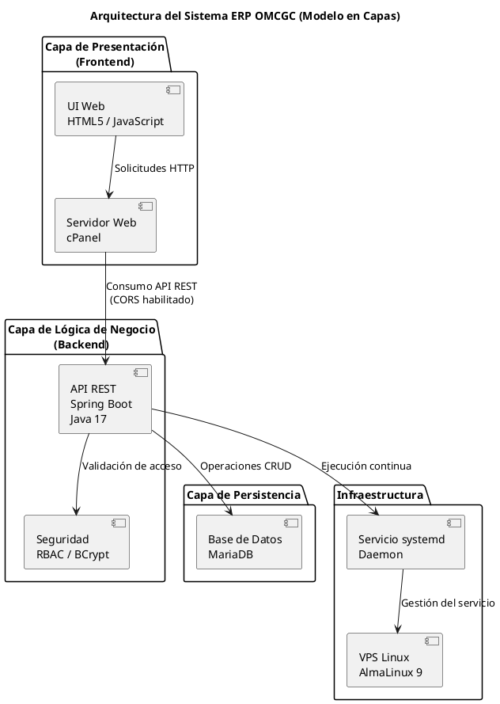
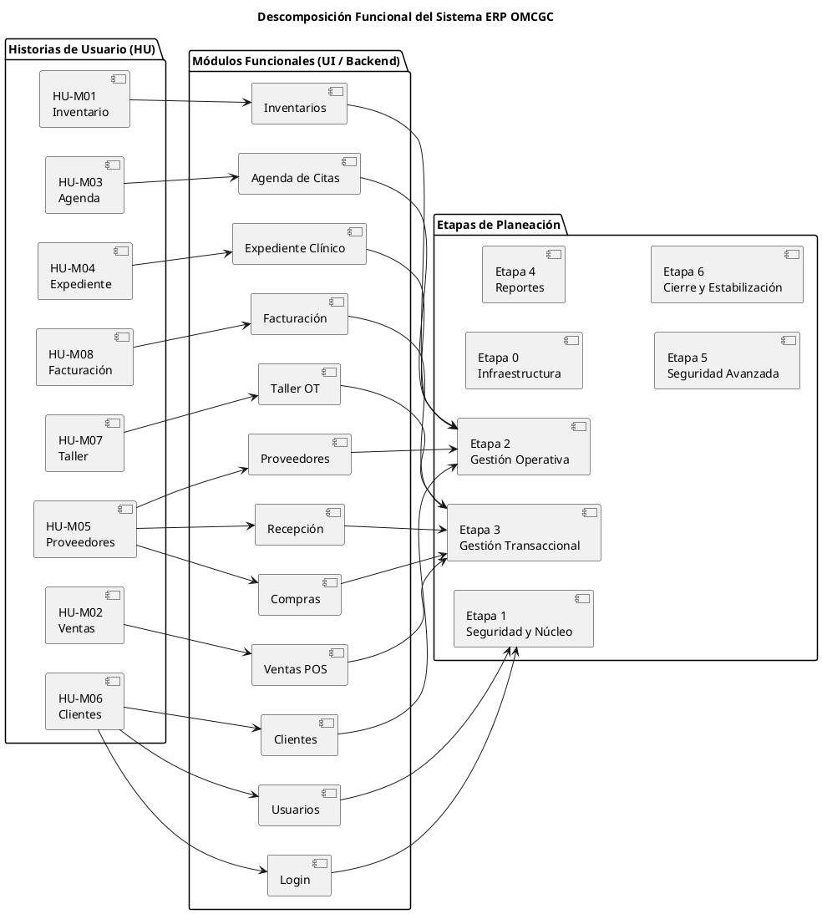

# REPORTE TÉCNICO DEL DESARROLLO

| Campo | Valor |
|---|---|
| **Proyecto** | Sistema ERP en la nube para gestión de ópticas OMCGC |
| **Empresa** | Walook México, S.A. de C.V. |
| **Autor** | Gabriel Amílcar Cruz Canto |
| **Matrícula** | ES1821003109 |
| **Programa** | Licenciatura en Ingeniería en Desarrollo de Software |
| **Unidad didáctica** | Proyecto Terminal I / Proyecto Terminal II |
| **Periodo académico** | PT1 – PT2 (Agosto 2025 – Enero 2026) |

---

## Contenido

1. [Introducción al desarrollo del sistema](#1-introducción-al-desarrollo-del-sistema)
2. [Resumen ejecutivo](#2-resumen-ejecutivo)
3. [Mapa de despliegue detallado](#3-mapa-de-despliegue-detallado-estado-físico-del-sistema)
4. [Datos de acceso y entorno de evaluación](#4-datos-de-acceso-y-entorno-de-evaluación)
5. [Plan de desarrollo y trazabilidad integral](#5-plan-de-desarrollo-y-trazabilidad-integral)

---

## 1. Introducción al desarrollo del sistema

El desarrollo del Sistema ERP OMCGC para la empresa WALOOK MÉXICO se plantea como una solución diseñada bajo principios formales de ingeniería de software, orientada a proporcionar estabilidad operativa, seguridad y capacidad de crecimiento en los procesos administrativos de ópticas.

El proyecto surge como respuesta a la fragmentación operativa identificada en la gestión de procesos clave, abordando esta problemática mediante una arquitectura distribuida en la que la interfaz de usuario se encarga exclusivamente de la interacción con el usuario, mientras que la lógica de negocio, las reglas operativas y los procesos transaccionales se ejecutan en un servidor independiente, permitiendo una gestión clara de responsabilidades y facilitando el mantenimiento y control del sistema.

Para sustentar esta arquitectura, se adopta un Stack tecnológico compuesto por Java 17 con Spring Boot para el backend y una interfaz web responsiva desarrollada bajo estándares HTML5 y JavaScript para el frontend, lo que permite una comunicación estructurada entre capas y un despliegue controlado en entornos productivos.

El sistema no se limita a cubrir funcionalidades administrativas como ventas e inventarios, sino que incorpora desde su diseño mecanismos de seguridad, tales como el uso de técnicas criptográficas para la protección de credenciales, así como criterios de resiliencia operativa, apoyados en servicios de monitoreo continuo sobre un entorno VPS Linux.

La comunicación entre el Frontend (cPanel) y el Backend (VPS) se encuentra protegida mediante certificado SSL emitido por Let's Encrypt, implementado a través de un reverse proxy Nginx que redirige las peticiones HTTPS del puerto 443 al servicio Java en el puerto 9090. Adicionalmente, la configuración de entorno y las directivas de Content Security Policy (CSP) se generan de forma dinámica mediante el módulo `api-config.js`, garantizando portabilidad automática entre los entornos de desarrollo local (XAMPP) y producción (VPS/cPanel) sin intervención manual.

Esta primera etapa del proyecto consolida la infraestructura base y el núcleo de seguridad, estableciendo las condiciones técnicas necesarias para el despliegue progresivo de los módulos operativos de mayor impacto transaccional contemplados en el plan de desarrollo.

---

### Diagrama: Representación de la Arquitectura del Sistema

*Diagrama de la arquitectura funcional del sistema ERP OMCGC, de creación propia, PlantUML, 2026.*

El diagrama de arquitectura en capas representa la organización estructural del Sistema ERP OMCGC bajo un modelo cliente–servidor distribuido. En él se identifica una separación clara entre la capa de presentación, encargada de la interacción con el usuario, la capa de lógica de negocio, responsable del procesamiento de reglas y validaciones, y la capa de persistencia, destinada al almacenamiento de datos. Esta disposición permite mejorar la mantenibilidad, la seguridad y la escalabilidad del sistema en un entorno VPS controlado.

---

## 2. Resumen ejecutivo

El presente resumen ejecutivo describe el estado de avance y los alcances técnicos alcanzados durante las primeras fases de implementación del Sistema ERP OMCGC. El modelo de desarrollo adoptado se fundamenta en un diseño funcional compuesto por ocho Historias de Usuario (HU), de las cuales se derivan doce módulos funcionales, mismos que, a su vez, se agrupan y organizan en siete etapas de planeación definidas para el control progresivo del proyecto.

A la fecha de este reporte, el desarrollo se encuentra concluido en las Etapas 0 y 1, así como un avance parcial de la Etapa 2, lo que representa un **43.33%** de progreso real y verificable del proyecto, calculado con base en la ponderación por etapas establecida desde la planeación inicial. Este avance se encuentra respaldado por evidencias técnicas funcionales en un entorno productivo controlado.

Durante estas fases se ha consolidado el núcleo funcional y de seguridad de la plataforma, dejando operativa una infraestructura en la nube preparada para el procesamiento controlado de operaciones administrativas y transaccionales. Uno de los principales logros técnicos corresponde al diseño e implementación de una **arquitectura híbrida desacoplada**, en la cual la capa de presentación (Frontend) se aloja de forma independiente en un hosting cPanel, mientras que la lógica de negocio y la persistencia de datos residen en un Servidor Privado Virtual (VPS) configurado bajo AlmaLinux 9, utilizando un motor de aplicaciones basado en Java 17 con Spring Boot.

La comunicación entre ambas capas se encuentra protegida mediante **certificado SSL (Let's Encrypt)**, implementado a través de un reverse proxy **Nginx** que redirige las peticiones HTTPS (puerto 443) al puerto interno del servicio Java (9090), bajo el dominio `api-vps.graxsoft.com`. Esta configuración garantiza la confidencialidad e integridad de los datos en tránsito.

La configuración del entorno de ejecución se gestiona de forma centralizada y dinámica a través del módulo **`api-config.js` (v2.0)**, el cual detecta automáticamente si el sistema opera en entorno local (XAMPP) o en producción (VPS/cPanel), ajustando la URL del backend y las directivas de **Content Security Policy (CSP)** sin intervención manual. Este mecanismo elimina la necesidad de modificar archivos HTML individuales al cambiar de entorno o de servidor.

Esta organización arquitectónica responde directamente al diseño funcional de los módulos derivados de las Historias de Usuario, permitiendo una separación clara de responsabilidades entre visualización, procesamiento y almacenamiento de la información.

En materia de seguridad, se ha implementado un esquema de autenticación que emplea el algoritmo **BCrypt** para la protección de credenciales, junto con un modelo de **Control de Acceso Basado en Roles (RBAC)** que gestiona permisos de forma centralizada desde el backend. La comunicación entre capas se encuentra protegida mediante políticas de **Cross-Origin Resource Sharing (CORS)** y **Content Security Policy (CSP)**, mitigando riesgos asociados a vectores de ataque comunes como Cross-Site Scripting (XSS).

Para asegurar la disponibilidad continua del servicio, el sistema ha sido integrado como un servicio nativo del sistema operativo mediante un proceso daemon administrado por **systemd**, garantizando el autoarranque y la estabilidad operativa ante reinicios del servidor. Con esta base tecnológica ya validada, el proyecto avanza de forma controlada hacia la continuación de la Etapa 2, orientada a completar la gestión operativa de los módulos pendientes, manteniendo coherencia con el diseño original de las Historias de Usuario y alineación con los criterios de calidad definidos en ISO/IEC 25010 y las directrices de documentación establecidas por IEEE 830.

---

### Glosario técnico del resumen ejecutivo

| Término / Sigla | Definición Técnica | Aplicación en el Proyecto |
|---|---|---|
| Arquitectura Híbrida Desacoplada | Diseño de software donde el Frontend y el Backend residen en servidores físicos o lógicos diferentes. | Los archivos HTML están en cPanel y el motor Java está en un VPS de HostGator. |
| VPS (Virtual Private Server) | Servidor virtual privado que garantiza recursos de cómputo (CPU, RAM) exclusivos para la aplicación. | Es el receptor del backend, funcionando de forma independiente al hosting compartido. |
| Spring Boot | Framework de Java diseñado para crear aplicaciones de grado empresarial listas para producción. | Es el motor que gestiona las reglas de negocio y la seguridad del ERP. |
| BCrypt | Función de hashing de contraseñas de un solo sentido, resistente a ataques de fuerza bruta. | Algoritmo utilizado para proteger las contraseñas de los usuarios en la base de datos. |
| RBAC (Role-Based Access Control) | Método de restringir el acceso al sistema a usuarios autorizados basándose en sus roles específicos. | El sistema decide si un usuario puede ver "Ventas" o "Usuarios" según su rol asignado. |
| CORS (Cross-Origin Resource Sharing) | Mecanismo de seguridad que permite o restringe recursos solicitados desde un dominio distinto al del servidor. | Permite que el dominio `graxsoft.com` pueda enviar datos de forma segura al VPS a través de HTTPS. |
| CSP (Content Security Policy) | Capa de seguridad adicional que ayuda a detectar y mitigar ciertos tipos de ataques, como XSS. | Implementado de forma dinámica en `api-config.js` (v2.0), se genera automáticamente según el entorno de ejecución (local o producción). |
| Daemon (Systemd) | Proceso informático que se ejecuta de manera continua en segundo plano sin intervención del usuario. | El servicio `omcgc-erp.service` que mantiene el motor Java encendido 24/7. |
| REST (Representational State Transfer) | Estilo de arquitectura para sistemas distribuidos basado en el protocolo HTTP. | Forma en que el Frontend y el Backend intercambian información mediante objetos JSON. |
| Persistencia | Capacidad de los datos de sobrevivir a la ejecución del programa que los creó. | Uso de MariaDB para que la información de los clientes no se pierda al apagar el servidor. |
| SSL/TLS (Secure Sockets Layer) | Protocolo criptográfico que proporciona comunicación segura sobre una red informática. | Certificado Let's Encrypt instalado en el VPS mediante Nginx reverse proxy (HTTPS puerto 443). |
| Nginx (Reverse Proxy) | Servidor web que actúa como intermediario, redirigiendo las solicitudes entrantes al servicio interno. | Recibe peticiones HTTPS en el puerto 443 y las redirige al servicio Java en el puerto 9090. |

---

### Diagrama: Descomposición Funcional de las Etapas

*Diagrama de descomposición funcional del sistema ERP OMCGC, de creación propia, PlantUML, 2026.*

El diagrama presenta la relación entre los requerimientos funcionales del sistema y su materialización técnica. En él, las Historias de Usuario representan las necesidades del usuario a nivel funcional, las cuales se implementan mediante módulos específicos del sistema. Esta estructura permite mantener una trazabilidad clara entre lo que el usuario requiere y cómo se construye la solución. El enfoque facilita la organización del desarrollo, el control del alcance y la validación progresiva del sistema conforme a las etapas de planeación definidas.

---

## 3. Mapa de despliegue detallado (estado físico del sistema)

El sistema se ha distribuido estratégicamente en dos entornos de hosting para maximizar la seguridad y el rendimiento. A continuación, se detalla la ubicación y función de cada componente desarrollado:

### Hosting cPanel (Frontend)

| Archivo / Componente | Descripción y Propósito Técnico | Avance |
|---|---|---|
| `index.html` | **Puerta de Enlace:** Punto de entrada raíz que gestiona la redirección forzada al módulo de autenticación. | 100% |
| `pages/login.html` | **Interfaz de Acceso:** Formulario con validación de campo. Las directivas CSP se generan dinámicamente desde `api-config.js`. | 100% |
| `pages/menu.html` | **Tablero de Control:** Contenedor responsivo que organiza el acceso a los módulos operativos (Inventarios, Ventas, etc.). | 100% |
| `pages/usuarios.html` | **Gestión de Personal:** Interfaz CRUD completa para administración de usuarios, roles y permisos con matriz dinámica. | 100% |
| `pages/clientes.html` | **Registro de Clientes:** Gestión de personas físicas y morales con validación de RFC y vinculación fiscal. | 100% |
| `pages/proveedores.html` | **Catálogo de Proveedores:** Directorio maestro de fabricantes y laboratorios con validación de datos fiscales. | 100% |
| `pages/inventarios.html` | **Control de Inventarios:** Registro de existencias, movimientos de Kardex y alertas de stock. | 90% |
| `assets/js/api-config.js` | **Configurador Global (v2.0):** Centraliza la URL del Backend y genera las directivas CSP de forma dinámica según el entorno detectado (local/producción). Elimina la necesidad de configuración manual en archivos HTML. | 100% |
| `assets/js/auth-service.js` | **Gestor de Sesión:** Maneja el almacenamiento seguro en sessionStorage y la encriptación de permisos en el navegador. | 100% |
| `assets/js/login-service.js` | **Cliente HTTP:** Implementa la lógica de red (Fetch API) para la comunicación asíncrona con el Backend. | 100% |
| `assets/js/message-service.js` | **Sistema de Mensajes:** Servicio centralizado de notificaciones visuales con 9 tipos de mensaje (error, validación, spin, etc.). | 100% |
| `assets/css/ui-base.css` | **Diseño Canónico:** Define variables CSS (colores, fuentes) y garantiza la responsividad modular. | 100% |

### Servidor VPS Linux (Backend)

| Archivo / Componente | Descripción y Propósito Técnico | Avance |
|---|---|---|
| `omcgc-erp-backend.jar` | **Binario de Aplicación:** Contenedor compilado que ejecuta toda la lógica de negocio escrita en Java. | 100% |
| `AuthController.java` | **Controlador REST:** Expone el endpoint `/api/auth/login` para recibir las peticiones del exterior. | 100% |
| `AuthService.java` | **Cerebro de Autenticación:** Valida credenciales contra la base de datos o el bypass de emergencia (root). | 100% |
| `SecurityConfiguration.java` | **Filtro de Seguridad:** Gestiona las políticas de CORS (permisos de dominio) y desactiva CSRF para REST. | 100% |
| `DatabaseConfig.java` | **Gestor de Conexión:** Configura programáticamente el acceso a MariaDB con modo Singleton. | 100% |
| `DatabaseHealthService.java` | **Monitor de Salud:** Servicio que verifica proactivamente si la base de datos está accesible antes de cada consulta. | 100% |
| `UsuarioController.java` | **CRUD de Usuarios:** Controlador REST con endpoints para gestión completa de usuarios, roles y permisos. | 100% |
| `ClienteController.java` | **CRUD de Clientes:** Controlador REST para gestión de personas físicas/morales con validación de RFC. | 100% |
| `ProveedorController.java` | **CRUD de Proveedores:** Controlador REST para catálogo de proveedores con manejo estandarizado de errores. | 100% |
| `InventarioController.java` | **Gestión de Inventarios:** Controlador REST para movimientos de stock, Kardex y alertas de nivel bajo. | 90% |
| Nginx (Reverse Proxy SSL) | **Capa de Seguridad de Transporte:** Recibe peticiones HTTPS en el puerto 443 con certificado Let's Encrypt y las redirige al servicio Java (puerto 9090). Dominio: `api-vps.graxsoft.com`. | 100% |
| `omcgc-erp.service` | **Daemon del Sistema:** Servicio de Linux systemd que mantiene el servidor activo 24/7 de forma automática. | 100% |
| `graxsof3_omcgc` (MariaDB) | **Base de Datos Relacional:** Motor donde residen las tablas de usuarios, roles, módulos, permisos, clientes, proveedores e inventarios. | 100% |
| `erp_log.txt` | **Bitácora de Eventos:** Registro de auditoría técnica que captura errores y accesos del motor en tiempo real. | 100% |

### Observaciones

- **Seguridad:** Ningún archivo sensible del Backend (Java, Configuración de Base de Datos) es accesible desde el sitio web de cPanel. Todo el procesamiento ocurre en el VPS. La comunicación se realiza exclusivamente por HTTPS.
- **Escalabilidad:** Al estar en servidores diferentes, si el sitio web (Frontend) recibe muchas visitas, el motor (Backend) no se ve afectado negativamente, y viceversa.
- **Portabilidad:** La detección automática de entorno en `api-config.js` (v2.0) permite que el mismo código fuente opere sin modificaciones tanto en desarrollo local como en producción.

---

## 4. Datos de acceso y entorno de evaluación

| Tipo | Identificador | Usuario / Email | Clave |
|---|---|---|---|
| URL de Acceso | Frontend Login | `https://gabrielcruz.graxsoft.com/frontend/pages/login.html` | — |
| Usuario Maestro | Acceso Root | `root` | `root` |
| Usuario de Prueba 1 | Test | `graxsoft_soporte@hotmail.com` | `Temp2d311e82!` |
| Usuario de Prueba 2 | Test | `test@test.com` | `Temp811fc076!` |
| Usuario de Prueba 3 | Test | `test1@test.com` | `Temp4e22acbc!` |

| Recurso | Enlace |
|---|---|
| **Figma (Maquetado)** | [Prototipo interactivo](https://www.figma.com/proto/CVhy4w8G7DoINpqDUpuDlE/Maquetado-Proyecto-Terminal-1--copia-?page-id=9%3A280&node-id=2007-5&p=f&viewport=165%2C228%2C0.19&t=69f0gmTwLRHLmqhN-1&scaling=min-zoom&content-scaling=fixed&starting-point-node-id=2007%3A5) |
| **Repositorio** | Repositorio_ES1821003109_CruzCantoGabrielAmilcar |

Los permisos asignados a cada usuario semilla, así como sus accesos y restricciones de uso dentro del sistema, se gestionan y visualizan de forma centralizada en el módulo de Usuarios, permitiendo un control claro y verificable de los privilegios operativos de cada perfil.

Figma da acceso al maquetado de las pantallas del diseño del sistema.

---

## 5. Plan de desarrollo y trazabilidad integral

El desarrollo del sistema se rige por un cronograma incremental dividido en 7 etapas críticas. Cada etapa ha sido diseñada para garantizar que los Requerimientos No Funcionales (RNF) actúen como pilares de calidad sobre los cuales se construyen las Historias de Usuario (HU). A continuación, se detalla la hoja de ruta técnica y el estado actual del proyecto:

### 5.1 Matriz de Trazabilidad por Etapas

| Etapa | Descripción | Módulos y Requerimientos (HU / RF) | Requerimientos No Funcionales (RNF) | % Etapa | % Acum. | Estado |
|---|---|---|---|---|---|---|
| 0 | Preparación e Infraestructura Base | RF-00: Entorno VPS. RF-01: Estructura Java/Spring. RF-02: Despliegue MariaDB. | RNF-00: Estructura mantenible. RNF-01: Config reproducible (Scripts). | 10% | 10% | ✅ Confirmado (100%) |
| 1 | Núcleo Funcional y Seguridad | HU-M01-01: Autenticación. HU-M01-02: Gestión de Roles. HU-M01-03: Dashboard. | RNF-02: Seguridad (BCrypt). RNF-03: Integración F-B (CORS). RNF-04: Consistencia visual. | 20% | 30% | ✅ Confirmado (100%) |
| 2 | Gestión Operativa Principal | HU-M02: Clientes. HU-M03: Proveedores. HU-M04: Inventarios y Stock. | RNF-05: Integridad de datos. RNF-06: Validaciones de negocio. | 20% | 50% | ⚠️ Parcial: Clientes y Proveedores 100% / Inventarios en desarrollo |
| 3 | Gestión Transaccional | HU-M05: Ventas (POS). HU-M06: Facturación (CFDI). HU-M07: Órdenes de Trabajo. | RNF-07: Trazabilidad transaccional. RNF-08: Control de errores. | 20% | 70% | ⏳ Planificado |
| 4 | Inteligencia y Reportes | HU-M08: Reportes Operativos. HU-M09: Dashboards Ejecutivos. | RNF-09: Rendimiento consultas. RNF-10: Exportación segura. | 15% | 85% | ⏳ Planificado |
| 5 | Seguridad Avanzada | HU-M10: Auditoría. HU-M11: Bitácoras forenses. | RNF-11: 2FA. RNF-12: Cumplimiento LFPDPPP. | 10% | 95% | ⏳ Planificado |
| 6 | Cierre y Estabilización | RF-20: Pruebas de Estrés. RF-21: Ajustes UX. | RNF-13: Estabilidad (99.9%). RNF-14: Documentación final. | 5% | 100% | ⏳ Final |

### 5.2 Análisis de Trazabilidad Aplicada (Logros hasta Etapa 2)

Para la presente entrega se confirma la culminación total de las Etapas 0 y 1, así como el avance parcial de la Etapa 2, lo que representa un **43.33%** de avance real, verificable y acumulado del proyecto. Este porcentaje se obtiene a partir de la planeación por etapas (10% + 20%), más el avance parcial correspondiente a la Etapa 2 (20% × 2/3), y se encuentra respaldado por evidencias técnicas funcionales disponibles en el entorno productivo.

La trazabilidad de los requerimientos se ha cumplido de manera consistente mediante los siguientes mecanismos:

- **Trazabilidad RNF-02 (Seguridad):** Se ha verificado que la HU-M01-01 (Autenticación) cumple con los requerimientos de seguridad establecidos, ya que las credenciales no se transmiten en texto plano. El sistema implementa cifrado en tránsito mediante HTTPS (SSL/TLS con Let's Encrypt) y hashing unidireccional mediante BCrypt en la capa de persistencia, garantizando la protección de la información sensible conforme a los criterios definidos.

- **Trazabilidad RNF-03 (Integración):** Se ha comprobado que la comunicación entre el servidor cPanel (Frontend) y el VPS (Backend) cumple con las políticas de CORS (Cross-Origin Resource Sharing) y CSP (Content Security Policy), asegurando que únicamente el dominio autorizado pueda consumir los servicios expuestos por el backend. La configuración de entorno se gestiona de forma centralizada y dinámica a través de `api-config.js` (v2.0), garantizando portabilidad automática entre entornos de desarrollo y producción.

- **Confirmación del Avance Acumulado (43.33%):** El avance se considera verificable y sustentado, dado que la infraestructura base opera como servicios autónomos del sistema, el motor de seguridad permite el acceso administrativo completo y, adicionalmente, en la Etapa 2 se encuentran operativos 2 de los 3 módulos planificados (Clientes y Proveedores), quedando pendiente únicamente el módulo de Inventarios para alcanzar el 50% previsto en dicha etapa.

### 5.3 Matriz de trazabilidad: 12 módulos → 8 bloques HU

**Avance global del proyecto (criterio por etapas): 43.33%**

| HU de Diseño (Master) | Módulo (Menú Principal) | Descripción Funcional del Módulo | Estado |
|---|---|---|---|
| HU-M01: Inventario | 2. INVENTARIOS | Existencias, SKUs y alertas de stock bajo. | ⚠️ Desarrollo |
| HU-M02: Ventas | 7. VENTAS | Punto de venta (POS) y registro de cobros. | ⏳ Diseño |
| HU-M03: Agenda | 3. AGENDA CITAS | Programación clínica y manejo de especialistas. | ⚠️ Desarrollo |
| HU-M04: Expediente | 5. EXPEDIENTE | Historia clínica ocular y registro de recetas. | ⚠️ Desarrollo |
| HU-M05: Proveedores | 4. PROVEEDORES | Catálogo maestro de fabricantes y laboratorios. | ✅ Validado |
| HU-M05: Proveedores | 8. COMPRAS | Gestión de Órdenes de Compra a proveedores. | ⏳ Diseño |
| HU-M05: Proveedores | 10. RECEPCIÓN | Auditoría y entrada física de mercancía. | ⏳ Diseño |
| HU-M06: Clientes | 1. LOGIN | Acceso seguro y cifrado de credenciales (BCrypt). | ✅ Realizado |
| HU-M06: Clientes | 12. USUARIOS | Gestión de roles, permisos y personal interno. | ✅ Realizado |
| HU-M06: Clientes | 6. CLIENTES | Registro de pacientes y vinculación fiscal. | ✅ Validado |
| HU-M07: Taller | 9. TALLER OT | Órdenes para biselado y montaje en taller. | ⏳ Diseño |
| HU-M08: Facturación | 11. FACTURACIÓN | Interfaz de timbrado fiscal SAT 4.0. | ⏳ Pendiente |

### Notas de la matriz

- **Avance Global del Proyecto (43.33%):** El avance del proyecto es del 43.33%, calculado bajo el criterio de planeación por etapas. Las Etapas 0 y 1 se encuentran concluidas (30%), y la Etapa 2 presenta un avance parcial equivalente a 2 de 3 módulos implementados, quedando pendiente únicamente Inventarios (HU-M01).

- **Hito Técnico Alcanzado:** Los módulos Login, Usuarios, Clientes y Proveedores validan la correcta operación de la infraestructura, seguridad y lógica base del sistema, permitiendo continuar con la Etapa 2 de forma controlada. Adicionalmente, la implementación de HTTPS mediante Nginx y Let's Encrypt, junto con la centralización dinámica del CSP en `api-config.js`, consolidan la seguridad en capa de transporte y la portabilidad del sistema.

- **Distribución Transversal por HU:** El bloque HU-M05 (Proveedores) concentra tres módulos de interfaz (Proveedores, Compras y Recepción), garantizando una lógica de negocio unificada para el ciclo de suministro, aun cuando algunos componentes se encuentren en fases posteriores.
