# ANÁLISIS Y DISEÑO GENERAL - ERP WALOOK

## 0. RESUMEN
El presente proyecto desarrolla un Sistema Web ERP en la nube para la gestión administrativa y operativa de las ópticas OMCGC – WALOOK MÉXICO, S.A. de C.V., motivado por la necesidad de integrar en una sola plataforma los procesos clave de la organización. La empresa enfrentaba problemas derivados del uso de sistemas aislados y registros manuales, tales como errores operativos, duplicidad de información y falta de trazabilidad, lo que impactaba directamente en la eficiencia administrativa y en la toma de decisiones.

Para atender esta problemática se diseñó e implementó un sistema centralizado, accesible y seguro, empleando el marco ágil Scrum, estructurado en 24 sprints, complementado con un Diagrama de Gantt para la planificación temporal del proyecto. Durante las fases de análisis y diseño se utilizaron instrumentos de modelado estructural, incluyendo diagramas UML, diagramas Entidad–Relación, Modelo Lógico, Diagrama Relacional y Diccionario de Datos, los cuales permitieron definir la arquitectura y estructura del sistema. La solución se soporta en una base de datos normalizada en PostgreSQL y en una arquitectura multicapa, integrada mediante una API REST y un esquema de Control de Acceso por Roles (RBAC).

Como resultado del proyecto se desarrollaron los módulos funcionales de Inventario, Punto de Venta (POS), Agenda de Citas, Expediente Clínico, Proveedores, Clientes, Taller/Órdenes de Trabajo, Facturación CFDI y Reportes, así como un modelo de datos completo, prototipos de interfaz de usuario en alta fidelidad y un mapa de navegabilidad. Estos productos conforman una solución tecnológica que optimiza los procesos operativos y administrativos de la organización.

## 1. PLANTEAMIENTO DEL PROBLEMA

### 1.1 Contexto
Walook México, S.A. de C.V. es una empresa dedicada al desarrollo de soluciones tecnológicas orientadas a la gestión administrativa y operativa de negocios. Su giro principal es la programación de sistemas de información a medida, con especial interés en plataformas basadas en la nube que permiten a las organizaciones modernizar procesos y optimizar la toma de decisiones. (Instituto Federal de Telecomunicaciones, 2020). La empresa cuenta con 16 empleados, distribuidos en áreas de análisis, desarrollo, pruebas, operaciones y soporte técnico.

El cliente actual es Gabriel Espadas, propietario de una de las cadenas de ópticas más grandes de la península de Yucatán, con sede en Mérida, Yucatán. Su negocio se dedica a la venta de armazones, lentes oftálmicos, lentes de contacto y accesorios, complementados con servicios de optometría. La operación de esta cadena de ópticas abarca procesos críticos como la administración de ventas al público, el control de inventarios, la gestión de clientes y la programación de servicios de optometría, los cuales requieren coordinación precisa y herramientas confiables.

En el entorno regional, el sector óptico presenta una competencia elevada. Existen cadenas consolidadas que han comenzado a integrar plataformas digitales para mejorar su atención al cliente y estandarizar procesos. Este panorama genera un reto para las ópticas de Gabriel Espadas, que necesitan mantenerse competitivas frente a negocios que ya adoptan soluciones tecnológicas modernas. (Revista ESPACIOS, 2025)

El área de oportunidad se ubica en la implementación de un sistema especializado que permita consolidar la información y garantizar una operación más eficiente. En este escenario, Walook asume la responsabilidad de diseñar un sistema en la nube que acompañe la evolución tecnológica del negocio de Gabriel Espadas, aportando valor en el control administrativo, la organización de procesos y la optimización de recursos.

### 1.2 Planteamiento del problema
La cadena de ópticas de Gabriel Espadas enfrenta una limitación crítica en su gestión debido a la ausencia de un sistema integral que unifique y centralice sus operaciones. El software previo denominado Efisiense quedó inconcluso y no cumplió con los objetivos planteados, lo que obligó a adoptar soluciones temporales basadas en escritorios remotos. Este mecanismo resulta obsoleto, poco práctico y genera costos adicionales en infraestructura.

El problema central se encuentra en la dispersión de procesos clave como las ventas en punto de venta, el control de inventarios, la gestión de clientes y la programación de servicios de optometría. Al no contar con una plataforma en la nube que concentre estas funciones, se producen errores administrativos, duplicidad de registros y dificultades para acceder a la información en tiempo real. (Hoffmann, 2023).

La situación actual afecta directamente la productividad del personal y la calidad del servicio brindado a los clientes. Esto limita la capacidad de la administración para generar reportes confiables que respalden la toma de decisiones estratégicas. Mientras la competencia ya ha comenzado a implementar soluciones digitales modernas, la cadena de Gabriel Espadas permanece con procesos fragmentados que ponen en riesgo su eficiencia y competitividad. (SAP LATAM, 2024).

Este proyecto se plantea como una respuesta necesaria para resolver la carencia tecnológica que afecta al negocio. La creación de un sistema unificado en la nube permitirá garantizar continuidad operativa, reducir errores en la gestión y ofrecer un servicio más ágil y confiable a los clientes de la cadena.

### 1.3 Justificación
El proyecto consiste en el desarrollo de un sistema ERP en la nube para la cadena de ópticas de Gabriel Espadas, con el propósito de integrar en una sola plataforma los procesos de ventas, inventarios, gestión de clientes y organización de servicios de optometría.

Se diseñó y programó un sistema que opera de forma centralizada, ágil y confiable, eliminando la dependencia de escritorios remotos y herramientas incompletas. El objetivo del sistema es ofrecer una solución moderna que garantice control administrativo, acceso seguro en tiempo real y reportes precisos para respaldar la toma de decisiones. (Orozco y Jacobs, 2016)

El sistema es accesible desde navegadores web, tabletas y teléfonos celulares, lo que permite movilidad en las tareas diarias. De esta manera, el personal puede realizar ventas directamente en el área de atención al cliente, efectuar conteos de inventario desde cualquier sucursal y disponer de información actualizada sin necesidad de estaciones de trabajo fijas. Esta característica incrementa la productividad y simplifica la operación de las ópticas. (Lavayen Moran y Sañudo Alvarado, 2025).

El diseño se basa en una arquitectura modular y escalable, sustentada en tecnologías actuales como PHP, JavaScript y PostgreSQL, además de incorporar medidas de seguridad, cifrado de datos, respaldos automáticos y conectividad optimizada en la nube.

Los beneficios del sistema son diversos:
•	**Administración:** acceso a información consolidada y reportes en tiempo real.
•	**Personal operativo:** procesos simplificados en ventas, inventario y gestión de clientes desde dispositivos móviles.
•	**Clientes:** mejor tiempo de respuesta y atención confiable.

La plataforma puede integrarse con aplicaciones de mensajería como WhatsApp o Telegram, lo que permite mantener una comunicación directa con el cliente final, enviar recordatorios de citas de optometría, promociones personalizadas y avisos de seguimiento postventa. Esta capacidad de expansión asegura que el sistema no solo atienda las necesidades actuales, sino que también se consolide como un activo estratégico para el crecimiento digital del negocio.

El desarrollo del sistema representa una solución práctica y concreta que permite a las ópticas de Gabriel Espadas modernizar su operación, garantizar eficiencia y mantenerse competitivas en el mercado del sureste de México.

### 1.4 Objetivos
En este apartado se presentan los objetivos que orientan el desarrollo del Sistema Web ERP en la nube de gestión administrativa y operativa de ópticas OMCGC – WALOOK MEXICO, S.A. de C.V.; estos objetivos permiten estructurar las actividades del proyecto y constituyen la base para evaluar el cumplimiento de los resultados propuestos.

#### 1.4.1 Objetivo general
Desarrollo de un Sistema Web ERP en la nube de gestión administrativa y operativa de ópticas OMCGC – WALOOK MEXICO, S.A. de C.V., que centraliza los procesos de inventario, ventas, citas, proveedores, control de clientes y generación de reportes, con el propósito de optimizar la operación de la organización y asegurar que el producto cumpla con criterios de calidad, claridad y trazabilidad establecidos en las normas ISO/IEC 25010 e IEEE 830.

#### 1.4.2 Objetivos específicos
1.	**Documentar** los requerimientos del sistema como base técnica de su desarrollo.
2.	**Modelar** los procesos administrativos y operativos mediante diagramas que representan de forma clara la interacción entre usuarios y el sistema.
3.	**Diseñar** la arquitectura de software y la base de datos relacional que aseguran integridad, consistencia y escalabilidad de la información.
4.	**Desarrollar** los módulos del sistema aplicando principios de programación que garantizan modularidad y mantenibilidad.
5.	**Validar** el sistema mediante pruebas unitarias, de integración y de rendimiento que comprueban su calidad y confiabilidad.
6.	**Integrar** mecanismos de seguridad y servicios que permiten la interoperabilidad entre módulos y la protección de datos en la operación del sistema.

## 2. MARCO INVESTIGATIVO Y TEÓRICO

### 2.1 Estudios y/o proyectos realizados
El desarrollo del Sistema Web ERP en la nube para la gestión administrativa y operativa de ópticas OMCGC – WALOOK MÉXICO, S.A. de C.V. se fundamenta en antecedentes recientes que evidencian la adopción y evolución de los sistemas ERP basados en la nube como una solución estratégica para la integración de procesos organizacionales, particularmente en pequeñas y medianas empresas. Estos estudios destacan cómo la digitalización y el uso de infraestructuras cloud han permitido mejorar la eficiencia operativa, la trazabilidad de la información y la competitividad empresarial.

En el contexto mexicano, el Instituto Federal de Telecomunicaciones (IFT, 2023) reporta que la infraestructura de centros de datos y servicios en la nube ha experimentado un crecimiento sostenido, impulsado por la demanda de soluciones digitales en sectores comerciales y de servicios. El informe señala que los modelos SaaS (Software as a Service), PaaS (Platform as a Service) e IaaS (Infrastructure as a Service) han favorecido la implementación de sistemas de información centralizados, al reducir costos de infraestructura local y facilitar el acceso remoto seguro a la información.

Desde una perspectiva latinoamericana, la Revista ESPACIOS (2025) analizó la adopción de sistemas ERP en pymes, identificando que aquellas organizaciones que integran plataformas en la nube logran mejoras significativas en la gestión de inventarios, ventas y atención al cliente. El estudio resalta que factores como la alineación estratégica del ERP, la capacitación del personal y la seguridad de la información son determinantes para el éxito de la implementación, concluyendo que los ERP cloud constituyen un habilitador clave de la transformación digital en las pymes.

A nivel internacional, SAP LATAM (2024) documenta un crecimiento acelerado en la adopción de soluciones ERP en la nube en México y América Latina, impulsado por la necesidad de sistemas escalables y de rápida implementación. El reporte indica que las organizaciones que migran a plataformas ERP cloud obtienen beneficios medibles, tales como reducción de errores operativos, mayor disponibilidad de información en tiempo real y mejora en la toma de decisiones administrativas.

En el ámbito académico, Hoffmann (2023) expone que los sistemas ERP modernos integran procesos administrativos, operativos y financieros en un entorno unificado, lo que permite disminuir la duplicidad de datos y fortalecer la trazabilidad de la información. El autor destaca que la evolución de estos sistemas hacia arquitecturas en la nube ha ampliado su alcance funcional, facilitando la interoperabilidad entre módulos y la integración con servicios externos mediante APIs.

Asimismo, la Revista ISTVR (2025) presenta una revisión sistemática de investigaciones recientes sobre arquitecturas cloud y sistemas empresariales, identificando tendencias como el uso de arquitecturas modulares, servicios desacoplados y APIs REST para garantizar escalabilidad y mantenibilidad. El estudio subraya que estas características resultan esenciales en sistemas ERP orientados a entornos dinámicos y distribuidos.

En conjunto, los antecedentes revisados demuestran que los sistemas ERP en la nube constituyen una solución tecnológica vigente y consolidada, con impacto positivo en la eficiencia administrativa, la integración de procesos y la competitividad organizacional. Estas evidencias respaldan la pertinencia del Sistema Web ERP en la nube de gestión administrativa y operativa de ópticas OMCGC – WALOOK MÉXICO, S.A. de C.V., al situarlo en consonancia con las tendencias actuales de digitalización, innovación tecnológica y optimización de recursos en organizaciones del sector comercial y de servicios.

### 2.2 Marco teórico
El desarrollo del sistema ERP en la nube exige un sustento teórico que integre fundamentos de ingeniería de software, arquitectura de sistemas, seguridad informática y normas internacionales de calidad. Este marco no se limita a definiciones; establece la relación entre conceptos técnicos y su aplicación directa en el Sistema Web ERP en la nube de gestión administrativa y operativa de ópticas OMCGC – WALOOK MEXICO, S.A. de C.V.

#### 2.2.1 ERP y computación en la nube
Los sistemas de planificación de recursos empresariales (ERP) se definen como plataformas que integran procesos administrativos, financieros y operativos en una sola solución. Según Redalyc (2023), su función esencial es optimizar la trazabilidad y reducir la duplicidad de datos, facilitando la toma de decisiones. Al migrar a la nube, los ERP aprovechan las ventajas de escalabilidad, accesibilidad y reducción de costos, lo que los convierte en soluciones adecuadas para pequeñas y medianas empresas. Como sostiene Redalyc, “el ERP actúa como mediador entre la teoría administrativa y la práctica empresarial” (2023, p. 7).

#### 2.2.2 POO y principios de responsabilidad única
La Programación Orientada a Objetos (POO) representa un paradigma fundamental en el desarrollo de software moderno. Sus principios permiten encapsular datos y comportamientos en entidades autónomas, favoreciendo la reutilización y el mantenimiento. Dentro de este paradigma, el Principio de Responsabilidad Única (SRP) asegura que cada módulo del sistema tenga una sola responsabilidad claramente definida, lo que favorece un diseño con estructura modular y reduce la complejidad. Pressman (2010) destaca que “la orientación a objetos promueve la abstracción y encapsulación como medios de reducir el riesgo de errores y aumentar la mantenibilidad” (p. 134). En el proyecto, estas bases garantizan que los módulos de inventario, ventas, citas y reportes se desarrollen como componentes cohesionados y fáciles de escalar.

#### 2.2.3 Arquitectura multicapa y frameworks
Un ERP en la nube debe sustentarse en arquitecturas que soporten escalabilidad y separación de responsabilidades. La arquitectura multicapa organiza el sistema en niveles (presentación, lógica de negocio y datos), lo que facilita la evolución y el mantenimiento. El uso de frameworks web (como Django, Laravel o Spring) aporta herramientas preconstruidas para implementar patrones de diseño como MVC, que promueven la separación entre interfaz y lógica del sistema. Moran y Alvarado (2025) señalan que “las arquitecturas en capas permiten aislar cambios y controlar la complejidad de sistemas a gran escala” (p. 210).

#### 2.2.4 Bases de datos relacionales y APIs
El Sistema Web ERP en la nube de gestión administrativa y operativa de ópticas OMCGC – WALOOK MEXICO, S.A. de C.V. requiere de un gestor de base de datos que asegure integridad y escalabilidad. PostgreSQL se consolida como una de las soluciones más robustas, con soporte para transacciones ACID, replicación lógica y optimización de consultas. De acuerdo con su documentación oficial, “PostgreSQL proporciona integridad transaccional completa y soporte avanzado para concurrencia” (PostgreSQL, 2024, párr. 2). Asimismo, la interoperabilidad se logra mediante APIs REST, que definen contratos de comunicación entre módulos y permiten integrar servicios externos bajo estándares abiertos (Orozco y Jacobs, 2016).

#### 2.2.5 Seguridad en ERP cloud
La seguridad constituye un eje crítico en sistemas ERP basados en la nube. Las guías de OWASP (2021) identifican vulnerabilidades comunes en aplicaciones web y APIs, destacando riesgos como exposición de datos y fallos de autorización. Para mitigarlos se aplican técnicas de autenticación y autorización como JWT (RFC 7519) y OAuth2, que aseguran la validación de identidades y la gestión de accesos por roles (RBAC). OWASP afirma que “la seguridad de las APIs se ha convertido en uno de los principales desafíos en la protección de aplicaciones modernas” (2021, párr. 5). Además, el uso de TLS/SSL garantiza el cifrado en tránsito, resguardando la confidencialidad de la información clínica y administrativa que manejará el sistema.

#### 2.2.6 Ciclo de vida del software y metodologías de desarrollo
El desarrollo de un ERP requiere planearse bajo modelos de ciclo de vida que aseguren la transición ordenada entre análisis, diseño, codificación, pruebas e implementación. El modelo en cascada ha sido tradicionalmente usado por su secuencia estructurada, aunque en la práctica se recomienda un enfoque ágil o iterativo que permita adaptaciones rápidas a cambios en los requerimientos. Pressman (2010) sostiene que “el ciclo de vida en espiral y los modelos iterativos facilitan la identificación temprana de riesgos y la verificación continua de avances” (p. 45). De manera complementaria, Sommerville (2011) destaca que “las metodologías ágiles promueven la entrega incremental y la colaboración directa con el cliente” (p. 67). Para el Sistema Web ERP en la nube de gestión administrativa y operativa de ópticas OMCGC – WALOOK MEXICO, S.A. de C.V., este enfoque garantiza que cada módulo (ventas, inventarios, citas y reportes) sea diseñado y probado de forma incremental, asegurando calidad y adaptabilidad desde etapas tempranas.

#### 2.2.7 Normas internacionales de calidad y pruebas
El cumplimiento de normas internacionales asegura la confiabilidad y calidad del software. La ISO/IEC 25010 define características como funcionalidad, fiabilidad, seguridad, usabilidad, eficiencia y mantenibilidad, que guiarán la evaluación del producto final. La IEEE 830 establece directrices para elaborar especificaciones de requerimientos de software claras y verificables, garantizando consistencia en la documentación del proyecto. Por su parte, la IEEE 1012 detalla procesos de verificación y validación que permiten asegurar que el sistema cumpla con sus objetivos y se someta a pruebas rigurosas. Según la ISO, “el modelo de calidad 25010 proporciona un marco para evaluar atributos esenciales de un producto de software” (2011, párr. 3).

#### 2.2.8 Síntesis
En conjunto, estos fundamentos teóricos sustentan la pertinencia técnica y metodológica del proyecto. Los principios de POO y SRP aseguran modularidad, la arquitectura multicapa soporta escalabilidad, PostgreSQL y APIs REST garantizan interoperabilidad, y las guías de seguridad OWASP junto con JWT y OAuth2 protegen la información. Finalmente, las normas ISO/IEC 25010, IEEE 830 e IEEE 1012 consolidan un marco de calidad internacional. Así, el Sistema Web ERP en la nube de gestión administrativa y operativa de ópticas OMCGC – WALOOK MEXICO, S.A. de C.V. se fundamenta en teorías, modelos y estándares reconocidos que aseguran su solidez académica y práctica.

## 3. METODOLOGÍA

El presente proyecto adopta como base de desarrollo una metodología ágil, dado que este enfoque permite responder de manera flexible a los cambios y garantiza la entrega continua de resultados funcionales en periodos cortos de tiempo. Entre las metodologías ágiles, se selecciona Scrum como marco de trabajo por su sencillez, adaptabilidad y capacidad de organizar las actividades en iteraciones llamadas sprints, lo que resulta compatible con la dinámica académica del Proyecto Terminal. Según Loayán (2025), “Agile ha transformado la forma en que se gestionan los proyectos al enfocarse en la entrega de valor incremental y la retroalimentación constante” (párr. 4). De manera complementaria, Chappell (2020) explica que “Scrum organiza el trabajo en equipos auto-gestionados que cumplen metas en plazos cortos, generando un producto que evoluciona con las necesidades del cliente” (párr. 7). En este contexto, la aplicación de Scrum proporciona un marco metodológico que asegura un proceso ordenado, incremental y alineado con las necesidades de la organización receptora.

La propuesta metodológica se orienta al desarrollo del Sistema Web ERP en la nube de gestión administrativa y operativa de ópticas OMCGC – WALOOK MEXICO, S.A. de C.V., cuyo propósito es integrar en una sola plataforma los procesos esenciales de la organización. Este sistema contempla la administración de inventarios, el control de ventas, la gestión de citas, la relación con proveedores, el registro de clientes y la generación de reportes estratégicos, todo ello en un entorno web accesible y seguro. Al estar basado en la nube, el ERP proporciona escalabilidad y disponibilidad permanente, evitando la dependencia de infraestructura local y reduciendo los costos de mantenimiento. De acuerdo con Redalyc (2020), “la nube se ha consolidado como una de las tecnologías más transformadoras de la última década” (p. 12), lo que respalda la pertinencia de implementar esta solución tecnológica para garantizar un modelo sostenible y competitivo en el sector óptico. (Instituto Federal de Telecomunicaciones, 2020)

La aplicación de una metodología ágil como Scrum al desarrollo del Sistema Web ERP en la nube de gestión administrativa y operativa de ópticas OMCGC – WALOOK MEXICO, S.A. de C.V. ofrece diversas ventajas. Entre ellas destacan la flexibilidad para adaptar cambios en los requerimientos, la entrega incremental de funcionalidades en cada sprint y la posibilidad de obtener retroalimentación temprana que reduce riesgos de desviación en el producto final. Estas características resultan clave en un contexto académico y organizacional, donde los plazos y los recursos son limitados. No obstante, también existen desventajas: el enfoque ágil demanda una disciplina constante en la gestión de tareas, reuniones periódicas para seguimiento y un alto nivel de compromiso por parte de los actores involucrados, lo que puede generar dificultades si no se cuenta con la disponibilidad adecuada. Como indica Chappell (2020), “Scrum organiza el trabajo en equipos autogestionados que cumplen metas en plazos cortos, generando un producto que evoluciona con las necesidades del cliente” (párr. 7), situación que valida su aplicación en proyectos de software, siempre que se mantenga la disciplina necesaria para su correcta implementación.

En cuanto a los costos y recursos, el proyecto contempla principalmente la inversión en horas-hombre, estimadas en 250 horas para el desarrollo del Proyecto Terminal I y 250 horas adicionales en el Proyecto Terminal II, lo que permite distribuir las tareas en etapas de análisis, diseño, codificación y pruebas. A esto se suman los recursos tecnológicos, que incluyen un servidor en la nube para el alojamiento del sistema, el uso de un gestor de base de datos como PostgreSQL, framework web para la construcción del ERP y un entorno de desarrollo integrado. También se consideran los recursos de apoyo, como el acompañamiento del asesor externo y la infraestructura proporcionada por la empresa receptora. El detalle de esta estimación está documentado en la tabla de costos y recursos del Anexo D (véase sección 8, Anexos), donde se desglosarán tanto los costos técnicos como los humanos asociados al proyecto.

En relación con el tiempo, el desarrollo del sistema se planifica dentro del periodo académico correspondiente al Proyecto Terminal I y II, lo que equivale a una duración total aproximada de nueve meses, distribuidos en dos fases de 250 horas cada una. La aplicación de Scrum permite organizar este tiempo en sprints o iteraciones, cada uno con entregables parciales que facilitan el control del avance y la retroalimentación continua. De esta manera, se asegura que las tareas de análisis, diseño, codificación y pruebas se realicen de forma progresiva y verificable en cada ciclo. El detalle de la calendarización se presenta en el Anexo A (véase sección 8, Anexos). Cronograma de actividades, donde se especifican las fases, responsables y productos parciales asociados a cada etapa del desarrollo.

El nivel tecnológico del proyecto se fundamenta en herramientas y estándares actuales de la ingeniería de software. El sistema se construyó bajo un framework web que facilita la separación de capas y el cumplimiento de principios de modularidad, apoyado en la Programación Orientada a Objetos (POO) y el Principio de Responsabilidad Única (SRP) para asegurar mantenibilidad y escalabilidad. La gestión de datos se realizará con PostgreSQL, un gestor de bases de datos relacional robusto y de código abierto, ampliamente reconocido por su confiabilidad y capacidad para manejar grandes volúmenes de información. La interoperabilidad entre módulos se garantizará mediante servicios API REST, que definen contratos claros de comunicación entre cliente y servidor. Finalmente, se implementaron mecanismos de seguridad como autenticación con JWT u OAuth2, cifrado en tránsito mediante TLS/SSL y controles de acceso basados en roles (RBAC). Este conjunto tecnológico coloca al sistema dentro de un marco competitivo, alineado con las tendencias actuales de desarrollo de software en la nube y con estándares internacionales como ISO/IEC 25010, que establece atributos de calidad esenciales como seguridad, confiabilidad y mantenibilidad. (ISO/IEC 25010, 2011). (véase Anexo C, Especificaciones técnicas del sistema).

En cuanto al personal involucrado, el desarrollo del sistema se llevará a cabo principalmente por el estudiante, quien asume el rol de analista, arquitecto y programador, aplicando de manera integral los conocimientos adquiridos en la licenciatura. El asesor externo participa como apoyo técnico y garante de la correcta orientación del proyecto en el ámbito empresarial, aportando experiencia en el área de Tecnologías de la Información. La organización receptora, representada en este caso por Walook México, funge como stakeholder, ya que provee el contexto operativo, facilita información de procesos y valida los avances mediante retroalimentación. Finalmente, el docente actúa como guía académico, asegurando que los entregables cumplan con los criterios metodológicos y normativos establecidos por la universidad. Esta estructura de roles garantiza que cada fase del desarrollo cuente con supervisión, acompañamiento y validación desde los planos académico, técnico y organizacional. (véase Anexo B, Tablas de historias de usuario).

El proyecto incorpora elementos de innovación orientados a potenciar la funcionalidad del sistema y a diferenciarlo de soluciones convencionales en el mercado. Una de las principales innovaciones es la centralización en la nube, que permite acceso en tiempo real desde distintos dispositivos y ubicaciones, garantizando continuidad operativa y reduciendo la dependencia de infraestructura local. El sistema contempla la posible integración de analítica de datos para identificar patrones en el comportamiento de ventas y en el consumo de productos ópticos, lo que facilitaría la toma de decisiones estratégicas. También se plantea la posibilidad de incluir un módulo de alertas inteligentes, que notifique en tiempo real situaciones críticas como bajo inventario o vencimiento de citas. Estas innovaciones no solo responden a la necesidad inmediata de las ópticas, sino que abren la puerta a un sistema escalable que puede evolucionar con las tendencias del sector, asegurando mayor competitividad y valor agregado para la organización receptora. (SAP LATAM, 2024). (véase Anexo C. Especificaciones técnicas y diagramas de arquitectura).

La aplicación de Scrum en el proyecto se estructura en fases que corresponden al ciclo de vida del software, garantizando orden y trazabilidad en cada actividad. En la fase de requerimientos, se levantan y documentan tanto las funcionalidades principales como los atributos no funcionales, apoyándose en historias de usuario que sustituyen los casos de uso tradicionales (véase Anexo B. Casos de uso e Historias de Usuario). Posteriormente, en la fase de análisis, se modelan los procesos administrativos y operativos de las ópticas mediante diagramas que representan las interacciones entre usuarios y el sistema (véase Anexo B. Diagramas de procesos y secuencia). En la etapa de diseño, se elaboran los diagramas UML, la arquitectura multicapa del sistema, el modelo de base de datos relacional y los prototipos de interfaz gráfica (véase Anexo C. Arquitectura del sistema, Anexo D. Modelo de base de datos y Anexo E. Prototipos de interfaz). Durante la fase de desarrollo, se codifican los módulos siguiendo principios de POO y SRP, asegurando modularidad y mantenibilidad. La fase de pruebas comprende evaluaciones unitarias, de integración y de rendimiento, alineadas con estándares como ISO/IEC 25010 e IEEE 1012 para garantizar calidad y confiabilidad. Finalmente, la etapa de implementación prepara el despliegue del sistema en un entorno de nube con mecanismos de seguridad, accesibilidad y respaldo. Como explica Pressman (2010), “un proceso de desarrollo bien estructurado permite que cada fase produzca entregables verificables que sirven como base para la siguiente” (p. 55), lo que asegura continuidad y control en el avance del proyecto. (Chappell, 2020).

En síntesis, la adopción de una metodología ágil como Scrum ofrece al proyecto un marco flexible y estructurado que permite avanzar de manera progresiva en la construcción del Sistema Web ERP en la nube de gestión administrativa y operativa de ópticas OMCGC – WALOOK MEXICO, S.A. de C.V. La integración de prácticas modernas de análisis, diseño, desarrollo y pruebas, junto con el uso de recursos tecnológicos de vanguardia, asegura que el sistema responda a los requerimientos de calidad y trazabilidad demandados por la universidad y la organización receptora. Los aspectos de costo, tiempo, innovación y recursos han sido considerados en esta planeación metodológica, quedando su detalle consignado en los Anexo A y Anexo D (véase sección 8, Anexos). De esta manera, la metodología seleccionada proporciona una guía clara para la ejecución del proyecto y un marco sólido para garantizar la obtención de resultados verificables y alineados con estándares internacionales.

## 4. DESARROLLO DE LA METODOLOGÍA

### 4.1 Planificación
La fase de planificación establece el punto de partida del proyecto, definiendo objetivos, alcance, recursos y tiempos que organizan de manera sistemática el desarrollo del Sistema Web ERP en la nube para la gestión administrativa y operativa de ópticas OMCGC – WALOOK MEXICO, S.A. de C.V. En esta etapa se realiza el análisis de costos y beneficios, la estimación de recursos técnicos y humanos y la asignación de responsabilidades, considerando al estudiante como desarrollador principal, el acompañamiento del asesor externo y docente, y la participación de directivos de la organización para la validación y priorización de entregables.

El plan de desarrollo se basa en la Carta de Aceptación, que fija el periodo de ejecución de septiembre de 2025 a mayo de 2026 y la dedicación total de 500 horas (correspondientes a Proyecto Terminal I y Proyecto Terminal II). Con ese marco temporal se calendarizan las actividades del ciclo de vida del software —levantamiento de requerimientos, análisis, diseño, desarrollo, pruebas y validación— e integran los entregables académicos y administrativos solicitados por la institución.

Para el control y la trazabilidad se elaboró un Diagrama de Gantt que distribuye 24 sprints (cada sprint dura 2 semanas). El cronograma refleja el periodo de la Carta de Aceptación, calendariza las HU por iteración, identifica dependencias y recursos asignados, e incorpora hitos de revisión con asesor y validación con directivos. La representación visual y el detalle de la calendarización se presentan en: (véase Anexo A, Cronograma de actividades).

Finally, as a reading guide, sections 4.2 to 4.5 develop each stage of the life cycle (analysis, design, development and implementation of tests) and reference their evidences in the corresponding annexes.

### 4.2 Análisis
La fase de análisis identifica con precisión la problemática y la transforma en especificaciones verificables para el Sistema Web ERP en la nube de OMCGC – WALOOK MEXICO, S.A. de C.V. Para el levantamiento de requerimientos se aplicaron técnicas de recopilación mixtas, que incluyeron revisión documental, entrevistas estructuradas al personal administrativo y de ventas, y análisis comparativo de sistemas ERP en la nube utilizados en el sector óptico. Estas acciones permitieron identificar los procesos críticos de operación y los puntos de mejora tecnológica. Las evidencias de los instrumentos aplicados se presentan en: (véase Anexo A, Instrumentos de datos del paciente). Con base en lo anterior se definieron los módulos principales del sistema, cada uno orientado a cubrir funciones específicas de la operación de las ópticas:

•	**Control de acceso (Usuarios, Roles y Permisos):** permite registrar, actualizar y desactivar usuarios; asignar roles y permisos; y controlar el inicio de sesión al sistema.
•	**POS / Ventas:** gestiona la captura de ventas, aplicación de descuentos, cálculo de totales, generación de tickets y registro de métodos de pago.
•	**Expediente clínico (Paciente / Recetas):** permite dar de alta pacientes, almacenar y actualizar sus datos clínicos, registrar recetas vigentes e histórico de consultas.
•	**Proveedores / Compras:** administra el alta y actualización de proveedores, solicitudes de pedido, recepción de mercancía y registro de compras.
•	**Inventario (Existencias y Movimientos):** controla existencias por producto, registra entradas y salidas, ajustes de inventario y consulta de movimientos.
•	**Agenda de citas:** permite programar, reprogramar, cancelar y consultar citas por fecha, hora y optometrista.
•	**Facturación (CFDI):** genera, timbra y cancela los comprobantes fiscales (CFDI) asociados a las ventas, así como la consulta de facturas emitidas.
•	**Reportes:** ofrece consultas consolidadas de ventas, citas, inventario y otros indicadores clave para la toma de decisiones.

El catálogo de Requerimientos No Funcionales (RNF) se presenta en: (véase Anexo B, Tabla – RNF para ING) y agrupa criterios de calidad basados en el estándar IEEE 830, que abarcan aspectos de seguridad, rendimiento, disponibilidad, mantenibilidad, usabilidad y fiabilidad del sistema. (IEEE 830, 1998). Estos atributos garantizan que el ERP opere de forma estable, segura y con tiempos de respuesta óptimos en un entorno web.

Las Historias de Usuario (HU) se presentan en: (véase Anexo B, Tablas de historias del usuario) y definen los requerimientos funcionales del sistema desde la perspectiva del usuario final. Cada HU incluye identificador, título, descripción, criterios de aceptación, roles implicados, validaciones y acciones esperadas; estas HU constituyen la base para el diseño de interfaces, la planificación de pruebas y la trazabilidad entre requerimientos y funcionalidades.

Estos elementos del análisis proporcionan una visión integral de las necesidades del sistema, delimitan su alcance funcional y establecen la trazabilidad necesaria entre los requerimientos, las Historias de Usuario (HU) y las etapas de diseño, desarrollo e implementación. De esta manera, el análisis garantiza que cada componente técnico del Sistema Web ERP en la nube responda a los objetivos operativos de OMCGC – WALOOK MEXICO, S.A. de C.V., permitiendo un proceso de construcción ordenado, verificable y alineado con los criterios de calidad establecidos en los Requerimientos No Funcionales (RNF).

### 4.3 Diseño
El diseño del Sistema Web ERP en la nube de gestión administrativa y operativa de ópticas OMCGC – WALOOK MEXICO, S.A. de C.V. transforma los requerimientos levantados (HU y RNF) en estructuras técnicas que guían la construcción del software. Esta etapa se centra en tres componentes: arquitectura del sistema, base de datos y diseño de la interfaz de usuario, procurando coherencia con los RNF de seguridad, rendimiento, mantenibilidad y usabilidad. (ISO/IEC 25010, 2011). Los resultados se desarrollan en los subapartados: 4.3.1 Diseño de arquitectura (véase Anexo B, Figuras 4–6), 4.3.2 Diseño de la base de datos (véase Anexo D, Figuras 7–9 y Tabla 1) y 4.3.3 Diseño de frontend (véase Anexo E, Figuras 10 y 11.a–11.m).

**Repositorio institucional de artefactos del análisis:** Las versiones completas de las Historias de Usuario (HU), así como los diagramas, el cronograma, los modelos estructurales y los artefactos utilizados para generar el diseño del sistema, se encuentran disponibles en el repositorio institucional de la cuenta UnADM del estudiante:
[Enlace al Repositorio Institucional (SharePoint)](https://unadmex-my.sharepoint.com/:f:/g/personal/gabriel_cruzca_nube_unadmexico_mx/IgA9PjM0nxzER7QdU3sjwu0DAQ0G5V3mkSUvXJd4A_UxR2g?e=kwJdDW)

#### 4.3.1 Diseño de arquitectura
La arquitectura adopta un enfoque multicapa y modular que separa presentación, lógica de negocio y persistencia, favoreciendo escalabilidad, mantenibilidad y reutilización. La interoperabilidad entre módulos se implementa mediante API REST con contratos claros (por ejemplo, `/login/acceso`, `/catálogos`, `/procesos`, `/reportes`, `/cfdi`). La seguridad se aplica con JWT (portador en encabezado, expiración y refresco) y control de acceso por roles (RBAC); cuando se requiere delegación o servicios de terceros (por ejemplo, timbrado CFDI), se contempla OAuth2. En cumplimiento de los lineamientos establecidos por las figuras académicas evaluadoras, la arquitectura incorpora cinco mecanismos de seguridad esenciales: certificado SSL/TLS para cifrado en tránsito, contraseñas fuertes definidas desde backend, uso de CAPTCHA en el login, variables de sesión con expiración y regeneración del identificador, y separación estricta entre frontend y backend para impedir la exposición del código de negocio. Asimismo, se definen políticas de errores, versionado de API y manejo de dependencias entre módulos (ventas ↔ inventario ↔ OT ↔ CFDI).

La arquitectura del sistema se documenta mediante seis diagramas que describen su estructura lógica, organización de módulos, despliegue en la nube y comportamiento operativo. Cada uno se detalla a continuación:

1.	**Figura 4. Diagrama de Componentes — Arquitectura ERP.** Representa la organización de las tres capas principales del sistema (presentación, negocio y datos), mostrando los módulos que las integran y las interfaces REST que comunican cada capa. (véase Anexo B — Diagrama de Componentes — Arquitectura ERP).
2.	**Figura 5. Diagrama de Paquetes — Arquitectura ERP.** Muestra la agrupación del proyecto en paquetes funcionales (login/acceso, catálogos, procesos, reportes y cfdi), evidenciando las relaciones de dependencia entre ellos y la estructura modular del código. (véase Anexo B — Diagrama de Paquetes — Arquitectura ERP).
3.	**Figura 6. Diagrama de Despliegue — Arquitectura ERP.** Expone la infraestructura de ejecución del sistema en la nube, identificando los nodos de aplicación, el servidor de base de datos PostgreSQL y los servicios externos de facturación CFDI. También muestra los canales seguros de comunicación (HTTPS/TLS) y los elementos de red asociados al despliegue. (véase Anexo B — Diagrama de Despliegue — Arquitectura ERP).
4.	**Figura 7. Despliegue (Extensión): Tabla de componentes, flujos y controles.** Resume las interacciones entre los módulos del sistema, los flujos de información y los mecanismos de control y respaldo implementados. (véase Anexo B — Despliegue (Extensión): Tabla de componentes, flujos y controles).
5.	**Figura 7. Diagrama de Actividad — Atención clínica y venta.** Describe la secuencia de actividades operativas que se ejecutan desde el registro del paciente hasta la confirmación de la venta, mostrando la interacción entre los módulos de agenda, expediente, ventas y facturación. (véase Anexo B — Diagrama de Actividad — Atención clínica y venta).
6.	**Figura 8. Diagrama de Máquina de Estados — Órdenes de Trabajo y Citas.** Modela los estados por los que transitan las órdenes y citas, desde su creación y programación hasta su cierre o cancelación, lo que permite comprender el ciclo de vida de los servicios ofrecidos. (véase Anexo B — Diagrama de Máquina de Estados — Órdenes de Trabajo y Citas).

Estos diagramas complementan la documentación técnica del sistema y proporcionan trazabilidad entre los requerimientos, las historias de usuario y la estructura arquitectónica definida. Con ello se asegura que la implementación siga un orden lógico, verificable y alineado con los estándares de calidad establecidos por la metodología SCRUM y la norma IEEE 830. (IEEE 830, 1998).

#### 4.3.2 Diseño de la base de datos
El diseño de la base de datos garantiza la integridad, consistencia y disponibilidad de la información del Sistema Web ERP en la nube de OMCGC – WALOOK MEXICO, S.A. de C.V. Este proceso se desarrolló de manera progresiva, pasando por tres etapas complementarias: modelo conceptual, modelo lógico y modelo físico, con el objetivo de asegurar trazabilidad entre los requerimientos y la estructura final de los datos.

En la primera etapa se construyó el modelo Entidad–Relación (E–R) empleando la notación Chen, que representa las entidades principales del sistema, sus atributos y las relaciones existentes entre ellas. Dicho modelo describe las entidades pacientes, optometristas, citas, expedientes, recetas, productos, inventario (existencias y movimientos), ventas, pagos, facturación CFDI y órdenes de trabajo, estableciendo la cardinalidad y dependencias necesarias para reflejar los procesos de negocio de la organización. (véase Anexo D — Figura 7, Diagrama E–R (Chen) — Modelo entidad–relación del dominio).

Posteriormente, a partir del modelo conceptual, se realizó la transformación al modelo lógico, aplicando un proceso sistemático de normalización hasta la Tercera Forma Normal (3FN). En este proceso se eliminaron redundancias, se descompusieron entidades con dependencias parciales y transitivas, y se definieron claves primarias y foráneas que aseguran la integridad referencial. Como resultado, cada tabla representa una entidad o relación concreta del dominio (por ejemplo, una cita se asocia a un paciente y a un optometrista mediante llaves externas). (véase Anexo D — Diagrama del Modelo Lógico (3FN)).

El diseño lógico se implementó en PostgreSQL, garantizando compatibilidad con estándares SQL y soporte para transacciones ACID. Se definieron índices, restricciones de unicidad y reglas de integridad para optimizar las consultas y prevenir anomalías de actualización. La estructura completa del dominio, junto con los tipos de datos, claves y validaciones, se documenta en el Diccionario de Datos. (véase Anexo D —  Diccionario de Datos).

Finalmente, se complementa la documentación con un Diagrama de Clases del Dominio, que ilustra la correspondencia entre los objetos de la capa de aplicación y las tablas físicas del modelo de base de datos, fortaleciendo la trazabilidad entre la arquitectura del sistema y su estructura persistente. (véase Anexo D — Diagrama de Clases (Dominio)).

Este diseño, apoyado en principios de modelado estructurado, normalización y consistencia relacional, permite garantizar un almacenamiento seguro, eficiente y escalable de la información, facilitando la evolución del sistema y su integración con los módulos operativos del ERP.

#### 4.3.3 Diseño de Frontend
El diseño del Frontend se orienta a ofrecer una experiencia de usuario clara, consistente y alineada con los procesos operativos del Sistema Web ERP en la nube de OMCGC – WALOOK MEXICO, S.A. de C.V. Para ello, se emplearon principios de usabilidad, jerarquía visual y accesibilidad que permiten al usuario interactuar con la plataforma de forma intuitiva. La estructura general del sistema organiza sus módulos mediante una navegación uniforme, menús persistentes y componentes reutilizables que facilitan el acceso a las funciones principales. El desarrollo del prototipo visual se realizó en Figma, permitiendo crear un maquetado navegable que puede ser evaluado en tiempo real y que sirve como base para la validación del diseño con el asesor y la organización receptora. (Moran y Alvarado, 2025).

El flujo de interacción del sistema se definió mediante un Mapa de Navegabilidad, el cual describe las rutas que sigue el usuario desde el inicio de sesión hasta la ejecución de las actividades operativas en cada módulo. Este mapa establece las transiciones entre pantallas, los accesos directos, los retornos permitidos y la relación jerárquica entre módulos como Agenda de Citas, Expediente Clínico, Punto de Venta (POS/Ventas), Taller/OT, Facturación CFDI, Proveedores, Inventario y Reportes. La navegación se organiza a partir de un menú principal y encabezados consistentes que reducen la complejidad del recorrido y permiten volver a secciones anteriores sin pérdida de contexto. La estructura del flujo se presenta en: (véase Anexo E — Mapa de Navegabilidad).

La primera interfaz corresponde a la pantalla de Login, punto de entrada al sistema y elemento central del control de acceso. En el maquetado desarrollado en Figma se muestran los componentes visuales básicos: campos para usuario y contraseña, botón principal para acceder y elementos de apoyo como el enlace de recuperación de acceso. Esta interfaz establece la apariencia inicial del sistema y define la línea gráfica que se utiliza en el resto de las pantallas. (véase Anexo E — Pantallas clave: Login).

La segunda interfaz corresponde al módulo de Agenda de Citas, cuya finalidad es mostrar la disponibilidad de horarios y permitir la gestión visual de las citas programadas. El maquetado en Figma presenta un calendario central donde el usuario puede identificar fechas con citas registradas, seleccionar un día específico y visualizar en un panel lateral la lista de citas asociadas. La interfaz incorpora campos para filtrar por paciente u optometrista, así como botones para registrar nuevas citas, reprogramarlas o cancelar las existentes. El diseño representa únicamente la disposición gráfica de los elementos y la forma en que se organiza la información dentro del módulo. (véase Anexo E — Pantallas clave: Agenda de Citas).

La tercera interfaz corresponde al módulo de Expediente del Paciente, en el cual se organiza la información clínica y administrativa relacionada con cada usuario del servicio. El maquetado elaborado en Figma muestra una pantalla dividida en secciones: datos generales del paciente (nombre, edad, contacto), antecedentes o condiciones relevantes para la evaluación óptica, registro de notas clínicas y el apartado destinado a la captura o consulta de recetas de dioptría. Adicionalmente, se incluye un espacio para adjuntar documentos o archivos proporcionados por el paciente, como recetas emitidas por otros profesionales. La interfaz representa únicamente la distribución visual de los componentes, facilitando la comprensión de la estructura del módulo y su relación con los procesos de atención. (véase Anexo E — Pantallas clave: Expediente del Paciente).

La integración del mapa de navegabilidad y de los prototipos desarrollados en Figma permite contar con una representación visual completa de cómo el usuario interactuará con el sistema en tiempo real. Estas maquetas sirven como base para validar los flujos operativos con la organización receptora y garantizan coherencia entre los requerimientos funcionales, las historias de usuario y la estructura visual del ERP. A partir de estos prototipos se orientará la implementación técnica del frontend utilizando tecnologías HTML5, CSS3 y JavaScript, asegurando que el diseño final conserve la organización, accesibilidad y funcionalidad definida en esta etapa. Con ello, el diseño de frontend queda documentado, evidenciado y alineado con lo solicitado en el instrumento de evaluación. (véase Anexo E — Prototipos desarrollados en Figma).

### 4.4 Desarrollo
La fase de desarrollo corresponde a la construcción del sistema a partir de los diseños establecidos, siguiendo un orden operativo definido: BD → login/acceso → catálogos → procesos → reportes. La implementación se realiza por HU y cada entrega cumple “definition of done” (criterios de aceptación aprobados, validaciones activas y trazabilidad registrada).

La ejecución se planifica en 24 sprints semanales iniciando el 01-sep-2025; en cada sprint se programa, construye y revisa el conjunto de HU asignadas, con cierre mediante demostración y registro de observaciones. (Chappell, 2020).  Se presentan en: (véase Anexo A, Cronograma de actividades) y (véase Anexo B, Tablas de historias del usuario).

La construcción respeta la arquitectura multicapa y los contratos REST definidos (serialización/DTO, manejo de errores y versionado), incorpora autenticación JWT y RBAC desde el inicio, y aplica migraciones controladas para esquema y datos semilla en PostgreSQL. Las decisiones técnicas y su trazabilidad se alinean con: (véase Anexo C, Arquitectura del sistema). (Orozco y Jacobs, 2016), (véase Anexo D, Base de datos) y (véase Anexo E, Pantallas clave).

**Tabla 6. Plan de desarrollo por etapas del sistema.**
_Estrategia de implementación incremental dividida en 7 etapas funcionales._

| Etapa | Descripción de la etapa | Requerimientos funcionales (RF) | Requerimientos no funcionales (RNF) | % Etapa | % Total |
| :---: | :--- | :--- | :--- | :---: | :---: |
| **0** | Preparación del sistema e infraestructura base | RF-00 Preparación del entorno<br>RF-01 Estructura de proyecto<br>RF-02 Base de datos vacía | RNF-00 Estructura mantenible<br>RNF-01 Configuración reproducible | 10% | 10% |
| **1** | Base funcional del sistema | RF-01 Autenticación<br>RF-02 Gestión de usuarios<br>RF-03 Roles y permisos<br>RF-04 Navegación base<br>RF-05 Comunicación API<br>RF-06 Persistencia básica | RNF-02 Seguridad básica<br>RNF-03 Integración front-back<br>RNF-04 Consistencia visual | 20% | 30% |
| **2** | Gestión operativa principal | RF-07 Clientes<br>RF-08 Proveedores<br>RF-09 Inventarios<br>RF-10 Órdenes de trabajo | RNF-05 Integridad de datos<br>RNF-06 Validaciones operativas | 20% | 50% |
| **3** | Gestión transaccional | RF-11 Ventas<br>RF-12 Compras<br>RF-13 Facturación<br>RF-14 Pagos | RNF-07 Trazabilidad transaccional<br>RNF-08 Control de errores | 20% | 70% |
| **4** | Reportes y consultas | RF-15 Reportes operativos<br>RF-16 Reportes administrativos | RNF-09 Rendimiento en consultas<br>RNF-10 Exportación de información | 15% | 85% |
| **5** | Seguridad avanzada y control | RF-17 Auditoría<br>RF-18 Bitácoras<br>RF-19 Control de accesos avanzados | RNF-11 Seguridad reforzada<br>RNF-12 Cumplimiento normativo | 10% | 95% |
| **6** | Cierre, pruebas y estabilización | RF-20 Pruebas finales<br>RF-21 Ajustes finales | RNF-13 Estabilidad<br>RNF-14 Documentación final | 5% | 100% |


#### 4.4.1 Codificación de la Base de datos
La base de datos se implementará en PostgreSQL conforme al modelo lógico (3FN) definido en la fase de diseño. La construcción contempla scripts DDL para crear esquemas, tablas, claves PK/FK, índices y restricciones de unicidad e integridad referencial, alineados al Diccionario de Datos. Cuando aplica, se incluyen reglas de validación y mecanismos de consistencia (p. ej., cálculo de importes de línea y totales de venta según lo documentado).
La normalización hasta Tercera Forma Normal (3FN) evita redundancias, mejora la consistencia y optimiza el rendimiento de consultas; se prevé el uso de vistas de soporte para reporteo y consultas frecuentes. La codificación sigue la trazabilidad ER → Lógico → Diccionario.
Se presentan en: (véase Anexo D, Figura 9, Modelo lógico 3FN) y (véase Anexo D, Tabla 1, Diccionario de Datos).

#### 4.4.2 Codificación de las interfaces y elementos
En paralelo con la base de datos, se implementarán las interfaces gráficas y los componentes funcionales guiados por las maquetas de Anexo E y la trazabilidad a HU. La codificación seguirá POO y SRP (responsabilidad única), con separación por capas (presentación ↔ casos de uso ↔ servicios) y validaciones coherentes con criterios de aceptación de cada HU (cliente y servidor), respetando RBAC y contratos REST definidos en arquitectura.
Se priorizan funcionalidades críticas del ERP (alineadas a los módulos y HU):
1.	**Inventario:** alta/edición de productos, existencias mínimas y alertas; movimientos (entrada/salida/ajuste) y consulta de stock.
2.	**Agenda de citas:** programar, confirmar, reprogramar y cancelar; vínculos a paciente/expediente y notificaciones internas.
3.	**POS / Ventas:** registro de venta, descuentos con autorización, pagos (efectivo/TPV/transferencia/mixto), cierre y comprobante.
4.	**Taller / OT:** creación de órdenes de trabajo, estados de proceso y registro de insumos.
5.	**Facturación (CFDI):** emisión, cancelación y complemento de pago; resguardo de XML/PDF.
6.	**Reportes:** consultas parametrizadas y exportación (PDF/CSV/XLSX).

Cada interfaz incorpora menús, botones, formularios con validación, mensajes/alertas y diseño responsivo. La implementación mantiene la coherencia visual definida en las maquetas y asegura la trazabilidad HU → pantalla → acción.
Se presentan en: (véase Anexo E, Figura 10, Diagrama de Navegabilidad) y (véase Anexo E, Figura 11, Pantallas clave — Login, Agenda, Expediente, POS/Ventas, Taller/OT, Facturación (CFDI), Reportes); para la correspondencia funcional, (véase Anexo B, Tablas de historias del usuario) y para los contratos de integración (véase Anexo C, Arquitectura del sistema).

### 4.5 Pruebas
Las pruebas verificaron el cumplimiento de los Requerimientos Funcionales (RF) y Requerimientos No Funcionales (RNF), asegurando la confiabilidad, seguridad y correcto funcionamiento de los módulos del Sistema Web ERP en la nube de gestión administrativa y operativa de ópticas OMCGC – WALOOK MEXICO, S.A. de C.V. Para ello, se aplicó un plan de pruebas por niveles que incluyó pruebas unitarias, pruebas de integración y pruebas de aceptación, alineadas con las Historias de Usuario (HU) y sus criterios de aceptación.

Para cada HU se definieron casos de prueba de caja negra, basados en los criterios de aceptación establecidos, y pruebas de caja blanca cuando fue necesario validar la lógica interna, condiciones y flujos de ejecución del sistema. Cada sprint contó con criterios de entrada (HU priorizada, diseño aprobado y datos de prueba definidos) y criterios de salida (casos de prueba ejecutados satisfactoriamente, ausencia de defectos críticos y validación de regresión). La trazabilidad se mantuvo mediante la relación HU → Caso de Prueba → Evidencia → Corrección, garantizando control y seguimiento de incidencias.

Las referencias para la validación de las pruebas se sustentaron en: los criterios de aceptación y trazabilidad de HU (véase Anexo B, Tablas de historias del usuario); los contratos de integración y puntos de prueba entre módulos (véase Anexo C, Arquitectura del sistema); las validaciones de interfaz y flujos de navegación (véase Anexo E, Figura 10, Diagrama de Navegabilidad y Figura 11, Pantallas clave); y las dependencias de datos (véase Anexo D, Base de datos: Figura 7, Diagrama E–R; Figura 9, Modelo lógico 3FN; y Tabla 1, Diccionario de Datos). Las evidencias de ejecución se integraron en la sección de anexos correspondiente.

#### 4.5.1 Pruebas de caja negra
Las pruebas de caja negra se aplicaron con el objetivo de validar las funcionalidades del sistema desde la perspectiva del usuario final, sin considerar la lógica interna del código. Para ello, se diseñaron escenarios de prueba basados en los requerimientos documentados y en las Historias de Usuario, evaluando aspectos como el inicio de sesión y control de acceso, el registro y consulta de clientes, la gestión de inventario (altas, bajas y actualizaciones) y la generación de reportes operativos.

Cada escenario se ejecutó utilizando datos de prueba válidos e inválidos, verificando que el sistema respondiera conforme a lo esperado en términos de validaciones, mensajes de error y resultados procesados. En la sección de Anexos se incluyen evidencias de dos pruebas realizadas (Ilustraciones 21 y 22), mientras que los casos adicionales se documentaron mediante un enlace externo de acceso restringido, conforme a lo establecido en la guía metodológica.

#### 4.5.2 Pruebas de caja blanca
Las pruebas de caja blanca se ejecutaron con la finalidad de analizar la estructura interna del sistema y verificar que la codificación cumpliera con los principios de modularidad, mantenibilidad y escalabilidad definidos en la metodología. Estas pruebas se aplicaron sobre funciones críticas, incluyendo la gestión de inventario, la validación de cálculos en la generación de reportes y el flujo de autenticación mediante JWT u OAuth2, así como el control de acceso basado en roles (RBAC).

Durante la ejecución se evaluó la cobertura de código y la correcta implementación de condiciones, bucles y flujos alternativos, asegurando que no existieran errores lógicos que comprometieran la operación del sistema. En la sección de Anexos se presentan evidencias de dos pruebas realizadas (Ilustraciones 23 y 24), mientras que los casos restantes se documentaron mediante enlace externo, de acuerdo con los lineamientos establecidos. Con la aplicación de ambas técnicas de prueba se aseguró que el sistema cumpliera con los estándares de calidad definidos, integrando tanto la validación funcional como la verificación interna del código antes de su implementación definitiva.

## 5. RESULTADOS

El desarrollo del Sistema Web ERP en la nube para la gestión administrativa y operativa de las ópticas OMCGC – WALOOK MÉXICO, S.A. de C.V. permitió obtener resultados concretos y verificables que dan cumplimiento al objetivo general del proyecto. Como resultado del proceso de análisis, diseño, desarrollo y pruebas ejecutado durante el Proyecto Terminal I y II, se cuenta con un sistema funcional que integra en una sola plataforma los principales procesos operativos de la organización.

El sistema se encuentra desplegado en un entorno web y es accesible mediante la siguiente URL:
**URL del sistema:**
[URL DEL SISTEMA AQUÍ]

**Credenciales de acceso (ambiente de pruebas):**
*   **Usuario:** [usuario]
*   **Contraseña:** [contraseña]

El ERP implementado permite la gestión integrada de inventarios, ventas (POS), agenda de citas, expediente del paciente, proveedores, clientes, órdenes de trabajo, facturación CFDI y reportes administrativos. La centralización de estos procesos reduce la dispersión de la información, elimina duplicidades en los registros y mejora la trazabilidad de las operaciones, lo que representa un avance significativo respecto al modelo operativo previo basado en controles manuales y sistemas aislados.

Desde un enfoque cuantitativo, el sistema cubre el 100 % de los módulos definidos en el alcance funcional del proyecto, conforme a las Historias de Usuario y Requerimientos No Funcionales establecidos. Asimismo, se logró la implementación completa de los mecanismos de seguridad definidos, incluyendo control de acceso por roles, autenticación segura y resguardo de la información, garantizando la integridad y confidencialidad de los datos administrativos y clínicos.

En términos de satisfacción del usuario, las pruebas funcionales y validaciones realizadas con la organización receptora permitieron constatar que el sistema responde adecuadamente a los flujos reales de operación de las ópticas. La retroalimentación obtenida indica un alto nivel de aceptación, al facilitar las tareas diarias del personal, reducir tiempos de captura y consulta de información, y mejorar la disponibilidad de datos para la toma de decisiones.

Con base en los resultados obtenidos, se considera que el proyecto alcanzó un grado de cumplimiento cercano al 100 % del objetivo general, al entregar un Sistema Web ERP en la nube completamente funcional, alineado con los requerimientos técnicos, operativos y de calidad establecidos por la universidad y la organización receptora. Estos resultados confirman la viabilidad de la solución propuesta y su potencial de uso en un entorno real de operación.

## 6. CONCLUSIONES
El desarrollo del Sistema Web ERP en la nube para la gestión administrativa y operativa de las ópticas OMCGC – WALOOK MÉXICO, S.A. de C.V. permitió alcanzar los objetivos establecidos en el proyecto, al entregar una solución funcional que integra de manera centralizada los procesos clave de la organización. El sistema consolidó la gestión de inventarios, ventas, agenda de citas, expediente del paciente, proveedores, órdenes de trabajo, facturación CFDI y reportes administrativos, mejorando la trazabilidad de la información y reduciendo la dependencia de controles manuales.

La aplicación de una metodología ágil permitió estructurar el trabajo de forma incremental y ordenada, garantizando la alineación entre los requerimientos definidos, las historias de usuario y la implementación final del sistema. La arquitectura multicapa adoptada, junto con el uso de principios de Programación Orientada a Objetos y separación de responsabilidades, favoreció la mantenibilidad, escalabilidad y coherencia del software desarrollado. Asimismo, el diseño e implementación de la base de datos normalizada aseguraron la integridad y consistencia de la información almacenada.

En términos de calidad, el sistema incorporó mecanismos de seguridad, control de acceso por roles y validaciones funcionales que permitieron cumplir con los Requerimientos No Funcionales establecidos. Las pruebas realizadas evidenciaron que las funcionalidades principales operan conforme a los flujos definidos, tanto desde la perspectiva del usuario final como desde la estructura interna del sistema, lo que contribuyó a garantizar su confiabilidad y estabilidad.

Entre los alcances del proyecto se destaca la entrega de un sistema operativo en un entorno web, accesible y alineado con las necesidades reales de la organización receptora. No obstante, se identificaron limitaciones propias del contexto académico, principalmente relacionadas con la restricción de tiempo y recursos, lo que acotó la incorporación de funcionalidades avanzadas y procesos de optimización que podrían desarrollarse en futuras iteraciones.

En conjunto, el proyecto concluyó con resultados satisfactorios al proporcionar una solución tecnológica viable, funcional y documentada, que responde a los objetivos planteados y sienta una base sólida para la evolución y mejora continua del sistema en un entorno real de operación.

## 7. FUENTES DE CONSULTA

*   Chappell, D. (2020). *The Scrum Guide*. Scrum.org.
*   Hoffmann, J. (2023). *Evolución de los sistemas ERP en la nube*. Journal of Enterprise Systems.
*   IEEE 830. (1998). *IEEE Recommended Practice for Software Requirements Specifications*. IEEE Computer Society.
*   Instituto Federal de Telecomunicaciones (IFT). (2020). *Anuario Estadístico 2020*. Recuperado de http://www.ift.org.mx
*   ISO/IEC 25010. (2011). *Systems and software engineering — Systems and software Quality Requirements and Evaluation (SQuaRE)*. International Organization for Standardization.
*   Lavayen Moran, J., & Sañudo Alvarado, L. (2025). *Arquitecturas de software modernas para PYMES*. Revista ISTVR.
*   Orozco, M., & Jacobs, P. (2016). *Integración de APIs y Servicios Web*. TechBooks.
*   OWASP. (2021). *OWASP Top 10 Web Application Security Risks*. Open Web Application Security Project.
*   PostgreSQL Global Development Group. (2024). *PostgreSQL 16.1 Documentation*.
*   Pressman, R. S. (2010). *Ingeniería de software: un enfoque práctico* (7a ed.). McGraw-Hill Interamericana.
*   Revista ESPACIOS. (2025). *Adopción de tecnologías en el sector óptico en México*.
*   SAP LATAM. (2024). *Tendencias de transformación digital en Latinoamérica*.
*   Sommerville, I. (2011). *Ingeniería de software* (9a ed.). Pearson Educación.

## 8. ANEXOS

### Anexo A. Cronograma de Actividades

**Tabla del Cronograma General del Proyecto (24 Sprints).**
_Periodo de ejecución: Septiembre 2025 — Febrero 2026._

| Fase | Sprint | Semanas | Actividad Principal | Entregable |
| :--- | :---: | :---: | :--- | :--- |
| **Análisis** | 1–2 | 1–2 | Levantamiento de requerimientos y entrevistas. | Catálogo de HU y RNF. |
| | 3–4 | 3–4 | Análisis de procesos (BPMN) y definición de alcance. | Diagramas de proceso y Alcance. |
| **Diseño** | 5–6 | 5–6 | Diseño de Arquitectura y Base de Datos (Modelo Lógico). | Diagramas UML y Script SQL. |
| | 7–8 | 7–8 | Diseño de Interfaces (UI/UX) y Prototipos. | Maquetas en Figma y Mapa de Sitio. |
| **Desarrollo** | 9–10 | 9–10 | Configuración de entorno y Módulo de Inventario. | CRUD Productos y Kardex. |
| | 11–12 | 11–12 | Módulo de Ventas / POS y Caja. | Ticket de venta y cobranza. |
| | 13–14 | 13–14 | Módulo de Clientes y Agenda de Citas. | Gestión de pacientes y calendario. |
| | 15–16 | 15–16 | Módulo de Expediente Clínico. | Historia clínica y recetas. |
| | 17–18 | 17–18 | Módulo de Proveedores y Compras. | Órdenes de Compra y Recepción. |
| | 19–20 | 19–20 | Módulos de Taller OT y Facturación CFDI. | Flujo de taller y Timbrado. |
| **Cierre** | 21–22 | 21–22 | Pruebas integrales (QA) y corrección de incidencias. | Reporte de pruebas y ajustes. |
| | 23–24 | 23–24 | Despliegue en producción, capacitación y entrega. | Manuales y Sistema en Producción. |


### Anexo B. Requerimientos No Funcionales (RNF)

**Tabla 2. RNF para ING**
_Requerimientos No Funcionales, Formato conforme al estándar IEEE 830 y trazabilidad RNF–HU M01–M08._

| Identificación del requerimiento | Nombre del requerimiento | Descripción del requerimiento | Prioridad del requerimiento |
| :--- | :--- | :--- | :--- |
| **RNF-01** | Disponibilidad del servicio | El sistema deberá mantener ≥ 99.0% de disponibilidad mensual, excluyendo mantenimientos programados comunicados con 48 horas de anticipación. | Alta |
| **RNF-02** | Rendimiento (tiempo de respuesta) | En producción, P95 ≤ 3 s para: login, alta de venta, búsqueda de producto, registro de cita; ventana de medición: 15 min. | Alta |
| **RNF-03** | Seguridad de transporte | Todas las comunicaciones cliente–servidor deberán usar TLS (Transport Layer Security: Seguridad de la Capa de Transporte) ≥ 1.2 con certificado válido (SHA-256, clave ≥ 2048 bits); deshabilitar SSLv3, TLS 1.0, TLS 1.1; prohibidos RC4, 3DES, NULL, aNULL; forzar redirección HTTP→HTTPS (301); HSTS (HTTP Strict Transport Security: Seguridad estricta de transporte HTTP) activo con max-age ≥ 31536000 e includeSubDomains. | Alta |
| **RNF-04** | Control de acceso y sesiones | Autenticación con credenciales únicas y contraseñas fuertes (longitud mínima, complejidad y caducidad); uso de CAPTCHA en el formulario de inicio de sesión; gestión de variables de sesión en servidor con expiración por inactividad ≤ 15 minutos y regeneración del identificador de sesión; 2FA para cuentas administrativas; todas las elevaciones de privilegio quedan auditadas. | Alta |
| **RNF-05** | Respaldo y recuperación | Respaldo diario de BD (Base de Datos); retención 7 días; RPO (Objetivo de Punto de Recuperación) ≤ 24 h y RTO (Objetivo de Tiempo de Recuperación) ≤ 4 h; prueba mensual de restauración. | Alta |
| **RNF-06** | Escalabilidad / Concurrencia | Sostener 200 usuarios concurrentes y ≥ 20 req/s durante 15 min, cumpliendo RNF-02. | Media |
| **RNF-07** | Confiabilidad transaccional | Tasa de error crítica < 0.1% mensual; transacciones ACID (Atomicidad, Consistencia, Aislamiento y Durabilidad) sin pérdida de datos ante fallos recuperables. | Alta |
| **RNF-08** | Mantenibilidad | Cobertura de pruebas ≥ 70% en módulos núcleo; MTTR (Tiempo medio de reparación) ≤ 8 h para incidencias de severidad media; rama principal sin issues críticos abiertos. | Media |
| **RNF-09** | Usabilidad y accesibilidad | Conformidad WCAG 2.1 AA (Pautas de Accesibilidad para el Contenido Web, nivel AA); ≥ 90% de éxito en tareas clave con 5 usuarios novatos (prueba moderada). | Media |
| **RNF-10** | Trazabilidad y auditoría | Registrar crear, actualizar y eliminar; inicios de sesión, intentos fallidos y cambios de rol; retención 90 días; exportación bajo solicitud. | Media |
| **RNF-11** | Cumplimiento de privacidad | Tratamiento de datos personales conforme a LFPDPPP (Ley Federal de Protección de Datos Personales en Posesión de los Particulares): aviso de privacidad visible; registro y conservación de consentimientos; atención de solicitudes ARCO (Acceso, Rectificación, Cancelación y Oposición) en ≤ 20 días hábiles y ejecución en ≤ 15 días hábiles; minimización de datos. | Alta |
| **RNF-12** | Interoperabilidad de API | REST+JSON, códigos de estado HTTP estandarizados, versionado (/v1), OpenAPI publicado y actualizado por release. | Media |

### Anexo B (Continuación). Historias de Usuario (HU)

**Tabla 3.1. HU M01 — Módulo Inventario**
_ID: M01 | Nombre: Inventario | Descripción: Administración del catálogo de productos y existencias: altas/consulta/edición/desactivación, entradas y salidas (compras, ajustes), Kardex por producto, mínimos/máximos y alertas de quiebre._

| ID | Título | Descripción | Datos / Botones | Validaciones / Criterios | Front / Back |
| :--- | :--- | :--- | :--- | :--- | :--- |
| HU-M01-01 | Registrar producto | Como administrador quiero dar de alta un producto para disponerlo en inventario. | **Datos:** sku, nombre, categoría, precio, costo, unidad, activo<br>**Botones:** Guardar, Cancelar | (i) SKU único, (ii) precio>0, (iii) queda activo, (iv) aparece en búsqueda. | **F:** x<br>**B:** SKU único; auditoría de alta. |
| HU-M01-02 | Consultar producto | Como personal de almacén quiero buscar/filtrar productos para verificar existencias. | **Datos:** sku, nombre, stock, activo<br>**Botones:** Buscar, Limpiar | Respuesta <2 s; paginación; muestra stock y estado. | **F:** x<br>**B:** Índices por sku/nombre; límite y paginación. |
| HU-M01-03 | Modificar producto | Como administrador quiero editar datos de un producto para mantener información vigente. | **Datos:** sku, nombre, categoría, precio, costo, activo, fecha_mod<br>**Botones:** Editar, Guardar, Cancelar | Cambios auditados; no duplica SKU; actualiza fecha_mod. | **F:** x<br>**B:** Concurrencia optimista; auditoría de cambios. |
| HU-M01-04 | Desactivar producto | Como administrador quiero desactivar un producto para que no se venda sin perder su historial. | **Datos:** sku, activo, fecha_baja<br>**Botones:** Desactivar, Cancelar | Estado→inactivo; no aparece en POS; persiste en reportes. | **F:** x<br>**B:** Evitar stock negativo; integridad con ventas. |
| HU-M01-05 | Registrar entrada | Como almacén quiero registrar entradas (compra/recepción) para actualizar existencias. | **Datos:** sku, cant, costo, folio_oc, fecha, tipo=ENTRADA<br>**Botones:** Guardar, Cancelar | Stock aumenta; movimiento “ENTRADA”; queda en kardex. | **F:** x<br>**B:** Transacción ACID; valida sku; cant>0. |
| HU-M01-06 | Registrar salida/ajuste | Como almacén quiero registrar salidas por ajuste para corregir diferencias. | **Datos:** sku, cant, motivo, fecha, tipo=SALIDA<br>**Botones:** Guardar, Cancelar | Movimiento “SALIDA”; requiere motivo; no permite stock<0. | **F:** x<br>**B:** Validación stock>=cant; auditoría de ajuste. |
| HU-M01-07 | Consultar kardex | Como almacén quiero ver kardex de un producto para auditar movimientos. | **Datos:** sku, fecha, tipo, cant, saldo, usuario<br>**Botones:** Buscar, Exportar | Orden cronológico; totales; exportación CSV/PDF. | **F:** x<br>**B:** Consulta por rango; agregados de saldo. |
| HU-M01-08 | Alertas stock mínimo | Como administrador quiero recibir alertas cuando un producto esté bajo mínimo. | **Datos:** sku, stock, min, max, estado_alerta<br>**Botones:** Ver alertas | Marca “bajo mínimo”; listado filtrable; notificación visual. | **F:** x<br>**B:** Job programado; cálculo (stock<min). |
_Fuente: Historias de Usuario — Módulo Inventario. (elaboración de propia autoría, 2025)._

<br>

**Tabla 3.2. HU M02 — Módulo Ventas / POS**
_ID: M02 | Nombre: Ventas / POS | Descripción: Gestión del punto de venta, tickets, cobro (medios de pago), comprobantes, cancelaciones con autorización y cortes de caja._

| ID | Título | Descripción | Datos / Botones | Validaciones / Criterios | Front / Back |
| :--- | :--- | :--- | :--- | :--- | :--- |
| HU-M02-01 | Iniciar venta | Como facturista quiero crear un ticket para comenzar una venta. | **Datos:** folio, fecha, usuario_id, estado<br>**Botones:** Nuevo, Cancelar | Folio único; estado "abierto"; visible en lista activa. | **F:** x<br>**B:** Generación folio; estado inicial. |
| HU-M02-02 | Agregar producto | Como facturista quiero agregar productos por escaneo/búsqueda. | **Datos:** sku, cant, precio, subtotal<br>**Botones:** Buscar, Escanear, Agregar | Valida stock ≥ cantidad; recalcula subtotal/IVA/total. | **F:** x<br>**B:** Validar stock; cálculos. |
| HU-M02-03 | Aplicar descuento | Como facturista quiero aplicar descuentos autorizados. | **Datos:** total, descuento, usuario_aut<br>**Botones:** Aplicar, Autorizar | Reglas: % máx por rol; exige autorización; recalcula totales. | **F:** x<br>**B:** Validación de permisos y límites. |
| HU-M02-04 | Registrar pago | Como facturista quiero cobrar con uno o varios medios. | **Datos:** medios_pago, monto, cambio<br>**Botones:** Cobrar, Agregar medio | Total pagado >= total venta; calcula cambio; venta "pagada". | **F:** x<br>**B:** Registro transaccional de pagos. |
| HU-M02-05 | Cerrar venta | Como facturista quiero cerrar la venta y emitir ticket. | **Datos:** total, pdf_ticket<br>**Botones:** Cerrar, Imprimir | Estado "cerrada"; decrementa stock; genera ticket; guarda totales. | **F:** x<br>**B:** Transacción cierre; actualización inventario. |
| HU-M02-06 | Cancelar venta | Como administrador quiero cancelar/devolver venta con motivo. | **Datos:** folio, motivo, usuario_aut<br>**Botones:** Cancelar, Nota | Requiere motivo y autorización; revierte stock; marca "cancelado". | **F:** x<br>**B:** Reversión de stock; auditoría. |
| HU-M02-07 | Corte de caja | Como administrador quiero generar corte de caja por turno. | **Datos:** usuario, turno, totales, dif<br>**Botones:** Generar, Exportar | Incluye ventas, cancelaciones, medios de pago; diferencias vs contadas. | **F:** x<br>**B:** Agregación de datos por turno. |
| HU-M02-08 | Consultar ventas | Como administrador quiero buscar/filtrar ventas. | **Datos:** folio, fecha, cliente, total<br>**Botones:** Buscar, Exportar | Filtro rango/cliente; índices; exporta CSV/PDF. | **F:** x<br>**B:** Consultas optimizadas. |
_Fuente: Historias de Usuario — Módulo Ventas / POS. (elaboración de propia autoría, 2025)._

<br>

**Tabla 3.3. HU M03 — Módulo Agenda de Citas**
_ID: M03 | Nombre: Agenda de Citas | Descripción: Programación, consulta, reprogramación y cancelación de citas; estados (programada, confirmada, atendida, no-show); recordatorios._

| ID | Título | Descripción | Datos / Botones | Validaciones / Criterios | Front / Back |
| :--- | :--- | :--- | :--- | :--- | :--- |
| HU-M03-01 | Registrar cita | Como recepcionista quiero agendar una cita. | **Datos:** paciente, especialista, fecha<br>**Botones:** Guardar, Cancelar | Evita traslape; guarda estado programada; confirma creación. | **F:** x<br>**B:** Validar disponibilidad; reglas horario. |
| HU-M03-02 | Consultar agenda | Como recepcionista quiero verificar la agenda. | **Datos:** fecha, especialista, estado<br>**Botones:** Ver día/semana | Lista por vista; filtros activos; respuesta ≤ 2 s. | **F:** x<br>**B:** Índices fecha/especialista. |
| HU-M03-03 | Reprogramar cita | Como recepcionista quiero reprogramar una cita. | **Datos:** cita_id, nueva_fecha<br>**Botones:** Reprogramar | Sin traslape; registra historial reprogramación; notifica. | **F:** x<br>**B:** Validar disp.; registrar cambio. |
| HU-M03-04 | Cancelar cita | Como recepcionista quiero cancelar una cita. | **Datos:** cita_id, motivo, usuario<br>**Botones:** Cancelar | Requiere motivo; estado cancelada; auditoría completa. | **F:** x<br>**B:** No cancelar si atendida; auditoría. |
| HU-M03-05 | Confirmar asistencia | Como recepcionista quiero confirmar llegada. | **Datos:** cita_id, hora_arribo<br>**Botones:** Confirmar | Botón cambia estado a confirmada; captura hora. | **F:** x<br>**B:** No confirmar canceladas. |
| HU-M03-06 | Marcar no-show | Como recepcionista quiero marcar inasistencia. | **Datos:** cita_id, fecha, hora<br>**Botones:** Marcar no-show | Tras tolerancia; libera espacio; bloqueo si ya atendida. | **F:** x<br>**B:** Bloqueos tolerancia/estado. |
| HU-M03-07 | Recordatorios | Como recepcionista quiero enviar recordatorios. | **Datos:** cita_id, canal, fecha_envio<br>**Botones:** Enviar, Reenviar | Job T-24h; registra intento; permite reenvío. | **F:** x<br>**B:** Servicio mensajería; bitácora. |
| HU-M03-08 | Iniciar atención | Como optometrista deseo iniciar atención desde cita. | **Datos:** expediente_id, cita_id<br>**Botones:** Iniciar atención | Desde cita confirmada abre expediente; registra vínculo. | **F:** x<br>**B:** Solo si confirmada; crea relación. |
_Fuente: Historias de Usuario — Módulo Agenda de Citas. (elaboración de propia autoría, 2025)._

<br>

**Tabla 3.4. HU M04 — Módulo Expediente (Paciente)**
_ID: M04 | Nombre: Expediente | Descripción: Gestión de datos clínicos y administrativos, antecedentes, episodios de atención, recetas, agudeza visual y documentos._

| ID | Título | Descripción | Datos / Botones | Validaciones / Criterios | Front / Back |
| :--- | :--- | :--- | :--- | :--- | :--- |
| HU-M04-01 | Registrar paciente | Como recepcionista quiero dar de alta un paciente. | **Datos:** nombre, curp, contacto<br>**Botones:** Guardar | CURP/RFC únicos; datos válidos; expediente con folio. | **F:** x<br>**B:** Unicidad; normalización. |
| HU-M04-02 | Consultar expediente | Como recepcionista quiero buscar pacientes. | **Datos:** folio, nombre, curp<br>**Botones:** Buscar | Búsqueda ≤ 2 s; muestra datos clave; paginación. | **F:** x<br>**B:** Índices optimizados. |
| HU-M04-03 | Editar datos | Como administrador quiero actualizar datos paciente. | **Datos:** contacto, dirección<br>**Botones:** Editar, Guardar | Cambios auditados; validaciones formato; actualiza fecha_mod. | **F:** x<br>**B:** Concurrencia optimista. |
| HU-M04-04 | Antecedentes/Alergias | Como optometrista quiero capturar antecedentes. | **Datos:** antecedentes, alergias<br>**Botones:** Guardar | Si alergias=true, alerta clínica visual en expediente. | **F:** x<br>**B:** Reglas de alerta. |
| HU-M04-05 | Registrar episodio | Como optometrista quiero crear un episodio de consulta. | **Datos:** cita_id, motivo, fecha<br>**Botones:** Iniciar | Episodio ligado a expediente/cita; estado "abierto". | **F:** x<br>**B:** FK expediente; estado inicial. |
| HU-M04-06 | Capturar AV/Receta | Como optometrista quiero registrar graduación. | **Datos:** esferas, cilindros, ejes, add<br>**Botones:** Guardar | Reglas de rango óptico; receta ligada al episodio. | **F:** x<br>**B:** Validar rangos; versionado. |
| HU-M04-07 | Generar receta PDF | Como optometrista quiero emitir receta impresa. | **Datos:** receta_id, formato<br>**Botones:** Descargar | Genera PDF con datos; disponible para descarga. | **F:** x<br>**B:** Render PDF service. |
| HU-M04-08 | Consentimiento | Como recepcionista quiero registrar consentimiento. | **Datos:** aceptado, firma/fecha<br>**Botones:** Aceptar, Adjuntar | Marca aceptado; permite adjuntar documento firmado. | **F:** x<br>**B:** Almacenamiento seguro. |
_Fuente: Historias de Usuario — Módulo Expediente Paciente. (elaboración de propia autoría, 2025)._

<br>

**Tabla 3.5. HU M05 — Módulo Proveedores**
_ID: M05 | Nombre: Proveedores | Descripción: Administración de proveedores, órdenes de compra (OC), aprobación, recepción de mercancía y devoluciones._

| ID | Título | Descripción | Datos / Botones | Validaciones / Criterios | Front / Back |
| :--- | :--- | :--- | :--- | :--- | :--- |
| HU-M05-01 | Registrar proveedor | Como compras quiero dar de alta un proveedor. | **Datos:** rfc, razón social, contacto<br>**Botones:** Guardar | RFC único; razón social obligatoria; activo por defecto. | **F:** x<br>**B:** Unicidad RFC; auditoría. |
| HU-M05-02 | Consultar proveedor | Como compras quiero buscar proveedores. | **Datos:** rfc, nombre, activo<br>**Botones:** Buscar | Respuesta ≤ 2 s; paginación; muestra status. | **F:** x<br>**B:** Índices búsqueda. |
| HU-M05-03 | Editar proveedor | Como administrador quiero actualizar datos proveedor. | **Datos:** contacto, dirección<br>**Botones:** Editar, Guardar | Cambios auditados; valida formatos; actualiza fecha_mod. | **F:** x<br>**B:** Concurrencia optimista. |
| HU-M05-04 | Desactivar proveedor | Como administrador quiero desactivar proveedor. | **Datos:** activo, fecha_baja<br>**Botones:** Desactivar | Estado inactivo; no permite nuevas OC; persiste histórico. | **F:** x<br>**B:** Bloqueo nuevas OC. |
| HU-M05-05 | Crear OC | Como compras quiero generar una Orden de Compra. | **Datos:** proveedor, skus, costos<br>**Botones:** Nueva OC | Folio único; estado borrador; calcula totales. | **F:** x<br>**B:** Folio seq.; validación renglones. |
| HU-M05-06 | Aprobar OC | Como administrador quiero aprobar una OC. | **Datos:** oc_id, estado<br>**Botones:** Aprobar, Rechazar | Estado aprobado; registra usuario; bloquea edición. | **F:** x<br>**B:** Bitácora aprobación. |
| HU-M05-07 | Recepción OC | Como almacén quiero recibir mercancía de OC. | **Datos:** oc_id, cant_recibida<br>**Botones:** Recepcionar | Genera entradas (M01); no exceder lo pedido. | **F:** x<br>**B:** Transacción ACID; integración M01. |
| HU-M05-08 | Devolución prov. | Como almacén quiero devolver ítems por defecto. | **Datos:** oc_id, cant_dev, motivo<br>**Botones:** Devolver | Genera salida (M01); requiere motivo/autorización. | **F:** x<br>**B:** Validar existencia; auditoría. |
_Fuente: Historias de Usuario — Módulo Proveedores. (elaboración de propia autoría, 2025)._

<br>

**Tabla 3.6. HU M06 — Módulo Clientes**
_ID: M06 | Nombre: Clientes | Descripción: Gestión de clientes, datos fiscales, historial de compras, consentimientos y unificación de duplicados._

| ID | Título | Descripción | Datos / Botones | Validaciones / Criterios | Front / Back |
| :--- | :--- | :--- | :--- | :--- | :--- |
| HU-M06-01 | Registrar cliente | Como recepcionista quiero dar de alta un cliente. | **Datos:** nombre, contacto, rfc<br>**Botones:** Guardar | RFC válido (si aplica); contacto válido; queda activo. | **F:** x<br>**B:** Unicidad combinada; auditoría. |
| HU-M06-02 | Consultar cliente | Como recepcionista quiero buscar clientes. | **Datos:** nombre, rfc, tel<br>**Botones:** Buscar | Respuesta ≤ 2 s; paginación; muestra datos clave. | **F:** x<br>**B:** Índices búsqueda. |
| HU-M06-03 | Editar cliente | Como administrador quiero actualizar datos cliente. | **Datos:** dirección, facturación<br>**Botones:** Guardar | Cambios auditados; validaciones; no duplicar RFC. | **F:** x<br>**B:** Reglas unicidad. |
| HU-M06-04 | Desactivar cliente | Como administrador quiero desactivar cliente. | **Datos:** activo, motivo<br>**Botones:** Desactivar | Estado inactivo; bloqueo en nuevas ventas; persiste histórico. | **F:** x<br>**B:** Integridad referencial. |
| HU-M06-05 | Historial compras | Como administrador quiero ver historial de compras. | **Datos:** cliente, ventas, fechas<br>**Botones:** Ver, Exportar | Lista cronológica; totales; enlace a venta detallada. | **F:** x<br>**B:** Agregaciones por cliente. |
| HU-M06-06 | Datos fiscales | Como facturista quiero gestionar RFC/direcciones. | **Datos:** rfc, régimen, uso_cfdi<br>**Botones:** Guardar | Validación reglas SAT; dirección fiscal default. | **F:** x<br>**B:** Validaciones fiscales. |
| HU-M06-07 | Consentimientos | Como recepcionista quiero gestionar permisos contacto. | **Datos:** sms, email, fecha<br>**Botones:** Aceptar/Revocar | Registra consentimiento por canal; bitácora legal. | **F:** x<br>**B:** Políticas LFPDPPP. |
| HU-M06-08 | Unificar clientes | Como administrador quiero unir duplicados. | **Datos:** master_id, dups[]<br>**Botones:** Unificar | Mueve historial al maestro; elimina duplicados. | **F:** x<br>**B:** Transacción ACID compleja. |
_Fuente: Historias de Usuario — Módulo Clientes. (elaboración de propia autoría, 2025)._

<br>

**Tabla 3.7. HU M07 — Módulo Taller / Órdenes de Trabajo (OT)**
_ID: M07 | Nombre: Taller / OT | Descripción: Gestión de Órdenes de Trabajo, asignación, etapas (montaje/pulido), control de insumos y entrega. Vínculo con Receta/Venta._

| ID | Título | Descripción | Datos / Botones | Validaciones / Criterios | Front / Back |
| :--- | :--- | :--- | :--- | :--- | :--- |
| HU-M07-01 | Crear OT | Como recepcionista quiero generar OT desde venta/receta. | **Datos:** venta_id, receta_id, fecha<br>**Botones:** Generar OT | Folio único; vincula venta/receta; estado 'creada'. | **F:** x<br>**B:** Valida venta/receta; auditoría. |
| HU-M07-02 | Asignar técnico | Como administrador quiero asignar responsable y prioridad. | **Datos:** técnico, prioridad<br>**Botones:** Asignar | Guarda asignación; notifica; solo en etapas iniciales. | **F:** x<br>**B:** Bitácora asignación. |
| HU-M07-03 | Etapas producción | Como técnico quiero registrar avance (etapas). | **Datos:** etapa, inicio, fin<br>**Botones:** Iniciar, Finalizar | Registra tiempos/usuario por etapa; múltiples etapas. | **F:** x<br>**B:** Validar secuencia; control tiempos. |
| HU-M07-04 | Cambiar estado | Como técnico quiero actualizar estado OT. | **Datos:** estado, motivo<br>**Botones:** Guardar | Reglas transición (en_proceso->lista); valida condiciones. | **F:** x<br>**B:** Máquina de estados (FSM). |
| HU-M07-05 | Entregar OT | Como recepcionista quiero entregar trabajo al cliente. | **Datos:** receptor, fecha<br>**Botones:** Entregar | Solo si estado=lista; genera comprobante entrega. | **F:** x<br>**B:** Cierre de flujo; liga venta. |
| HU-M07-06 | Reproceso | Como administrador quiero enviar a reproceso. | **Datos:** motivo, etapa_retorno<br>**Botones:** Reproceso | Genera sub-OT o reinicia etapa; mantiene trazabilidad. | **F:** x<br>**B:** Relación padre-hijo/histórico. |
| HU-M07-07 | Insumos OT | Como técnico quiero registrar consumo materiales. | **Datos:** sku, cantidad<br>**Botones:** Registrar | Descuenta inventario (M01); asocia costo a OT. | **F:** x<br>**B:** Transacción stock; bloqueos. |
| HU-M07-08 | Consultar OT | Como administrador quiero monitorear OTs. | **Datos:** estado, técnico, fechas<br>**Botones:** Buscar | Filtros estado/técnico; semáforos de atraso. | **F:** x<br>**B:** Consultas reporte. |
_Fuente: Historias de Usuario — Módulo Taller / Órdenes de Trabajo (OT). (elaboración de propia autoría, 2025)._

<br>

**Tabla 3.8. HU M08 — Módulo Facturación (CFDI)**
_ID: M08 | Nombre: Facturación | Descripción: Emisión, timbrado, cancelación y envío de CFDI. Complementos de pago y bitácora SAT._

| ID | Título | Descripción | Datos / Botones | Validaciones / Criterios | Front / Back |
| :--- | :--- | :--- | :--- | :--- | :--- |
| HU-M08-01 | Configurar PAC | Como administrador quiero configurar credenciales SAT/PAC. | **Datos:** .cer, .key, pass, PAC<br>**Botones:** Cargar, Probar | Valida archivos/pass; prueba conexión; guarda seguro. | **F:** x<br>**B:** Encriptación llaves; vigencia. |
| HU-M08-02 | Prevalidar venta | Como facturista quiero validar datos antes de timbrar. | **Datos:** venta, cliente<br>**Botones:** Prevalidar | Checklist fiscal (RFC, uso, régimen, importes). | **F:** x<br>**B:** Reglas validación SAT 4.0. |
| HU-M08-03 | Emitir CFDI | Como facturista quiero timbrar factura de venta. | **Datos:** venta_id<br>**Botones:** Timbrar | Genera UUID/XML/PDF; vincula venta; estatus 'vigente'. | **F:** x<br>**B:** Conexión PAC; ACID. |
| HU-M08-04 | Descargar/Enviar | Como facturista quiero entregar archivos al cliente. | **Datos:** uuid, email<br>**Botones:** Enviar, Descargar | Envío correo; bitácora envío; descarga directa. | **F:** x<br>**B:** Mailer service; logs. |
| HU-M08-05 | Cancelar CFDI | Como administrador quiero cancelar factura. | **Datos:** motivo_sat, uuid<br>**Botones:** Cancelar | Petición SAT; valida plazos; acuse cancelación. | **F:** x<br>**B:** Flujo cancelación SAT. |
| HU-M08-06 | Compl. Pago | Como facturista quiero emitir REP (Pagos). | **Datos:** pago_id, saldo<br>**Botones:** Generar REP | Para parcialidades/crédito; relaciona uuid origen. | **F:** x<br>**B:** Cálculo saldos insolutos. |
| HU-M08-07 | Reintentar | Como facturista quiero reintentar fallos de timbrado. | **Datos:** error_log<br>**Botones:** Reintentar | Permite reintento si no timbró; registra error. | **F:** x<br>**B:** Idempotencia; manejo errores. |
| HU-M08-08 | Consultar CFDI | Como administrador quiero buscar facturas emitidas. | **Datos:** rfc, fecha, uuid<br>**Botones:** Buscar | Filtro por RFC/estatus SAT; exportación. | **F:** x<br>**B:** Índices fiscales. |
_Fuente: Historias de Usuario — Módulo Facturación CFDI. (elaboración de propia autoría, 2025)._

### Diagramas de Actividad (PlantUML)

**Anexo B, Figura 1 – Diagrama de Actividad (Parte 1)**
_Flujo primario: Agenda, Expediente y Ventas._

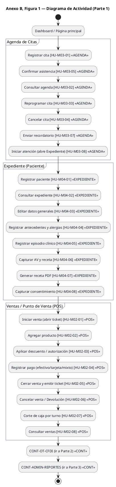

<br>

**Anexo B, Figura 1 – Diagrama de Actividad (Parte 2)**
_Flujo extendido: Taller/OT y Facturación CFDI._

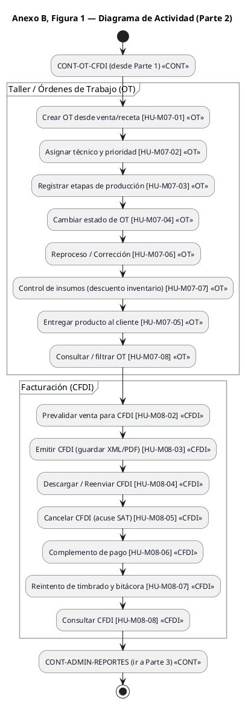

<br>

**Anexo B, Figura 1 – Diagrama de Actividad (Parte 3)**
_Flujo administrativo y de soporte: Inventario, Admin y Reportes._

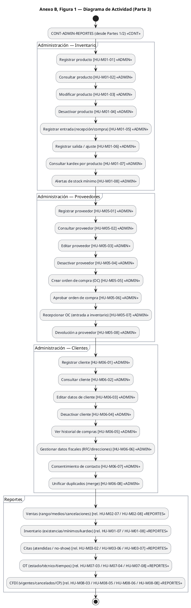

<br>

**Anexo B, Figura 2 – Diagrama de Máquina de Estados: Órdenes de Trabajo y Citas**
_Ciclo de vida de Citas y Órdenes de Trabajo._

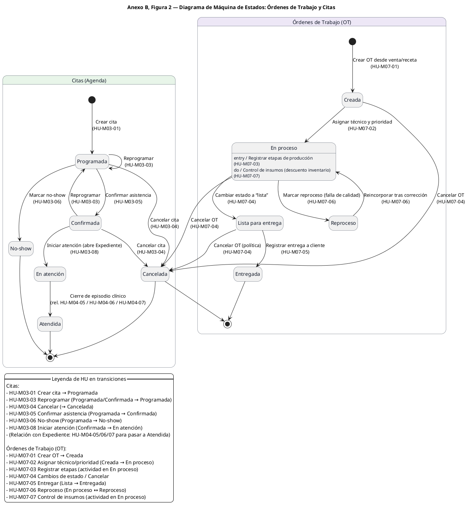

<br>

**Anexo B, Figura 3 – Diagrama de Secuencia: Venta y entrega**
_Interacción entre módulos, desde la cita hasta la entrega._

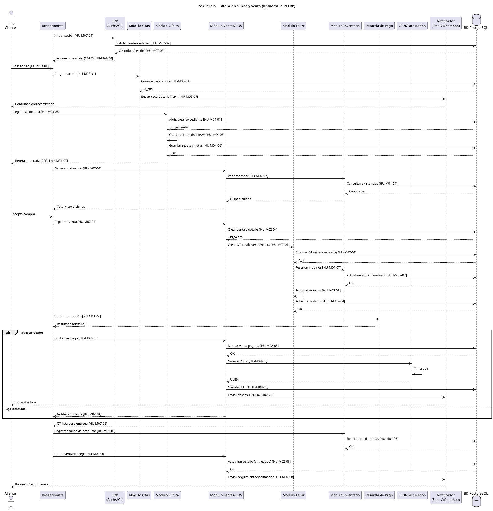

> **Explicación para desarrollador IA — Diagrama de Secuencia**
> Este diagrama describe la interacción temporal entre actores y módulos para ejecutar el flujo operativo principal del sistema, desde la atención clínica hasta la entrega y facturación.
> *   Define quién llama a quién, en qué orden y con qué responsabilidad, sin detallar implementación interna.
> *   Los participantes representan límites claros: actores humanos, cliente web, API, dominios del ERP y servicios externos.
> *   Cada mensaje clave incluye IDs de Historias de Usuario (HU), permitiendo trazabilidad directa entre requisitos y ejecución.
> *   El bloque alt modela decisiones críticas (pago aprobado/rechazado), indicando ramas obligatorias que deben manejarse.
> *   Las interacciones con servicios externos (Pago, CFDI/PAC, Notificador) están desacopladas y se invocan solo desde el dominio responsable.
> *   La persistencia se realiza explícitamente a través de la BD, mostrando puntos de commit del proceso.
>
> Este diagrama debe usarse para:
> *   Implementar orquestación (controladores, casos de uso).
> *   Validar orden de operaciones y dependencias entre dominios.
> *   Diseñar manejo de errores y reintentos en pasos críticos (pago, timbrado).
>
> No define reglas de negocio internas ni estados; esas se rigen por los diagramas de Actividad y Máquina de Estados. Aquí se especifica la conversación del sistema en tiempo de ejecución.


### Anexo C. Especificaciones Técnicas y Arquitectura


**Tabla 5. Consolida las decisiones técnicas del proyecto.**
_Propuesta de requerimientos técnicos y stack tecnológico._

| Concepto | Detalle |
| :--- | :--- |
| **Niveles de usuario** | Administrador, Recepcionista, Cajero/Facturista, Optometrista, Compras, Almacén, Técnico, Cliente. |
| **Módulos propuestos** | 8 módulos: Inventario, Ventas/POS, Agenda de Citas, Expediente, Proveedores, Clientes, Taller/OT, Facturación. |
| **Lenguajes de programación** | Tecnologías web estándar: PHP, Python, JavaScript/TypeScript (capas web y API REST) y SQL (consultas/migraciones). |
| **IDE / Editor** | Visual Studio Code (extensiones para TS/JS, linting y depuración). |
| **SG Base de Datos** | PostgreSQL (modelo relacional normalizado a 3FN). |
| **Librerías / Componentes** | JWT (tokens), OAuth2/OIDC, cliente SMTP (correo), SDK/PAC CFDI, validadores (input sanitization). |
| **Protocolos** | HTTPS/TLS 1.2+, HTTP/1.1 (REST/JSON), OAuth2, SMTP, NTP. |
| **Interfaz gráfica** | Web responsiva (SPA/PWA), alertas visuales, navegación consistente, accesibilidad WCAG AA. |
| **Mecanismos de seguridad** | 1) TLS e2e; 2) Hashing (bcrypt/Argon2); 3) Prevención SQLi/XSS; 4) RBAC + JWT; 5) Políticas de pass/2FA; 6) Backups RPO/RTO; 7) Rate limiting. |
| **Otras tecnologías** | Sanitización de código, gestión de secretos (Vault/KMS), logging/monitoreo (ELK/Prometheus), CI/CD. |
| **Hardware externo** | Impresora térmica POS, lector de código de barras, PCs/laptops/tablets de usuario. |
_*El valor propuesto podría variar, dependiendo de otros factores, como económicos y estratégicos (Fuente: elaboración propia, 2025)._

<br>


| Componente / Área | Qué es | Para qué sirve (función práctica) | Puertos / Canal | RNF asociado |
| :--- | :--- | :--- | :--- | :--- |
| **VPC / Red Privada** | Red aislada en la nube | Mantener servidores internos fuera de Internet | — | Seguridad, disponibilidad |
| **DMZ (zona pública)** | Segmento expuesto a Internet | Recibe tráfico y lo filtra antes de entrar a la red privada | — | Seguridad |
| **WAF / CDN** | Firewall web y red de distribución | Bloquea ataques (SQLi, XSS) y acelera estáticos | HTTPS 443 | Seguridad, desempeño |
| **Balanceador de Carga (LB)** | Entrada única al backend | Reparte peticiones a varias réplicas de la API | HTTPS 443 | Disponibilidad, escalabilidad |
| **HTTPS/TLS** | Cifrado de transporte | Protege datos entre navegador ↔ WAF/LB ↔ API | 443 | Seguridad (en tránsito) |
| **Clúster de aplicaciones** | Contenedores de ERP API + workers | API atiende solicitudes; workers ejecutan tareas en segundo plano | Interno | Disponibilidad, desempeño |
| **Workers (jobs/colas)** | Procesos asíncronos | Enviar correos, timbrar, generar PDFs sin bloquear la API | AMQP 5672 | Desempeño, resiliencia |
| **Monitoreo & logging** | Prometheus/Loki/Grafana | Métricas, logs, alertas y tableros | — | Mantenibilidad, disponibilidad |
| **Cola de mensajes** | RabbitMQ/AMQP | Desacopla procesos; garantiza entrega diferida | TCP 5672 | Resiliencia, desempeño |
| **Almacenamiento de archivos** | S3/NFS | Guardar XML/PDF de CFDI, imágenes de recetas/evidencias | S3/NFS | Integridad, disponibilidad |
| **Redis (cache)** | Almacén en memoria | Acelera sesiones, tokens y consultas repetidas | TCP 6379 | Desempeño |
| **Zona de Datos (privada)** | Segmento de base de datos | Aislar y proteger datos operativos | — | Seguridad |
| **PostgreSQL** | Base de datos operativa | Persistencia transaccional del ERP | TLS 5432 | Integridad, disponibilidad |
| **Backups / Snapshots** | Copias automáticas | Recuperación ante pérdida o corrupción | — | Continuidad, confiabilidad |
| **PITR** | Point-In-Time Recovery | Volver a un instante exacto tras un error humano | — | Recuperación ante desastres |
| **Pasarela de Pago** | Servicio externo | Cobros con tarjeta/links de pago | HTTPS | Integración, seguridad |
| **PAC / SAT CFDI** | Servicio externo | Timbrado, cancelación, complementos de pago | HTTPS | Cumplimiento fiscal, integridad |
| **Proveedor de mensajería** | Email/WhatsApp/SMS | Recordatorios y notificaciones | HTTPS | Comunicaciones, usabilidad |
| **mTLS LB↔API** | Autenticación mutua TLS | Verifica identidad de ambos extremos, no solo cifra | 443 interno | Seguridad reforzada |
| **JWT / RBAC** | Tokens firmados y roles/permisos | Control de acceso a recursos de la API | — | Seguridad |
| **Secrets en vault/KMS** | Gestor seguro de llaves | Custodia de contraseñas, llaves y tokens | — | Seguridad, cumplimiento |
| **SG/ACL** | Reglas de red | Solo puertos necesarios (443, 5432, 5672, 6379…) | — | Seguridad |
| **Cifrado en reposo** | Disco/objetos cifrados | Protege datos y backups almacenados | — | Seguridad |
| **Backups verificados** | Pruebas de restauración | Garantiza que las copias sirven realmente | — | Continuidad |

_Figura 4 — Tabla explicativa que desglosa los elementos mostrados en la Figura 3 (VPC/Red privada, DMZ con WAF/CDN y LB, clúster de aplicaciones/workers, monitoreo, RabbitMQ/AMQP 5672, S3/NFS, Redis 6379, PostgreSQL 5432 con TLS, backups/PITR, pasarela de pago, PAC/SAT CFDI y mensajería), indicando su función, protocolos/puertos y RNF asociadas (seguridad, disponibilidad, desempeño, continuidad y cumplimiento). Reitera controles: mTLS entre LB–API, JWT/RBAC, secretos en vault/KMS, SG/ACL, cifrado en tránsito y en reposo, y verificación de respaldos. (elaboración propia; extensión de la Figura 6)_

<br>

**Anexo C, Figura 4 — Diagrama de Componentes (Arquitectura conceptual)**
_Descomposición del sistema en dominios funcionales y sus integraciones._

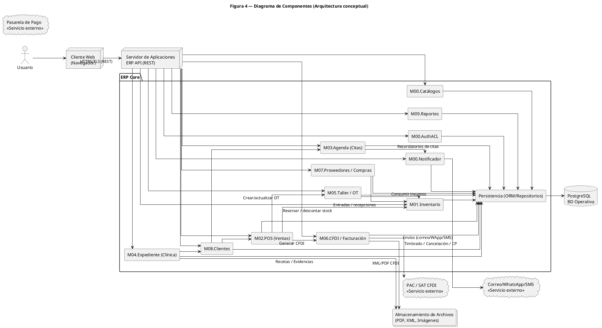

> **Explicación para desarrollador IA — Diagrama de Componentes**
> *   **Responsabilidad por dominio:** cada componente encapsula un dominio funcional claro sin lógica cruzada.
> *   **Punto único de entrada:** el ERP API (REST) es el gateway; ningún cliente accede directo a dominios internos.
> *   **Desacoplamiento:** los dominios no se llaman entre sí directamente; coordinan vía la API.
> *   **Persistencia centralizada:** todos los dominios acceden a datos mediante Repositorios (ORM), no directo a BD.
> *   **Integraciones externas aisladas:** Pago, PAC/SAT y Mensajería están fuera del Core y se consumen solo desde su dominio.
>
> **Flujos clave:**
> *   POS → OT → Inventario → CFDI
> *   Agenda → Clínica → Clientes
> *   Notificador como side-effect (eventual, no bloqueante).
>

<br>

**Anexo C, Figura 5 — Diagrama de Paquetes (Arquitectura ERP)**
_Organización por capas y dominios (Clean Architecture)._

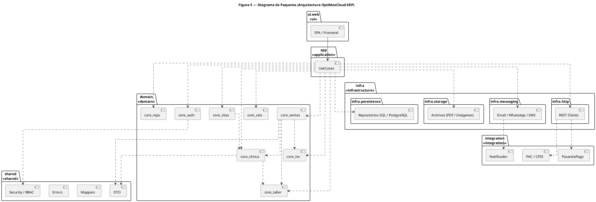

> **Explicación para el desarrollador IA — Diagrama de Paquetes**
> Este diagrama describe la arquitectura lógica del sistema ERP organizada por capas y dominios, siguiendo principios de separación de responsabilidades y Clean Architecture.
>
> **1. ui.web (Interfaz de Usuario)**
> *   Contiene el cliente web (SPA).
> *   Responsabilidad: presentación y captura de datos.
> *   No contiene lógica de negocio ni acceso directo a infraestructura.
>
> **2. app (Capa de Aplicación)**
> *   Contiene los Use Cases.
> *   Orquesta los flujos del sistema, coordinando UI, dominios e infraestructura.
> *   No implementa reglas de negocio, solo secuencia y control.
>
> **3. domain (Capa de Dominio)**
> *   Núcleo del negocio con dominios independientes (*bounded contexts*):
>     *   auth, citas, clínica, ventas, taller, inventario, catálogos, reportes.
> *   Cada dominio encapsula sus reglas sin depender de infraestructura.
>
> **4. shared (Componentes Compartidos)**
> *   Elementos transversales: DTO, mappers, errors, security/RBAC.
> *   Sin lógica de negocio específica.
>
> **5. infra (Infraestructura)**
> *   Detalles técnicos: persistencia (BD), storage, mensajería, clientes HTTP.
> *   Adapta tecnologías externas al sistema.
>
> **6. integration (Integraciones Externas)**
> *   Servicios externos: pagos, CFDI, notificaciones.
> *   Acceso vía infraestructura, nunca directo desde dominio.
>
> **Reglas arquitectónicas clave:**
> *   La interfaz solo interactúa con la capa de aplicación.
> *   La capa de aplicación depende del dominio, no al revés.
> *   El dominio es independiente de tecnologías.
> *   La infraestructura son adaptadores, no controladores.

<br>

**Anexo C, Figura 6 — Diagrama de Despliegue (Arquitectura ERP)**
_Topología física: VPC, Zonas, Nodos, Protocolos y Seguridad._

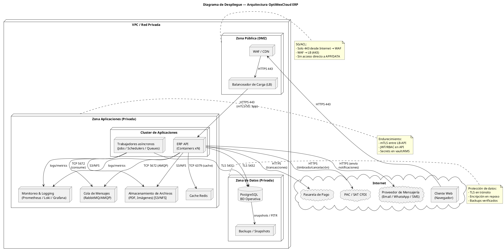

> **Explicación para el desarrollador IA — Diagrama de Despliegue**
> Este diagrama representa el despliegue físico y lógico del sistema ERP en un entorno de nube, mostrando nodos, zonas de red, servicios y flujos de comunicación con el objetivo de guiar la implementación segura y escalable.
>
> **Zonas y segmentación de red:**
> *   **Internet / Clientes:** Acceso vía navegador.
> *   **DMZ:** WAF/CDN y LB (expone solo HTTPS 443).
> *   **Zona Privada de Apps:** Clúster de contenedores (API, workers) y servicios gestionados internos (Redis, RabbitMQ).
> *   **Zona de Datos:** Base de datos y backups, sin acceso directo a internet.
>
> **Capa de Aplicaciones:**
> *   **ERP API & Workers:** Ejecución en contenedores; workers procesan tareas asíncronas para no bloquear la API.
> *   **Servicios Internos:** Redis (cache) y RabbitMQ (colas) aislados del dominio, solo consumidos por API/Workers.
>
> **Capa de Datos:**
> *   **PostgreSQL:** Accesible solo desde la zona de aplicaciones vía conexión segura.
> *   **Backups:** Snapshots para recuperación y confiabilidad RNF.
>
> **Integraciones Externas:**
> *   Conectan única y exclusivamente a través de la ERP API vía HTTPS.
>
> **Seguridad y Control:**
> *   **Tránsito:** Todo TLS.
> *   **Acceso:** Centralizado en API (JWT/RBAC).
> *   **Red:** Segmentada por función (VPC, DMZ, Privada).
>

<br>

### Anexo D. Diccionario de Datos y Modelo de Dominio

**Figura 7. Diagrama de Clases (Dominio).**
_Estructura estática de entidades del dominio, atributos y métodos principales._

```plantuml
@startuml
title Diagrama de Clases (Dominio)\n(elaboración propia con PlantUML.com)

skinparam classAttributeIconSize 0
skinparam shadowing false
skinparam roundcorner 10
skinparam packageStyle rect
skinparam nodesep 30
skinparam ranksep 30

left to right direction

'======================================================
'  PACKAGE AUTH / ACCESO
'======================================================

package "Auth / Acceso" #E6F1FF {

  class Usuario <<entity>> {
    +id_usuario : UUID
    +nombre : string
    +email : string
    +password_hash : string
    +activo : bool
    +creado_en : datetime
    --
    +autenticar(credenciales : string) : bool
    +cambiarContrasena(nueva : string) : void
    +tieneRol(rol : Rol) : bool
    +actualizarPerfil(nombre : string, email : string) : void
    +activar() : void
    +desactivar() : void
  }

  class Rol <<entity>> {
    +id_rol : UUID
    +nombre : string
    --
    +agregarPermiso(permiso : Permiso) : void
    +quitarPermiso(permiso : Permiso) : void
    +asignarUsuario(u : Usuario) : void
    +removerUsuario(u : Usuario) : void
  }

  class Permiso <<entity>> {
    +id_permiso : UUID
    +codigo : string
    +descripcion : string
    --
    +validar() : bool
    +esCritico() : bool
  }

  class UsuarioRol <<entity>> {
    +id_usuario_rol : UUID
    +id_usuario : UUID
    +id_rol : UUID
    --
    +crear(u : Usuario, r : Rol) : UsuarioRol
  }

  class RolPermiso <<entity>> {
    +id_rol_permiso : UUID
    +id_rol : UUID
    +id_permiso : UUID
    --
    +asignar(r : Rol, p : Permiso) : RolPermiso
    +remover() : void
  }
}

'======================================================
'  PACKAGE CLÍNICA
'======================================================

package "Clínica" #E7F9E7 {

  class Optometrista <<entity>> {
    +id_optometrista : UUID
    +nombre : string
    +cedula : string
    +telefono : string
    +email : string
    --
    +asignarCita(c : Cita) : void
    +validarCedula() : bool
    +actualizarDatos() : void
  }

  class Paciente <<entity>> {
    +id_paciente : UUID
    +nombre : string
    +apellidos : string
    +telefono : string
    +email : string
    +fecha_registro : date
    --
    +registrar() : void
    +actualizarDatos() : void
    +validarContacto() : bool
  }

  class Cita <<entity>> {
    +id_cita : UUID
    +id_paciente : UUID
    +id_optometrista : UUID
    +fecha : date
    +hora : time
    +estado : EstadoCita
    +motivo : string
    +creada_en : datetime
    --
    +programar(p : Paciente, o : Optometrista, f : date, h : time) : void
    +reprogramar(f : date, h : time) : void
    +cancelar(motivo : string) : void
    +confirmar() : void
    +marcarAusente() : void
    +esCancelable() : bool
    +esReprogramable() : bool
  }

  class Expediente <<entity>> {
    +id_expediente : UUID
    +id_paciente : UUID
    +fechaApertura : date
    +notas : text
    --
    +abrir(p : Paciente) : void
    +adjuntarArchivo(url : string, tipo : string) : void
    +cerrar() : void
    +validarArchivo(url : string) : bool
  }

  class Receta <<entity>> {
    +id_receta : UUID
    +id_expediente : UUID
    +esfera_OD : decimal
    +cilindro_OD : decimal
    +eje_OD : int
    +esfera_OI : decimal
    +cilindro_OI : decimal
    +eje_OI : int
    +observaciones : string
    +fechaEmision : date
    +pdf_url : string
    --
    +emitir(e : Expediente) : void
    +generarPDF() : string
    +validarGraduacion() : bool
    +actualizar() : void
  }
}

'======================================================
'  PACKAGE VENTAS / POS
'======================================================

package "Ventas / POS" #FFEFD5 {

  class Venta <<entity>> {
    +id_venta : UUID
    +id_paciente : UUID
    +id_receta : UUID
    +fecha : datetime
    +total : Dinero
    +estado : EstadoVenta
    --
    +agregarItem(p : Producto, cant : decimal, precio : Dinero) : void
    +calcularTotal() : Dinero
    +cambiarEstado(nuevo : EstadoVenta) : void
    +registrarPago(monto : Dinero, metodo : MetodoPago) : Pago
    +emitirCFDI() : FacturaCFDI
    +cancelar() : void
    +validarEstado() : bool
    +aplicarDescuento(pct : decimal) : void
  }

  class DetalleVenta <<entity>> {
    +id_detalle : UUID
    +id_venta : UUID
    +id_producto : UUID
    +cantidad : decimal
    +precioUnit : Dinero
    +subtotal : Dinero
    --
    +calcularSubtotal() : Dinero
    +actualizarCantidad(nueva : decimal) : void
  }

  class Pago <<entity>> {
    +id_pago : UUID
    +id_venta : UUID
    +monto : Dinero
    +metodo : MetodoPago
    +autorizacion : string
    +creado_en : datetime
    --
    +autorizar() : bool
    +anular() : void
    +validarMonto() : bool
  }
}

'======================================================
'  PACKAGE CFDI
'======================================================

package "CFDI" #FFE5E5 {

  class ServicioCFDI <<service>> {
    +timbrar(v : Venta) : FacturaCFDI
    +cancelar(f : FacturaCFDI, motivo : string) : bool
    +validarTimbrado(f : FacturaCFDI) : bool
    +simular(v : Venta) : bool
  }

  class FacturaCFDI <<entity>> {
    +id_cfdi : UUID
    +uuid : string
    +id_venta : UUID
    +rfc : string
    +uso_cfdi : string
    +total : Dinero
    +estatus : EstatusCFDI
    +xml_url : string
    +pdf_url : string
    --
    +timbrar() : bool
    +cancelar(motivo : string) : bool
    +validarXML() : bool
    +generarCadenaOriginal() : string
  }
}

'======================================================
'  PACKAGE TALLER / OT
'======================================================

package "Taller / OT" #E5ECFF {

  class OrdenTrabajo <<entity>> {
    +id_ot : UUID
    +id_venta : UUID
    +especificaciones : text
    +estado : EstadoOT
    +creada_en : datetime
    --
    +crearDesdeVenta(v : Venta) : void
    +cambiarEstado(nuevo : EstadoOT) : void
    +agregarInsumo(p : Producto, cant : decimal) : void
    +validarEspecificaciones() : bool
    +calcularTiempo() : int
  }

  class InsumoOT <<entity>> {
    +id_insumo_ot : UUID
    +id_ot : UUID
    +id_producto : UUID
    +cantidad : decimal
    --
    +reservar() : bool
    +liberar() : void
  }

  class HistorialEstadoOT <<entity>> {
    +id_hist_ot : UUID
    +id_ot : UUID
    +estado : EstadoOT
    +fecha : datetime
    +observacion : string
    --
    +registrar(estado : EstadoOT, fecha : datetime) : void
  }
}

'======================================================
'  PACKAGE INVENTARIO
'======================================================

package "Inventario" #F4E8FF {

  class Sucursal <<entity>> {
    +id_sucursal : UUID
    +nombre : string
    --
    +registrar() : void
    +actualizar(nuevoNombre : string) : void
    +desactivar() : void
  }

  class Producto <<entity>> {
    +id_producto : UUID
    +sku : string
    +nombre : string
    +precioBase : Dinero
    +activo : bool
    --
    +actualizarPrecio(nuevo : Dinero) : void
    +esStockSuficiente(cant : decimal) : bool
    +cambiarEstado(activo : bool) : void
  }

  class Existencia <<entity>> {
    +id_existencia : UUID
    +id_producto : UUID
    +id_sucursal : UUID
    +stock : decimal
    +min_stock : decimal
    --
    +ajustar(delta : decimal) : void
    +validarStockMinimo() : bool
  }

  class MovimientoInventario <<entity>> {
    +id_mov_inv : UUID
    +id_producto : UUID
    +tipo : string
    +cantidad : decimal
    +motivo : string
    +fecha : datetime
    --
    +registrarEntrada(p : Producto, cant : decimal) : void
    +registrarSalida(p : Producto, cant : decimal) : void
    +revertir() : void
    +validarMovimiento() : bool
  }
}

'======================================================
'  PACKAGE PROVEEDORES / COMPRAS
'======================================================

package "Proveedores / Compras" #E5FFF5 {

  class Proveedor <<entity>> {
    +id_proveedor : UUID
    +rfc : string
    +razonSocial : string
    +contacto : string
    +correo : string
    +condicionPago : string
    --
    +registrar() : void
    +actualizar() : void
    +validarRFC() : bool
  }

  class OrdenCompra <<entity>> {
    +id_oc : UUID
    +id_proveedor : UUID
    +fecha : date
    +condicionPago : string
    --
    +agregarItem(p : Producto, cant : decimal, costo : Dinero) : void
    +cerrar() : void
    +cancelar() : void
  }

  class DetalleOC <<entity>> {
    +id_detalle_oc : UUID
    +id_oc : UUID
    +id_producto : UUID
    +cantidad : decimal
    +costoUnit : Dinero
    +subtotal : Dinero
    --
    +calcularSubtotal() : Dinero
    +actualizarCantidad(nueva : decimal) : void
  }

  class Recepcion <<entity>> {
    +id_recepcion : UUID
    +id_oc : UUID
    +fecha : date
    +observaciones : string
    --
    +registrar() : void
    +validarCantidades() : bool
  }

  class Devolucion <<entity>> {
    +id_devolucion : UUID
    +id_oc : UUID
    +fecha : date
    +motivo : string
    --
    +procesar() : void
    +validarMotivo() : bool
  }
}

'======================================================
'  PACKAGE CATÁLOGOS / DOMINIOS
'======================================================

package "Catálogos / Dominios" #FFFFFF {

  class Direccion <<value>> {
    +calle : string
    +colonia : string
    +ciudad : string
    +estado : string
    +cp : string
    --
    +validar() : bool
    +formatear() : string
  }

  class Dinero <<value>> {
    +monto : decimal
    +moneda : string
    --
    +sumar(otro : Dinero) : Dinero
    +restar(otro : Dinero) : Dinero
    +formatear() : string
  }

  enum EstadoVenta <<enumeration>> {
    Abierta
    Pagada
    Cancelada
  }

  enum EstadoCita <<enumeration>> {
    Programada
    Confirmada
    Reprogramada
    Cancelada
    Ausente
    Atendida
  }

  enum EstadoOT <<enumeration>> {
    Recibida
    EnProceso
    EsperaMaterial
    Reparacion
    Terminada
    Entregada
    Devuelta
  }

  enum MetodoPago <<enumeration>> {
    Efectivo
    TPV
    Transferencia
  }

  enum EstatusCFDI <<enumeration>> {
    Vigente
    Cancelado
  }
}

'======================================================
'  ASOCIACIONES (multiplicidades)
'======================================================

' Auth
Usuario "1" -- "0..*" UsuarioRol
Rol     "1" -- "0..*" UsuarioRol
Rol     "1" -- "0..*" RolPermiso
Permiso "1" -- "0..*" RolPermiso

' Clínica
Paciente      "1" -- "0..*" Cita
Optometrista  "1" -- "0..*" Cita
Paciente      "1" -- "0..1" Expediente
Expediente    "1" -- "0..*" Receta

' Ventas
Paciente   "1" -- "0..*" Venta
Receta     "0..1" -- "0..*" Venta
Venta      "1" -- "1..*" DetalleVenta
Producto   "1" -- "0..*" DetalleVenta
Venta      "1" -- "0..*" Pago
Venta      "1" -- "0..1" FacturaCFDI

' Taller / OT
Venta         "1" -- "0..*" OrdenTrabajo
OrdenTrabajo  "1" -- "0..*" InsumoOT
Producto      "1" -- "0..*" InsumoOT
OrdenTrabajo  "1" -- "0..*" HistorialEstadoOT

' Inventario
Producto   "1" -- "0..*" Existencia
Sucursal   "1" -- "0..*" Existencia
Producto   "1" -- "0..*" MovimientoInventario
Recepcion  "1" -- "0..*" MovimientoInventario
Devolucion "1" -- "0..*" MovimientoInventario

' Compras
Proveedor    "1" -- "0..*" OrdenCompra
OrdenCompra  "1" -- "0..*" DetalleOC
OrdenCompra  "1" -- "0..*" Recepcion
OrdenCompra  "0..1" -- "0..*" Devolucion
Producto     "1" -- "0..*" DetalleOC

' CFDI
ServicioCFDI ..> FacturaCFDI
Venta "1" -- "0..1" FacturaCFDI

'======================================================
'  COMPOSICIONES (VALUE OBJECTS)
'======================================================

Paciente *-- Direccion
Proveedor *-- Direccion

Producto *-- Dinero
Venta *-- Dinero
DetalleVenta *-- Dinero
Pago *-- Dinero
DetalleOC *-- Dinero

@enduml
```


<br>

**Figura 8. Diagrama del Modelo Lógico (3FN) — Esquema Relacional Normalizado.**
_Definición de tablas, llaves primarias (*), únicas (+) y foráneas (<<FK>>) con tipos de dato explícitos._

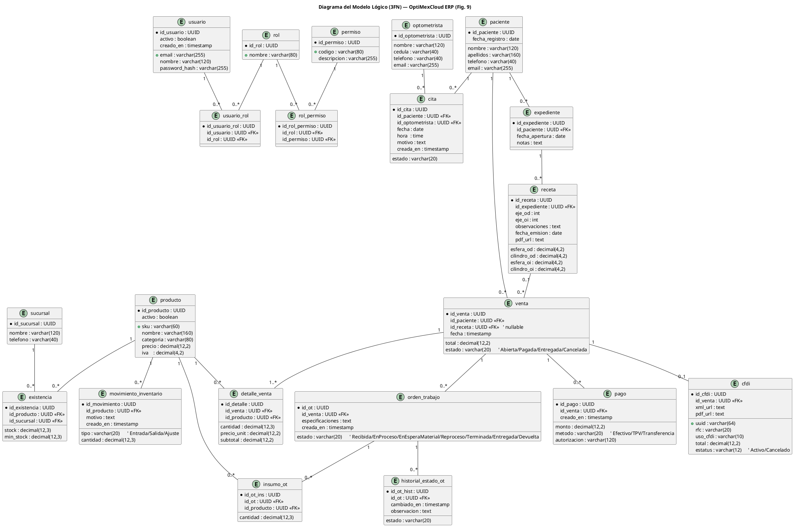

<br>

**Figura 9. Diagrama Relacional de la Base de Datos (Extendido).**
_Detalle visual de tablas, catálogos y relaciones (Crow's Foot Notation)._

```plantuml
@startuml
title Diagrama Relacional de la Base de Datos\n(elaboración propia con PlantUML.com)

skinparam classAttributeIconSize 0
skinparam shadowing false
skinparam roundcorner 10
skinparam packageStyle rect
skinparam nodesep 30
skinparam ranksep 30
left to right direction

'======================================================
'  ACCESO / USUARIOS
'======================================================
package "Usuarios / Acceso" #E6F1FF {

  class usuario {
    +id_usuario : UUID <<PK>>
    +nombre : varchar(120)
    +email : varchar(255) <<UK>>
    +password_hash : varchar(255)
    +activo : boolean
    +creado_en : timestamp
  }

  class permiso {
    +id_permiso : UUID <<PK>>
    +codigo : varchar(80) <<UK>>
    +descripcion : varchar(255)
  }

  class rol {
    +id_rol : UUID <<PK>>
    +nombre : varchar(80) <<UK>>
  }

  class usuario_rol {
    +id_usuario_rol : UUID <<PK>>
    +id_usuario : UUID <<FK>>
    +id_rol : UUID <<FK>>
  }


  class rol_permiso {
    +id_rol_permiso : UUID <<PK>>
    +id_rol : UUID <<FK>>
    +id_permiso : UUID <<FK>>
  }

  class bitacora_seguridad {
    +id_bitacora : UUID <<PK>>
    +id_usuario : UUID <<FK>>
    +accion : varchar(50)
    +ip_origen : varchar(45)
    +detalles : text
    +fecha : timestamp
  }

}

'======================================================
'  CLÍNICA
'======================================================
package "Clínica" #E7F9E7 {

  class paciente {
    +id_paciente : UUID <<PK>>
    +nombre : varchar(120)
    +apellidos : varchar(120)
    +telefono : varchar(40)
    +email : varchar(255)
    +fecha_registro : date
  }

  class optometrista {
    +id_optometrista : UUID <<PK>>
    +nombre : varchar(120)
    +cedula : varchar(40)
    +telefono : varchar(40)
    +email : varchar(255)
  }

  class expediente {
    +id_expediente : UUID <<PK>>
    +id_paciente : UUID <<FK>>
    +fecha_apertura : date
    +notas : text
  }

  class cita {
    +id_cita : UUID <<PK>>
    +id_paciente : UUID <<FK>>
    +id_optometrista : UUID <<FK>>
    +fecha : date
    +hora : time
    +estado_cita : int <<FK>>
    +motivo : varchar(250)
    +creada_en : timestamp
  }

  class receta {
    +id_receta : UUID <<PK>>
    +id_expediente : UUID <<FK>>
    +esfera_od : decimal(4,2)
    +cilindro_od : decimal(4,2)
    +eje_od : int
    +esfera_oi : decimal(4,2)
    +cilindro_oi : decimal(4,2)
    +eje_oi : int
    +fecha_emision : date
    +observaciones : text
    +pdf_url : varchar(255)
  }
}

'======================================================
'  VENTAS / POS
'======================================================
package "Ventas / POS" #FFF0D0 {

  class venta {
    +id_venta : UUID <<PK>>
    +id_paciente : UUID <<FK>>
    +id_receta : UUID <<FK>> nullable
    +id_sucursal : UUID <<FK>>
    +estado_venta : int <<FK>>
    +fecha : timestamp
    +total : decimal(12,2)
  }

  class detalle_venta {
    +id_detalle : UUID <<PK>>
    +id_venta : UUID <<FK>>
    +id_producto : UUID <<FK>>
    +cantidad : decimal(12,2)
    +precio_unit : decimal(12,2)
    +subtotal : decimal(12,2)
  }

  class pago {
    +id_pago : UUID <<PK>>
    +id_venta : UUID <<FK>>
    +id_metodo_pago : UUID <<FK>>
    +monto : decimal(12,2)
    +autorizacion : varchar(120)
    +creado_en : timestamp
  }

  class orden_trabajo {
    +id_ot : UUID <<PK>>
    +id_venta : UUID <<FK>>
    +especificaciones : text
    +estado_ot : int <<FK>>
    +creada_en : timestamp
  }

  class historial_estado_ot {
    +id_hist_ot : UUID <<PK>>
    +id_ot : UUID <<FK>>
    +estado_ot : int <<FK>>
    +fecha : timestamp
    +observacion : text
  }

  class factura_cfdi {
    +id_cfdi : UUID <<PK>>
    +id_venta : UUID <<FK>>
    +uuid : varchar(50) <<UK>>
    +rfc : varchar(20)
    +uso_cfdi : varchar(10)
    +xml_url : varchar(255)
    +pdf_url : varchar(255)
    +estatus_cfdi : int <<FK>>
  }
}

'======================================================
'  INVENTARIO
'======================================================
package "Inventario" #F4E8FF {

  class sucursal {
    +id_sucursal : UUID <<PK>>
    +nombre : varchar(120)
    +telefono : varchar(40)
  }

  class producto {
    +id_producto : UUID <<PK>>
    +sku : varchar(80) <<UK>>
    +nombre : varchar(160)
    +precio_base : decimal(12,2)
    +activo : boolean
  }

  class existencia {
    +id_existencia : UUID <<PK>>
    +id_producto : UUID <<FK>>
    +id_sucursal : UUID <<FK>>
    +stock : decimal(12,2)
    +min_stock : decimal(12,2)
  }

  class movimiento_inventario {
    +id_mov_inv : UUID <<PK>>
    +id_producto : UUID <<FK>>
    +id_sucursal : UUID <<FK>>
    +id_tipo_mov_inv : int <<FK>>
    +cantidad : decimal(12,2)
    +motivo : varchar(250)
    +fecha : timestamp
  }
}

'======================================================
'  COMPRAS / PROVEEDORES
'======================================================
package "Proveedores / Compras" #E5FFF5 {

  class proveedor {
    +id_proveedor : UUID <<PK>>
    +rfc : varchar(20)
    +razon_social : varchar(255)
    +contacto : varchar(120)
    +correo : varchar(255)
    +condicion_pago : varchar(80)
  }

  class orden_compra {
    +id_oc : UUID <<PK>>
    +id_proveedor : UUID <<FK>>
    +fecha : date
    +condicion_pago : varchar(80)
  }

  class detalle_oc {
    +id_detalle_oc : UUID <<PK>>
    +id_oc : UUID <<FK>>
    +id_producto : UUID <<FK>>
    +cantidad : decimal(12,2)
    +costo_unit : decimal(12,2)
    +subtotal : decimal(12,2)
  }

  class recepcion {
    +id_recepcion : UUID <<PK>>
    +id_oc : UUID <<FK>>
    +fecha : date
    +observaciones : text
  }

  class devolucion {
    +id_devolucion : UUID <<PK>>
    +id_oc : UUID <<FK>>
    +fecha : date
    +motivo : text
  }
}

'======================================================
'  CATÁLOGOS / DOMINIOS
'======================================================

package "Catálogos / Dominios" #FFFFFF {

  class cat_estado_venta {
    +id_estado_venta : UUID <<PK>>
    +nombre : varchar(30) <<UK>>
  }

  class cat_metodo_pago {
    +id_metodo_pago : UUID <<PK>>
    +nombre : varchar(30) <<UK>>
  }

  class cat_estado_ot {
    +id_estado_ot : UUID <<PK>>
    +nombre : varchar(30) <<UK>>
  }

  class cat_estado_cita {
    +id_estado_cita : UUID <<PK>>
    +nombre : varchar(30) <<UK>>
  }

  class cat_estatus_cfdi {
    +id_estatus_cfdi : UUID <<PK>>
    +nombre : varchar(30) <<UK>>
  }

  class cat_tipo_mov_inv {
    +id_tipo_mov_inv : UUID <<PK>>
    +nombre : varchar(30) <<UK>>
  }
}

'======================================================
'  RELACIONES (PK → FK)
'======================================================

usuario_rol }o--|| usuario
usuario_rol }o--|| rol
rol_permiso }o--|| permiso
rol_permiso }o--|| rol

expediente }o--|| paciente
cita }o--|| paciente
cita }o--|| optometrista
receta }o--|| expediente

venta }o--|| paciente
venta }o--|| receta
venta }o--|| sucursal
venta }o--|| cat_estado_venta

detalle_venta }o--|| venta
detalle_venta }o--|| producto

pago }o--|| venta
pago }o--|| cat_metodo_pago

orden_trabajo }o--|| venta
orden_trabajo }o--|| cat_estado_ot

historial_estado_ot }o--|| orden_trabajo
historial_estado_ot }o--|| cat_estado_ot

factura_cfdi }o--|| venta
factura_cfdi }o--|| cat_estatus_cfdi

existencia }o--|| producto
existencia }o--|| sucursal

movimiento_inventario }o--|| producto
movimiento_inventario }o--|| sucursal
movimiento_inventario }o--|| cat_tipo_mov_inv

orden_compra }o--|| proveedor
detalle_oc }o--|| orden_compra
detalle_oc }o--|| producto
recepcion }o--|| orden_compra
devolucion }o--|| orden_compra

cita }o--|| cat_estado_cita

@enduml
```

<br>

**Tabla 1. Diccionario de Datos — Campos, tipos y llaves.**
_Descripción detallada de atributos para las entidades principales._

| Tabla / Entidad | Campo | Tipo | Requerido | PK/FK/UK | Descripción / Observaciones |
| :--- | :--- | :--- | :---: | :--- | :--- |
| **USUARIO** | id_usuario | UUID | Sí | PK | Identificador del usuario. |
| | nombre | varchar(120) | Sí | — | Nombre completo. |
| | email | varchar(255) | Sí | UK | Correo único para acceso. |
| | password_hash | varchar(255) | Sí | — | Hash de contraseña (bcrypt). |
| | activo | boolean | Sí | — | Estado habilitado. |
| | creado_en | timestamp | Sí | — | Fecha/hora de alta. |
| **ROL** | id_rol | UUID | Sí | PK | Identificador del rol. |
| | nombre | varchar(80) | Sí | UK | Nombre único de rol (e.g. ADMIN). |
| **PERMISO** | id_permiso | UUID | Sí | PK | Identificador del permiso. |
| | codigo | varchar(80) | Sí | UK | Código único (e.g. VENTA_READ). |
| | descripcion | varchar(255) | No | — | Descripción breve. |
| **PACIENTE** | id_paciente | UUID | Sí | PK | Identificador del paciente/cliente. |
| | nombre | varchar(120) | Sí | — | Nombre. |
| | apellidos | varchar(160) | Sí | — | Apellidos. |
| | telefono | varchar(40) | No | — | Teléfono. |
| | email | varchar(255) | No | — | Correo electrónico. |
| | fecha_registro | date | Sí | — | Fecha de alta. |
| **CITA** | id_cita | UUID | Sí | PK | Identificador de cita. |
| | id_paciente | UUID | Sí | FK | Paciente citado (-> paciente). |
| | id_optometrista | UUID | Sí | FK | Profesional asignado (-> optometrista). |
| | fecha | date | Sí | — | Fecha de la cita. |
| | hora | time | Sí | — | Hora de la cita. |
| | id_estado_cita | UUID | Sí | FK | Estado controlado (-> cat_estado_cita). |
| **EXPEDIENTE** | id_expediente | UUID | Sí | PK | Identificador de expediente. |
| | id_paciente | UUID | Sí | FK+UK | Paciente propietario (1:1). |
| | fecha_apertura | date | Sí | — | Fecha de apertura. |
| | notas | text | No | — | Observaciones generales. |
| **RECETA** | id_receta | UUID | Sí | PK | Identificador de receta. |
| | id_expediente | UUID | Sí | FK | Expediente asociado (-> expediente). |
| | esfera_od/oi | decimal(4,2) | Sí | — | Graduación ESF (OD/OI). |
| | cilindro_od/oi | decimal(4,2) | Sí | — | Cilindro (OD/OI). |
| | eje_od/oi | int | Sí | — | Eje (OD/OI). |
| | fecha_emision | date | Sí | — | Fecha de emisión. |
| **PRODUCTO** | id_producto | UUID | Sí | PK | Identificador de producto. |
| | sku | varchar(60) | Sí | UK | SKU único. |
| | nombre | varchar(160) | Sí | — | Nombre comercial. |
| | precio_unit | decimal(12,2) | Sí | — | Precio unitario base. |
| **VENTA** | id_venta | UUID | Sí | PK | Identificador de venta. |
| | id_paciente | UUID | Sí | FK | Cliente (-> paciente). |
| | id_sucursal | UUID | Sí | FK | Sucursal de operación (-> sucursal). |
| | id_estado_venta | UUID | Sí | FK | Estado (-> cat_estado_venta). |
| | total | decimal(12,2) | Sí | — | Total calculado. |
| **ORDEN_TRABAJO** | id_ot | UUID | Sí | PK | Identificador de OT. |
| | id_venta | UUID | Sí | FK | Venta origen (-> venta). |
| | id_estado_ot | UUID | Sí | FK | Estado (-> cat_estado_ot). |
| | especificaciones | text | Sí | — | Indicaciones de fabricación. |
| **CFDI** | id_cfdi | UUID | Sí | PK | Identificador interno. |
| | uuid | varchar(64) | Sí | UK | UUID Fiscal (Folio SAT). |
| | id_venta | UUID | Sí | FK | Venta facturada (-> venta). |
| | rfc | varchar(20) | Sí | — | RFC receptor. |
| | total | decimal(12,2) | Sí | — | Total timbrado. |
| **BITACORA_SEGURIDAD** | id_bitacora | UUID | Sí | PK | Identificador de log. |
| | id_usuario | UUID | No | FK | Usuario actor (-> usuario). |
| | accion | varchar(50) | Sí | — | Tipo de evento (LOGIN, UPDATE, etc). |
| | ip_origen | varchar(45) | No | — | Dirección IP del cliente. |
| | detalles | text | No | — | Datos adicionales del evento. |
| | fecha | timestamp | Sí | — | Momento del registro. |


_Tabla 1 — Especifica por tabla los campos, tipos, obligatoriedad, claves PK/FK, unicidad y descripción. Deriva del Diagrama Relacional (Fig. 9); incluye restricción compuesta en EXISTENCIA y campos materializados. Trazabilidad a HU M01–M08 y RNF de consistencia (Fuente: elaboración propia, 2025)._
<br>

**Código creación de tablas (DDL) — Script SQL PostgreSQL.**
_Script completo para la creación de la estructura de base de datos (tablas, llaves y relaciones)._

```sql
/* =========================================================
   SCRIPT: Creación completa de BD Optica ERP
   Motor: PostgreSQL
   Autoría: Elaboración propia
   ========================================================= */

/* ---------- 1. Eliminar y crear base de datos ---------- */

DROP DATABASE IF EXISTS optica_erp;
CREATE DATABASE optica_erp
  WITH ENCODING='UTF8'
       LC_COLLATE='es_MX.UTF-8'
       LC_CTYPE='es_MX.UTF-8'
       TEMPLATE=template0;

\c optica_erp;

/* ---------- 2. Extensiones ---------- */

CREATE EXTENSION IF NOT EXISTS "uuid-ossp";

/* ---------- 3. Catálogos ---------- */

CREATE TABLE cat_estado_cita (
  id_estado_cita UUID PRIMARY KEY DEFAULT uuid_generate_v4(),
  nombre VARCHAR(30) UNIQUE NOT NULL
);

CREATE TABLE cat_estado_venta (
  id_estado_venta UUID PRIMARY KEY DEFAULT uuid_generate_v4(),
  nombre VARCHAR(30) UNIQUE NOT NULL
);

CREATE TABLE cat_estado_ot (
  id_estado_ot UUID PRIMARY KEY DEFAULT uuid_generate_v4(),
  nombre VARCHAR(30) UNIQUE NOT NULL
);

CREATE TABLE cat_estatus_cfdi (
  id_estatus_cfdi UUID PRIMARY KEY DEFAULT uuid_generate_v4(),
  nombre VARCHAR(30) UNIQUE NOT NULL
);

CREATE TABLE cat_metodo_pago (
  id_metodo_pago UUID PRIMARY KEY DEFAULT uuid_generate_v4(),
  nombre VARCHAR(20) UNIQUE NOT NULL
);

CREATE TABLE cat_tipo_mov_inv (
  id_tipo_mov UUID PRIMARY KEY DEFAULT uuid_generate_v4(),
  nombre VARCHAR(20) UNIQUE NOT NULL
);

/* ---------- 4. Seguridad ---------- */

CREATE TABLE usuario (
  id_usuario UUID PRIMARY KEY DEFAULT uuid_generate_v4(),
  nombre VARCHAR(120) NOT NULL,
  email VARCHAR(255) UNIQUE NOT NULL,
  password_hash VARCHAR(255) NOT NULL,
  activo BOOLEAN NOT NULL,
  creado_en TIMESTAMP NOT NULL DEFAULT now()
);

CREATE TABLE rol (
  id_rol UUID PRIMARY KEY DEFAULT uuid_generate_v4(),
  nombre VARCHAR(80) UNIQUE NOT NULL
);

CREATE TABLE permiso (
  id_permiso UUID PRIMARY KEY DEFAULT uuid_generate_v4(),
  codigo VARCHAR(80) UNIQUE NOT NULL,
  descripcion VARCHAR(255)
);

CREATE TABLE usuario_rol (
  id_usuario_rol UUID PRIMARY KEY DEFAULT uuid_generate_v4(),
  id_usuario UUID NOT NULL REFERENCES usuario(id_usuario),
  id_rol UUID NOT NULL REFERENCES rol(id_rol)
);

CREATE TABLE rol_permiso (
  id_rol_permiso UUID PRIMARY KEY DEFAULT uuid_generate_v4(),
  id_rol UUID NOT NULL REFERENCES rol(id_rol),
  id_permiso UUID NOT NULL REFERENCES permiso(id_permiso)
);


CREATE TABLE bitacora_seguridad (
  id_bitacora UUID PRIMARY KEY DEFAULT uuid_generate_v4(),
  id_usuario UUID REFERENCES usuario(id_usuario),
  accion VARCHAR(50) NOT NULL,
  ip_origen VARCHAR(45),
  detalles TEXT,
  fecha TIMESTAMP NOT NULL DEFAULT now()
);

/* ---------- 5. Clínica ---------- */

CREATE TABLE paciente (
  id_paciente UUID PRIMARY KEY DEFAULT uuid_generate_v4(),
  nombre VARCHAR(120) NOT NULL,
  apellidos VARCHAR(160) NOT NULL,
  telefono VARCHAR(40),
  email VARCHAR(255),
  fecha_registro DATE NOT NULL
);

CREATE TABLE optometrista (
  id_optometrista UUID PRIMARY KEY DEFAULT uuid_generate_v4(),
  nombre VARCHAR(120) NOT NULL,
  cedula VARCHAR(40) NOT NULL,
  telefono VARCHAR(40),
  email VARCHAR(255)
);

CREATE TABLE expediente (
  id_expediente UUID PRIMARY KEY DEFAULT uuid_generate_v4(),
  id_paciente UUID UNIQUE NOT NULL REFERENCES paciente(id_paciente),
  fecha_apertura DATE NOT NULL,
  notas TEXT
);

CREATE TABLE cita (
  id_cita UUID PRIMARY KEY DEFAULT uuid_generate_v4(),
  id_paciente UUID NOT NULL REFERENCES paciente(id_paciente),
  id_optometrista UUID NOT NULL REFERENCES optometrista(id_optometrista),
  fecha DATE NOT NULL,
  hora TIME NOT NULL,
  id_estado_cita UUID NOT NULL REFERENCES cat_estado_cita(id_estado_cita),
  motivo TEXT,
  creada_en TIMESTAMP NOT NULL DEFAULT now()
);

CREATE TABLE receta (
  id_receta UUID PRIMARY KEY DEFAULT uuid_generate_v4(),
  id_expediente UUID NOT NULL REFERENCES expediente(id_expediente),
  esfera_od DECIMAL(4,2) NOT NULL,
  cilindro_od DECIMAL(4,2) NOT NULL,
  eje_od INT NOT NULL,
  esfera_oi DECIMAL(4,2) NOT NULL,
  cilindro_oi DECIMAL(4,2) NOT NULL,
  eje_oi INT NOT NULL,
  observaciones TEXT,
  fecha_emision DATE NOT NULL,
  pdf_url TEXT
);

/* ---------- 6. Inventario ---------- */

CREATE TABLE sucursal (
  id_sucursal UUID PRIMARY KEY DEFAULT uuid_generate_v4(),
  nombre VARCHAR(120) NOT NULL,
  telefono VARCHAR(40)
);

CREATE TABLE producto (
  id_producto UUID PRIMARY KEY DEFAULT uuid_generate_v4(),
  sku VARCHAR(60) UNIQUE NOT NULL,
  nombre VARCHAR(160) NOT NULL,
  categoria VARCHAR(80) NOT NULL,
  precio_unit DECIMAL(12,2) NOT NULL,
  iva DECIMAL(4,2) NOT NULL,
  activo BOOLEAN NOT NULL
);

CREATE TABLE existencia (
  id_existencia UUID PRIMARY KEY DEFAULT uuid_generate_v4(),
  id_producto UUID NOT NULL REFERENCES producto(id_producto),
  id_sucursal UUID NOT NULL REFERENCES sucursal(id_sucursal),
  stock DECIMAL(12,3) NOT NULL,
  min_stock DECIMAL(12,3) NOT NULL,
  UNIQUE (id_producto, id_sucursal)
);

CREATE TABLE movimiento_inventario (
  id_movimiento UUID PRIMARY KEY DEFAULT uuid_generate_v4(),
  id_producto UUID NOT NULL REFERENCES producto(id_producto),
  id_sucursal UUID NOT NULL REFERENCES sucursal(id_sucursal),
  id_tipo_mov UUID NOT NULL REFERENCES cat_tipo_mov_inv(id_tipo_mov),
  cantidad DECIMAL(12,3) NOT NULL,
  motivo TEXT,
  creado_en TIMESTAMP NOT NULL DEFAULT now()
);

/* ---------- 7. Ventas ---------- */

CREATE TABLE venta (
  id_venta UUID PRIMARY KEY DEFAULT uuid_generate_v4(),
  id_paciente UUID NOT NULL REFERENCES paciente(id_paciente),
  id_receta UUID REFERENCES receta(id_receta),
  id_sucursal UUID NOT NULL REFERENCES sucursal(id_sucursal),
  id_estado_venta UUID NOT NULL REFERENCES cat_estado_venta(id_estado_venta),
  fecha TIMESTAMP NOT NULL DEFAULT now(),
  total DECIMAL(12,2) NOT NULL
);

CREATE TABLE detalle_venta (
  id_detalle UUID PRIMARY KEY DEFAULT uuid_generate_v4(),
  id_venta UUID NOT NULL REFERENCES venta(id_venta),
  id_producto UUID NOT NULL REFERENCES producto(id_producto),
  cantidad DECIMAL(12,3) NOT NULL,
  precio_unit DECIMAL(12,2) NOT NULL,
  subtotal DECIMAL(12,2) NOT NULL
);

CREATE TABLE pago (
  id_pago UUID PRIMARY KEY DEFAULT uuid_generate_v4(),
  id_venta UUID NOT NULL REFERENCES venta(id_venta),
  id_metodo_pago UUID NOT NULL REFERENCES cat_metodo_pago(id_metodo_pago),
  monto DECIMAL(12,2) NOT NULL,
  autorizacion VARCHAR(120),
  creado_en TIMESTAMP NOT NULL DEFAULT now()
);

/* ---------- 8. Taller ---------- */

CREATE TABLE orden_trabajo (
  id_ot UUID PRIMARY KEY DEFAULT uuid_generate_v4(),
  id_venta UUID NOT NULL REFERENCES venta(id_venta),
  id_estado_ot UUID NOT NULL REFERENCES cat_estado_ot(id_estado_ot),
  especificaciones TEXT NOT NULL,
  creada_en TIMESTAMP NOT NULL DEFAULT now()
);

CREATE TABLE historial_estado_ot (
  id_ot_hist UUID PRIMARY KEY DEFAULT uuid_generate_v4(),
  id_ot UUID NOT NULL REFERENCES orden_trabajo(id_ot),
  id_estado_ot UUID NOT NULL REFERENCES cat_estado_ot(id_estado_ot),
  cambiado_en TIMESTAMP NOT NULL DEFAULT now(),
  observacion TEXT
);

CREATE TABLE insumo_ot (
  id_ot_ins UUID PRIMARY KEY DEFAULT uuid_generate_v4(),
  id_ot UUID NOT NULL REFERENCES orden_trabajo(id_ot),
  id_producto UUID NOT NULL REFERENCES producto(id_producto),
  cantidad DECIMAL(12,3) NOT NULL
);

/* ---------- 9. CFDI ---------- */

CREATE TABLE cfdi (
  id_cfdi UUID PRIMARY KEY DEFAULT uuid_generate_v4(),
  uuid VARCHAR(64) UNIQUE NOT NULL,
  id_venta UUID NOT NULL REFERENCES venta(id_venta),
  id_estatus_cfdi UUID NOT NULL REFERENCES cat_estatus_cfdi(id_estatus_cfdi),
  rfc VARCHAR(20) NOT NULL,
  uso_cfdi VARCHAR(10) NOT NULL,
  total DECIMAL(12,2) NOT NULL,
  xml_url TEXT,
  pdf_url TEXT
);

/* ---------- FIN DEL SCRIPT ---------- */
```
<br>

<br>

### Anexo E. Diseño de Navegación (Mapa del Sitio)

**Figura 10. Diagrama de Navegabilidad (WBS).**
_Mapa jerárquico de menús y pantallas del Frontend._

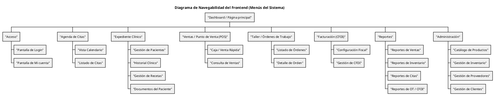

<br>

**Figura 11. Prototipo de Interfaz — Agenda de Citas (Wireframe).**
_Representación de baja fidelidad de la pantalla de gestión de agenda y detalles de cita._

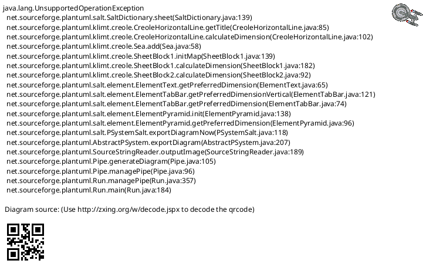


<br>

**Figura 12. Prototipo de Interfaz — Gestión de Clientes (Wireframe).**
_Pantalla de administración del catálogo de clientes con listado y formulario de detalles._

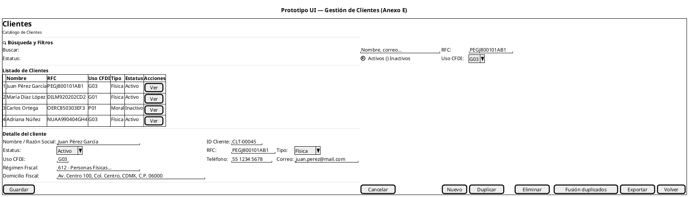

<br>

**Figura 13. Prototipo de Interfaz — Gestión de Compras / Órdenes de Compra (OC).**
_Panel de control para ciclo de vida de compras: listado filtrable y formulario maestro-detalle._

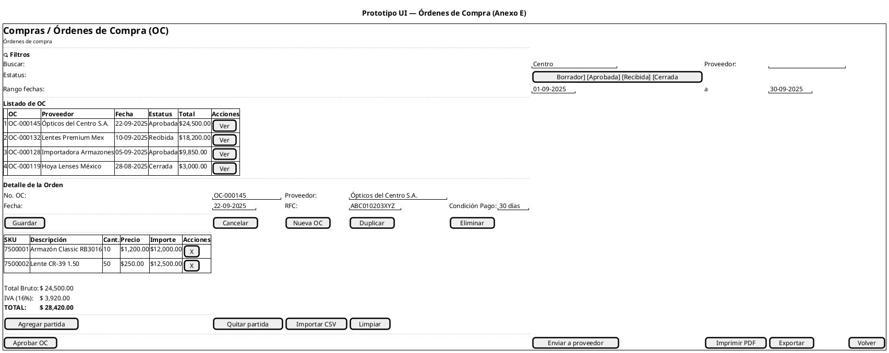


<br>

**Figura 14. Prototipo de Interfaz — Expediente Clínico / Historia Clínica.**
_Vista integral del paciente: identificación, antecedentes, receta optométrica y archivos adjuntos._

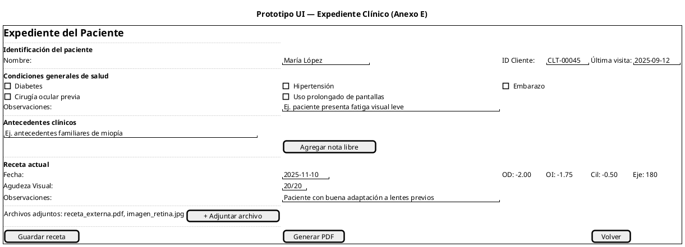

<br>

**Figura 15. Prototipo de Interfaz — Facturación / CFDI 4.0.**
_Consola de administración fiscal: filtro de comprobantes, detalles de timbrado, cancelación y complementos de pago._

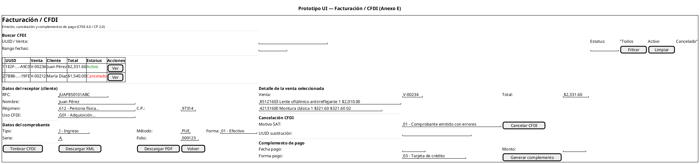


<br>

**Figura 16. Prototipo de Interfaz — Reportes del Sistema / Business Intelligence.**
_Tablero de análisis de datos con filtros multiparamétricos, KPI's resúmen y grid de resultados._

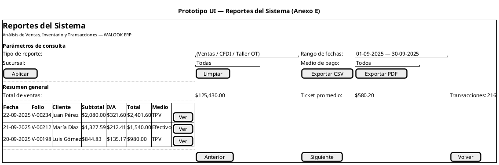

<br>

**Figura 17. Prototipo de Interfaz — Pantalla de Acceso (Login).**
_Punto de entrada seguro al sistema con credenciales y recuperación de cuenta._

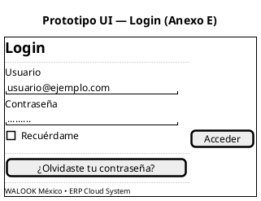

<br>

**Figura 18. Prototipo de Interfaz — Menú Principal (Dashboard).**
_Vista central de navegación hacia los distintos módulos operativos del ERP._

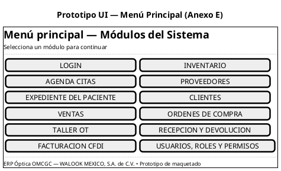

<br>

**Figura 19. Prototipo de Interfaz — Taller / Órdenes de Trabajo (OT).**
_Gestión del flujo productivo: asignación de insumos, control de calidad y seguimiento de estados._

```plantuml
@startsalt
title Prototipo UI — Taller / OT (Anexo E)
{+
  <b><size:18>Taller / OT</size></b>
  <size:10>Gestión de Órdenes de Trabajo, insumos y control de calidad</size>
  ..
  <b>Lista de Órdenes de Trabajo</b>
  Buscar OT: | "OT-000...           " | Estado: | ^Todos^ | [ Filtrar ]
  {#
    OT-00023 | Venta: V-00234 | Paciente: Juan Pérez | EnProceso | [ Abrir ]
    OT-00022 | Venta: V-00212 | Paciente: María Díaz | Terminada | [ Abrir ]
    OT-00021 | Venta: V-00198 | Paciente: Luis Gómez | EnEspera... | [ Abrir ]
  }
  [ + Desde venta ] | [ Volver ]
  ..
  <b>Detalle OT: OT-00023</b>
  Venta: | "V-00234       " | Paciente: | "Juan Pérez    " | Estado: | "EnProceso     "
  Especificaciones:
  "Armazón clásico, antirreflejante básico, PD = 63  "
  . | . | . | . | [ Guardar ]
  ..
  {
    <b>Insumos</b>
    Buscar insumo: | "LENTE 1.50    " | [ Buscar ] | [ Agregar ]
    {
      Lente orgánico 1.50 | 2 | [ Liberar ]
      Armazón clásico | 1 | [ Liberar ]
      Paño microfibra | 0 | [ Reservar ]
    }
    [ Reservar faltantes ]
  } | {
    <b>Control de calidad</b>
    [X] Montaje correcto
    [X] Alineación y centrado
    [ ] Tornillos ajustados
    [ ] Limpieza final
    [ Guardar control ] | [ Agregar ]
  } | {
    <b>Historial de estado</b>
    2025-09-20 10:12 Recibida
    2025-09-21 09:05 EnProceso
    2025-09-21 12:32 EnEspera...
  }
  ..
  Observaciones: | "Ajustar puente levemente.           "
  [ Terminar OT ] | [ Enviar a reproceso ] | [ Entregar ]
}
@endsalt
```

<br>

**Figura 20. Prototipo de Interfaz — Gestión de Proveedores.**
_Catálogo de gestión de proveedores, condiciones comerciales y contactos._

```plantuml
@startsalt
title Prototipo UI — Proveedores (Anexo E)
{+
  <b><size:18>Proveedores</size></b>
  <size:10>Catálogo de Proveedores</size>
  ..
  <b>Buscar</b>
  Nombre...: | "Nombre, razón social...       " | RFC: | "                  "
  Estatus: | [Activos] [Inactivos]
  Condición de pago: | [Contado] [15 días] [30 días] [60 días]
  ..
  {#
    <b>RFC</b> | <b>Proveedor</b> | <b>Condición</b> | <b>Estatus</b> | <b>Acciones</b>
    ABC010203XYZ | Ópticos del Centro S.A. | 30 días | <&media-record> Activo | [ Ver ]
    DEF040506LMN | Lentes Premium de México | Contado | <&media-record> Activo | [ Ver ]
    GHI070809QRS | Importadora Armazones SA | 15 días | <&media-record> Inactivo | [ Ver ]
    JKL101112TUV | Hoya Lenses México | 30 días | <&media-record> Activo | [ Ver ]
  }
  ..
  {
    RFC: | "ABC010203XYZ      " | Razón Social: | "Ópticos del Centro S.A. de C.V. "
    Condición de pago: | "30 días           "
    Contacto: | "Laura Pérez       " | Teléfono: | "55 1234 5678    " | Correo: | "compras@optcentro.mx"
    Estatus: | "Activo            "
    [ Guardar ] | [ Cancelar ] | [ Nuevo ] | [ Duplicar ] | [ Eliminar ]
  }
  ..
  [ Crear OC ] | [ Ver OC ] | [ Recepciones / Devoluciones ] | [ Exportar ] | [ Volver ]
}
@endsalt
```

<br>

**Figura 21. Prototipo de Interfaz — Recepciones y Devoluciones.**
_Control de logística de entrada, recepción de mercancía y gestión de devoluciones a proveedor._

```plantuml
@startsalt
title Prototipo UI — Recepciones y Devoluciones (Anexo E)
{+
  <b><size:18>Recepciones / Devoluciones</size></b>
  <size:10>Control de recepción de mercancía, devoluciones a proveedor y ajuste de inventario</size>
  ..
  <b>Buscar</b>
  Centro: | "Sucursal Centro " | Proveedor: | "Ópticos del Centro... " | OC: | "OC-000145"
  Estatus: | [Pendiente] [Parcial] [Completa] [Devuelta]
  Rango fechas: | "01-09-2025" | a | "30-09-2025"
  ..
  {#
    <b>Recepción</b> | <b>OC</b> | <b>Proveedor</b> | <b>Fecha</b> | <b>Estatus</b> | <b>Total</b> | <b>Acciones</b>
    REC-000210 | OC-000145 | Ópticos del Centro... | 23-09-2025 | Parcial | $12,500.00 | [ Ver ]
    REC-000198 | OC-000132 | Lentes Premium Mex | 11-09-2025 | Completa | $18,200.00 | [ Ver ]
    REC-000195 | OC-000128 | Importadora Arm... | 06-09-2025 | Devuelta | $0.00 | [ Ver ]
  }
  ..
  <b>Detalle de la recepción</b>
  {
     No. Recepción: | "REC-000210  " | Proveedor: | "Ópticos del Centro S.A." | OC: | "OC-000145"
     Almacén: | "Sucursal Centro " | Estatus: | "Recepción parcial   "
     Comentarios: | "Recepción parcial; faltan 40 lentes.                     "
     . | [ Guardar ] | [ Cancelar ] | [ Nueva ] | [ Duplicar ] | [ Eliminar ]
  }
  ..
  <b>Partidas de la recepción</b>
  {#
    <b>SKU</b> | <b>Descripción</b> | <b>Cant. OC</b> | <b>Cant. Rec.</b> | <b>Serie</b> | <b>Costo</b> | <b>Importe</b> | <b>Acciones</b>
    7500001 | Armazón Classic... | 10 | 10 | RB-2309-01 | $1,200 | $12,000 | [ Quitar ]
  }
  ..
  {
    <b>Totales</b>
    Recibido: $ 14,500.00 | Diferencia vs OC: $10,000.00
    [ Registrar en inventario ] | [ Imprimir PDF ] | [ Generar devolución ] | [ Exportar ] | [ Volver ]
  }
}
@endsalt
```


```

<br>

**Figura 22. Prototipo de Interfaz — Administración de Usuarios, Roles y Permisos (RBAC).**
_Consola de seguridad para gestión de accesos, roles y matriz de permisos por módulo._

```plantuml
@startsalt
title Prototipo UI — Usuarios y Roles (Anexo E)
{+
  <b><size:18>Usuarios, Roles y Permisos</size></b>
  <size:10>Control de usuarios, roles y permisos de acceso al sistema</size>
  ..
  <b>Buscar</b>
  Nombre...: | "Nombre, correo...       " | Rol: | "Todos"
  Estatus: | [Activos] [Inactivos]
  ..
  {#
    <b>Usuario</b> | <b>Correo</b> | <b>Rol</b> | <b>Estatus</b> | <b>Acciones</b>
    juan.perez | juan.perez@empresa.mx | Administrador | <color:green>Activo</color> | [ Ver ]
    maria.diaz | maria.diaz@empresa.mx | Facturista | <color:green>Activo</color> | [ Ver ]
    carlos.ortega | c.ortega@empresa.mx | Recepcionista | <color:orange>Inactivo</color> | [ Ver ]
    adriana.nunez | a.nunez@empresa.mx | Recepcionista | <color:green>Activo</color> | [ Ver ]
  }
  ..
  {
    <b>Detalle del usuario</b>
    Usuario: | "juan.perez          " | Correo: | "juan.perez@empresa.mx"
    Nombre: | "Juan Pérez García   " | Rol: | ^Administrador^
    Estatus: | ^Activo^ | [ Restablecer contraseña ]
    . | [ Guardar ] | [ Cancelar ] | [ Nuevo ] | [ Desactivar ]
  }
  ..
  <b>Permisos por módulo</b>
  {#
    <b>Módulo</b> | <b>Ver</b> | <b>Crear</b> | <b>Editar</b> | <b>Eliminar</b>
    Inventario | [X] | [X] | [X] | [ ]
    POS / Ventas | [X] | [X] | [ ] | [ ]
    Agenda (Citas) | [X] | [X] | [X] | [ ]
    Facturación CFDI | [X] | [ ] | [ ] | [ ]
  }
  ..
  [ Exportar ] | [ Ver bitácora de acceso ] | [ Volver ]
}
@endsalt
```
