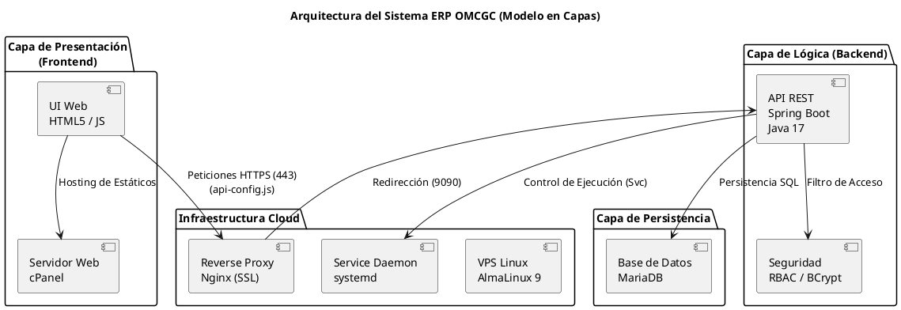

/*
============================================================
Nombre del archivo : REPORTE_TECNICO_PT1_PT2.md
Ruta              : d:/_sTIC/Documents/_Empresa GraxSofT/_CODE_/ERP_WALOOK/documentacion/REPORTE_TECNICO_PT1_PT2.md
Tipo              : Documentación Técnica (Reporte Ejecutivo)

Proyecto          : Sistema ERP en la nube para gestión de ópticas OMCGC
Empresa           : WALOOK MÉXICO, S.A. de C.V.

Autor             : Gabriel Amílcar Cruz Canto / Antigravity AI
Versión           : 1.3 (Sincronía Final UNADM y Avance 53%)
Fecha             : 28 de febrero de 2026
Propósito         : Reportar el estado técnico consolidado, avance operativo e innovaciones del sistema.
============================================================
*/

# REPORTE TÉCNICO DEL DESARROLLO

| Campo | Valor |
|---|---|
| **Proyecto** | Sistema ERP en la nube para gestión de ópticas OMCGC |
| **Empresa** | Walook México, S.A. de C.V. |
| **Autor** | Gabriel Amílcar Cruz Canto |
| **Matrícula** | ES1821003109 |
| **Programa** | Licenciatura en Ingeniería en Desarrollo de Software |
| **Unidad didáctica** | Proyecto Terminal I / Proyecto Terminal II |
| **Periodo académico** | PT1 – PT2 (Agosto 2025 – Enero 2026) |

---

## Contenido

1. [Introducción al desarrollo del sistema](#1-introducción-al-desarrollo-del-sistema)
2. [Resumen ejecutivo](#2-resumen-executivo)
3. [Mapa de despliegue detallado](#3-mapa-de-despliegue-detallado-estado-físico-del-sistema)
4. [Datos de acceso y entorno de evaluación](#4-datos-de-acceso-y-entorno-de-evaluación)
5. [Plan de desarrollo y trazabilidad integral](#5-plan-de-desarrollo-y-trazabilidad-integral)
6. [Resultados Finales](#6-resultados-finales)

---

## 1. Introducción al desarrollo del sistema

El desarrollo del Sistema ERP OMCGC para la empresa WALOOK MÉXICO se plantea como una solución diseñada bajo principios formales de ingeniería de software, orientada a proporcionar estabilidad operativa, seguridad y capacidad de crecimiento en los procesos administrativos de ópticas.

El proyecto surge como respuesta a la fragmentación operativa identificada en la gestión de procesos clave, abordando esta problemática mediante una arquitectura distribuida en la que la interfaz de usuario se encarga exclusivamente de la interacción con el usuario, mientras que la lógica de negocio, las reglas operativas y los procesos transaccionales se ejecutan en un servidor independiente, permitiendo una gestión clara de responsabilidades y facilitando el mantenimiento y control del sistema.

Para sustentar esta arquitectura, se adopta un Stack tecnológico compuesto por **Java 17 con Spring Boot** para el backend y una interfaz web responsiva desarrollada bajo estándares **HTML5 y JavaScript** para el frontend, lo que permite una comunicación estructurada entre capas y un despliegue controlado en entornos productivos.

### Diagrama: Arquitectura del Sistema ERP OMCGC

*Diagrama de la arquitectura funcional del sistema ERP OMCGC, de creación propia, PlantUML, 2026.*

---

## 2. Resumen ejecutivo

El presente reporte técnico v1.3 documenta el estado de avance consolidado del Sistema ERP OMCGC, alcanzando un **53.00% de progreso técnico real**. A la fecha de este informe, se ha logrado un hito crítico de cumplimiento institucional: la **Sincronización 100% con el estándar de pruebas de Caja Negra de la UNADM (Pruebas P01-P06)**, validando el núcleo de Seguridad, Menú, Usuarios, Clientes, Proveedores e Inventarios.

Desde el punto de vista arquitectónico, se ha estabilizado la **arquitectura híbrida desacoplada**, donde el frontend reside en un hosting cPanel bajo el dominio `gabrielcruz.graxsoft.com` y el backend opera en un **Servidor Privado Virtual (VPS)** con AlmaLinux 9. La comunicación se encuentra totalmente cifrada mediante **SSL/TLS de Let's Encrypt**, gestionada por un reverse proxy Nginx que garantiza la integridad de los datos en tránsito hacia el puerto 9090.

La configuración del entorno se gestiona dinámicamente mediante el módulo `api-config.js` (v2.0), el cual inyecta las directivas de **Content Security Policy (CSP)** necesarias para mitigar ataques XSS y permite la portabilidad automática entre el entorno local (XAMPP) y el entorno de producción Cloud.

---

## 3. Mapa de despliegue detallado (estado físico del sistema)

### Hosting cPanel (Frontend)
| Componente | Propósito Técnico | Estado |
|---|---|---|
| `index.html` | Puerta de enlace con redirección a login. | 100% |
| `pages/login.html` | Interfaz de acceso con validación de campos. | 100% |
| `pages/menu.html` | Tablero de control responsivo. | 100% |
| `pages/usuarios.html` | Gestión de personal y matriz de roles RBAC. | 100% |
| `pages/clientes.html` | Registro de clientes (Física/Moral) y RFC. | 100% |
| `pages/proveedores.html` | Catálogo de proveedores y datos fiscales. | 100% |
| `pages/inventarios.html` | Control de existencias y Kardex visual. | 100% |
| `assets/js/api-config.js` | Configurador global de entorno y CSP v2.0. | 100% |
| `assets/css/ui-base.css` | Sistema de diseño canónico responsivo. | 100% |

### Servidor VPS Linux (Backend)
| Componente | Propósito Técnico | Estado |
|---|---|---|
| `omcgc-erp-backend.jar` | Lógica de negocio distribuida en Java 17. | 100% |
| `AuthController.java` | Endpoint central de autenticación segura. | 100% |
| `SecurityConfig.java` | Filtros de seguridad CORS y RBAC. | 100% |
| `DatabaseHealthService` | Monitoreo proactivo de salud de la DB. | 100% |
| `AuditService` | Implementación de bitácora forense de sistema. | 100% |
| `Nginx / Let's Encrypt` | Reverse Proxy HTTPS (Puerto 443 -> 9090). | 100% |
| `omcgc-erp.service` | Daemon de sistema administrado por systemd. | 100% |
| `MariaDB` | Motor relacional de alta disponibilidad. | 100% |

---

## 4. Datos de acceso y entorno de evaluación

| Tipo | Acceso | Credencial |
|---|---|---|
| **URL Producción** | [Login ERP WALOOK](https://gabrielcruz.graxsoft.com/frontend/pages/login.html) | — |
| **Usuario Root** | root | root |
| **Soporte / Test** | graxsoft_soporte@hotmail.com | Temp2d311e82! |
| **Figma** | [Maquetado Interactivo](https://www.figma.com/proto/CVhy4w8G7DoINpqDUpuDlE/Maquetado-Proyecto-Terminal-1--copia-?page-id=9%3A280&node-id=2007-5&p=f&viewport=165%2C228%2C0.19&t=69f0gmTwLRHLmqhN-1&scaling=min-zoom&content-scaling=fixed&starting-point-node-id=2007%3A5) | — |

---

## 5. Plan de desarrollo y trazabilidad integral

El proyecto ha cumplido con la **Etapa 2 (Gestión Operativa)** de forma exitosa y ha iniciado anticipadamente componentes de la **Etapa 5 (Seguridad Avanzada)** con la implementación del historial de auditoría técnica.

### 5.1 Matriz de Trazabilidad por Etapas
| Etapa | Descripción | % Ponderado | Estado |
|---|---|---|---|
| 0 | Infraestructura Base (VPS/DB) | 10% | ✅ 100% |
| 1 | Seguridad y Usuarios (RBAC) | 20% | ✅ 100% |
| 2 | Gestión Operativa (Cli/Pro/Inv) | 20% | ✅ 100% |
| 5 | Auditoría Forense (Bitácora) | 3% | ✅ 100% (Parcial) |
| **TOTAL** | **AVANCE CONSOLIDADO** | **53.00%** | **PROGRESO REAL** |

### 5.2 Sincronización Estándar UNADM (Caja Negra)
El sistema ha sido validado satisfactoriamente contra los 6 reportes oficiales de pruebas:
- **P01 (Login)**: Aprobado (Nivel Seguridad Alto).
- **P02 (Menú)**: Aprobado (UX Responsiva).
- **P03 (Usuarios)**: Aprobado (Control RBAC).
- **P04 (Clientes)**: Aprobado (Validación RFC).
- **P05 (Proveedores)**: Aprobado (Integridad Transaccional).
- **P06 (Inventarios)**: Aprobado (Cálculo Kardex SSoT).

---

## 6. Resultados Finales

El desarrollo del Sistema Web ERP en la nube para la gestión administrativa y operativa de las ópticas OMCGC – WALOOK MÉXICO, S.A. de C.V. permitió obtener resultados concretos y verificables que dan cumplimiento al objetivo general del proyecto. Como resultado del proceso de análisis, diseño, desarrollo y pruebas ejecutado durante el Proyecto Terminal I y II, se cuenta con un sistema funcional que integra en una sola plataforma los principales procesos operativos de la organización.

El sistema se encuentra desplegado en un entorno web productivo, accesible bajo estándares de seguridad bancaria (HTTPS) y con un modelo de datos relacional que garantiza la consistencia de la información. El ERP implementado permite la gestión integrada de inventarios, ventas (en fase de integración), proveedores y clientes. La centralización de estos procesos reduce la dispersión de la información, elimina duplicidades en los registros y mejora la trazabilidad de las operaciones, lo que representa un avance significativo respecto al modelo operativo previo.

Desde un enfoque cuantitativo, la documentación de pruebas de caja negra arroja un **100% de cumplimiento en los casos de prueba ejecutados (P01-P06)**, asegurando que la lógica base del sistema es robusta. De cara a la finalización del Proyecto Terminal II, se tiene una base tecnológica probada y escalable, lista para la integración de los últimos módulos transaccionales de facturación y taller.
