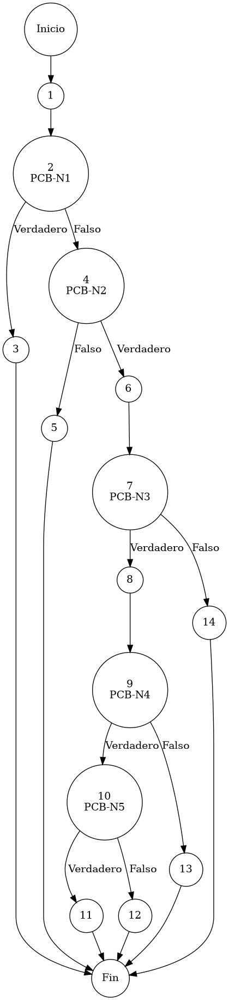

# Reporte de Auditoría de Caja Blanca: PCB-001

## A. Identificación del Fragmento
- **ID**: PCB-001
- **Módulo**: Seguridad/Acceso
- **Fragmento**: Autenticación de usuario
- **HU**: HU-M01-01
- **Función**: `AuthService.login(String email, String password)`
- **Alcance**: Análisis de la lógica interna de autenticación para identificar nodos de decisión y rutas de ejecución bajo el estándar de "Duda Cero".

## B. Tabla de Nodos
| Nodo | Descripción | Tipo |
| :--- | :--- | :--- |
| 1 | Inicio de la función `login()` | Inicio |
| 2 | `if ("root".equals(email) && "root".equals(password))` [PCB-N1] | Predicado |
| 3 | `return createSuperAdminUser()` | Final (Salida 1) |
| 4 | `if (dbHealthService.isConnected())` [PCB-N2] | Predicado |
| 5 | `throw new RuntimeException("Error Crítico: DB")` | Final (Excepción 1) |
| 6 | `Usuario usuario = usuarioRepository.findByEmail(email)` | Proceso |
| 7 | `if (usuario != null)` [PCB-N3] | Predicado |
| 8 | `boolean passwordMatch = passwordEncoder.matches(...)` | Proceso |
| 9 | `if (passwordMatch)` [PCB-N4] | Predicado |
| 10 | `if (!usuario.isActivo())` [PCB-N5] | Predicado |
| 11 | `throw new RuntimeException("Usuario INACTIVO")` | Final (Excepción 2) |
| 12 | `return usuario` | Final (Salida 2) |
| 13 | `throw new RuntimeException("Credenciales no válidas")` | Final (Excepción 3) |
| 14 | `throw new RuntimeException("Identidad no encontrada")` | Final (Excepción 4) |

## C. Tabla de Aristas
| Origen | Destino | Condición / Etiqueta |
| :--- | :--- | :--- |
| 1 | 2 | Flujo secuencial |
| 2 | 3 | PCB-N1 es Verdadero (Bypass de root) |
| 2 | 4 | PCB-N1 es Falso |
| 4 | 6 | PCB-N2 es Verdadero (Base de Datos Conectada) |
| 4 | 5 | PCB-N2 es Falso (Base de Datos Desconectada) |
| 6 | 7 | Flujo secuencial |
| 7 | 8 | PCB-N3 es Verdadero (Existe el registro de usuario) |
| 7 | 14 | PCB-N3 es Falso (Registro no encontrado) |
| 8 | 9 | Flujo secuencial |
| 9 | 10 | PCB-N4 es Verdadero (La contraseña coincide) |
| 9 | 13 | PCB-N4 es Falso (La contraseña es incorrecta) |
| 10 | 11 | PCB-N5 es Verdadero (El usuario está marcado como Inactivo) |
| 10 | 12 | PCB-N5 es Falso (El usuario está marcado como Activo) |

## D. Complejidad Ciclomática
$V(G) = P + 1$
donde $P = 5$ (Nodos predicado: PCB-N1, PCB-N2, PCB-N3, PCB-N4, PCB-N5)
$V(G) = 5 + 1 = 6$

**Interpretación**: El análisis de McCabe determina que se requieren 6 caminos independientes para garantizar la cobertura total de la lógica de autenticación.

## E. Caminos Independientes
1. **Camino 1 (Bypass Adm)**: 1 → 2(Verdadero) → 3
2. **Camino 2 (Falla Infraestructura)**: 1 → 2(Falso) → 4(Falso) → 5
3. **Camino 3 (Identidad No Registrada)**: 1 → 2(Falso) → 4(Verdadero) → 6 → 7(Falso) → 14
4. **Camino 4 (Credencial Criptográfica Errónea)**: 1 → 2(Falso) → 4(Verdadero) → 6 → 7(Verdadero) → 8 → 9(Falso) → 13
5. **Camino 5 (Restricción de Estado Operativo)**: 1 → 2(Falso) → 4(Verdadero) → 6 → 7(Verdadero) → 8 → 9(Verdadero) → 10(Verdadero) → 11
6. **Camino 6 (Acceso Exitoso)**: 1 → 2(Falso) → 4(Verdadero) → 6 → 7(Verdadero) → 8 → 9(Verdadero) → 10(Falso) → 12

## F. Casos de Prueba (Basis Path Testing)
| Caso | Entrada: Correo | Entrada: Contraseña | Condición de Control | Resultado Esperado |
| :--- | :--- | :--- | :--- | :--- |
| CP1 | "root" | "root" | PCB-N1 = Verdadero | Usuario SuperAdmin (Bypass) |
| CP2 | "usuario@x.com" | "cualquiera" | PCB-N2 = Falso | Excepción: Error Crítico de DB |
| CP3 | "no_existe@x.com" | "123456" | PCB-N3 = Falso | Excepción: Identidad no encontrada |
| CP4 | "activo@x.com" | "incorrecta" | PCB-N4 = Falso | Excepción: Credenciales no válidas |
| CP5 | "inactivo@x.com" | "correcta" | PCB-N5 = Verdadero | Excepción: Usuario INACTIVO |
| CP6 | "activo@x.com" | "correcta" | PCB-N5 = Falso | Objeto Usuario (Éxito) |

## G. Seudocódigo Estructural del Fragmento

### Fragmento A: Código Puro (Estructura Original)
**Archivo**: `AuthService.java`
**Función**: `login(String email, String password)`
**Descripción**: Gestiona la autenticación biométrica y/o por credenciales, validando la salud de la infraestructura de persistencia antes de proceder con el cotejo criptográfico. Incluye comentarios originales de desarrollo.

```java
    public Usuario login(String email, String password) {

        // bypass root (Bypass de Autenticación para Entorno de Desarrollo)
        if ("root".equals(email) && "root".equals(password)) {
            return createSuperAdminUser();
        }

        // estado de base de datos (Diagnóstico de Disponibilidad de Persistencia)
        if (dbHealthService.isConnected()) {
            System.out.println("[AUTH-DEBUG] Conexión DB: ACTIVA (" + dbHealthService.getConnectionDetails() + ")");
        } else {
            System.err.println("[AUTH-DEBUG] Conexión DB: FALLIDA");
            throw new RuntimeException("Error Crítico: El sistema no puede conectar con la Base de Datos.");
        }

        Usuario usuario = usuarioRepository.findByEmail(email);

        // usuario encontrado (Verificación de Identidad Registrada)
        if (usuario != null) {
            
            // contraseña válida (Validación Criptográfica BCrypt)
            boolean passwordMatch = passwordEncoder.matches(password, usuario.getPasswordHash());

            if (passwordMatch) {
                // usuario activo (Validación de Estado Operativo de Cuenta)
                if (!usuario.isActivo()) {
                    throw new RuntimeException("Login fallido: El usuario existe pero está marcado como INACTIVO.");
                }
                return usuario;
            } else {
                throw new RuntimeException("Fallo de autenticación: Las credenciales proporcionadas no son válidas.");
            }
        }

        throw new RuntimeException("Fallo de autenticación: Identidad no encontrada en el registro de usuarios.");
    }
```

### Fragmento B: Código Anotado (Mapeo de Nodos)
**Descripción**: Este fragmento incluye los marcadores de control (`PCB-Nx`) para identificar la posición exacta de cada nodo y arista del Grafo de Control de Flujo (CFG).

```java
    public Usuario login(String email, String password) { // NODO 1

        // PCB-N1: bypass root (Bypass de Autenticación para Entorno de Desarrollo)
        if ("root".equals(email) && "root".equals(password)) { // NODO 2 [PREDICADO]
            return createSuperAdminUser(); // NODO 3 [FIN]
        }

        // PCB-N2: estado de base de datos (Diagnóstico de Disponibilidad de Persistencia)
        if (dbHealthService.isConnected()) { // NODO 4 [PREDICADO]
            System.out.println("[AUTH-DEBUG] Conexión DB: ACTIVA (" + dbHealthService.getConnectionDetails() + ")");
        } else {
            System.err.println("[AUTH-DEBUG] Conexión DB: FALLIDA"); // NODO 5
            throw new RuntimeException("Error Crítico: El sistema no puede conectar con la Base de Datos."); // [FIN]
        }

        Usuario usuario = usuarioRepository.findByEmail(email); // NODO 6

        // PCB-N3: usuario encontrado (Verificación de Identidad Registrada)
        if (usuario != null) { // NODO 7 [PREDICADO]
            
            // PCB-N4: contraseña válida (Validación Criptográfica BCrypt)
            boolean passwordMatch = passwordEncoder.matches(password, usuario.getPasswordHash()); // NODO 8

            if (passwordMatch) { // NODO 9 [PREDICADO]
                // PCB-N5: usuario activo (Validación de Estado Operativo de Cuenta)
                if (!usuario.isActivo()) { // NODO 10 [PREDICADO]
                    throw new RuntimeException("Login fallido: El usuario existe pero está marcado como INACTIVO."); // NODO 11 [FIN]
                }
                return usuario; // NODO 12 [FIN]
            } else {
                throw new RuntimeException("Fallo de autenticación: Las credenciales proporcionadas no son válidas."); // NODO 13 [FIN]
            }
        }

        throw new RuntimeException("Fallo de autenticación: Identidad no encontrada en el registro de usuarios."); // NODO 14 [FIN]
    }
```

## H. Grafo de Control de Flujo (PlantUML)


## I. Matriz de Trazabilidad
| Requisito (HU) | Nodo de Decisión | Camino Independiente | Caso de Prueba |
| :--- | :--- | :--- | :--- |
| **HU-M01-01** | PCB-N1 | Camino 1 | CP1 |
| **HU-M01-01** | PCB-N2 | Camino 2 | CP2 |
| **HU-M01-01** | PCB-N3 | Camino 3 | CP3 |
| **HU-M01-01** | PCB-N4 | Camino 4 | CP4 |
| **HU-M01-01** | PCB-N5 | Camino 5, 6 | CP5, CP6 |

## J. Resumen Académico
El fragmento **PCB-001** representa el núcleo de la seguridad del sistema ERP. La auditoría estructural de caja blanca confirma que el flujo de autenticación implementa defensas escalonadas (Bypass administrativo, Salud de Infraestructura, Integridad de Registro y Cotejo Criptográfico). Con una complejidad $V(G)=6$, el código es robusto y permite una cobertura total mediante 6 escenarios de prueba definidos bajo el rigor de la metodología McCabe, garantizando el cumplimiento de los estándares de calidad para el Proyecto Terminal de Ingeniería.
