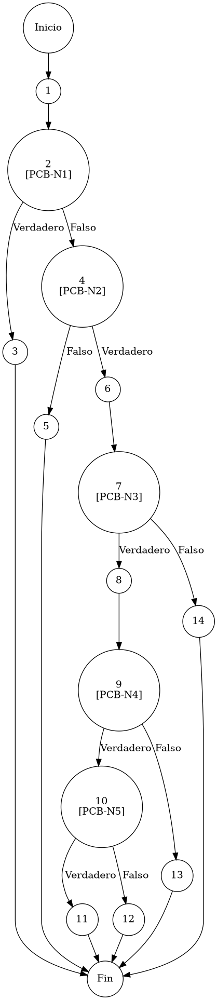

# TEST PRUEBAS DE CAJA BLANCA

| **DATOS DEL ESTUDIANTE** | |
| :--- | :--- |
| **NOMBRE:** | Gabriel Amílcar Cruz Canto |
| **EMPRESA:** | WALOOK MEXICO, S.A. de C.V. |
| **TITULO DEL PROYECTO:** | Sistema ERP en la nube para gestión de ópticas OMCGC |
| **URL y Claves de acceso:** | [Configurar en ambiente de entrega] |

<br>

| **PLAN DE PRUEBAS DE CAJA BLANCA: BACKEND** | | | | |
| :--- | :--- | :--- | :--- | :--- |
| **Número** | **Nombre de la Prueba Backend** | **Descripción** | **Fecha** | **Responsable** |
| PCB-001 | Autenticación de usuario | Protocolo de Acceso y Validación de Infraestructura | 17/03/2026 | Gabriel Amílcar Cruz Canto |

---

# FASE DE PRUEBAS

| **Nombre del Módulo del Sistema + Historia de usuario** |
| :--- |
| Módulo Seguridad / Acceso – HU-M01-01 |

| **Número y nombre de la Prueba** |
| :--- |
| PCB-001 / Autenticación de usuario – AuthService.login() |

### Paso 0

```java
    /**
     * ESPECIFICACIÓN TÉCNICA: Protocolo de Autenticación Privilegiada y Validación de Infraestructura.
     * OBJETIVO OPERATIVO: Verificación criptográfica de credenciales y disponibilidad de persistencia.
     * IMPACTO: Gatekeeper estructural para mitigar riesgos de acceso no autorizado.
     */
    public Usuario login(String email, String password) { // [N1: INICIO]
1
        // [PCB-N1] bypass root (Bypass de Autenticación para Entorno de Desarrollo)
        if ("root".equals(email) && "root".equals(password)) { // [N2] [PCB-N1] -> [SI: N3] [NO: N4] : ¿Es acceso maestro?
            return createSuperAdminUser(); // [N3: FIN] -> Retorno privilegiado
        }

        // [PCB-N2] estado de base de datos (Diagnóstico de Disponibilidad de Persistencia)
        if (dbHealthService.isConnected()) { // [N4] [PCB-N2] -> [SI: N6] [NO: N5] : ¿Hay conexión DB?
            System.out.println("[AUTH-DEBUG] Conexión DB: ACTIVA"); // [N6: PROCESO]
        } else {
            System.err.println("[AUTH-DEBUG] Conexión DB: FALLIDA"); // [N5: SALIDA]
            throw new RuntimeException("Error DB"); // (Continúa N5)
        }

        Usuario usuario = usuarioRepository.findByEmail(email); // (Continúa N6)

        // [PCB-N3] usuario encontrado (Verificación de Identidad Registrada)
        if (usuario != null) { // [N7] [PCB-N3] -> [SI: N8] [NO: N14] : ¿Existe el registro?
            
            // [PCB-N4] contraseña válida (Validación Criptográfica BCrypt)
            boolean passwordMatch = passwordEncoder.matches(password, usuario.getPasswordHash()); // [N8: PROCESO]

            if (passwordMatch) { // [N9] [PCB-N4] -> [SI: N10] [NO: N13] : ¿Contraseña válida?
                // [PCB-N5] usuario activo (Validación de Estado Operativo de Cuenta)
                if (!usuario.isActivo()) { // [N10] [PCB-N5] -> [SI: N11] [NO: N12] : ¿Cuenta suspendida?
                    throw new RuntimeException("Usuario INACTIVO"); // [N11: FIN (EXC)]
                }
                return usuario; // [N12: FIN] -> Acceso concedido
            } else {
                throw new RuntimeException("Credenciales no válidas"); // [N13: FIN (EXC)]
            }
        }

        throw new RuntimeException("Identidad No Encontrada"); // [N14: FIN (EXC)]
    }
```

### Descripción breve del fragmento

El fragmento **PCB-001** representa el núcleo de la seguridad del sistema ERP. La auditoría estructural confirma que el flujo de autenticación implementa defensas escalonadas: Bypass administrativo, Salud de Infraestructura, Integridad de Registro y Cotejo Criptográfico. Con una complejidad ciclomática $V(G)=6$, el diseño garantiza la detección proactiva de fallos antes de conceder privilegios de sesión.

### Identificación de Nodos

| ID del Nodo | Tipo | Descripción |
| :--- | :--- | :--- |
| **Nodo 1** | Inicio | Inicio del método `login(String email, String password)` y recepción de parámetros de entrada. |
| **Nodo 2 [PCB-N1]** | Nodo predicado | Evaluación de la condición `if ("root".equals(email) && "root".equals(password))`. Identificado con la etiqueta **PCB-N1**. |
| **Nodo 3** | Nodo de salida | Ejecución de `return createSuperAdminUser()`. Finaliza el flujo cuando se detectan credenciales de superadministrador. |
| **Nodo 4 [PCB-N2]** | Nodo predicado | Evaluación de `if (dbHealthService.isConnected())` para verificar diagnóstico de salud de base de datos. Identificado con la etiqueta **PCB-N2**. |
| **Nodo 5** | Nodo de salida | Ejecución de registro de fallo y lanzamiento de `RuntimeException("Error DB")`. Interrupción por fallo crítico de infraestructura. |
| **Nodo 6** | Nodo de proceso | Notificación de éxito en consola y ejecución de `usuarioRepository.findByEmail(email)`. |
| **Nodo 7 [PCB-N3]** | Nodo predicado | Evaluación de `if (usuario != null)`. Verificación de existencia del registro de identidad. Identificado con la etiqueta **PCB-N3**. |
| **Nodo 8** | Nodo de proceso | Ejecución de `passwordEncoder.matches()`. Validación criptográfica de contraseña mediante BCrypt. |
| **Nodo 9 [PCB-N4]** | Nodo predicado | Evaluación de `if (passwordMatch)`. Verificación de coincidencia de seguridad. Identificado con la etiqueta **PCB-N4**. |
| **Nodo 10 [PCB-N5]** | Nodo predicado | Evaluación de `if (!usuario.isActivo())`. Validación de estado operativo de la cuenta. Identificado con la etiqueta **PCB-N5**. |
| **Nodo 11** | Nodo de salida | Lanzamiento de `RuntimeException("Usuario INACTIVO")`. Interrupción por cuenta suspendida. |
| **Nodo 12** | Nodo de salida | Ejecución de `return usuario`. Finalización exitosa del flujo y retorno de objeto autenticado. |
| **Nodo 13** | Nodo de salida | Lanzamiento de `RuntimeException("Credenciales no válidas")`. Interrupción por fallo de contraseña. |
| **Nodo 14** | Nodo de salida | Lanzamiento de `RuntimeException("Identidad No Encontrada")`. Interrupción por registro inexistente. |

### Paso 1



### Paso 2

**V(G) = Número de regiones** = (5 internas + 1 externa) = **6**
**V(G) = Aristas – Nodos + 2** = V(G) = 18 – 14 + 2 = **6**
**V(G) = Nodos Predicado + 1** = V(G) = 5 + 1 = **6**

### Paso 3

| Total de caminos | Ruta de cada camino |
| :--- | :--- |
| **Camino 1** | Inicio → 1 → 2(SÍ) → 3 → Fin |
| **Camino 2** | Inicio → 1 → 2(NO) → 4(NO) → 5 → Fin |
| **Camino 3** | Inicio → 1 → 2(NO) → 4(SÍ) → 6 → 7(NO) → 14 → Fin |
| **Camino 4** | Inicio → 1 → 2(NO) → 4(SÍ) → 6 → 7(SÍ) → 8 → 9(NO) → 13 → Fin |
| **Camino 5** | Inicio → 1 → 2(NO) → 4(SÍ) → 6 → 7(SÍ) → 8 → 9(SÍ) → 10(SÍ) → 11 → Fin |
| **Camino 6** | Inicio → 1 → 2(NO) → 4(SÍ) → 6 → 7(SÍ) → 8 → 9(SÍ) → 10(NO) → 12 → Fin |

### Paso 4

| Número del camino | Caso de Prueba (IN) | Resultado esperado (OUT) |
| :--- | :--- | :--- |
| **Camino 1** | email="root", password="root" | createSuperAdminUser() → Usuario SuperAdmin (Bypass) |
| **Camino 2** | email="vendedor@test.com", password="cualquiera", dbHealthService.isConnected() = false | RuntimeException("Error Crítico: DB") |
| **Camino 3** | email="noexiste@dominio.com", password="123456", dbHealthService.isConnected() = true, usuario = null | RuntimeException("Identidad no encontrada") |
| **Camino 4** | email="opto@test.com", password="incorrecta", usuario != null, passwordMatch = false | RuntimeException("Credenciales no válidas") |
| **Camino 5** | email="caja@test.com", password="correcta", usuario != null, passwordMatch = true, usuario.isActivo() = false | RuntimeException("Usuario INACTIVO") |
| **Camino 6** | email="almacen@test.com", password="correcta", usuario != null, passwordMatch = true, usuario.isActivo() = true | return usuario (Objeto Usuario) |
