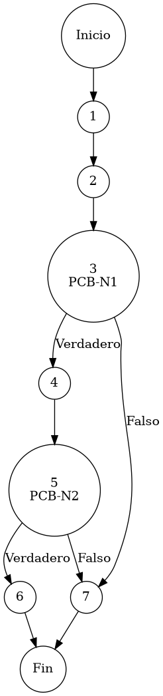

# TEST PRUEBAS DE CAJA BLANCA

| **DATOS DEL ESTUDIANTE** | |
| :--- | :--- |
| **NOMBRE:** | Gabriel Amílcar Cruz Canto |
| **EMPRESA:** | WALOOK MEXICO, S.A. de C.V. |
| **TITULO DEL PROYECTO:** | Sistema ERP en la nube para gestión de ópticas OMCGC |
| **URL y Claves de acceso:** | [Configurar en ambiente de entrega] |

<br>

| **PLAN DE PRUEBAS DE CAJA BLANCA: BACKEND** | | | | |
| :--- | :--- | :--- | :--- | :--- |
| **Número** | **Nombre de la Prueba Backend** | **Descripción** | **Fecha** | **Responsable** |
| PCB-002 | Gestión de Permisos | Protocolo de Recuperación y Fallback de Privilegios | 17/03/2026 | Gabriel Amílcar Cruz Canto |

---

# FASE DE PRUEBAS

| **Nombre del Módulo del Sistema + Historia de usuario** |
| :--- |
| Módulo Seguridad / Acceso – HU-M01-03 |

| **Número y nombre de la Prueba** |
| :--- |
| PCB-002 / Gestión de Permisos – UsuarioService.getPermissionsByUsuario() |

### Paso 0

```java
    /**
     * ESPECIFICACIÓN TÉCNICA: Protocolo de Recuperación y Fallback de Privilegios Granulares.
     * OBJETIVO OPERATIVO: Proveer matriz de control de acceso (específicos o heredados).
     * IMPACTO: Determinación de la visibilidad de módulos en el Dashboard.
     */
    public List<java.util.Map<String, Object>> getPermissionsByUsuario(String idUsuario) { // [N1: INICIO]
        
        // 1. Buscar permisos específicos (Personalización)
        List<java.util.Map<String, Object>> permisos = usuarioRepository.findPermissionsByUsuario(idUsuario); // [N2: PROCESO]

        // [PCB-N1] evaluación de personalización (Detección de permisos específicos)
        if (permisos.isEmpty()) { // [N3] [PCB-N1] -> [SI: N4] [NO: N7] : ¿Lista de permisos vacía?
            Usuario u = findById(idUsuario); // [N4: PROCESO]
            
            // [PCB-N2] validación de integridad de cuenta (Existencia y Rol asignado)
            if (u != null && u.getRolId() != null) { // [N5] [PCB-N2] -> [SI: N6] [NO: N7] : ¿Tiene Rol asignado?
                return usuarioRepository.findPermissionsByRol(u.getRolId()); // [N6: FIN] -> Retorno de herencia
            }
        }
        return permisos; // [N7: FIN] -> Retorno de lista actual
    }
```

### Descripción breve del fragmento

El fragmento **PCB-002** implementa el motor de resolución de privilegios del ERP. Su diseño arquitectónico permite una personalización granular de permisos por usuario, con un mecanismo de *fallback* automático hacia los permisos definidos por el Rol en caso de ausencia de configuración específica. Con una complejidad $V(G)=3$, la prueba garantiza que la seguridad sea inmutable y jerárquica.

### Identificación de Nodos

| ID del Nodo | Tipo | Descripción |
| :--- | :--- | :--- |
| **Nodo 1** | Inicio | Inicio del método `getPermissionsByUsuario(String idUsuario)` y recepción del identificador de entrada. |
| **Nodo 2** | Nodo de proceso | Ejecución de `usuarioRepository.findPermissionsByUsuario(idUsuario)`. Consulta de privilegios personalizados en el repositorio. |
| **Nodo 3 [PCB-N1]** | Nodo predicado | Evaluación de la condición `if (permisos.isEmpty())`. Detección de ausencia de personalización. Identificado con la etiqueta **PCB-N1**. |
| **Nodo 4** | Nodo de proceso | Ejecución de `findById(idUsuario)` para localizar la entidad de usuario en la capa de persistencia. |
| **Nodo 5 [PCB-N2]** | Nodo predicado | Evaluación de la condición `if (u != null && u.getRolId() != null)`. Validación de integridad de la cuenta y rol asignado. Identificado con la etiqueta **PCB-N2**. |
| **Nodo 6** | Nodo de salida | Ejecución de `return usuarioRepository.findPermissionsByRol()`. Retorno de la matriz de permisos heredados del Rol. |
| **Nodo 7** | Nodo de salida | Ejecución de `return permisos`. Finalización del flujo con retorno de lista personalizada o vacía según descarte. |

### Paso 1



### Paso 2

**V(G) = Número de regiones** = (2 internas + 1 externa) = **3**
**V(G) = Aristas – Nodos + 2** = V(G) = 10 – 9 + 2 = **3**
**V(G) = Nodos Predicado + 1** = V(G) = 2 + 1 = **3**

### Paso 3

| Total de caminos | Ruta de cada camino |
| :--- | :--- |
| **Camino 1** | Inicio → 1 → 2 → 3(NO) → 7 → Fin |
| **Camino 2** | Inicio → 1 → 2 → 3(SÍ) → 4 → 5(NO) → 7 → Fin |
| **Camino 3** | Inicio → 1 → 2 → 3(SÍ) → 4 → 5(SÍ) → 6 → Fin |

### Paso 4

| Número del camino | Caso de Prueba (IN) | Resultado esperado (OUT) |
| :--- | :--- | :--- |
| **Camino 1** | idUsuario="USR-001", permisos.isEmpty() = false | return permisos (Lista personalizada) |
| **Camino 2** | idUsuario="USR-999", permisos.isEmpty() = true, u = null | return permisos (Lista vacía / Fallo existencia) |
| **Camino 3** | idUsuario="USR-002", permisos.isEmpty() = true, u != null, u.getRolId() != null | return usuarioRepository.findPermissionsByRol() (Herencia) |
