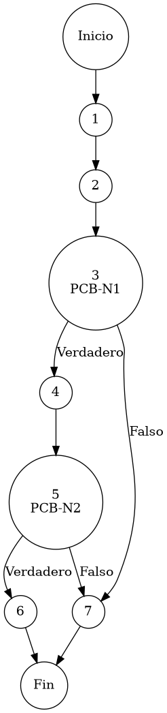

# Reporte de Auditoría de Caja Blanca: PCB-002

## A. Identificación del Fragmento
- **ID**: PCB-002
- **Módulo**: Seguridad/Acceso
- **Fragmento**: Validación de privilegios granulares
- **HU**: HU-M01-03
- **Función**: `UsuarioService.getPermissionsByUsuario(String idUsuario)`
- **Alcance**: Análisis de la lógica de recuperación de permisos específicos o por defecto del rol para identificar nodos de decisión jerárquica bajo el estándar de "Duda Cero".

## B. Tabla de Nodos
| Nodo | Descripción | Tipo |
| :--- | :--- | :--- |
| 1 | Inicio de la función `getPermissionsByUsuario()` | Inicio |
| 2 | `List<Map<...>> permisos = usuarioRepository.findPermissionsByUsuario(idUsuario)` | Proceso |
| 3 | `if (permisos.isEmpty())` [PCB-N1] | Predicado |
| 4 | `Usuario u = findById(idUsuario)` | Proceso |
| 5 | `if (u != null && u.getRolId() != null)` [PCB-N2] | Predicado |
| 6 | `return usuarioRepository.findPermissionsByRol(u.getRolId())` | Final (Heredado) |
| 7 | `return permisos` (Desde N1 o N2 fallido) | Final |

## C. Tabla de Aristas
| Origen | Destino | Condición / Etiqueta |
| :--- | :--- | :--- |
| 1 | 2 | Flujo secuencial |
| 2 | 3 | Flujo secuencial |
| 3 | 4 | PCB-N1 es Verdadero (No se encontraron permisos personalizados) |
| 3 | 7 | PCB-N1 es Falso (Se retornan permisos específicos del usuario) |
| 4 | 5 | Flujo secuencial |
| 5 | 6 | PCB-N2 es Verdadero (Usuario y Rol válidos para herencia) |
| 5 | 7 | PCB-N2 es Falso (No es posible aplicar el mecanismo de Fallback) |

## D. Complejidad Ciclomática
$V(G) = P + 1$
donde $P = 2$ (Nodos predicado: PCB-N1, PCB-N2)
$V(G) = 2 + 1 = 3$

**Interpretación**: El análisis estructural determina que existen 3 caminos independientes para cubrir la resolución jerárquica de privilegios en el sistema.

## E. Caminos Independientes
1. **Camino 1 (Resolución Directa)**: 1 → 2 → 3(Falso) → 7
2. **Camino 2 (Herencia por Rol)**: 1 → 2 → 3(Verdadero) → 4 → 5(Verdadero) → 6
3. **Camino 3 (Sin Privilegios/Falla de Perfil)**: 1 → 2 → 3(Verdadero) → 4 → 5(Falso) → 7

## F. Casos de Prueba (Basis Path Testing)
| Caso | entrada: idUsuario | Repositorio Personalizados | Repositorio Rol | Resultado Esperado |
| :--- | :--- | :--- | :--- | :--- |
| CP1 | "User01" | Lista con 5 permisos registrados | N/D | Retorno de listado personalizado (Prioridad A) |
| CP2 | "User02" | Lista Vacía | Lista con 3 permisos | Retorno de permisos heredados del Rol (Prioridad B) |
| CP3 | "User03" (No existe) | Lista Vacía | Lista Vacía | Retorno de lista vacía (Sin privilegios) |

## G. Seudocódigo Estructural del Fragmento

### Fragmento A: Código Puro (Estructura Original)
**Archivo**: `UsuarioService.java`
**Función**: `getPermissionsByUsuario(String idUsuario)`
**Descripción**: Implementa el protocolo de recuperación y fallback de privilegios granulares del sistema, otorgando prioridad a las personalizaciones individuales sobre las colectivas. Incluye comentarios originales de desarrollo.

```java
    public List<java.util.Map<String, Object>> getPermissionsByUsuario(String idUsuario) {
        // 1. Buscar permisos específicos (Personalización)
        List<java.util.Map<String, Object>> permisos = usuarioRepository.findPermissionsByUsuario(idUsuario);

        // evaluación de personalización (Detección de permisos específicos)
        if (permisos.isEmpty()) {
            Usuario u = findById(idUsuario);
            
            // validación de integridad de cuenta (Existencia y Rol asignado)
            if (u != null && u.getRolId() != null) {
                return usuarioRepository.findPermissionsByRol(u.getRolId());
            }
        }
        return permisos;
    }
```

### Fragmento B: Código Anotado (Mapeo de Nodos)
**Descripción**: Este fragmento incluye los marcadores de control (`PCB-Nx`) para identificar la posición exacta de cada nodo y arista del Grafo de Control de Flujo (CFG).

```java
    public List<java.util.Map<String, Object>> getPermissionsByUsuario(String idUsuario) { // NODO 1
        // 1. Buscar permisos específicos (Personalización)
        List<java.util.Map<String, Object>> permisos = usuarioRepository.findPermissionsByUsuario(idUsuario); // NODO 2

        // PCB-N1: evaluación de personalización (Detección de permisos específicos)
        if (permisos.isEmpty()) { // NODO 3 [PREDICADO]
            Usuario u = findById(idUsuario); // NODO 4
            
            // PCB-N2: validación de integridad de cuenta (Existencia y Rol asignado)
            if (u != null && u.getRolId() != null) { // NODO 5 [PREDICADO]
                return usuarioRepository.findPermissionsByRol(u.getRolId()); // NODO 6 [FIN]
            }
        }
        return permisos; // NODO 7 [FIN]
    }
```

## H. Grafo de Control de Flujo (PlantUML)


## I. Matriz de Trazabilidad
| Requisito (HU) | Nodo de Decisión | Camino Independiente | Caso de Prueba |
| :--- | :--- | :--- | :--- |
| **HU-M01-03** | PCB-N1 | Camino 1 | CP1 |
| **HU-M01-03** | PCB-N1 | Camino 2, 3 | CP2, CP3 |
| **HU-M01-03** | PCB-N2 | Camino 2 | CP2 |
| **HU-M01-03** | PCB-N2 | Camino 3 | CP3 |

## J. Resumen Académico
El fragmento **PCB-002** implementa un patrón de *Cascading Permissions* esencial para la seguridad basada en roles (RBAC) del ERP. La auditoría de caja blanca verifica que el código garantiza la disponibilidad de privilegios mediante un mecanismo de fallback al rol cuando no existen ajustes finos individuales. Con una complejidad ciclomática $V(G)=3$, la estructura es eficiente y previene fallos por referencia nula, asegurando que la interfaz de usuario reciba siempre una matriz de facultades consistente.
