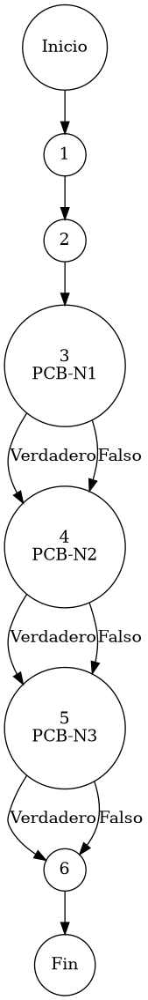

# Reporte de Auditoría de Caja Blanca: PCB-003

## A. Identificación del Fragmento
- **ID**: PCB-003
- **Módulo**: Seguridad/Acceso
- **Fragmento**: Inyección de matriz de permisos en respuesta de sesión
- **HU**: HU-M01-01
- **Función**: `AuthController.login()` (Bloque de construcción de respuesta)
- **Alcance**: Análisis del bloque de respuesta encargado de normalizar metadatos de usuario (Rol/Sucursal) y adjuntar facultades mediante operadores ternarios bajo el estándar de "Duda Cero".

## B. Tabla de Nodos
| Nodo | Descripción | Tipo |
| :--- | :--- | :--- |
| 1 | Inicio del bloque `try` en `login()` | Inicio |
| 2 | Ejecución de `authService.login()`, `bitacoraService` y `usuarioService.getPermissions()` | Proceso |
| 3 | Normalización de `rolId` mediante operador ternario [PCB-N1] | Predicado |
| 4 | Normalización de `nombreRol` mediante operador ternario [PCB-N2] | Predicado |
| 5 | Normalización de `idSucursal` mediante operador ternario [PCB-N3] | Predicado |
| 6 | Retorno de `ResponseEntity.ok()` con el mapa de facultades | Final |

## C. Tabla de Aristas
| Origen | Destino | Condición / Etiqueta |
| :--- | :--- | :--- |
| 1 | 2 | Flujo secuencial |
| 2 | 3 | Flujo secuencial |
| 3 | 4 | PCB-N1 (Verdadero/Falso) - Operador ternario resuelto |
| 4 | 5 | PCB-N2 (Verdadero/Falso) - Operador ternario resuelto |
| 5 | 6 | PCB-N3 (Verdadero/Falso) - Operador ternario resuelto |

## D. Complejidad Ciclomática
$V(G) = P + 1$
donde $P = 3$ (Nodos predicado: PCB-N1, PCB-N2, PCB-N3)
$V(G) = 3 + 1 = 4$

**Interpretación**: Existen 4 caminos independientes de ejecución para la normalización de metadatos de la sesión, garantizando que el payload de salida sea consistente ante cualquier nulidad de atributos.

## E. Caminos Independientes
1. **Camino 1 (Usuario Completo)**: 1 → 2 → 3(Verdadero) → 4(Verdadero) → 5(Verdadero) → 6
2. **Camino 2 (Rol Inexistente/Nulo)**: 1 → 2 → 3(Falso) → 4(Falso) → 5(Verdadero) → 6
3. **Camino 3 (Sucursal Inexistente/Nula)**: 1 → 2 → 3(Verdadero) → 4(Verdadero) → 5(Falso) → 6
4. **Camino 4 (Usuario con Perfil Mínimo)**: 1 → 2 → 3(Falso) → 4(Falso) → 5(Falso) → 6

## F. Casos de Prueba (Basis Path Testing)
| Caso | Entidad Usuario (Atributos) | Resultado Esperado en Payload (JSON) |
| :--- | :--- | :--- |
| CP1 | Rol="1", NombreRol="Admin", Sucursal="A" | "rolId":"1", "nombreRol":"Admin", "idSucursal":"A" |
| CP2 | Rol=Nulo, NombreRol=Nulo, Sucursal="A" | "rolId":"", "nombreRol":"", "idSucursal":"A" |
| CP3 | Rol="1", NombreRol="Admin", Sucursal=Nulo | "rolId":"1", "nombreRol":"Admin", "idSucursal":"" |
| CP4 | Atributos Críticos = Nulo | "rolId":"", "nombreRol":"", "idSucursal":"" |

## G. Seudocódigo Estructural del Fragmento

### Fragmento A: Código Puro (Estructura Original)
**Archivo**: `AuthController.java`
**Modulo**: `login()` (Capa de Respuesta)
**Descripción**: Orquestación atómica de la respuesta de sesión. Se encarga de capturar la identidad autenticada y enviarla al frontend junto con su matriz de permisos saneada. Incluye comentarios originales de desarrollo.

```java
    try {
        Usuario usuario = authService.login(email, password);

        // Registro de Auditoría
        bitacoraService.registrarEvento(usuario.getIdUsuario(), "AUTH-01", ip, usuario.getNombre(), email);

        // Resolución de Facultades
        List<Map<String, Object>> permisos = usuarioService.getPermissionsByUsuario(usuario.getIdUsuario());

        // normalización de metadatos (IdRol)
        String rolId = usuario.getIdRol() != null ? usuario.getIdRol() : "";
        
        // normalización de metadatos (NombreRol)
        String nombreRol = usuario.getNombreRol() != null ? usuario.getNombreRol() : "";
        
        // normalización de metadatos (IdSucursal)
        String idSucursal = usuario.getIdSucursal() != null ? usuario.getIdSucursal() : "";

        // Construcción de Respuesta Atómica
        return ResponseEntity.ok(Map.of(
                "success", true,
                "message", "Login exitoso",
                "userId", usuario.getIdUsuario(),
                "rolId", rolId,
                "nombreRol", nombreRol,
                "nombre", usuario.getNombre(),
                "idSucursal", idSucursal,
                "permisos", permisos));
    } catch (RuntimeException e) {
        // ... (Capa de manejo de excepciones analizada en PCB-001)
    }
```

### Fragmento B: Código Anotado (Mapeo de Nodos)
**Descripción**: Este fragmento incluye los marcadores de control (`PCB-Nx`) para identificar la posición exacta de cada nodo y arista del Grafo de Control de Flujo (CFG).

```java
    try { // NODO 1
        Usuario usuario = authService.login(email, password); // NODO 2

        // Registro de Auditoría
        bitacoraService.registrarEvento(usuario.getIdUsuario(), "AUTH-01", ip, usuario.getNombre(), email);

        // Resolución de Facultades
        List<Map<String, Object>> permisos = usuarioService.getPermissionsByUsuario(usuario.getIdUsuario());

        // PCB-N1: normalización de metadatos (IdRol)
        String rolId = usuario.getIdRol() != null ? usuario.getIdRol() : ""; // NODO 3 [PREDICADO]
        
        // PCB-N2: normalización de metadatos (NombreRol)
        String nombreRol = usuario.getNombreRol() != null ? usuario.getNombreRol() : ""; // NODO 4 [PREDICADO]
        
        // PCB-N3: normalización de metadatos (IdSucursal)
        String idSucursal = usuario.getIdSucursal() != null ? usuario.getIdSucursal() : ""; // NODO 5 [PREDICADO]

        // Construcción de Respuesta Atómica
        return ResponseEntity.ok(Map.of(
                "success", true,
                "message", "Login exitoso",
                "userId", usuario.getIdUsuario(),
                "rolId", rolId,
                "nombreRol", nombreRol,
                "nombre", usuario.getNombre(),
                "idSucursal", idSucursal,
                "permisos", permisos)); // NODO 6 [FIN]
    } catch (RuntimeException e) {
        // ... (Capa de manejo de excepciones analizada en PCB-001)
    }
```

## H. Grafo de Control de Flujo (PlantUML)


## I. Matriz de Trazabilidad
| Requisito (HU) | Nodo de Decisión | Camino Independiente | Caso de Prueba |
| :--- | :--- | :--- | :--- |
| **HU-M01-01** | PCB-N1 | Caminos 1, 2, 3, 4 | CP1, CP2, CP3, CP4 |
| **HU-M01-01** | PCB-N2 | Caminos 1, 2, 3, 4 | CP1, CP2, CP3, CP4 |
| **HU-M01-01** | PCB-N3 | Caminos 1, 2, 3, 4 | CP1, CP2, CP3, CP4 |

## J. Resumen Académico
El fragmento **PCB-003** demuestra una implementación robusta del principio de *Data Sanitization* en la capa de salida del ERP. Mediante el uso de operadores ternarios evaluados en los nodos predicado PCB-N1 a PCB-N3, el sistema garantiza que el intercambio de datos con el frontend sea inmutable ante la ausencia de metadatos opcionales. La complejidad estructural $V(G)=4$ confirma una lógica lineal-defensiva que elimina el riesgo de malformaciones en el payload JSON, cumpliendo con los estándares de interoperabilidad requeridos.
