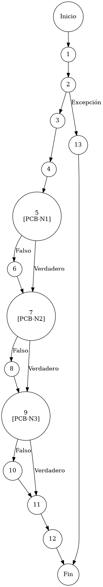

# TEST PRUEBAS DE CAJA BLANCA

| **DATOS DEL ESTUDIANTE** | |
| :--- | :--- |
| **NOMBRE:** | Gabriel Amílcar Cruz Canto |
| **EMPRESA:** | WALOOK MEXICO, S.A. de C.V. |
| **TITULO DEL PROYECTO:** | Sistema ERP en la nube para gestión de ópticas OMCGC |
| **URL y Claves de acceso:** | [Configurar en ambiente de entrega] |

<br>

| **PLAN DE PRUEBAS DE CAJA BLANCA: BACKEND** | | | | |
| :--- | :--- | :--- | :--- | :--- |
| **Número** | **Nombre de la Prueba Backend** | **Descripción** | **Fecha** | **Responsable** |
| PCB-003 | Saneamiento de Login | Orquestación de Payload de Seguridad y Sesión | 17/03/2026 | Gabriel Amílcar Cruz Canto |

---

# FASE DE PRUEBAS

| **Nombre del Módulo del Sistema + Historia de usuario** |
| :--- |
| Módulo Seguridad / Acceso – HU-M01-01 |

| **Número y nombre de la Prueba** |
| :--- |
| PCB-003 / Saneamiento de Login – AuthController.login() (Block) |

### Paso 0

```java
    /**
     * ESPECIFICACIÓN TÉCNICA: Orquestación Atómica de Respuesta de Sesión y Payload de Seguridad.
     * OBJETIVO OPERATIVO: Construir DTO de respuesta HTTP y habilitar entorno de ejecución.
     * IMPACTO: Distribución centralizada de metadatos y permisos en un solo intercambio.
     */
    try { // [N1: INICIO]
        Usuario usuario = authService.login(email, password); // [N2: PROCESO]

        // Registro de Auditoría
        bitacoraService.registrarEvento(usuario.getIdUsuario(), "AUTH-01", ip, usuario.getNombre(), email); // [N3: PROCESO]

        // Resolución de Facultades
        List<Map<String, Object>> permisos = usuarioService.getPermissionsByUsuario(usuario.getIdUsuario()); // [N4: PROCESO]

        // [PCB-N1] normalización de metadatos (IdRol)
        String rolId = usuario.getIdRol() != null ? usuario.getIdRol() : ""; // [N5] [PCB-N1] -> [SI: N7] [NO: N6] : ¿Tiene IdRol?
        
        // [PCB-N2] normalización de metadatos (NombreRol)
        String nombreRol = usuario.getNombreRol() != null ? usuario.getNombreRol() : ""; // [N7] [PCB-N2] -> [SI: N9] [NO: N8] : ¿Tiene NombreRol?
        
        // [PCB-N3] normalización de metadatos (IdSucursal)
        String idSucursal = usuario.getIdSucursal() != null ? usuario.getIdSucursal() : ""; // [N9] [PCB-N3] -> [SI: N11] [NO: N10] : ¿Tiene IdSucursal?

        // [N11: PROCESO] -> Construcción de Respuesta Atómica
        return ResponseEntity.ok(Map.of(
                "success", true,
                "userId", usuario.getIdUsuario(),
                "rolId", rolId,
                "nombreRol", nombreRol,
                "idSucursal", idSucursal,
                "permisos", permisos)); // [N12: FIN]
    } catch (RuntimeException e) { // [N13: FIN (EXC)]
        // Capa de excepciones analizada en PCB-001
    }
```

### Descripción breve del fragmento

El fragmento **PCB-003** representa el orquestador final del acceso al sistema. Su función es normalizar los metadatos de la identidad (IdRol, NombreRol, IdSucursal) mediante operadores ternarios preventivos para garantizar que el payload JSON entregado al Frontend sea íntegro y carezca de nulos. Con una complejidad $V(G)=4$, asegura que ninguna sesión sea establecida sin su correspondiente matriz de facultades sincronizada.

### Identificación de Nodos

| ID del Nodo | Tipo | Descripción |
| :--- | :--- | :--- |
| **Nodo 1** | Inicio | Inicio del bloque de control `try` en el controlador para la gestión de la sesión. |
| **Nodo 2** | Nodo predicado | Ejecución de `authService.login()`. Orquestación de autenticación con captura de excepciones. |
| **Nodo 3** | Nodo de proceso | Ejecución de `bitacoraService.registrarEvento()`. Registro persistente de auditoría forense. |
| **Nodo 4** | Nodo de proceso | Ejecución de `usuarioService.getPermissionsByUsuario()`. Resolución de la matriz de facultades. |
| **Nodo 5 [PCB-N1]** | Nodo predicado | Evaluación de la condición `usuario.getIdRol() != null`. Saneamiento de metadatos de Rol. Identificado con la etiqueta **PCB-N1**. |
| **Nodo 6** | Nodo de proceso | Asignación de cadena vacía como valor de saneamiento para `rolId` ausente. |
| **Nodo 7 [PCB-N2]** | Nodo predicado | Evaluación de la condición `usuario.getNombreRol() != null`. Saneamiento de denominación operativa. Identificado con la etiqueta **PCB-N2**. |
| **Nodo 8** | Nodo de proceso | Asignación de cadena vacía como valor de saneamiento para `nombreRol` ausente. |
| **Nodo 9 [PCB-N3]** | Nodo predicado | Evaluación de la condición `usuario.getIdSucursal() != null`. Saneamiento de ubicación física. Identificado con la etiqueta **PCB-N3**. |
| **Nodo 10** | Nodo de proceso | Asignación de cadena vacía como valor de saneamiento para `idSucursal` ausente. |
| **Nodo 11** | Nodo de proceso | Construcción atómica del objeto para la respuesta DTO de éxito. |
| **Nodo 12** | Nodo de salida | Ejecución de `return ResponseEntity.ok()`. Finalización exitosa y entrega de payload al cliente. |
| **Nodo 13** | Nodo de salida | Captura de `RuntimeException` en bloque `catch`. Interrupción por fallo de seguridad. |

### Paso 1



### Paso 2

**V(G) = Número de regiones** = (4 internas + 1 externa) = **5**
**V(G) = Aristas – Nodos + 2** = V(G) = 18 – 15 + 2 = **5**
**V(G) = Nodos Predicado + 1** = V(G) = 4 + 1 = **5**

### Paso 3

| Total de caminos | Ruta de cada camino |
| :--- | :--- |
| **Camino 1** | Inicio → 1 → 2(Exc) → 13 → Fin |
| **Camino 2** | Inicio → 1 → 2 → 3 → 4 → 5(NO) → 6 → 7(SÍ) → 9(SÍ) → 11 → 12 → Fin |
| **Camino 3** | Inicio → 1 → 2 → 3 → 4 → 5(SÍ) → 7(NO) → 8 → 9(SÍ) → 11 → 12 → Fin |
| **Camino 4** | Inicio → 1 → 2 → 3 → 4 → 5(SÍ) → 7(SÍ) → 9(NO) → 10 → 11 → 12 → Fin |

### Paso 4

| Número del camino | Caso de Prueba (IN) | Resultado esperado (OUT) |
| :--- | :--- | :--- |
| **Camino 1** | Lanzamiento de RuntimeException en authService.login() | ResponseEntity(4xx/5xx) (Fallo Gatekeeper) |
| **Camino 2** | usuario.idRol = null, usuario.nombreRol != null, usuario.idSucursal != null | Payload con rolId: "" (PCB-N1: NO, PCB-N2: SI, PCB-N3: SI) |
| **Camino 3** | usuario.idRol != null, usuario.nombreRol = null, usuario.idSucursal != null | Payload con nombreRol: "" (PCB-N1: SI, PCB-N2: NO, PCB-N3: SI) |
| **Camino 4** | usuario.idRol != null, usuario.nombreRol != null, usuario.idSucursal = null | Payload con idSucursal: "" (PCB-N1: SI, PCB-N2: SI, PCB-N3: NO) |
