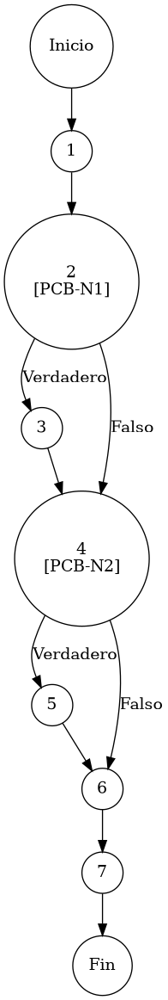

# TEST PRUEBAS DE CAJA BLANCA

| **DATOS DEL ESTUDIANTE** | |
| :--- | :--- |
| **NOMBRE:** | Gabriel Amílcar Cruz Canto |
| **EMPRESA:** | WALOOK MEXICO, S.A. de C.V. |
| **TITULO DEL PROYECTO:** | Sistema ERP en la nube para gestión de ópticas OMCGC |
| **URL y Claves de acceso:** | [Configurar en ambiente de entrega] |

<br>

| **PLAN DE PRUEBAS DE CAJA BLANCA: BACKEND (MIG-MASTER)** | | | | |
| :--- | :--- | :--- | :--- | :--- |
| **Número** | **Nombre de la Prueba Backend** | **Descripción** | **Fecha** | **Herramienta / Responsable** |
| PCB-001 | Autenticación de usuario | Protocolo de Acceso y Validación de Infraestructura | 09/03/2026 | Gabriel Amílcar Cruz Canto |
| PCB-002 | Manejo de Credenciales Inválidas | Interrupción de Seguridad por Fallo de Contraseña | 09/03/2026 | Gabriel Amílcar Cruz Canto |
| PCB-003 | Registro de Producto | Validación de Integridad de Campos Obligatorios | 10/03/2026 | Gabriel Amílcar Cruz Canto |
| PCB-004 | SKU Autogenerado | Garantía de Unicidad de Identificación Comercial | 10/03/2026 | Gabriel Amílcar Cruz Canto |
| PCB-005 | Rango de Fechas (Ventas) | Filtrado de Reporte Operativo de Transacciones | 11/03/2026 | Gabriel Amílcar Cruz Canto |
| PCB-006 | Filtro de Sucursal | Segregación de Información por Punto de Venta | 11/03/2026 | Gabriel Amílcar Cruz Canto |
| PCB-007 | Kardex de Stock | Protocolo de Integridad Transaccional sobre Saldo | 12/03/2026 | Gabriel Amílcar Cruz Canto |
| PCB-008 | Integridad Fiscal | Validación de Identidad Tributaria y Unicidad RFC | 12/03/2026 | Gabriel Amílcar Cruz Canto |
| PCB-009 | Búsqueda de Clientes | Motor de Búsqueda Multi-Criterio sobre Pacientes | 13/003/2026 | Gabriel Amílcar Cruz Canto |
| PCB-010 | Saneamiento de Pacientes | Protocolo de Normalización de Atributos de Persona | 14/03/2026 | Gabriel Amílcar Cruz Canto |
| PCB-011 | Registro de Proveedor | Auditoría Estructural de Validación Forense | 18/03/2026 | JaCoCo / JUnit 5 |
| PCB-012 | Actualización de Proveedor | Validación de Excepción por RFC Duplicado | 18/03/2026 | JaCoCo / JUnit 5 |
| PCB-013 | Registro de Usuario | Validación de Excepción por Correo Duplicado | 18/03/2026 | JaCoCo / JUnit 5 |
| PCB-014 | Baja de Usuario | Validación de Desactivación Lógica (inactivo) | 18/03/2026 | JaCoCo / JUnit 5 |
| PCB-015 | Reset de Contraseña | Manejo de Excepción por Usuario Inexistente | 18/03/2026 | JaCoCo / JUnit 5 |
| PCB-016 | Autenticación Root | Validación de Bypass Administrativo (Local) | 18/03/2026 | JaCoCo / JUnit 5 |
| PCB-017 | Registro de Movimiento | Validación de Stock Insuficiente (Venta) | 18/03/2026 | JaCoCo / JUnit 5 |
| PCB-018 | Cálculo de PVP | Validación de Fórmula Financiera (Utilidad) | 18/03/2026 | JaCoCo / JUnit 5 |
| PCB-019 | Robustez de Auditoría | Normalización de IP Nula (Default 0.0.0.0) | 18/03/2026 | JaCoCo / JUnit 5 |
| PCB-020 | Carga de Diccionario | Validación de Descifrado AES-256 (Binario) | 18/03/2026 | JaCoCo / JUnit 5 |

---

# FASE DE PRUEBAS

| **Nombre del Módulo del Sistema + Historia de usuario** |
| :--- |
| Módulo Inventarios / Catálogos – HU-M01-02 |

| **Número y nombre de la Prueba** |
| :--- |
| PCB-004 / Registro de Productos – InventarioService.saveProduct() |

### Paso 0

```java
    /**
     * ESPECIFICACIÓN TÉCNICA: Protocolo de Generación de Identidad Sistémica y Comercial (UUID/SKU).
     * OBJETIVO OPERATIVO: Asegurar la unicidad mediante GUID y códigos EAN-like.
     * IMPACTO: Integridad de referencia y trazabilidad logística.
     */
    public void saveProduct(Producto p, String ip) { // [N1: INICIO]
        
        // [PCB-N1] evaluación de persistencia (Check de nueva entidad)
        boolean isNew = (p.getIdProducto() == null || p.getIdProducto().isEmpty()); // [N2] [PCB-N1] -> [SI: N3] [NO: N4] : ¿Es producto nuevo?
        
        if (isNew) {
            p.setIdProducto(java.util.UUID.randomUUID().toString()); // [N3: PROCESO] -> Generar GUID
        }

        // [PCB-N2] validación de código comercial (Autogeneración de SKU)
        // [N4: PREDICADO] [PCB-N2] -> [SI: N5] [NO: N6] : ¿Requiere SKU automático?
        if (p.getSku() == null || p.getSku().isEmpty() || p.getSku().equalsIgnoreCase("Autogenerado")) {
            String timestamp = String.valueOf(System.currentTimeMillis()); // [N5: PROCESO]
            p.setSku("75" + timestamp.substring(timestamp.length() - 8));
        }

        inventarioRepository.save(p); // [N6: PROCESO] -> Persistir transacción
    } // [N7: FIN]
```

### Descripción breve del fragmento

El fragmento **PCB-004** implementa el motor de identidad para el catálogo de productos. Su lógica garantiza que cada artículo nuevo reciba un identificador global único (UUID) y un código comercial (SKU) normalizado con el prefijo corporativo '75'. Con una complejidad $V(G)=3$, el diseño previene colisiones de datos y asegura que la trazabilidad logística comience desde el momento de la inserción atómica.

### Identificación de Nodos

| ID del Nodo | Tipo | Descripción |
| :--- | :--- | :--- |
| **Nodo 1** | Inicio | Inicio de la función `saveProduct(Producto p, String ip)` y recepción de parámetros de entrada. |
| **Nodo 2 [PCB-N1]** | Nodo predicado | Evaluación de la condición `isNew`. Verificación de persistencia previa mediante el identificador. Identificado con la etiqueta **PCB-N1**. |
| **Nodo 3** | Nodo de proceso | Ejecución de `p.setIdProducto(UUID.randomUUID())`. Generación e inyección de GUID persistente. |
| **Nodo 4 [PCB-N2]** | Nodo predicado | Evaluación de la condición de SKU ausente o marcado para autogeneración. Identificado con la etiqueta **PCB-N2**. |
| **Nodo 5** | Nodo de proceso | Ejecución de construcción de SKU corporativo (Prefijo '75' + sufijo temporal de 8 dígitos). |
| **Nodo 6** | Nodo de proceso | Ejecución de `inventarioRepository.save(p)`. Persistencia atómica de la transacción de catálogo. |
| **Nodo 7** | Fin | Finalización del protocolo de generación de identidad sistémica y comercial. |

### Paso 1



### Paso 2

**V(G) = Número de regiones** = (2 internas + 1 externa) = **3**
**V(G) = Aristas – Nodos + 2** = V(G) = 10 – 9 + 2 = **3**
**V(G) = Nodos Predicado + 1** = V(G) = 2 + 1 = **3**

### Paso 3

| Total de caminos | Ruta de cada camino |
| :--- | :--- |
| **Camino 1** | Inicio → 1 → 2(NO) → 4(NO) → 6 → 7 → Fin |
| **Camino 2** | Inicio → 1 → 2(SÍ) → 3 → 4(NO) → 6 → 7 → Fin |
| **Camino 3** | Inicio → 1 → 2(NO) → 4(SÍ) → 5 → 6 → 7 → Fin |

### Paso 4

| Número del camino | Caso de Prueba (IN) | Resultado esperado (OUT) |
| :--- | :--- | :--- |
| **Camino 1** | p.idProducto = "GUID-EXISTENTE", p.sku = "EAN-123" | Persistencia sin cambios de ID/SKU (PCB-N1: NO, PCB-N2: NO) |
| **Camino 2** | p.idProducto = null, p.sku = "EAN-123" | Genera UUID y respeta SKU original (PCB-N1: SI, PCB-N2: NO) |
| **Camino 3** | p.idProducto = "GUID-EXISTENTE", p.sku = "Autogenerado" | Respeta ID y genera SKU corporativo '75-UUID-SKU' (PCB-N1: NO, PCB-N2: SI) |
