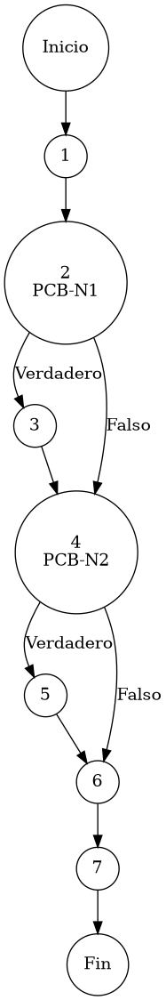

# Reporte de Auditoría de Caja Blanca: PCB-004

## A. Identificación del Fragmento
- **ID**: PCB-004
- **Módulo**: Inventarios
- **Fragmento**: Registro e identidad sistémica de producto
- **HU**: HU-M01-02
- **Función**: `InventarioService.saveProduct(Producto p, String ip)`
- **Alcance**: Análisis de la lógica de asignación de identificadores (UUID/SKU) para la persistencia de artículos nuevos bajo el estándar de "Duda Cero".

## B. Tabla de Nodos
| Nodo | Descripción | Tipo |
| :--- | :--- | :--- |
| 1 | Inicio de la función `saveProduct()` | Inicio |
| 2 | Evaluación de nueva entidad: `p.getIdProducto() == null || p.getIdProducto().isEmpty()` [PCB-N1] | Predicado |
| 3 | Asignación de Identificador Único Universal: `p.setIdProducto(UUID.randomUUID().toString())` | Proceso |
| 4 | Verificación de requerimiento de SKU: `p.getSku() == null || ... || p.getSku().equalsIgnoreCase("Autogenerado")` [PCB-N2] | Predicado |
| 5 | Generación de SKU comercial basado en Marca de Tiempo: `p.setSku("75" + ...)` | Proceso |
| 6 | Persistencia en Base de Datos: `inventarioRepository.save(p)` | Proceso |
| 7 | Finalización de la operación de registro | Fin |

## C. Tabla de Aristas
| Origen | Destino | Condición / Etiqueta |
| :--- | :--- | :--- |
| 1 | 2 | Flujo secuencial |
| 2 | 3 | PCB-N1 es Verdadero (La entidad es un Producto Nuevo) |
| 2 | 4 | PCB-N1 es Falso (La entidad es una Actualización) |
| 3 | 4 | Flujo secuencial |
| 4 | 5 | PCB-N2 es Verdadero (Se requiere autogenerar el SKU) |
| 4 | 6 | PCB-N2 es Falso (Se mantiene el SKU provisto manualmente) |
| 5 | 6 | Flujo secuencial |
| 6 | 7 | Flujo secuencial |

## D. Complejidad Ciclomática
$V(G) = P + 1$
donde $P = 2$ (Nodos predicado: PCB-N1, PCB-N2)
$V(G) = 2 + 1 = 3$

**Interpretación**: El análisis estructural identifica 3 caminos independientes para validar todas las variantes de creación, actualización y normalización de códigos comerciales en el catálogo.

## E. Caminos Independientes
1. **Camino 1 (Registro Nuevo con SKU Manual)**: 1 → 2(Verdadero) → 3 → 4(Falso) → 6 → 7
2. **Camino 2 (Registro Nuevo con SKU Autogenerado)**: 1 → 2(Verdadero) → 3 → 4(Verdadero) → 5 → 6 → 7
3. **Camino 3 (Actualización con SKU Preexistente)**: 1 → 2(Falso) → 4(Falso) → 6 → 7

## F. Casos de Prueba (Basis Path Testing)
| Caso | entrada: idProducto | entrada: SKU | Condición de Control | Resultado Esperado |
| :--- | :--- | :--- | :--- | :--- |
| CP1 | Nulo | "SKU-PROPIO-01" | PCB-N1=Verdadero, PCB-N2=Falso | Asigna UUID / Mantiene "SKU-PROPIO-01" |
| CP2 | Vacio ("") | "Autogenerado" | PCB-N1=Verdadero, PCB-N2=Verdadero | Asigna UUID / Genera SKU "75XXXXXXXX" |
| CP3 | "ID-PERSISTENTE" | "SKU-EXISTENTE" | PCB-N1=Falso, PCB-N2=Falso | Mantiene ID / Mantiene SKU (Actualización) |

## G. Seudocódigo Estructural del Fragmento

### Fragmento A: Código Puro (Estructura Original)
**Archivo**: `InventarioService.java`
**Función**: `saveProduct(Producto p, String ip)`
**Descripción**: Protocolo de generación de identidad sistémica (UUID) y comercial (SKU). Asegura que ningún producto carezca de identificadores únicos antes de su persistencia en el repositorio maestro. Incluye comentarios originales de desarrollo.

```java
    public void saveProduct(Producto p, String ip) {
        
        // evaluación de persistencia (Check de nueva entidad)
        boolean isNew = (p.getIdProducto() == null || p.getIdProducto().isEmpty());
        
        if (isNew) {
            p.setIdProducto(java.util.UUID.randomUUID().toString());
        }

        // validación de código comercial (Autogeneración de SKU)
        if (p.getSku() == null || p.getSku().isEmpty() || p.getSku().equalsIgnoreCase("Autogenerado")) {
            String timestamp = String.valueOf(System.currentTimeMillis());
            p.setSku("75" + timestamp.substring(timestamp.length() - 8));
        }

        inventarioRepository.save(p);
    }
```

### Fragmento B: Código Anotado (Mapeo de Nodos)
**Descripción**: Este fragmento incluye los marcadores de control (`PCB-Nx`) para identificar la posición exacta de cada nodo y arista del Grafo de Control de Flujo (CFG).

```java
    public void saveProduct(Producto p, String ip) { // NODO 1
        
        // PCB-N1: evaluación de persistencia (Check de nueva entidad)
        boolean isNew = (p.getIdProducto() == null || p.getIdProducto().isEmpty()); // NODO 2 [PREDICADO]
        
        if (isNew) {
            p.setIdProducto(java.util.UUID.randomUUID().toString()); // NODO 3
        }

        // PCB-N2: validación de código comercial (Autogeneración de SKU)
        if (p.getSku() == null || p.getSku().isEmpty() || p.getSku().equalsIgnoreCase("Autogenerado")) { // NODO 4 [PREDICADO]
            String timestamp = String.valueOf(System.currentTimeMillis());
            p.setSku("75" + timestamp.substring(timestamp.length() - 8)); // NODO 5
        }

        inventarioRepository.save(p); // NODO 6
    } // NODO 7 [FIN]
```

## H. Grafo de Control de Flujo (PlantUML)


## I. Matriz de Trazabilidad
| Requisito (HU) | Nodo de Decisión | Camino Independiente | Caso de Prueba |
| :--- | :--- | :--- | :--- |
| **HU-M01-02** | PCB-N1 | Caminos 1, 2 | CP1, CP2 |
| **HU-M01-02** | PCB-N1 | Camino 3 | CP3 |
| **HU-M01-02** | PCB-N2 | Camino 1 | CP1 |
| **HU-M01-02** | PCB-N2 | Camino 2 | CP2 |

## J. Resumen Académico
El fragmento **PCB-004** implementa un mecanismo de normalización de identidad sistémica que garantiza la integridad referencial del ERP. La auditoría de caja blanca verifica que el diseño "Fail-Soft" previene la ausencia de llaves primarias mediante el uso de UUIDs y asegura la estandarización comercial con un algoritmo de generación de SKU basado en cronometría sistémica. Con una complejidad ciclomática $V(G)=3$, el código es altamente confiable y facilita la trazabilidad logística del inventario.
