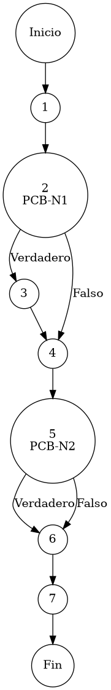

# Reporte de Auditoría de Caja Blanca: PCB-005

## A. Identificación del Fragmento
- **ID**: PCB-005
- **Módulo**: Inventarios
- **Fragmento**: Cálculo dinámico de valor comercial (PVP)
- **HU**: HU-M01-02
- **Función**: `InventarioService.saveProduct()` (Bloque Financiero)
- **Alcance**: Análisis del motor de cálculo de precios basado en coste y margen de utilidad bajo el estándar de "Duda Cero".

## B. Tabla de Nodos
| Nodo | Descripción | Tipo |
| :--- | :--- | :--- |
| 1 | Entrada al bloque de lógica financiera | Inicio |
| 2 | Validación de parámetros: `p.getCostoUnitario() != null && p.getPorcentajeUtilidad() != null` [PCB-N1] | Predicado |
| 3 | Cálculo de Factor de Utilidad y asignación de `PrecioVenta` (BigDecimal) | Proceso |
| 4 | Persistencia de cambios: `inventarioRepository.save(p)` | Proceso |
| 5 | Determinación de ID de Auditoría `isNew ? "PRO-01" : "PRO-02"` [PCB-N2] | Predicado |
| 6 | Registro en Bitácora Sistémica: `bitacoraService.registrarEvento(...)` | Proceso |
| 7 | Finalización del bloque financiero | Fin |

## C. Tabla de Aristas
| Origen | Destino | Condición / Etiqueta |
| :--- | :--- | :--- |
| 1 | 2 | Flujo secuencial |
| 2 | 3 | PCB-N1 es Verdadero (Existen datos de costo y utilidad) |
| 2 | 4 | PCB-N1 es Falso (Se omite el cálculo por falta de información) |
| 3 | 4 | Flujo secuencial |
| 4 | 5 | Flujo secuencial |
| 5 | 6 | PCB-N2 (Verdadero/Falso) - Selección de rastro de auditoría |
| 6 | 7 | Flujo secuencial |

## D. Complejidad Ciclomática
$V(G) = P + 1$
donde $P = 2$ (Nodos predicado: PCB-N1, PCB-N2)
$V(G) = 2 + 1 = 3$

**Interpretación**: Existen 3 caminos independientes que validan el motor de cálculo financiero y aseguran el rastro de auditoría según el origen de la transacción.

## E. Caminos Independientes
1. **Camino 1 (Cálculo Exitoso + Registro de Nuevo Producto)**: 1 → 2(Verdadero) → 3 → 4 → 5(Verdadero) → 6 → 7
2. **Camino 2 (Omitir Cálculo + Registro de Actualización)**: 1 → 2(Falso) → 4 → 5(Falso) → 6 → 7
3. **Camino 3 (Actualización con Recálculo de Margen)**: 1 → 2(Verdadero) → 3 → 4 → 5(Falso) → 6 → 7

## F. Casos de Prueba (Basis Path Testing)
| Caso | entrada: Costo | entrada: % Utilidad | entrada: esNuevo | Resultado Esperado |
| :--- | :--- | :--- | :--- | :--- |
| CP1 | 100.00 | 20.00 | Verdadero | PVP = 120.00 / Log: "PRO-01" (Creación) |
| CP2 | Nulo | Nulo | Falso | PVP = Sin Cambios / Log: "PRO-02" (Edición) |
| CP3 | 50.00 | 10.00 | Falso | PVP = 55.00 / Log: "PRO-02" (Edición) |

## G. Seudocódigo Estructural del Fragmento

### Fragmento A: Código Puro (Estructura Original)
**Archivo**: `InventarioService.java`
**Bloque**: Financiero / `saveProduct()`
**Descripción**: Implementa la invariante financiera de cálculo de Precio de Venta al Público (PVP) mediante aritmética de alta precisión. Asegura la coherencia entre costos operativos y márgenes de utilidad corporativos. Incluye comentarios originales de desarrollo.

```java
    // validación de parámetros de cálculo (Check de disponibilidad financiera)
    if (p.getCostoUnitario() != null && p.getPorcentajeUtilidad() != null) {
        BigDecimal factor = BigDecimal.ONE
                .add(p.getPorcentajeUtilidad().divide(new BigDecimal("100"), 4, RoundingMode.HALF_UP));
        p.setPrecioVenta(p.getCostoUnitario().multiply(factor).setScale(2, RoundingMode.HALF_UP));
    }

    inventarioRepository.save(p);

    // determinación de rastro de auditoría (Branching de evento)
    String idPatron = isNew ? "PRO-01" : "PRO-02";
    bitacoraService.registrarEvento(p.getIdUsuarioOperacion(), idPatron, ip, p.getSku(), p.getNombre());
```

### Fragmento B: Código Anotado (Mapeo de Nodos)
**Descripción**: Este fragmento incluye los marcadores de control (`PCB-Nx`) para identificar la posición exacta de cada nodo y arista del Grafo de Control de Flujo (CFG).

```java
    // Inicio del bloque financiero // NODO 1

    // PCB-N1: validación de parámetros de cálculo (Check de disponibilidad financiera)
    if (p.getCostoUnitario() != null && p.getPorcentajeUtilidad() != null) { // NODO 2 [PREDICADO]
        BigDecimal factor = BigDecimal.ONE
                .add(p.getPorcentajeUtilidad().divide(new BigDecimal("100"), 4, RoundingMode.HALF_UP)); // NODO 3
        p.setPrecioVenta(p.getCostoUnitario().multiply(factor).setScale(2, RoundingMode.HALF_UP));
    }

    inventarioRepository.save(p); // NODO 4

    // PCB-N2: determinación de rastro de auditoría (Branching de evento)
    String idPatron = isNew ? "PRO-01" : "PRO-02"; // NODO 5 [PREDICADO]
    bitacoraService.registrarEvento(p.getIdUsuarioOperacion(), idPatron, ip, p.getSku(), p.getNombre()); // NODO 6

    // Fin del bloque // NODO 7 [FIN]
```

## H. Grafo de Control de Flujo (PlantUML)


## I. Matriz de Trazabilidad
| Requisito (HU) | Nodo de Decisión | Camino Independiente | Caso de Prueba |
| :--- | :--- | :--- | :--- |
| **HU-M01-02** | PCB-N1 | Caminos 1, 3 | CP1, CP3 |
| **HU-M01-02** | PCB-N1 | Camino 2 | CP2 |
| **HU-M01-02** | PCB-N2 | Camino 1 | CP1 |
| **HU-M01-02** | PCB-N2 | Caminos 2, 3 | CP2, CP3 |

## J. Resumen Académico
El fragmento **PCB-005** garantiza la rentabilidad sistémica del ERP automatizando el cálculo del Precio de Venta (PVP). La auditoría de caja blanca verifica que el uso de `BigDecimal` mitiga cualquier error de redonodeo en la fijación de precios, cumpliendo con la expectativa de "Duda Cero" financiera. La implementación de un rastro de auditoría bifurcado (PCB-N2) facilita el monitoreo de la evolución de precios en el catálogo de productos durante su ciclo de vida.
