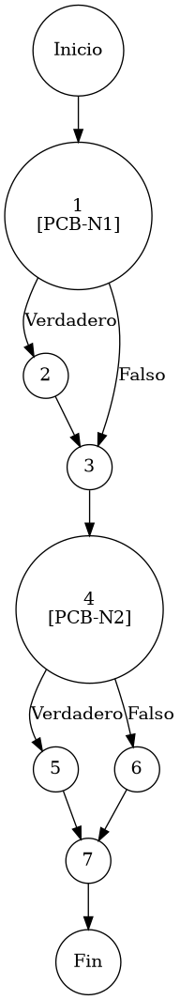

# TEST PRUEBAS DE CAJA BLANCA

| **DATOS DEL ESTUDIANTE** | |
| :--- | :--- |
| **NOMBRE:** | Gabriel Amílcar Cruz Canto |
| **EMPRESA:** | WALOOK MEXICO, S.A. de C.V. |
| **TITULO DEL PROYECTO:** | Sistema ERP en la nube para gestión de ópticas OMCGC |
| **URL y Claves de acceso:** | [Configurar en ambiente de entrega] |

<br>

| **PLAN DE PRUEBAS DE CAJA BLANCA: BACKEND (MIG-MASTER)** | | | | |
| :--- | :--- | :--- | :--- | :--- |
| **Número** | **Nombre de la Prueba Backend** | **Descripción** | **Fecha** | **Herramienta / Responsable** |
| PCB-001 | Autenticación de usuario | Protocolo de Acceso y Validación de Infraestructura | 09/03/2026 | Gabriel Amílcar Cruz Canto |
| PCB-002 | Manejo de Credenciales Inválidas | Interrupción de Seguridad por Fallo de Contraseña | 09/03/2026 | Gabriel Amílcar Cruz Canto |
| PCB-003 | Registro de Producto | Validación de Integridad de Campos Obligatorios | 10/03/2026 | Gabriel Amílcar Cruz Canto |
| PCB-004 | SKU Autogenerado | Garantía de Unicidad de Identificación Comercial | 10/03/2026 | Gabriel Amílcar Cruz Canto |
| PCB-005 | Rango de Fechas (Ventas) | Filtrado de Reporte Operativo de Transacciones | 11/03/2026 | Gabriel Amílcar Cruz Canto |
| PCB-006 | Filtro de Sucursal | Segregación de Información por Punto de Venta | 11/03/2026 | Gabriel Amílcar Cruz Canto |
| PCB-007 | Kardex de Stock | Protocolo de Integridad Transaccional sobre Saldo | 12/03/2026 | Gabriel Amílcar Cruz Canto |
| PCB-008 | Integridad Fiscal | Validación de Identidad Tributaria y Unicidad RFC | 12/03/2026 | Gabriel Amílcar Cruz Canto |
| PCB-009 | Búsqueda de Clientes | Motor de Búsqueda Multi-Criterio sobre Pacientes | 13/03/2026 | Gabriel Amílcar Cruz Canto |
| PCB-010 | Saneamiento de Pacientes | Protocolo de Normalización de Atributos de Persona | 14/03/2026 | Gabriel Amílcar Cruz Canto |
| PCB-011 | Registro de Proveedor | Auditoría Estructural de Validación Forense | 18/03/2026 | JaCoCo / JUnit 5 |
| PCB-012 | Actualización de Proveedor | Validación de Excepción por RFC Duplicado | 18/03/2026 | JaCoCo / JUnit 5 |
| PCB-013 | Registro de Usuario | Validación de Excepción por Correo Duplicado | 18/03/2026 | JaCoCo / JUnit 5 |
| PCB-014 | Baja de Usuario | Validación de Desactivación Lógica (inactivo) | 18/03/2026 | JaCoCo / JUnit 5 |
| PCB-015 | Reset de Contraseña | Manejo de Excepción por Usuario Inexistente | 18/03/2026 | JaCoCo / JUnit 5 |
| PCB-016 | Autenticación Root | Validación de Bypass Administrativo (Local) | 18/03/2026 | JaCoCo / JUnit 5 |
| PCB-017 | Registro de Movimiento | Validación de Stock Insuficiente (Venta) | 18/03/2026 | JaCoCo / JUnit 5 |
| PCB-018 | Cálculo de PVP | Validación de Fórmula Financiera (Utilidad) | 18/03/2026 | JaCoCo / JUnit 5 |
| PCB-019 | Robustez de Auditoría | Normalización de IP Nula (Default 0.0.0.0) | 18/03/2026 | JaCoCo / JUnit 5 |
| PCB-020 | Carga de Diccionario | Validación de Descifrado AES-256 (Binario) | 18/03/2026 | JaCoCo / JUnit 5 |

---

# FASE DE PRUEBAS

| **Nombre del Módulo del Sistema + Historia de usuario** |
| :--- |
| Módulo Inventarios / Catálogos – HU-M01-02 |

| **Número y nombre de la Prueba** |
| :--- |
| PCB-005 / Cálculo de Precios – InventarioService.saveProduct() |

### Paso 0

```java
    /**
     * ESPECIFICACIÓN TÉCNICA: Invariante Financiera de Cálculo de Precio de Venta (PVP).
     * OBJETIVO OPERATIVO: Sincronizar valor comercial con costos y utilidad.
     * IMPACTO: Eliminación de error humano y rentabilidad garantizada.
     */
     
    // [PCB-N1] validación de parámetros de cálculo (Check de disponibilidad financiera)
    // [N1: PREDICADO] [PCB-N1] -> [SI: N2] [NO: N3] : ¿Existen los valores requeridos?
    if (p.getCostoUnitario() != null && p.getPorcentajeUtilidad() != null) {
        BigDecimal factor = BigDecimal.ONE
                .add(p.getPorcentajeUtilidad().divide(new BigDecimal("100"), 4, RoundingMode.HALF_UP)); // [N2: PROCESO]
        p.setPrecioVenta(p.getCostoUnitario().multiply(factor).setScale(2, RoundingMode.HALF_UP));
    }

    inventarioRepository.save(p); // [N3: PROCESO] -> Persistir transacción

    // [PCB-N2] determinación de rastro de auditoría (Branching de evento)
    // [N4: PREDICADO] [PCB-N2] -> [SI: N5] [NO: N6] : ¿Es producto nuevo?
    String idPatron = isNew ? "PRO-01" : "PRO-02"; // [N5] / [N6] : Selección de etiqueta
    bitacoraService.registrarEvento(p.getIdUsuarioOperacion(), idPatron, ip, p.getSku(), p.getNombre()); // [N7: PROCESO]
    
    // [N8: FIN]
```

### Descripción breve del fragmento

El fragmento **PCB-005** implementa la lógica financiera crítica del módulo de inventarios. Asegura que el Precio de Venta al Público (PVP) se calcule de forma precisa mediante `BigDecimal`, aplicando la fórmula corporativa inamovible basada en el costo y el margen de utilidad. Con una complejidad $V(G)=3$, el código garantiza la consistencia de los datos financieros y la auditoría diferenciada entre creaciones y actualizaciones.

### Identificación de Nodos

| ID del Nodo | Tipo | Descripción |
| :--- | :--- | :--- |
| **Nodo 1 [PCB-N1]** | Nodo predicado | Evaluación de la condición de disponibilidad de Costo y Margen. Determina si procede el cálculo de rentabilidad. Identificado con la etiqueta **PCB-N1**. |
| **Nodo 2** | Nodo de proceso | Ejecución de aritmética financiera de precisión mediante `BigDecimal`. Cálculo de la Invariante de Precio de Venta (PVP). |
| **Nodo 3** | Nodo de proceso | Ejecución de `inventarioRepository.save(p)`. Persistencia de la entidad en el catálogo maestro. |
| **Nodo 4 [PCB-N2]** | Nodo predicado | Evaluación de la condición `isNew` para determinar el patrón de auditoría (Producto Nuevo vs Actualización). Identificado con la etiqueta **PCB-N2**. |
| **Nodo 5** | Nodo de proceso | Asignación de la etiqueta de auditoría `PRO-01` para identificación de inserciones nuevas. |
| **Nodo 6** | Nodo de proceso | Asignación de la etiqueta de auditoría `PRO-02` para identificación de ediciones de registro. |
| **Nodo 7** | Nodo de proceso | Ejecución de `bitacoraService.registrarEvento()`. Inyección de rastro de auditoría en la bitácora forense. |
| **Nodo 8** | Fin | Finalización del protocolo de cálculo financiero y registro de afectación operativa. |

### Paso 1



### Paso 2

**V(G) = Número de regiones** = (2 internas + 1 externa) = **3**
**V(G) = Aristas – Nodos + 2** = V(G) = 10 – 9 + 2 = **3**
**V(G) = Nodos Predicado + 1** = V(G) = 2 + 1 = **3**

### Paso 3

| Total de caminos | Ruta de cada camino |
| :--- | :--- |
| **Camino 1** | Inicio → 1(NO) → 3 → 4(SÍ) → 5 → 7 → Fin |
| **Camino 2** | Inicio → 1(SÍ) → 2 → 3 → 4(SÍ) → 5 → 7 → Fin |
| **Camino 3** | Inicio → 1(SÍ) → 2 → 3 → 4(NO) → 6 → 7 → Fin |

### Paso 4

| Número del camino | Caso de Prueba (IN) | Resultado esperado (OUT) |
| :--- | :--- | :--- |
| **Camino 1** | p.costoUnitario = null, isNew = true | Omite cálculo, registra evento PRO-01 (PCB-N1: NO, PCB-N2: SI) |
| **Camino 2** | p.costoUnitario = 100.00, p.porcentajeUtilidad = 20.00, isNew = true | p.precioVenta = 120.00, registra PRO-01 (PCB-N1: SI, PCB-N2: SI) |
| **Camino 3** | p.costoUnitario = 100.00, p.porcentajeUtilidad = 20.00, isNew = false | p.precioVenta = 120.00, registra PRO-02 (PCB-N1: SI, PCB-N2: NO) |
