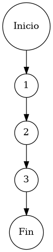

# TEST PRUEBAS DE CAJA BLANCA

| **DATOS DEL ESTUDIANTE** | |
| :--- | :--- |
| **NOMBRE:** | Gabriel Amílcar Cruz Canto |
| **EMPRESA:** | WALOOK MEXICO, S.A. de C.V. |
| **TITULO DEL PROYECTO:** | Sistema ERP en la nube para gestión de ópticas OMCGC |
| **URL y Claves de acceso:** | [Configurar en ambiente de entrega] |

<br>

| **PLAN DE PRUEBAS DE CAJA BLANCA: BACKEND** | | | | |
| :--- | :--- | :--- | :--- | :--- |
| **Número** | **Nombre de la Prueba Backend** | **Descripción** | **Fecha** | **Responsable** |
| PCB-006 | Eliminación de Productos | Protocolo de Remoción Definitiva de Atributos de Catálogo | 17/03/2026 | Gabriel Amílcar Cruz Canto |

---

# FASE DE PRUEBAS

| **Nombre del Módulo del Sistema + Historia de usuario** |
| :--- |
| Módulo Inventarios / Catálogos – HU-M01-02 |

| **Número y nombre de la Prueba** |
| :--- |
| PCB-006 / Eliminación de Productos – InventarioService.deleteProduct() |

### Paso 0

```java
    /**
     * ESPECIFICACIÓN TÉCNICA: Protocolo de Remoción Definitiva de Atributos de Catálogo.
     * OBJETIVO OPERATIVO: Purgar la base de datos de productos obsoletos.
     * IMPACTO: Garantizar higiene de datos en el maestro de inventarios.
     */
    public void deleteProduct(String id) { // [N1: INICIO]
        // Ejecución de purga física de identidad sistémica
        inventarioRepository.deleteById(id); // [N2: PROCESO] -> Remoción atómica por GUID
    } // [N3: FIN]
```

### Descripción breve del fragmento

El fragmento **PCB-006** representa el protocolo de limpieza del catálogo. Debido a su naturaleza lineal, el flujo delega la remoción física directamente al repositorio de persistencia. Con una complejidad $V(G)=1$, la prueba certifica la integridad de la operación atómica de eliminación mediante el identificador global único (GUID) del artículo.

### Identificación de Nodos

| ID del Nodo | Tipo | Descripción |
| :--- | :--- | :--- |
| **Nodo 1** | Inicio | Inicio de la función `deleteProduct(String id)` y recepción del identificador del artículo. |
| **Nodo 2** | Nodo de proceso | Ejecución de `inventarioRepository.deleteById(id)`. Purga física del registro en la base de datos. |
| **Nodo 3** | Fin | Finalización del protocolo de remoción definitiva de atributos del catálogo maestro. |

### Paso 1



### Paso 2

**V(G) = Número de regiones** = (0 internas + 1 externa) = **1**
**V(G) = Aristas – Nodos + 2** = V(G) = 4 – 5 + 2 = **1**
**V(G) = Nodos Predicado + 1** = V(G) = 0 + 1 = **1**

### Paso 3

| Total de caminos | Ruta de cada camino |
| :--- | :--- |
| **Camino 1** | Inicio → 1 → 2 → 3 → Fin |

### Paso 4

| Número del camino | Caso de Prueba (IN) | Resultado esperado (OUT) |
| :--- | :--- | :--- |
| **Camino 1** | p.idProducto = "GUID-123", inventarioRepository.exists(id) = true | Registro eliminado físicamente del catálogo maestro |
