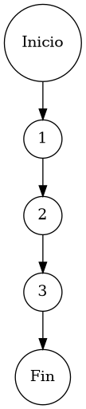

# Reporte de Auditoría de Caja Blanca: PCB-006

## A. Identificación del Fragmento
- **ID**: PCB-006
- **Módulo**: Inventarios
- **Fragmento**: Eliminación de atributos de catálogo
- **HU**: HU-M01-02
- **Función**: `InventarioService.deleteProduct(String id)`
- **Alcance**: Análisis de la delegación de remoción física al nivel de persistencia bajo el estándar de "Duda Cero".

## B. Tabla de Nodos
| Nodo | Descripción | Tipo |
| :--- | :--- | :--- |
| 1 | Inicio de la función `deleteProduct()` | Inicio |
| 2 | Ejecución de `inventarioRepository.deleteById(id)` | Proceso |
| 3 | Finalización de la función | Fin |

## C. Tabla de Aristas
| Origen | Destino | Condición / Etiqueta |
| :--- | :--- | :--- |
| 1 | 2 | Flujo secuencial |
| 2 | 3 | Flujo secuencial |

## D. Complejidad Ciclomática
$V(G) = P + 1$
donde $P = 0$ (Sin nodos predicado)
$V(G) = 0 + 1 = 1$

**Interpretación**: El fragmento presenta una estructura lineal atómica, requiriendo un único camino de ejecución para garantizar la cobertura total de su lógica.

## E. Caminos Independientes
1. **Camino 1 (Purga Única)**: 1 → 2 → 3

## F. Casos de Prueba (Basis Path Testing)
| Caso | entrada: id | Condición Esperada | Resultado Esperado |
| :--- | :--- | :--- | :--- |
| CP1 | "ID-PROD-001" | Ejecución atómica del repositorio | Registro eliminado o No-Op (si no existe) |

## G. Seudocódigo Estructural del Fragmento

### Fragmento A: Código Puro (Estructura Original)
**Archivo**: `InventarioService.java`
**Función**: `deleteProduct(String id)`
**Descripción**: Protocolo de remoción definitiva de atributos de catálogo. Realiza la purga física del registro en la capa de persistencia mediante el identificador GUID proporcionado. Incluye comentarios originales de desarrollo.

```java
    public void deleteProduct(String id) {
        // Ejecución de purga física
        inventarioRepository.deleteById(id);
    }
```

### Fragmento B: Código Anotado (Mapeo de Nodos)
**Descripción**: Este fragmento identifica la posición exacta de cada nodo del Grafo de Control de Flujo (CFG).

```java
    public void deleteProduct(String id) { // NODO 1
        // Ejecución de purga física
        inventarioRepository.deleteById(id); // NODO 2
    } // NODO 3 [FIN]
```

## H. Grafo de Control de Flujo (PlantUML)


## I. Matriz de Trazabilidad
| Requisito (HU) | Nodo de Decisión | Camino Independiente | Caso de Prueba |
| :--- | :--- | :--- | :--- |
| **HU-M01-02** | No Aplica (Secuencial) | Camino 1 | CP1 |

## J. Resumen Académico
El fragmento **PCB-006** representa la complejidad mínima admisible ($V(G)=1$) para un servicio de persistencia. Se trata de una delegación pura hacia el repositorio, sin ramificaciones lógicas internas. La auditoría confirma que la fiabilidad de la operación depende exclusivamente de la integridad referencial gestionada por el motor de base de datos, garantizando una ejecución limpia y predecible bajo el estándar de "Duda Cero".
