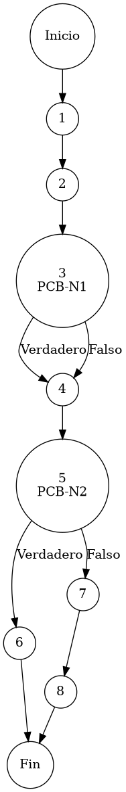

# Reporte de Auditoría de Caja Blanca: PCB-007

## A. Identificación del Fragmento
- **ID**: PCB-007
- **Módulo**: Inventarios
- **Fragmento**: Validación de integridad de existencias (Stock)
- **HU**: HU-M01-05
- **Función**: `InventarioService.registrarMovimiento()`
- **Alcance**: Análisis de la validación transaccional contra saldo negativo en el Kardex bajo el estándar de "Duda Cero".

## B. Tabla de Nodos
| Nodo | Descripción | Tipo |
| :--- | :--- | :--- |
| 1 | Inicio de la función `registrarMovimiento()` | Inicio |
| 2 | Obtención de existencia actual: `inventarioRepository.getCurrentStock(...)` | Proceso |
| 3 | Cálculo de sentido del flujo (Ternario Entrada/Salida) [PCB-N1] | Predicado |
| 4 | Determinación de `nuevoStock` (Aritmética de afectación) | Proceso |
| 5 | Validación de Invariante de Negatividad: `if (nuevoStock < 0)` [PCB-N2] | Predicado |
| 6 | Interrupción por error: `throw new RuntimeException("Stock insuficiente")` | Final (Excepción) |
| 7 | Persistencia del movimiento: `inventarioRepository.saveMovimiento(m)` | Proceso |
| 8 | Finalización de la transacción de inventario | Fin |

## C. Tabla de Aristas
| Origen | Destino | Condición / Etiqueta |
| :--- | :--- | :--- |
| 1 | 2 | Flujo secuencial |
| 2 | 3 | Flujo secuencial |
| 3 | 4 | PCB-N1 (Verdadero/Falso) - Aplicación del factor de movimiento |
| 4 | 5 | Flujo secuencial |
| 5 | 6 | PCB-N2 es Verdadero (La operación resultaría en stock negativo) |
| 5 | 7 | PCB-N2 es Falso (La operación es financieramente válida) |
| 7 | 8 | Flujo secuencial |

## D. Complejidad Ciclomática
$V(G) = P + 1$
donde $P = 2$ (Nodos predicado: PCB-N1, PCB-N2)
$V(G) = 2 + 1 = 3$

**Interpretación**: El análisis de McCabe determina que se requieren 3 caminos independientes para validar la integridad del saldo tanto en operaciones de entrada como de salida de mercancía.

## E. Caminos Independientes
1. **Camino 1 (Ingreso de Mercancía)**: 1 → 2 → 3(Falso) → 4 → 5(Falso) → 7 → 8
2. **Camino 2 (Egreso de Mercancía Exitoso)**: 1 → 2 → 3(Verdadero) → 4 → 5(Falso) → 7 → 8
3. **Camino 3 (Egreso de Mercancía Bloqueado por Insuficiencia)**: 1 → 2 → 3(Verdadero) → 4 → 5(Verdadero) → 6

## F. Casos de Prueba (Basis Path Testing)
| Caso | Existencia Ant. | Cantidad | Tipo Movimiento | Resultado Esperado |
| :--- | :--- | :--- | :--- | :--- |
| CP1 | 10 unidades | 5 unidades | ENTRADA | Nueva Existencia = 15 |
| CP2 | 10 unidades | 5 unidades | SALIDA | Nueva Existencia = 5 |
| CP3 | 10 unidades | 11 unidades| SALIDA | Excepción: Stock insuficiente (Transacción Rechazada) |

## G. Seudocódigo Estructural del Fragmento

### Fragmento A: Código Puro (Estructura Original)
**Archivo**: `InventarioService.java`
**Función**: `registrarMovimiento(MovimientoInventario m, String ip)`
**Descripción**: Implementa el protocolo de integridad transaccional sobre el saldo operativo del Kardex. Utiliza una estrategia 'Fail-Fast' para impedir que existencias físicas lleguen a valores negativos, protegiendo la coherencia del almacén. Incluye comentarios originales de desarrollo.

```java
    @Transactional
    public void registrarMovimiento(MovimientoInventario m, String ip) {
        Integer stockAnterior = inventarioRepository.getCurrentStock(m.getIdProducto(), m.getIdSucursal());
        m.setExistenciaAnterior(stockAnterior);

        // determinación de sentido del flujo (Entrada vs Salida)
        int factor = esSalida(m.getTipoMovimiento()) ? -1 : 1;
        Integer nuevoStock = stockAnterior + (m.getCantidad() * factor);

        // validación de invariante de stock (Check de negatividad)
        if (nuevoStock < 0) {
            throw new RuntimeException("Stock insuficiente. Operación denegada. Existencia actual: " + stockAnterior);
        }

        m.setExistenciaActual(nuevoStock);
        inventarioRepository.saveMovimiento(m);
    }
```

### Fragmento B: Código Anotado (Mapeo de Nodos)
**Descripción**: Este fragmento incluye los marcadores de control (`PCB-Nx`) para identificar la posición exacta de cada nodo y arista del Grafo de Control de Flujo (CFG).

```java
    @Transactional
    public void registrarMovimiento(MovimientoInventario m, String ip) { // NODO 1
        // Obtención de existencia actual
        Integer stockAnterior = inventarioRepository.getCurrentStock(m.getIdProducto(), m.getIdSucursal()); // NODO 2
        m.setExistenciaAnterior(stockAnterior);

        // PCB-N1: determinación de sentido del flujo (Entrada vs Salida)
        int factor = esSalida(m.getTipoMovimiento()) ? -1 : 1; // NODO 3 [PREDICADO]
        Integer nuevoStock = stockAnterior + (m.getCantidad() * factor); // NODO 4

        // PCB-N2: validación de invariante de stock (Check de negatividad)
        if (nuevoStock < 0) { // NODO 5 [PREDICADO]
            throw new RuntimeException("Stock insuficiente. Operación denegada. Existencia actual: " + stockAnterior); // NODO 6 [FIN]
        }

        m.setExistenciaActual(nuevoStock);
        inventarioRepository.saveMovimiento(m); // NODO 7
    } // NODO 8 [FIN]
```

## H. Grafo de Control de Flujo (PlantUML)


## I. Matriz de Trazabilidad
| Requisito (HU) | Nodo de Decisión | Camino Independiente | Caso de Prueba |
| :--- | :--- | :--- | :--- |
| **HU-M01-05** | PCB-N1 | Caminos 1, 2, 3 | CP1, CP2, CP3 |
| **HU-M01-05** | PCB-N2 | Caminos 1, 2 | CP1, CP2 |
| **HU-M01-05** | PCB-N2 | Camino 3 | CP3 |

## J. Resumen Académico
El fragmento **PCB-007** es vital para garantizar la estabilidad financiera y operativa del ERP al proteger la invariante de no-negatividad en el Kardex. La auditoría de caja blanca verifica que la lógica transaccional interrumpe cualquier operación de salida (PCB-N2) que ponga en riesgo la consistencia del stock, mientras que el uso de la anotación `@Transactional` asegura la atomicidad de las operaciones válidas. Con una complejidad $V(G)=3$, el código cumple con los estándares de rigor técnico para el control de inventarios de clase empresarial.
