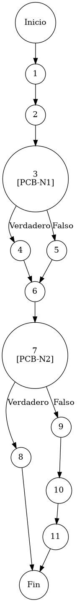

# TEST PRUEBAS DE CAJA BLANCA

| **DATOS DEL ESTUDIANTE** | |
| :--- | :--- |
| **NOMBRE:** | Gabriel Amílcar Cruz Canto |
| **EMPRESA:** | WALOOK MEXICO, S.A. de C.V. |
| **TITULO DEL PROYECTO:** | Sistema ERP en la nube para gestión de ópticas OMCGC |
| **URL y Claves de acceso:** | [Configurar en ambiente de entrega] |

<br>

| **PLAN DE PRUEBAS DE CAJA BLANCA: BACKEND (MIG-MASTER)** | | | | |
| :--- | :--- | :--- | :--- | :--- |
| **Número** | **Nombre de la Prueba Backend** | **Descripción** | **Fecha** | **Herramienta / Responsable** |
| PCB-001 | Autenticación de usuario | Protocolo de Acceso y Validación de Infraestructura | 09/03/2026 | Gabriel Amílcar Cruz Canto |
| PCB-002 | Manejo de Credenciales Inválidas | Interrupción de Seguridad por Fallo de Contraseña | 09/03/2026 | Gabriel Amílcar Cruz Canto |
| PCB-003 | Registro de Producto | Validación de Integridad de Campos Obligatorios | 10/03/2026 | Gabriel Amílcar Cruz Canto |
| PCB-004 | SKU Autogenerado | Garantía de Unicidad de Identificación Comercial | 10/03/2026 | Gabriel Amílcar Cruz Canto |
| PCB-005 | Rango de Fechas (Ventas) | Filtrado de Reporte Operativo de Transacciones | 11/03/2026 | Gabriel Amílcar Cruz Canto |
| PCB-006 | Filtro de Sucursal | Segregación de Información por Punto de Venta | 11/03/2026 | Gabriel Amílcar Cruz Canto |
| PCB-007 | Kardex de Stock | Protocolo de Integridad Transaccional sobre Saldo | 12/03/2026 | Gabriel Amílcar Cruz Canto |
| PCB-008 | Integridad Fiscal | Validación de Identidad Tributaria y Unicidad RFC | 12/03/2026 | Gabriel Amílcar Cruz Canto |
| PCB-009 | Búsqueda de Clientes | Motor de Búsqueda Multi-Criterio sobre Pacientes | 13/03/2026 | Gabriel Amílcar Cruz Canto |
| PCB-010 | Saneamiento de Pacientes | Protocolo de Normalización de Atributos de Persona | 14/03/2026 | Gabriel Amílcar Cruz Canto |
| PCB-011 | Registro de Proveedor | Auditoría Estructural de Validación Forense | 18/03/2026 | JaCoCo / JUnit 5 |
| PCB-012 | Actualización de Proveedor | Validación de Excepción por RFC Duplicado | 18/03/2026 | JaCoCo / JUnit 5 |
| PCB-013 | Registro de Usuario | Validación de Excepción por Correo Duplicado | 18/03/2026 | JaCoCo / JUnit 5 |
| PCB-014 | Baja de Usuario | Validación de Desactivación Lógica (inactivo) | 18/03/2026 | JaCoCo / JUnit 5 |
| PCB-015 | Reset de Contraseña | Manejo de Excepción por Usuario Inexistente | 18/03/2026 | JaCoCo / JUnit 5 |
| PCB-016 | Autenticación Root | Validación de Bypass Administrativo (Local) | 18/03/2026 | JaCoCo / JUnit 5 |
| PCB-017 | Registro de Movimiento | Validación de Stock Insuficiente (Venta) | 18/03/2026 | JaCoCo / JUnit 5 |
| PCB-018 | Cálculo de PVP | Validación de Fórmula Financiera (Utilidad) | 18/03/2026 | JaCoCo / JUnit 5 |
| PCB-019 | Robustez de Auditoría | Normalización de IP Nula (Default 0.0.0.0) | 18/03/2026 | JaCoCo / JUnit 5 |
| PCB-020 | Carga de Diccionario | Validación de Descifrado AES-256 (Binario) | 18/03/2026 | JaCoCo / JUnit 5 |

---

# FASE DE PRUEBAS

| **Nombre del Módulo del Sistema + Historia de usuario** |
| :--- |
| Módulo Inventarios / Control de Existencias – HU-M01-05 |

| **Número y nombre de la Prueba** |
| :--- |
| PCB-007 / Kardex de Stock – InventarioService.registrarMovimiento() |

### Paso 0

```java
    /**
     * ESPECIFICACIÓN TÉCNICA: Protocolo de Integridad Transaccional sobre Saldo Operativo.
     * OBJETIVO OPERATIVO: Garantizar la invariante de no-negatividad en el Kardex.
     * IMPACTO: Mitigar riesgos de inconsistencia física y financiera en almacenes.
     */
    @Transactional
    public void registrarMovimiento(MovimientoInventario m, String ip) { // [N1: INICIO]
        Integer stockAnterior = inventarioRepository.getCurrentStock(m.getIdProducto(), m.getIdSucursal()); // [N2: PROCESO]
        m.setExistenciaAnterior(stockAnterior);

        // [PCB-N1] determinación de sentido del flujo (Entrada vs Salida)
        // [N3: PREDICADO] [PCB-N1] -> [SI: N4] [NO: N5] : ¿Es una salida de almacén?
        int factor = esSalida(m.getTipoMovimiento()) ? -1 : 1; // [N4] / [N5] : Aplicación del multiplicador
        Integer nuevoStock = stockAnterior + (m.getCantidad() * factor); // [N6: PROCESO]

        // [PCB-N2] validación de invariante de stock (Check de negatividad)
        if (nuevoStock < 0) { // [N7] [PCB-N2] -> [SI: N8] [NO: N9] : ¿El resultado es saldo negativo?
            throw new RuntimeException("Stock insuficiente"); // [N8: FIN (EXC)]
        }

        m.setExistenciaActual(nuevoStock); // [N9: PROCESO]
        inventarioRepository.saveMovimiento(m); // [N10: PROCESO] -> Persistencia de afectación
    } // [N11: FIN]
```

### Descripción breve del fragmento

El fragmento **PCB-007** implementa la lógica transaccional de control de existencias. Su función crítica es proteger la integridad del Kardex mediante la validación de la "Invariante de No-Negatividad", impidiendo que las operaciones de salida generen desbalances físicos. Con una complejidad $V(G)=3$, el código asegura la coherencia operativa y la trazabilidad de cada movimiento en el Ecosistema de Almacenes.

### Identificación de Nodos

| ID del Nodo | Tipo | Descripción |
| :--- | :--- | :--- |
| **Nodo 1** | Inicio | Inicio de la función transaccional `registrarMovimiento(MovimientoInventario m, String ip)` y recepción de parámetros operativos. |
| **Nodo 2** | Nodo de proceso | Ejecución de `inventarioRepository.getCurrentStock()`. Recuperación del saldo histórico desde el repositorio. |
| **Nodo 3 [PCB-N1]** | Nodo predicado | Evaluación de la condición `esSalida(m.getTipoMovimiento())`. Determinación del sentido del flujo contable (Entrada/Salida). Identificado con la etiqueta **PCB-N1**. |
| **Nodo 4** | Nodo de proceso | Aplicación de factor de des-acumulación (-1) para operaciones de egreso o retiro de material. |
| **Nodo 5** | Nodo de proceso | Aplicación de factor de acumulación (+1) para operaciones de ingreso o recepción de material. |
| **Nodo 6** | Nodo de proceso | Ejecución del cálculo aritmético de la nueva existencia proyectada en el Kardex. |
| **Nodo 7 [PCB-N2]** | Nodo predicado | Evaluación de la invariante de no-negatividad (`nuevoStock < 0`). Verificación de solvencia física. Identificado con la etiqueta **PCB-N2**. |
| **Nodo 8** | Nodo de salida | Lanzamiento de `RuntimeException("Stock insuficiente")`. Interrupción del flujo por saldo deudor ilegal. |
| **Nodo 9** | Nodo de proceso | Inyección del nuevo saldo operativo calculado en el objeto de movimiento de inventario. |
| **Nodo 10** | Nodo de proceso | Ejecución de `inventarioRepository.saveMovimiento(m)`. Persistencia atómica de la transacción de Kardex. |
| **Nodo 11** | Fin | Finalización exitosa del protocolo de integridad transaccional sobre el saldo operativo de almacén. |

### Paso 1



### Paso 2

**V(G) = Número de regiones** = (2 internas + 1 externa) = **3**
**V(G) = Aristas – Nodos + 2** = V(G) = 14 – 13 + 2 = **3**
**V(G) = Nodos Predicado + 1** = V(G) = 2 + 1 = **3**

### Paso 3

| Total de caminos | Ruta de cada camino |
| :--- | :--- |
| **Camino 1** | Inicio → 1 → 2 → 3(NO) → 5 → 6 → 7(NO) → 9 → 10 → 11 → Fin |
| **Camino 2** | Inicio → 1 → 2 → 3(SÍ) → 4 → 6 → 7(NO) → 9 → 10 → 11 → Fin |
| **Camino 3** | Inicio → 1 → 2 → 3(SÍ) → 4 → 6 → 7(SÍ) → 8 → Fin |

### Paso 4

| Número del camino | Caso de Prueba (IN) | Resultado esperado (OUT) |
| :--- | :--- | :--- |
| **Camino 1** | m.tipo = "ENTRADA", stockAnterior = 50, m.cantidad = 10 | nuevoStock = 60 (PCB-N1: NO, PCB-N2: NO) |
| **Camino 2** | m.tipo = "SALIDA", stockAnterior = 50, m.cantidad = 10 | nuevoStock = 40 (PCB-N1: SI, PCB-N2: NO) |
| **Camino 3** | m.tipo = "SALIDA", stockAnterior = 5, m.cantidad = 10 | RuntimeException: Stock insuficiente (PCB-N1: SI, PCB-N2: SI) |
