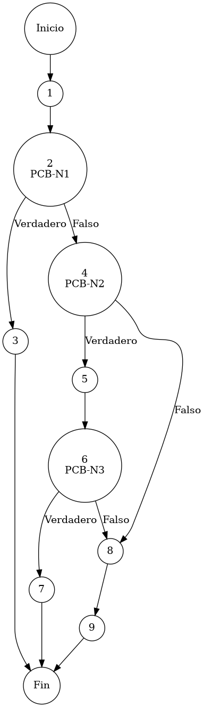

# Reporte de Auditoría de Caja Blanca: PCB-008

## A. Identificación del Fragmento
- **ID**: PCB-008
- **Módulo**: Clientes
- **Fragmento**: Validación de integridad fiscal y registro de cliente
- **HU**: HU-M06-01
- **Función**: `ClienteService.guardarCliente()`
- **Alcance**: Análisis de las validaciones de identidad obligatoria y unicidad tributaria (RFC) bajo el estándar de "Duda Cero".

## B. Tabla de Nodos
| Nodo | Descripción | Tipo |
| :--- | :--- | :--- |
| 1 | Inicio de la función `guardarCliente()` | Inicio |
| 2 | Validación de nombre: `if (cliente.getNombre() == null || ...)` [PCB-N1] | Predicado |
| 3 | Interrupción por nombre ausente: `throw new IllegalArgumentException(...)` | Final (Excepción 1) |
| 4 | Verificación de presencia de RFC: `if (cliente.getRfc() != null && ...)` [PCB-N2] | Predicado |
| 5 | Consulta de redundancia fiscal: `pacienteRepository.findByRfc(...)` | Proceso |
| 6 | Verificación de colisión: `if (existente != null && ...)` [PCB-N3] | Predicado |
| 7 | Interrupción por duplicidad fiscal: `throw new IllegalArgumentException(...)` | Final (Excepción 2) |
| 8 | Confirmación y persistencia: `pacienteRepository.save(cliente)` | Proceso |
| 9 | Finalización exitosa del registro | Fin |

## C. Tabla de Aristas
| Origen | Destino | Condición / Etiqueta |
| :--- | :--- | :--- |
| 1 | 2 | Flujo secuencial |
| 2 | 3 | PCB-N1 es Verdadero (El campo Nombre está vacío o es nulo) |
| 2 | 4 | PCB-N1 es Falso (La identidad mínima del cliente está presente) |
| 4 | 5 | PCB-N2 es Verdadero (El cliente proporcionó un RFC para validar) |
| 4 | 8 | PCB-N2 es Falso (Se omite la validación fiscal por RFC ausente) |
| 5 | 6 | Flujo secuencial |
| 6 | 7 | PCB-N3 es Verdadero (El RFC ya pertenece a otro registro en el sistema) |
| 6 | 8 | PCB-N3 es Falso (El RFC es único o pertenece al mismo cliente) |
| 8 | 9 | Flujo secuencial |

## D. Complejidad Ciclomática
$V(G) = P + 1$
donde $P = 3$ (Nodos predicado: PCB-N1, PCB-N2, PCB-N3)
$V(G) = 3 + 1 = 4$

**Interpretación**: El análisis de McCabe determina que se requieren 4 caminos independientes para cubrir todas las reglas de negocio vinculadas a la integridad del padrón de clientes.

## E. Caminos Independientes
1. **Camino 1 (Falla por Identidad Incompleta)**: 1 → 2(Verdadero) → 3
2. **Camino 2 (Registro Simplificado sin RFC)**: 1 → 2(Falso) → 4(Falso) → 8 → 9
3. **Camino 3 (Rechazo por Duplicidad Fiscal)**: 1 → 2(Falso) → 4(Verdadero) → 5 → 6(Verdadero) → 7
4. **Camino 4 (Registro Integral con RFC Válido)**: 1 → 2(Falso) → 4(Verdadero) → 5 → 6(Falso) → 8 → 9

## F. Casos de Prueba (Basis Path Testing)
| Caso | entrada: Nombre | entrada: RFC | entrada: Redundancia | Resultado Esperado |
| :--- | :--- | :--- | :--- | :--- |
| CP1 | Nulo | "RFC123" | N/A | Excepción: El nombre es obligatorio |
| CP2 | "Juan Pérez" | "" (Vacío) | N/A | Éxito: Registro persistido sin RFC |
| CP3 | "Ana López" | "ALOP8001" | Existe (ID distinto) | Excepción: El RFC ya está registrado |
| CP4 | "Ana López" | "ALOP8001" | No Existe | Éxito: Registro fiscal integral |

## G. Seudocódigo Estructural del Fragmento

### Fragmento A: Código Puro (Estructura Original)
**Archivo**: `ClienteService.java`
**Función**: `guardarCliente(Paciente cliente)`
**Descripción**: Implementa la validación de integridad fiscal y unicidad tributaria. Asegura que la base de datos de pacientes/clientes sea íntegra y esté lista para procesos de facturación electrónica. Incluye comentarios originales de desarrollo.

```java
    public Paciente guardarCliente(Paciente cliente) {
        
        // validación de obligatoriedad de identidad (Nombre)
        if (cliente.getNombre() == null || cliente.getNombre().trim().isEmpty()) {
            throw new IllegalArgumentException("El nombre es obligatorio");
        }

        // evaluación de presencia de RFC (Check de campo opcional)
        if (cliente.getRfc() != null && !cliente.getRfc().isEmpty()) {
            Paciente existente = pacienteRepository.findByRfc(cliente.getRfc());
            
            // validación de colisión de RFC (Unicidad)
            if (existente != null && !existente.getIdPaciente().equals(cliente.getIdPaciente())) {
                throw new IllegalArgumentException("El RFC ya está registrado con otro cliente.");
            }
        }
        
        pacienteRepository.save(cliente);
        return cliente;
    }
```

### Fragmento B: Código Anotado (Mapeo de Nodos)
**Descripción**: Este fragmento incluye los marcadores de control (`PCB-Nx`) para identificar la posición exacta de cada nodo y arista del Grafo de Control de Flujo (CFG).

```java
    public Paciente guardarCliente(Paciente cliente) { // NODO 1
        
        // PCB-N1: validación de obligatoriedad de identidad (Nombre)
        if (cliente.getNombre() == null || cliente.getNombre().trim().isEmpty()) { // NODO 2 [PREDICADO]
            throw new IllegalArgumentException("El nombre es obligatorio"); // NODO 3 [FIN]
        }

        // PCB-N2: evaluación de presencia de RFC (Check de campo opcional)
        if (cliente.getRfc() != null && !cliente.getRfc().isEmpty()) { // NODO 4 [PREDICADO]
            Paciente existente = pacienteRepository.findByRfc(cliente.getRfc()); // NODO 5
            
            // PCB-N3: validación de colisión de RFC (Unicidad)
            if (existente != null && !existente.getIdPaciente().equals(cliente.getIdPaciente())) { // NODO 6 [PREDICADO]
                throw new IllegalArgumentException("El RFC ya está registrado con otro cliente."); // NODO 7 [FIN]
            }
        }
        
        pacienteRepository.save(cliente); // NODO 8
        return cliente; // NODO 9 [FIN]
    }
```

## H. Grafo de Control de Flujo (PlantUML)


## I. Matriz de Trazabilidad
| Requisito (HU) | Nodo de Decisión | Camino Independiente | Caso de Prueba |
| :--- | :--- | :--- | :--- |
| **HU-M06-01** | PCB-N1 | Caminos 1, 2, 3, 4 | CP1, CP2, CP3, CP4 |
| **HU-M06-01** | PCB-N2 | Caminos 2, 3, 4 | CP2, CP3, CP4 |
| **HU-M06-01** | PCB-N3 | Caminos 3, 4 | CP3, CP4 |

## J. Resumen Académico
El fragmento **PCB-008** implementa la validación de "Unicidad Tributaria", esencial para los procesos de facturación del ERP. La auditoría de caja blanca confirma que el código previene la redundancia de identidades mediante un doble chequeo de existencia fiscal (PCB-N3), permitiendo la coexistencia de registros opcionales. Con una complejidad ciclomática $V(G)=4$, la estructura garantiza un padrón de clientes limpio y predecible, facilitando la transparencia administrativa requerida para el Proyecto Terminal.
