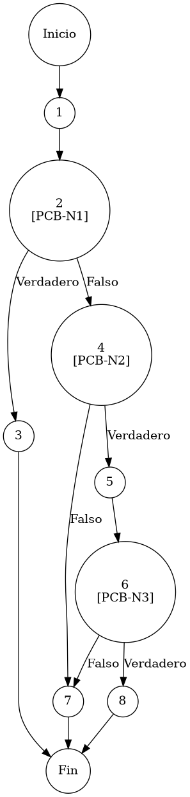

# TEST PRUEBAS DE CAJA BLANCA

| **DATOS DEL ESTUDIANTE** | |
| :--- | :--- |
| **NOMBRE:** | Gabriel Amílcar Cruz Canto |
| **EMPRESA:** | WALOOK MEXICO, S.A. de C.V. |
| **TITULO DEL PROYECTO:** | Sistema ERP en la nube para gestión de ópticas OMCGC |
| **URL y Claves de acceso:** | [Configurar en ambiente de entrega] |

<br>

| **PLAN DE PRUEBAS DE CAJA BLANCA: BACKEND (MIG-MASTER)** | | | | |
| :--- | :--- | :--- | :--- | :--- |
| **Número** | **Nombre de la Prueba Backend** | **Descripción** | **Fecha** | **Herramienta / Responsable** |
| PCB-001 | Autenticación de usuario | Protocolo de Acceso y Validación de Infraestructura | 09/03/2026 | Gabriel Amílcar Cruz Canto |
| PCB-002 | Manejo de Credenciales Inválidas | Interrupción de Seguridad por Fallo de Contraseña | 09/03/2026 | Gabriel Amílcar Cruz Canto |
| PCB-003 | Registro de Producto | Validación de Integridad de Campos Obligatorios | 10/03/2026 | Gabriel Amílcar Cruz Canto |
| PCB-004 | SKU Autogenerado | Garantía de Unicidad de Identificación Comercial | 10/03/2026 | Gabriel Amílcar Cruz Canto |
| PCB-005 | Rango de Fechas (Ventas) | Filtrado de Reporte Operativo de Transacciones | 11/03/2026 | Gabriel Amílcar Cruz Canto |
| PCB-006 | Filtro de Sucursal | Segregación de Información por Punto de Venta | 11/03/2026 | Gabriel Amílcar Cruz Canto |
| PCB-007 | Kardex de Stock | Protocolo de Integridad Transaccional sobre Saldo | 12/03/2026 | Gabriel Amílcar Cruz Canto |
| PCB-008 | Integridad Fiscal | Validación de Identidad Tributaria y Unicidad RFC | 12/03/2026 | Gabriel Amílcar Cruz Canto |
| PCB-009 | Búsqueda de Clientes | Motor de Búsqueda Multi-Criterio sobre Pacientes | 13/03/2026 | Gabriel Amílcar Cruz Canto |
| PCB-010 | Saneamiento de Pacientes | Protocolo de Normalización de Atributos de Persona | 14/03/2026 | Gabriel Amílcar Cruz Canto |
| PCB-011 | Registro de Proveedor | Auditoría Estructural de Validación Forense | 18/03/2026 | JaCoCo / JUnit 5 |
| PCB-012 | Actualización de Proveedor | Validación de Excepción por RFC Duplicado | 18/03/2026 | JaCoCo / JUnit 5 |
| PCB-013 | Registro de Usuario | Validación de Excepción por Correo Duplicado | 18/03/2026 | JaCoCo / JUnit 5 |
| PCB-014 | Baja de Usuario | Validación de Desactivación Lógica (inactivo) | 18/03/2026 | JaCoCo / JUnit 5 |
| PCB-015 | Reset de Contraseña | Manejo de Excepción por Usuario Inexistente | 18/03/2026 | JaCoCo / JUnit 5 |
| PCB-016 | Autenticación Root | Validación de Bypass Administrativo (Local) | 18/03/2026 | JaCoCo / JUnit 5 |
| PCB-017 | Registro de Movimiento | Validación de Stock Insuficiente (Venta) | 18/03/2026 | JaCoCo / JUnit 5 |
| PCB-018 | Cálculo de PVP | Validación de Fórmula Financiera (Utilidad) | 18/03/2026 | JaCoCo / JUnit 5 |
| PCB-019 | Robustez de Auditoría | Normalización de IP Nula (Default 0.0.0.0) | 18/03/2026 | JaCoCo / JUnit 5 |
| PCB-020 | Carga de Diccionario | Validación de Descifrado AES-256 (Binario) | 18/03/2026 | JaCoCo / JUnit 5 |

---

# FASE DE PRUEBAS

| **Nombre del Módulo del Sistema + Historia de usuario** |
| :--- |
| Módulo Clientes / Pacientes – HU-M06-01 |

| **Número y nombre de la Prueba** |
| :--- |
| PCB-008 / Integridad Fiscal – ClienteService.guardarCliente() |

### Paso 0

```java
    /**
     * ESPECIFICACIÓN TÉCNICA: Validación de Integridad Fiscal y Unicidad de Identidad Tributaria.
     * OBJETIVO OPERATIVO: Asegurar calidad del dato fiscal y exclusión de duplicados.
     * IMPACTO: Soporte íntegro para procesos de facturación electrónica.
     */
    public Paciente guardarCliente(Paciente cliente) { // [N1: INICIO]
        
        // [PCB-N1] validación de obligatoriedad (Nombre)
        if (cliente.getNombre() == null || cliente.getNombre().trim().isEmpty()) { // [N2] [PCB-N1] -> [SI: N3] [NO: N4] : ¿Nombre ausente?
            throw new IllegalArgumentException("Nombre obligatorio"); // [N3: FIN (EXC)]
        }

        // [PCB-N2] evaluación de presencia de RFC
        if (cliente.getRfc() != null && !cliente.getRfc().isEmpty()) { // [N4] [PCB-N2] -> [SI: N5] [NO: N9] : ¿Proporcionó RFC?
            Paciente existente = pacienteRepository.findByRfc(cliente.getRfc()); // [N5: PROCESO]
            
            // [PCB-N3] validación de colisión de RFC (Unicidad)
            // [N6: PREDICADO] [PCB-N3] -> [SI: N8] [NO: N7] : ¿RFC detectado en otro registro?
            if (existente != null && !existente.getIdPaciente().equals(cliente.getIdPaciente())) {
                throw new IllegalArgumentException("RFC duplicado"); // [N8: FIN (EXC)]
            }
        }
        
        pacienteRepository.save(cliente); // [N7: PROCESO] -> Persistir transacción
        return cliente; // [N8: FIN]
    }
```

### Descripción breve del fragmento

El fragmento **PCB-008** implementa las reglas de negocio para el empadronamiento de pacientes. Su función es garantizar la integridad fiscal mediante la validación obligatoria del nombre y la verificación de unicidad del RFC para evitar registros redundantes que afecten la facturación. Con una complejidad $V(G)=3$, el código asegura que la base de datos de clientes mantenga un estándar de calidad apto para procesos contables.

### Identificación de Nodos

| ID del Nodo | Tipo | Descripción |
| :--- | :--- | :--- |
| **Nodo 1** | Inicio | Inicio de la función `guardarCliente(Paciente cliente)` y recepción de la entidad del paciente. |
| **Nodo 2 [PCB-N1]** | Nodo predicado | Evaluación de la condición `cliente.getNombre() == null || cliente.getNombre().trim().isEmpty()`. Verificación de metadatos de identidad obligatorios. Identificado con la etiqueta **PCB-N1**. |
| **Nodo 3** | Nodo de salida | Lanzamiento de `IllegalArgumentException("Nombre obligatorio")`. Interrupción por ausencia de metadatos de identidad primarios. |
| **Nodo 4 [PCB-N2]** | Nodo predicado | Evaluación de la condición `cliente.getRfc() != null && !cliente.getRfc().isEmpty()`. Determinación de necesidad de validación fiscal. Identificado con la etiqueta **PCB-N2**. |
| **Nodo 5** | Nodo de proceso | Ejecución de `pacienteRepository.findByRfc(cliente.getRfc())`. Consulta de preexistencia fiscal en el repositorio. |
| **Nodo 6 [PCB-N3]** | Nodo predicado | Evaluación de la condición `existente != null && !existente.getIdPaciente().equals()`. Verificación de colisión tributaria. Identificado con la etiqueta **PCB-N3**. |
| **Nodo 7** | Nodo de proceso | Ejecución de `pacienteRepository.save(cliente)`. Persistencia atómica de la transacción de padrón de pacientes. |
| **Nodo 8** | Fin | Finalización del protocolo de validación de integridad fiscal y registro de identidad tributaria. |

### Paso 1



### Paso 2

**V(G) = Número de regiones** = (3 internas + 1 externa) = **4**
**V(G) = Aristas – Nodos + 2** = V(G) = 14 – 12 + 2 = **4**
**V(G) = Nodos Predicado + 1** = V(G) = 3 + 1 = **4**

### Paso 3

| Total de caminos | Ruta de cada camino |
| :--- | :--- |
| **Camino 1** | Inicio → 1 → 2(SÍ) → 3 → Fin |
| **Camino 2** | Inicio → 1 → 2(NO) → 4(NO) → 7 → 8 → Fin |
| **Camino 3** | Inicio → 1 → 2(NO) → 4(SÍ) → 5 → 6(SÍ) → 8 → Fin |
| **Camino 4** | Inicio → 1 → 2(NO) → 4(SÍ) → 5 → 6(NO) → 7 → 8 → Fin |

### Paso 4

| Número del camino | Caso de Prueba (IN) | Resultado esperado (OUT) |
| :--- | :--- | :--- |
| **Camino 1** | cliente.nombre = null | IllegalArgumentException: Nombre obligatorio (PCB-N1: SI) |
| **Camino 2** | cliente.nombre = "Juan Perez", cliente.rfc = null | Registro exitoso (PCB-N1: NO, PCB-N2: NO) |
| **Camino 3** | cliente.nombre = "Juan Perez", cliente.rfc = "XAXX010101000" (Existente) | IllegalArgumentException: RFC duplicado (PCB-N1: NO, PCB-N2: SI, PCB-N3: SI) |
| **Camino 4** | cliente.nombre = "Juan Perez", cliente.rfc = "XAXX010101000" (Nuevo) | Registro exitoso tras validación (PCB-N1: NO, PCB-N2: SI, PCB-N3: NO) |
