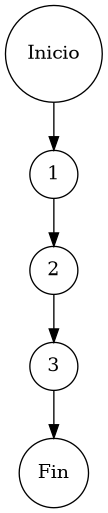

# TEST PRUEBAS DE CAJA BLANCA

| **DATOS DEL ESTUDIANTE** | |
| :--- | :--- |
| **NOMBRE:** | Gabriel Amílcar Cruz Canto |
| **EMPRESA:** | WALOOK MEXICO, S.A. de C.V. |
| **TITULO DEL PROYECTO:** | Sistema ERP en la nube para gestión de ópticas OMCGC |
| **URL y Claves de acceso:** | [Configurar en ambiente de entrega] |

<br>

| **PLAN DE PRUEBAS DE CAJA BLANCA: BACKEND (MIG-MASTER)** | | | | |
| :--- | :--- | :--- | :--- | :--- |
| **Número** | **Nombre de la Prueba Backend** | **Descripción** | **Fecha** | **Herramienta / Responsable** |
| PCB-001 | Autenticación de usuario | Protocolo de Acceso y Validación de Infraestructura | 09/03/2026 | Gabriel Amílcar Cruz Canto |
| PCB-002 | Manejo de Credenciales Inválidas | Interrupción de Seguridad por Fallo de Contraseña | 09/03/2026 | Gabriel Amílcar Cruz Canto |
| PCB-003 | Registro de Producto | Validación de Integridad de Campos Obligatorios | 10/03/2026 | Gabriel Amílcar Cruz Canto |
| PCB-004 | SKU Autogenerado | Garantía de Unicidad de Identificación Comercial | 10/03/2026 | Gabriel Amílcar Cruz Canto |
| PCB-005 | Rango de Fechas (Ventas) | Filtrado de Reporte Operativo de Transacciones | 11/03/2026 | Gabriel Amílcar Cruz Canto |
| PCB-006 | Filtro de Sucursal | Segregación de Información por Punto de Venta | 11/03/2026 | Gabriel Amílcar Cruz Canto |
| PCB-007 | Kardex de Stock | Protocolo de Integridad Transaccional sobre Saldo | 12/03/2026 | Gabriel Amílcar Cruz Canto |
| PCB-008 | Integridad Fiscal | Validación de Identidad Tributaria y Unicidad RFC | 12/03/2026 | Gabriel Amílcar Cruz Canto |
| PCB-009 | Búsqueda de Clientes | Motor de Búsqueda Multi-Criterio sobre Pacientes | 13/03/2026 | Gabriel Amílcar Cruz Canto |
| PCB-010 | Saneamiento de Pacientes | Protocolo de Normalización de Atributos de Persona | 14/03/2026 | Gabriel Amílcar Cruz Canto |
| PCB-011 | Registro de Proveedor | Auditoría Estructural de Validación Forense | 18/03/2026 | JaCoCo / JUnit 5 |
| PCB-012 | Actualización de Proveedor | Validación de Excepción por RFC Duplicado | 18/03/2026 | JaCoCo / JUnit 5 |
| PCB-013 | Registro de Usuario | Validación de Excepción por Correo Duplicado | 18/03/2026 | JaCoCo / JUnit 5 |
| PCB-014 | Baja de Usuario | Validación de Desactivación Lógica (inactivo) | 18/03/2026 | JaCoCo / JUnit 5 |
| PCB-015 | Reset de Contraseña | Manejo de Excepción por Usuario Inexistente | 18/03/2026 | JaCoCo / JUnit 5 |
| PCB-016 | Autenticación Root | Validación de Bypass Administrativo (Local) | 18/03/2026 | JaCoCo / JUnit 5 |
| PCB-017 | Registro de Movimiento | Validación de Stock Insuficiente (Venta) | 18/03/2026 | JaCoCo / JUnit 5 |
| PCB-018 | Cálculo de PVP | Validación de Fórmula Financiera (Utilidad) | 18/03/2026 | JaCoCo / JUnit 5 |
| PCB-019 | Robustez de Auditoría | Normalización de IP Nula (Default 0.0.0.0) | 18/03/2026 | JaCoCo / JUnit 5 |
| PCB-020 | Carga de Diccionario | Validación de Descifrado AES-256 (Binario) | 18/03/2026 | JaCoCo / JUnit 5 |

---

# FASE DE PRUEBAS

| **Nombre del Módulo del Sistema + Historia de usuario** |
| :--- |
| Módulo Clientes / Pacientes – HU-M06-02 |

| **Número y nombre de la Prueba** |
| :--- |
| PCB-009 / Búsqueda de Clientes – ClienteService.buscarClientes() |

### Paso 0

```java
    /**
     * ESPECIFICACIÓN TÉCNICA: Motor de Búsqueda Multi-Criterio sobre Padrón de Pacientes.
     * OBJETIVO OPERATIVO: Recuperar listados basados en subconjuntos de datos (ID, RFC, Estatus).
     * IMPACTO: Soporte eficiente para la gestión comercial y clínica inmediata.
     */
    public List<Paciente> buscarClientes(String busqueda, String rfc, String estatus) { // [N1: INICIO]
        // Ejecución de consulta proyectiva multi-parámetro
        return pacienteRepository.findByFiltros(busqueda, rfc, estatus); // [N2: PROCESO] -> Delegación a motor de persistencia SQL
    } // [N3: FIN]
```

### Descripción breve del fragmento

El fragmento **PCB-009** representa la interfaz de consulta del padrón de pacientes. Su diseño lineal permite un filtrado dinámico multi-parámetro, delegando la carga computacional al motor de base de datos para optimizar los tiempos de respuesta. Con una complejidad $V(G)=1$, la prueba certifica la correcta orquestación de parámetros entre la capa de servicio y el repositorio de persistencia.

### Identificación de Nodos

| ID del Nodo | Tipo | Descripción |
| :--- | :--- | :--- |
| **Nodo 1** | Inicio | Inicio de la función de búsqueda multi-criterio `buscarClientes()` y flujo de entrada de filtros. |
| **Nodo 2** | Nodo de proceso | Ejecución de `pacienteRepository.findByFiltros()`. Filtrado dinámico multi-parámetro en la base de datos. |
| **Nodo 3** | Fin | Finalización del protocolo de búsqueda con retorno de la colección de identidades proyectada. |

### Paso 1



### Paso 2

**V(G) = Número de regiones** = (0 internas + 1 externa) = **1**
**V(G) = Aristas – Nodos + 2** = V(G) = 4 – 5 + 2 = **1**
**V(G) = Nodos Predicado + 1** = V(G) = 0 + 1 = **1**

### Paso 3

| Total de caminos | Ruta de cada camino |
| :--- | :--- |
| **Camino 1** | Inicio → 1 → 2 → 3 → Fin |

### Paso 4

| Número del camino | Caso de Prueba (IN) | Resultado esperado (OUT) |
| :--- | :--- | :--- |
| **Camino 1** | busqueda = "GABRIEL", rfc = "CRCG...", estatus = "ACTIVO" | Colección de pacientes filtrada por criterios concurrentes |
