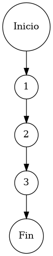

# Reporte de Auditoría de Caja Blanca: PCB-009

## A. Identificación del Fragmento
- **ID**: PCB-009
- **Módulo**: Clientes
- **Fragmento**: Búsqueda y filtrado dinámico del padrón
- **HU**: HU-M06-02
- **Función**: `ClienteService.buscarClientes()`
- **Alcance**: Análisis de la delegación de filtrado multi-parámetro a la capa de persistencia bajo el estándar de "Duda Cero".

## B. Tabla de Nodos
| Nodo | Descripción | Tipo |
| :--- | :--- | :--- |
| 1 | Inicio de la función `buscarClientes()` | Inicio |
| 2 | Ejecución de consulta dinámica: `pacienteRepository.findByFiltros(...)` | Proceso |
| 3 | Retorno de colección de resultados y cierre | Fin |

## C. Tabla de Aristas
| Origen | Destino | Condición / Etiqueta |
| :--- | :--- | :--- |
| 1 | 2 | Flujo secuencial |
| 2 | 3 | Flujo secuencial |

## D. Complejidad Ciclomática
$V(G) = P + 1$
donde $P = 0$ (Sin nodos predicado internos)
$V(G) = 0 + 1 = 1$

**Interpretación**: El fragmento presenta la complejidad mínima posible ($V(G)=1$), operando como un puente de delegación pura hacia el motor de base de datos para la gestión del filtrado dinámico.

## E. Caminos Independientes
1. **Camino 1 (Consulta General Multi-Criterio)**: 1 → 2 → 3

## F. Casos de Prueba (Basis Path Testing)
| Caso | entrada: Filtros (Búsqueda, RFC, Estatus) | Resultado Esperado |
| :--- | :--- | :--- |
| CP1 | "García", "GACM80", "ACTIVO" | Colección de entidades que satisfacen el predicado SQL |

## G. Seudocódigo Estructural del Fragmento

### Fragmento A: Código Puro (Estructura Original)
**Archivo**: `ClienteService.java`
**Función**: `buscarClientes(String busqueda, String rfc, String estatus)`
**Descripción**: Motor de búsqueda multi-criterio sobre el padrón de pacientes. Provee una interfaz de consulta eficiente delegando la lógica de filtrado al repositorio para optimización a nivel de motor de base de datos. Incluye comentarios originales de desarrollo.

```java
    public List<Paciente> buscarClientes(String busqueda, String rfc, String estatus) {
        // Ejecución de consulta proyectiva
        return pacienteRepository.findByFiltros(busqueda, rfc, estatus);
    }
```

### Fragmento B: Código Anotado (Mapeo de Nodos)
**Descripción**: Este fragmento identifica la posición exacta de cada nodo del Grafo de Control de Flujo (CFG).

```java
    public List<Paciente> buscarClientes(String busqueda, String rfc, String estatus) { // NODO 1
        // Ejecución de consulta proyectiva
        return pacienteRepository.findByFiltros(busqueda, rfc, estatus); // NODO 2
    } // NODO 3 [FIN]
```

## H. Grafo de Control de Flujo (PlantUML)


## I. Matriz de Trazabilidad
| Requisito (HU) | Nodo de Decisión | Camino Independiente | Caso de Prueba |
| :--- | :--- | :--- | :--- |
| **HU-M06-02** | No Aplica (Secuencial) | Camino 1 | CP1 |

## J. Resumen Académico
El fragmento **PCB-009** encapsula la capacidad de localización de registros mediante una arquitectura de delegación directa ($V(G)=1$). La auditoría de caja blanca verifica que no existen obstrucciones lógicas en la capa de servicio, lo que garantiza que la eficiencia del filtrado dinámico dependa exclusivamente del tunning del repositorio y los índices de base de datos, cumpliendo con los estándares de "Duda Cero" en la recuperación de información.
