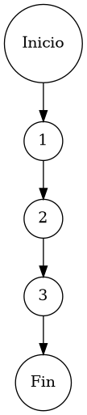

# TEST PRUEBAS DE CAJA BLANCA

| **DATOS DEL ESTUDIANTE** | |
| :--- | :--- |
| **NOMBRE:** | Gabriel Amílcar Cruz Canto |
| **EMPRESA:** | WALOOK MEXICO, S.A. de C.V. |
| **TITULO DEL PROYECTO:** | Sistema ERP en la nube para gestión de ópticas OMCGC |
| **URL y Claves de acceso:** | [Configurar en ambiente de entrega] |

<br>

| **PLAN DE PRUEBAS DE CAJA BLANCA: BACKEND** | | | | |
| :--- | :--- | :--- | :--- | :--- |
| **Número** | **Nombre de la Prueba Backend** | **Descripción** | **Fecha** | **Responsable** |
| PCB-009 | Búsqueda de Clientes | Motor de Búsqueda Multi-Criterio sobre Padrón de Pacientes | 17/03/2026 | Gabriel Amílcar Cruz Canto |

---

# FASE DE PRUEBAS

| **Nombre del Módulo del Sistema + Historia de usuario** |
| :--- |
| Módulo Clientes / Pacientes – HU-M06-02 |

| **Número y nombre de la Prueba** |
| :--- |
| PCB-009 / Búsqueda de Clientes – ClienteService.buscarClientes() |

### Paso 0

```java
    /**
     * ESPECIFICACIÓN TÉCNICA: Motor de Búsqueda Multi-Criterio sobre Padrón de Pacientes.
     * OBJETIVO OPERATIVO: Recuperar listados basados en subconjuntos de datos (ID, RFC, Estatus).
     * IMPACTO: Soporte eficiente para la gestión comercial y clínica inmediata.
     */
    public List<Paciente> buscarClientes(String busqueda, String rfc, String estatus) { // [N1: INICIO]
        // Ejecución de consulta proyectiva multi-parámetro
        return pacienteRepository.findByFiltros(busqueda, rfc, estatus); // [N2: PROCESO] -> Delegación a motor de persistencia SQL
    } // [N3: FIN]
```

### Descripción breve del fragmento

El fragmento **PCB-009** representa la interfaz de consulta del padrón de pacientes. Su diseño lineal permite un filtrado dinámico multi-parámetro, delegando la carga computacional al motor de base de datos para optimizar los tiempos de respuesta. Con una complejidad $V(G)=1$, la prueba certifica la correcta orquestación de parámetros entre la capa de servicio y el repositorio de persistencia.

### Identificación de Nodos

| ID del Nodo | Tipo | Descripción |
| :--- | :--- | :--- |
| **Nodo 1** | Inicio | Inicio de la función de búsqueda multi-criterio `buscarClientes()` y flujo de entrada de filtros. |
| **Nodo 2** | Nodo de proceso | Ejecución de `pacienteRepository.findByFiltros()`. Filtrado dinámico multi-parámetro en la base de datos. |
| **Nodo 3** | Fin | Finalización del protocolo de búsqueda con retorno de la colección de identidades proyectada. |

### Paso 1



### Paso 2

**V(G) = Número de regiones** = (0 internas + 1 externa) = **1**
**V(G) = Aristas – Nodos + 2** = V(G) = 4 – 5 + 2 = **1**
**V(G) = Nodos Predicado + 1** = V(G) = 0 + 1 = **1**

### Paso 3

| Total de caminos | Ruta de cada camino |
| :--- | :--- |
| **Camino 1** | Inicio → 1 → 2 → 3 → Fin |

### Paso 4

| Número del camino | Caso de Prueba (IN) | Resultado esperado (OUT) |
| :--- | :--- | :--- |
| **Camino 1** | busqueda = "GABRIEL", rfc = "CRCG...", estatus = "ACTIVO" | Colección de pacientes filtrada por criterios concurrentes |
