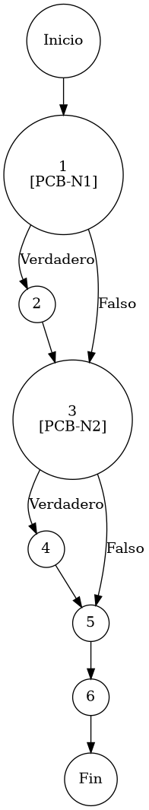

# TEST PRUEBAS DE CAJA BLANCA

| **DATOS DEL ESTUDIANTE** | |
| :--- | :--- |
| **NOMBRE:** | Gabriel Amílcar Cruz Canto |
| **EMPRESA:** | WALOOK MEXICO, S.A. de C.V. |
| **TITULO DEL PROYECTO:** | Sistema ERP en la nube para gestión de ópticas OMCGC |
| **URL y Claves de acceso:** | [Configurar en ambiente de entrega] |

<br>

| **PLAN DE PRUEBAS DE CAJA BLANCA: BACKEND** | | | | |
| :--- | :--- | :--- | :--- | :--- |
| **Número** | **Nombre de la Prueba Backend** | **Descripción** | **Fecha** | **Responsable** |
| PCB-010 | Saneamiento de Pacientes | Protocolo de Normalización de Atributos de Persona | 17/03/2026 | Gabriel Amílcar Cruz Canto |

---

# FASE DE PRUEBAS

| **Nombre del Módulo del Sistema + Historia de usuario** |
| :--- |
| Módulo Clientes / Pacientes – HU-M06-01 |

| **Número y nombre de la Prueba** |
| :--- |
| PCB-010 / Saneamiento de Pacientes – ClienteService.guardarCliente() |

### Paso 0

```java
    /**
     * ESPECIFICACIÓN TÉCNICA: Protocolo de Normalización de Atributos de Persona en Padrón.
     * OBJETIVO OPERATIVO: Asegurar apellidos y estatus con valores por defecto coherentes.
     * IMPACTO: Eliminar nulos descriptivos y fallos de renderizado en UI.
     */
     
    // [PCB-N1] evaluación de consistencia (Check de Apellidos)
    if (cliente.getApellidos() == null) { // [N1] [PCB-N1] -> [SI: N2] [NO: N3] : ¿Apellidos nulos?
        cliente.setApellidos(""); // [N2: PROCESO] -> Normalizar a cadena vacía
    }

    // [PCB-N2] evaluación de estado operativo (Auto-activación)
    if (cliente.getEstatus() == null) { // [N3] [PCB-N2] -> [SI: N4] [NO: N5] : ¿Estatus sin definir?
        cliente.setEstatus("ACTIVO"); // [N4: PROCESO] -> Forzar estado operativo
    }

    pacienteRepository.save(cliente); // [N5: PROCESO] -> Persistencia de registro saneado
    return cliente; // [N6: FIN]
```

### Descripción breve del fragmento

El fragmento **PCB-010** implementa la fase de saneamiento de datos post-validación. Su función es garantizar que los atributos opcionales (apellidos) y de estado (estatus) posean valores por defecto coherentes para evitar errores de renderizado en la interfaz de usuario. Con una complejidad $V(G)=3$, el código asegura la uniformidad operativa de todo registro nuevo o actualizado en el padrón.

### Identificación de Nodos

| ID del Nodo | Tipo | Descripción |
| :--- | :--- | :--- |
| **Nodo 1 [PCB-N1]** | Nodo predicado | Evaluación de la condición `cliente.getApellidos() == null`. Saneamiento de metadatos de identidad opcionales. Identificado con la etiqueta **PCB-N1**. |
| **Nodo 2** | Nodo de proceso | Ejecución de normalización de atributos opcionales. Asignación de cadena vacía segura para evitar fallos de nulidad. |
| **Nodo 3 [PCB-N2]** | Nodo predicado | Evaluación de la condición `cliente.getEstatus() == null`. Verificación de definición operativa inicial. Identificado con la etiqueta **PCB-N2**. |
| **Nodo 4** | Nodo de proceso | Ejecución de activación forzosa mediante la asignación del estatus "ACTIVO" por defecto sistémico. |
| **Nodo 5** | Nodo de proceso | Ejecución de `pacienteRepository.save(cliente)`. Persistencia atómica de la entidad en el padrón saneado. |
| **Nodo 6** | Fin | Finalización del protocolo de normalización de atributos y aseguramiento de visibilidad íntegra en UI. |

### Paso 1



### Paso 2

**V(G) = Número de regiones** = (2 internas + 1 externa) = **3**
**V(G) = Aristas – Nodos + 2** = V(G) = 9 – 8 + 2 = **3**
**V(G) = Nodos Predicado + 1** = V(G) = 2 + 1 = **3**

### Paso 3

| Total de caminos | Ruta de cada camino |
| :--- | :--- |
| **Camino 1** | Inicio → 1(NO) → 3(NO) → 5 → 6 → Fin |
| **Camino 2** | Inicio → 1(SÍ) → 2 → 3(NO) → 5 → 6 → Fin |
| **Camino 3** | Inicio → 1(SÍ) → 2 → 3(SÍ) → 4 → 5 → 6 → Fin |

### Paso 4

| Número del camino | Caso de Prueba (IN) | Resultado esperado (OUT) |
| :--- | :--- | :--- |
| **Camino 1** | cliente.apellidos = "Cruz", cliente.estatus = "INACTIVO" | Conserva integridad original (PCB-N1: NO, PCB-N2: NO) |
| **Camino 2** | cliente.apellidos = null, cliente.estatus = "ACTIVO" | cliente.apellidos = "" (PCB-N1: SI, PCB-N2: NO) |
| **Camino 3** | cliente.apellidos = null, cliente.estatus = null | apellidos = "", estatus = "ACTIVO" (PCB-N1: SI, PCB-N2: SI) |
