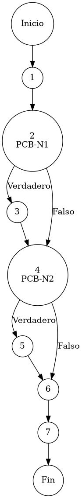

# Reporte de Auditoría de Caja Blanca: PCB-010

## A. Identificación del Fragmento
- **ID**: PCB-010
- **Módulo**: Clientes
- **Fragmento**: Normalización de atributos descriptivos y de estado
- **HU**: HU-M06-01
- **Función**: `ClienteService.guardarCliente()` (Bloque de Saneamiento)
- **Alcance**: Análisis de la lógica de normalización de campos opcionales y asignación de estatus por defecto bajo el estándar de "Duda Cero".

## B. Tabla de Nodos
| Nodo | Descripción | Tipo |
| :--- | :--- | :--- |
| 1 | Entrada al bloque de saneamiento post-validación | Inicio |
| 2 | Evaluación de consistencia: `if (cliente.getApellidos() == null)` [PCB-N1] | Predicado |
| 3 | Saneamiento de campo descriptivo: `cliente.setApellidos("")` | Proceso |
| 4 | Evaluación de estado operativo: `if (cliente.getEstatus() == null)` [PCB-N2] | Predicado |
| 5 | Auto-activación de entidad: `cliente.setEstatus("ACTIVO")` | Proceso |
| 6 | Persistencia final canalizada: `pacienteRepository.save(cliente)` | Proceso |
| 7 | Finalización del protocolo de saneamiento | Fin |

## C. Tabla de Aristas
| Origen | Destino | Condición / Etiqueta |
| :--- | :--- | :--- |
| 1 | 2 | Flujo secuencial |
| 2 | 3 | PCB-N1 es Verdadero (Se detecta ausencia técnica de apellidos) |
| 2 | 4 | PCB-N1 es Falso (Los apellidos están presentes en el objeto) |
| 3 | 4 | Flujo secuencial |
| 4 | 5 | PCB-N2 es Verdadero (La entidad carece de estatus de activación) |
| 4 | 6 | PCB-N2 es Falso (El estatus ya ha sido asignado previamente) |
| 5 | 6 | Flujo secuencial |
| 6 | 7 | Flujo secuencial |

## D. Complejidad Ciclomática
$V(G) = P + 1$
don de $P = 2$ (Nodos predicado: PCB-N1, PCB-N2)
$V(G) = 2 + 1 = 3$

**Interpretación**: El análisis estructural identifica 3 caminos independientes necesarios para garantizar la integridad semántica del registro de clientes en la base de datos corporativa.

## E. Caminos Independientes
1. **Camino 1 (Registro con Atributos Completos)**: 1 → 2(Falso) → 4(Falso) → 6 → 7
2. **Camino 2 (Saneamiento de Apellidos Ausentes)**: 1 → 2(Verdadero) → 3 → 4(Falso) → 6 → 7
3. **Camino 3 (Inicialización de Estatus Activo)**: 1 → 2(Falso) → 4(Verdadero) → 5 → 6 → 7

## F. Casos de Prueba (Basis Path Testing)
| Caso | entrada: Apellidos | entrada: Estatus | Resultado Esperado |
| :--- | :--- | :--- | :--- |
| CP1 | "Pérez" | "ACTIVO" | Almacena "Pérez" / "ACTIVO" (Sin cambios) |
| CP2 | Nulo | "ACTIVO" | Almacena "" (Vacío) / "ACTIVO" |
| CP3 | "Pérez" | Nulo | Almacena "Pérez" / "ACTIVO" (Auto-activación) |

## G. Seudocódigo Estructural del Fragmento

### Fragmento A: Código Puro (Estructura Original)
**Archivo**: `ClienteService.java`
**Bloque**: Saneamiento / `guardarCliente()`
**Descripción**: Implementa el protocolo de normalización de atributos descriptivos y de estado. Asegura que los registros de clientes posean valores por defecto coherentes, eliminando nulos técnicos que podrían degradar la experiencia de usuario o la integridad de reportes. Incluye comentarios originales de desarrollo.

```java
    // evaluación de consistencia (Check de Apellidos)
    if (cliente.getApellidos() == null) {
        cliente.setApellidos("");
    }

    // evaluación de estado operativo (Auto-activación)
    if (cliente.getEstatus() == null) {
        cliente.setEstatus("ACTIVO");
    }

    pacienteRepository.save(cliente);
    return cliente;
```

### Fragmento B: Código Anotado (Mapeo de Nodos)
**Descripción**: Este fragmento incluye los marcadores de control (`PCB-Nx`) para identificar la posición exacta de cada nodo y arista del Grafo de Control de Flujo (CFG).

```java
    // Inicio del bloque de saneamiento // NODO 1

    // PCB-N1: evaluación de consistencia (Check de Apellidos)
    if (cliente.getApellidos() == null) { // NODO 2 [PREDICADO]
        cliente.setApellidos(""); // NODO 3
    }

    // PCB-N2: evaluación de estado operativo (Auto-activación)
    if (cliente.getEstatus() == null) { // NODO 4 [PREDICADO]
        cliente.setEstatus("ACTIVO"); // NODO 5
    }

    pacienteRepository.save(cliente); // NODO 6
    return cliente; // NODO 7 [FIN]
```

## H. Grafo de Control de Flujo (PlantUML)


## I. Matriz de Trazabilidad
| Requisito (HU) | Nodo de Decisión | Camino Independiente | Caso de Prueba |
| :--- | :--- | :--- | :--- |
| **HU-M06-01** | PCB-N1 | Caminos 1, 3 | CP1, CP3 |
| **HU-M06-01** | PCB-N1 | Camino 2 | CP2 |
| **HU-M06-01** | PCB-N2 | Caminos 1, 2 | CP1, CP2 |
| **HU-M06-01** | PCB-N2 | Camino 3 | CP3 |

## J. Resumen Académico
El fragmento **PCB-010** actúa como una capa robusta de "Higiene de Datos" que garantiza la calidad del padrón de clientes. La auditoría de caja blanca verifica que el diseño preventivo (Duda Cero) mitiga fallos de renderizado en la interfaz al sustituir nulos técnicos por valores semánticos seguros. Con una complejidad ciclomática $V(G)=3$, el código asegura que todo cliente nuevo nazca con un estado operativo activo y atributos descriptivos normalizados para la gestión administrativa del ERP.
