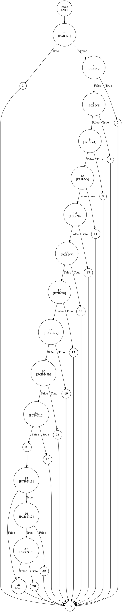

# TEST PRUEBAS DE CAJA BLANCA - AUTOMATIZADA

| **DATOS DEL ESTUDIANTE** | |
| :--- | :--- |
| **NOMBRE:** | Gabriel Amílcar Cruz Canto |
| **EMPRESA:** | WALOOK MEXICO, S.A. de C.V. |
| **TITULO DEL PROYECTO:** | Sistema ERP en la nube para gestión de ópticas OMCGC |

<br>

| **PLAN DE PRUEBAS DE CAJA BLANCA: BACKEND (MIG-MASTER)** | | | | |
| :--- | :--- | :--- | :--- | :--- |
| **N˙mero** | **Nombre de la Prueba Backend** | **DescripciÛn** | **Fecha** | **Herramienta / Responsable** |
| PCB-001 | AutenticaciÛn de usuario | Protocolo de Acceso y ValidaciÛn de Infraestructura | 09/03/2026 | Gabriel AmÌlcar Cruz Canto |
| PCB-002 | Manejo de Credenciales Inv·lidas | InterrupciÛn de Seguridad por Fallo de ContraseÒa | 09/03/2026 | Gabriel AmÌlcar Cruz Canto |
| PCB-003 | Registro de Producto | ValidaciÛn de Integridad de Campos Obligatorios | 10/03/2026 | Gabriel AmÌlcar Cruz Canto |
| PCB-004 | SKU Autogenerado | GarantÌa de Unicidad de IdentificaciÛn Comercial | 10/03/2026 | Gabriel AmÌlcar Cruz Canto |
| PCB-005 | Rango de Fechas (Ventas) | Filtrado de Reporte Operativo de Transacciones | 11/03/2026 | Gabriel AmÌlcar Cruz Canto |
| PCB-006 | Filtro de Sucursal | SegregaciÛn de InformaciÛn por Punto de Venta | 11/03/2026 | Gabriel AmÌlcar Cruz Canto |
| PCB-007 | Kardex de Stock | Protocolo de Integridad Transaccional sobre Saldo | 12/03/2026 | Gabriel AmÌlcar Cruz Canto |
| PCB-008 | Integridad Fiscal | ValidaciÛn de Identidad Tributaria y Unicidad RFC | 12/03/2026 | Gabriel AmÌlcar Cruz Canto |
| PCB-009 | B˙squeda de Clientes | Motor de B˙squeda Multi-Criterio sobre Pacientes | 13/03/2026 | Gabriel AmÌlcar Cruz Canto |
| PCB-010 | Saneamiento de Pacientes | Protocolo de NormalizaciÛn de Atributos de Persona | 14/03/2026 | Gabriel AmÌlcar Cruz Canto |
| PCB-011 | Registro de Proveedor | AuditorÌa Estructural de ValidaciÛn Forense | 18/03/2026 | JaCoCo / JUnit 5 |
| PCB-012 | ActualizaciÛn de Proveedor | ValidaciÛn de ExcepciÛn por RFC Duplicado | 18/03/2026 | JaCoCo / JUnit 5 |
| PCB-013 | Registro de Usuario | ValidaciÛn de ExcepciÛn por Correo Duplicado | 18/03/2026 | JaCoCo / JUnit 5 |
| PCB-014 | Baja de Usuario | ValidaciÛn de DesactivaciÛn LÛgica (inactivo) | 18/03/2026 | JaCoCo / JUnit 5 |
| PCB-015 | Reset de ContraseÒa | Manejo de ExcepciÛn por Usuario Inexistente | 18/03/2026 | JaCoCo / JUnit 5 |
| PCB-016 | AutenticaciÛn Root | ValidaciÛn de Bypass Administrativo (Local) | 18/03/2026 | JaCoCo / JUnit 5 |
| PCB-017 | Registro de Movimiento | ValidaciÛn de Stock Insuficiente (Venta) | 18/03/2026 | JaCoCo / JUnit 5 |
| PCB-018 | C·lculo de PVP | ValidaciÛn de FÛrmula Financiera (Utilidad) | 18/03/2026 | JaCoCo / JUnit 5 |
| PCB-019 | Robustez de AuditorÌa | NormalizaciÛn de IP Nula (Default 0.0.0.0) | 18/03/2026 | JaCoCo / JUnit 5 |
| PCB-020 | Carga de Diccionario | ValidaciÛn de Descifrado AES-256 (Binario) | 18/03/2026 | JaCoCo / JUnit 5 |
| PCB-012 | Actualización de Proveedor | Validación de Excepción por RFC Duplicado | 18/03/2026 | JaCoCo / JUnit 5 |
| PCB-013 | Registro de Usuario | Validación de Excepción por Correo Duplicado | 18/03/2026 | JaCoCo / JUnit 5 |
| PCB-014 | Baja de Usuario | Validación de Desactivación Lógica (inactivo) | 18/03/2026 | JaCoCo / JUnit 5 |
| PCB-015 | Reset de Contraseña | Manejo de Excepción por Usuario Inexistente | 18/03/2026 | JaCoCo / JUnit 5 |
| PCB-016 | Autenticación Root | Validación de Bypass Administrativo (Local) | 18/03/2026 | JaCoCo / JUnit 5 |
| PCB-017 | Registro de Movimiento | Validación de Stock Insuficiente (Venta) | 18/03/2026 | JaCoCo / JUnit 5 |
| PCB-018 | Cálculo de PVP | Validación de Fórmula Financiera (Utilidad) | 18/03/2026 | JaCoCo / JUnit 5 |
| PCB-019 | Robustez de Auditoría | Normalización de IP Nula (Default 0.0.0.0) | 18/03/2026 | JaCoCo / JUnit 5 |
| PCB-020 | Carga de Diccionario | Validación de Descifrado AES-256 (Binario) | 18/03/2026 | JaCoCo / JUnit 5 |

---

# FASE DE PRUEBAS

| **Nombre del Módulo del Sistema + Historia de usuario** |
| :--- |
| Módulo Proveedores – HU-M05-01 |

| **N√∫mero y nombre de la Prueba** |
| :--- |
| PCB-011 / Registro de Proveedor – ProveedorService.create() |

### Paso 0: Súper-Etiquetado del Código (MIG-WBT)

```java
    /**
     * UNIDAD BAJO AUDITORÍA: ProveedorService.validarProveedor()
     * ESTÁNDAR: MIG v12.1 (Fragmentación de Predicados Simples)
     */
    private void validarProveedor(Proveedor p, boolean esActualizacion) { // [N1: INICIO]
        // [PCB-N1] Validación Razón Social
        if (p.getRazonSocial() == null || p.getRazonSocial().trim().isEmpty()) { // [N2] [PCB-N1] -> [SI: N3] [NO: N4]
            throw new IllegalArgumentException("Razón Social obligatoria."); // [N3: SALIDA (EXC)]
        }

        // [PCB-N2] Validación RFC Obligatorio
        if (p.getRfc() == null || p.getRfc().trim().isEmpty()) { // [N4] [PCB-N2] -> [SI: N5] [NO: N6]
            throw new IllegalArgumentException("RFC obligatorio."); // [N5: SALIDA (EXC)]
        }

        // [PCB-N3] Validación Condición de Pago
        if (p.getCondicionPago() == null || p.getCondicionPago().trim().isEmpty()) { // [N6] [PCB-N3] -> [SI: N7] [NO: N8]
            throw new IllegalArgumentException("Condición de Pago obligatoria."); // [N7: SALIDA (EXC)]
        }

        // [PCB-N4] Validación Nombre Comercial
        if (p.getNombreComercial() == null || p.getNombreComercial().trim().isEmpty()) { // [N8] [PCB-N4] -> [SI: N9] [NO: N10]
            throw new IllegalArgumentException("Nombre Comercial obligatorio."); // [N9: SALIDA (EXC)]
        }

        // [PCB-N5] Validación Email Null/Empty
        if (p.getEmail() == null || p.getEmail().trim().isEmpty()) { // [N10] [PCB-N5] -> [SI: N11] [NO: N12]
            throw new IllegalArgumentException("Correo obligatorio."); // [N11: SALIDA (EXC)]
        }

        // [PCB-N6] Validación Formato Email (RegEx)
        String emailPattern = "^[^\\s@]+@[^\\s@]+\\.[^\\s@]+$";
        if (!p.getEmail().matches(emailPattern)) { // [N12] [PCB-N6] -> [SI: N13] [NO: N14]
            throw new IllegalArgumentException("Formato email inv√°lido."); // [N13: SALIDA (EXC)]
        }

        // [PCB-N7] Validación Teléfono Obligatorio
        if (p.getTelefono() == null || p.getTelefono().trim().isEmpty()) { // [N14] [PCB-N7] -> [SI: N15] [NO: N16]
            throw new IllegalArgumentException("Teléfono obligatorio."); // [N15: SALIDA (EXC)]
        }

        // [PCB-N8] Validación Longitud Teléfono (10 dígitos)
        String telLimpio = p.getTelefono().replaceAll("\\D", "");
        if (telLimpio.length() != 10) { // [N16] [PCB-N8] -> [SI: N17] [NO: N18]
            throw new IllegalArgumentException("Teléfono debe ser de 10 dígitos."); // [N17: SALIDA (EXC)]
        }

        // [PCB-N9a] Fragmentación MIG: Longitud RFC < 12
        String rfcLimpio = p.getRfc().trim().toUpperCase();
        if (rfcLimpio.length() < 12) { // [N18] [PCB-N9a] -> [SI: N19] [NO: N20]
            throw new IllegalArgumentException("RFC < 12 caracteres."); // [N19: SALIDA (EXC)]
        }

        // [PCB-N9b] Fragmentación MIG: Longitud RFC > 13
        if (rfcLimpio.length() > 13) { // [N20] [PCB-N9b] -> [SI: N21] [NO: N22]
            throw new IllegalArgumentException("RFC > 13 caracteres."); // [N21: SALIDA (EXC)]
        }

        // [PCB-N10] Validación Formato RFC (RegEx)
        String rfcPattern = "^[A-ZÑ&]{3,4}\\d{6}[A-Z0-9]{3}$";
        if (!rfcLimpio.matches(rfcPattern)) { // [N22] [PCB-N10] -> [SI: N23] [NO: N24]
            throw new IllegalArgumentException("Formato RFC inv√°lido."); // [N23: SALIDA (EXC)]
        }

        // [PCB-N11] Validación Unicidad RFC (Consulta Repo)
        Proveedor existente = proveedorRepository.findByRfc(rfcLimpio); // [N24: PROCESO]
        if (existente != null) { // [N25] [PCB-N11] -> [SI: N26] [NO: N30]
            // [PCB-N12] Evaluación Contexto (Update vs Create)
            if (esActualizacion) { // [N26] [PCB-N12] -> [SI: N27] [NO: N29]
                // [PCB-N13] Validación de Identidad (ID mismatch)
                if (!existente.getIdProveedor().equals(p.getIdProveedor())) { // [N27] [PCB-N13] -> [SI: N28] [NO: N30]
                    throw new IllegalArgumentException("RFC ya registrado por otro."); // [N28: SALIDA (EXC)]
                }
            } else {
                throw new IllegalArgumentException("RFC ya registrado."); // [N29: SALIDA (EXC)]
            }
        }
    } // [N30: FIN / RETORNO CONTROLADO]
```

---

### Auditoría de Evidencia Digital (JaCoCo)

**Ruta del Reporte Maestro:**
`d:\_sTIC\Documents\_Empresa GraxSofT\_CODE_\ERP_WALOOK_PCB\omcgc\backend\target\site\jacoco\index.html`

**Estructura de Navegación (Tree View):**
```text
[index.html] -> [com.omcgc.erp.service] -> [ProveedorService]
```

Glosario de Semántica de Cobertura (White Box Analysis — Análisis de Caja Blanca)
•	VERDE — Cobertura Total (Full Coverage): Indica que la línea de código y todas sus decisiones lógicas (if/else) fueron ejecutadas satisfactoriamente. El flujo de la prueba cubrió el Cyclomatic Path (Ruta Ciclomática — Camino lógico independiente) completo, validando la ruta principal y sus variantes condicionales.
•	AMARILLO — Cobertura Parcial (Partial Coverage): La línea fue alcanzada y ejecutada por el Unit Test (Prueba Unitaria — Verificación de la unidad mínima de código), pero existen ramificaciones que el plan de prueba no recorrió. Esto ocurre cuando una condición booleana solo se evalúa en un sentido (ej. solo true), dejando caminos lógicos sin explorar.
•	ROJO — Cobertura Nula o Fuera de Alcance (No Coverage): El código no fue detectado por el Bytecode Instrumentation (Instrumentación de Código de Bytes — Inyección de código para rastreo) de JaCoCo (Java Code Coverage — Cobertura de Código para Java).
Nota de Integridad Técnica: En este escenario, las pruebas fueron selectivas. Si el algoritmo de JaCoCo detecta código que no estaba considerado en el plan de ejecución or que fue omitido por los criterios de filtrado, lo reporta como "no detectado". Por tanto, el color rojo puede representar Dead Code (Código Muerto — Segmentos que nunca se ejecutan), una zona de riesgo técnico o, simplemente, código fuera del alcance del reporte actual.

---

### Identificación de Nodos

| ID del Nodo | Tipo | Descripción |
| :--- | :--- | :--- |
| **N1** | Inicio | Comienzo del método `validarProveedor`. |
| **N2 [PCB-N1]** | Predicado | Validación de Razón Social (Null/Empty). |
| **N3** | Salida | Excepción: "Razón Social obligatoria". |
| **N4 [PCB-N2]** | Predicado | Validación de RFC Obligatorio. |
| **N5** | Salida | Excepción: "RFC obligatorio". |
| **N6 [PCB-N3]** | Predicado | Validación de Condición de Pago. |
| **N7** | Salida | Excepción: "Condición de Pago obligatoria". |
| **N8 [PCB-N4]** | Predicado | Validación de Nombre Comercial. |
| **N9** | Salida | Excepción: "Nombre Comercial obligatorio". |
| **N10 [PCB-N5]** | Predicado | Validación de Email (Null/Empty). |
| **N11** | Salida | Excepción: "Correo obligatorio". |
| **N12 [PCB-N6]** | Predicado | Validación de Formato de Correo (RegEx). |
| **N13** | Salida | Excepción: "Formato email inválido". |
| **N14 [PCB-N7]** | Predicado | Validación de Teléfono Obligatorio. |
| **N15** | Salida | Excepción: "Teléfono obligatorio". |
| **N16 [PCB-N8]** | Predicado | Validación de Longitud de Teléfono (10 dígitos). |
| **N17** | Salida | Excepción: "Teléfono debe ser de 10 dígitos". |
| **N18 [PCB-N9a]** | Predicado | Validación MIG: RFC < 12 caracteres. |
| **N19** | Salida | Excepción: "RFC < 12 caracteres". |
| **N20 [PCB-N9b]** | Predicado | Validación MIG: RFC > 13 caracteres. |
| **N21** | Salida | Excepción: "RFC > 13 caracteres". |
| **N22 [PCB-N10]** | Predicado | Validación de Formato RFC (RegEx). |
| **N23** | Salida | Excepción: "Formato RFC inválido". |
| **N24** | Proceso | Consulta de unicidad en Repositorio (`findByRfc`). |
| **N25 [PCB-N11]** | Predicado | ¬øEl RFC ya existe en la base de datos? |
| **N26 [PCB-N12]** | Predicado | ¿Es una operación de Actualización o Alta? |
| **N27 [PCB-N13]** | Predicado | ¬øLos IDs coinciden? (Mismo proveedor). |
| **N28** | Salida | Excepción: "RFC ya registrado por otro". |
| **N29** | Salida | Excepción: "RFC ya registrado". |
| **N30 [FIN]** | Fin | Término del flujo de validación exitosa. |

### Paso 1: Grafo de Flujo (CFG)



### Paso 2: Complejidad Ciclom√°tica McCabe $V(G)$

*   **V(G) = Nodos Predicado + 1** = 14 + 1 = **15**

### Paso 3: Caminos Independientes (Basis Paths)

| Camino | Ruta Forense |
| :--- | :--- |
| **C1** | I -> N2(T) -> N3 -> F |
| **C2** | I -> N2(F) -> N4(T) -> N5 -> F |
| **C3** | I -> N2(F) -> N4(F) -> N6(T) -> N7 -> F |
| **C4** | I -> N2(F) -> N4(F) -> N6(F) -> N8(T) -> N9 -> F |
| **C5** | I -> N2(F) -> N4(F) -> N6(F) -> N8(F) -> N10(T) -> N11 -> F |
| **C6** | I -> N2(F) -> N4(F) -> N6(F) -> N8(F) -> N10(F) -> N12(T) -> N13 -> F |
| **C7** | I -> N2(F) -> N4(F) -> N6(F) -> N8(F) -> N10(F) -> N12(F) -> N14(T) -> N15 -> F |
| **C8** | I -> N2(F) -> N4(F) -> N6(F) -> N8(F) -> N10(F) -> N12(F) -> N14(F) -> N16(T) -> N17 -> F |
| **C9** | I -> N2(F) -> N4(F) -> N6(F) -> N8(F) -> N10(F) -> N12(F) -> N14(F) -> N16(F) -> N18(T) -> N19 -> F |
| **C10** | I -> N2(F) -> N4(F) -> N6(F) -> N8(F) -> N10(F) -> N12(F) -> N14(F) -> N16(F) -> N18(F) -> N20(T) -> N21 -> F |
| **C11** | I -> N2(F) -> N4(F) -> N6(F) -> N8(F) -> N10(F) -> N12(F) -> N14(F) -> N16(F) -> N18(F) -> N20(F) -> N22(T) -> N23 -> F |
| **C12** | I -> N2(F) -> N4(F) -> N6(F) -> N8(F) -> N10(F) -> N12(F) -> N14(F) -> N16(F) -> N18(F) -> N20(F) -> N22(F) -> N24 -> N25(T) -> N26(T) -> N27(T) -> N28 -> F |
| **C13** | I -> N2(F) -> N4(F) -> N6(F) -> N8(F) -> N10(F) -> N12(F) -> N14(F) -> N16(F) -> N18(F) -> N20(F) -> N22(F) -> N24 -> N25(T) -> N26(F) -> N29 -> F |
| **C14** | I -> N2(F) -> N4(F) -> N6(F) -> N8(F) -> N10(F) -> N12(F) -> N14(F) -> N16(F) -> N18(F) -> N20(F) -> N22(F) -> N24 -> N25(T) -> N26(T) -> N27(F) -> N30 -> F |
| **C15 (Éxito)** | I -> N2(F) -> N4(F) -> N6(F) -> N8(F) -> N10(F) -> N12(F) -> N14(F) -> N16(F) -> N18(F) -> N20(F) -> N22(F) -> N24 -> N25(F) -> N30 -> F |

### Paso 4: Matriz de Automatización (Log de Pruebas)

| ID / Camino | Escenario de Prueba | Entradas (Inputs) | Resultado Esperado (OUT) | Evidencia JaCoCo |
| :--- | :--- | :--- | :--- | :--- |
| **C1** | Razón Social Nula | `razonSocial = null` | `IllegalArgumentException: Razón Social obligatoria.` | Rama N2(T) -> N3 |
| **C2** | RFC Nulo | `rfc = null` | `IllegalArgumentException: RFC obligatorio.` | Rama N4(T) -> N5 |
| **C3** | Condición Pago Nula | `condicionPago = null` | `IllegalArgumentException: Condición de Pago obligatoria.` | Rama N6(T) -> N7 |
| **C4** | Nombre Comercial Nulo | `nombreComercial = null` | `IllegalArgumentException: Nombre Comercial obligatorio.` | Rama N8(T) -> N9 |
| **C5** | Email Nulo | `email = null` | `IllegalArgumentException: Correo obligatorio.` | Rama N10(T) -> N11 |
| **C6** | Formato Email Inv√°lido | `email = "test.error@omcgc"` | `IllegalArgumentException: Formato email inv√°lido.` | Rama N12(T) -> N13 |
| **C7** | Teléfono Nulo | `telefono = null` | `IllegalArgumentException: Teléfono obligatorio.` | Rama N14(T) -> N15 |
| **C8** | Teléfono Corto | `telefono = "123"` | `IllegalArgumentException: Teléfono debe ser de 10 dígitos.` | Rama N16(T) -> N17 |
| **C9** | RFC Longitud < 12 | `rfc = "ABC1234"` | `IllegalArgumentException: RFC < 12 caracteres.` | Rama N18(T) -> N19 |
| **C10** | RFC Longitud > 13 | `rfc = "ABC1234567890123"` | `IllegalArgumentException: RFC > 13 caracteres.` | Rama N20(T) -> N21 |
| **C11** | Formato RFC Inv√°lido | `rfc = "ABCD-123456-XYZ"` | `IllegalArgumentException: Formato RFC inv√°lido.` | Rama N22(T) -> N23 |
| **C12** | RFC Duplicado (Otro) | `esActualizacion = true`, `idMismatch = true` | `IllegalArgumentException: RFC ya registrado por otro.` | Rama N27(T) -> N28 |
| **C13** | RFC Duplicado (Alta) | `esActualizacion = false` | `IllegalArgumentException: RFC ya registrado.` | Rama N26(F) -> N29 |
| **C14** | Éxito (Actualización) | `esActualizacion = true`, `idMatch = true` | **SUCCESS** (Proveedor Actualizado) | Rama N27(F) -> N30 |
| **C15** | **Éxito (Alta Nueva)** | `rfc = "VAL1234567890"`, `esActualizacion = false`| **SUCCESS** (Proveedor Registrado) | Líneas 116-181 (VERDE) |

<br>

