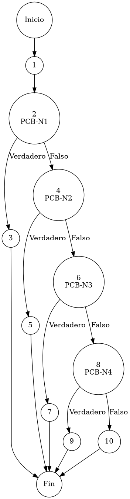

# Reporte de Auditoría de Caja Blanca: PCB-011

## A. Identificación del Fragmento
- **ID**: PCB-011
- **Módulo**: Proveedores
- **Fragmento**: Validación estructural de registro de proveedor
- **HU**: HU-M05-01
- **Función**: `ProveedorService.validarProveedor()`
- **Alcance**: Análisis del flujo de validación de completitud para campos mandatorios bajo el estándar de "Duda Cero".

## B. Tabla de Nodos
| Nodo | Descripción | Tipo |
| :--- | :--- | :--- |
| 1 | Inicio del protocolo de validación estructural | Inicio |
| 2 | Validación de Identidad Jurídica: `if (p.getRazonSocial() == null || ...)` [PCB-N1] | Predicado |
| 3 | Interrupción por Razón Social ausente: `throw new IllegalArgumentException(...)` | Final (Excepción 1) |
| 4 | Validación de Identidad Tributaria: `if (p.getRfc() == null || ...)` [PCB-N2] | Predicado |
| 5 | Interrupción por RFC ausente: `throw new IllegalArgumentException(...)` | Final (Excepción 2) |
| 6 | Validación de Acuerdo Comercial: `if (p.getCondicionPago() == null || ...)` [PCB-N3] | Predicado |
| 7 | Interrupción por Condición de Pago ausente: `throw new IllegalArgumentException(...)` | Final (Excepción 3) |
| 8 | Validación de Marca Comercial: `if (p.getNombreComercial() == null || ...)` [PCB-N4] | Predicado |
| 9 | Interrupción por Nombre Comercial ausente: `throw new IllegalArgumentException(...)` | Final (Excepción 4) |
| 10 | Finalización exitosa de la validación estructural | Fin |

## C. Tabla de Aristas
| Origen | Destino | Condición / Etiqueta |
| :--- | :--- | :--- |
| 1 | 2 | Flujo secuencial |
| 2 | 3 | PCB-N1 es Verdadero (Campo mandatorio vacío) |
| 2 | 4 | PCB-N1 es Falso (Dato íntegro) |
| 4 | 5 | PCB-N2 es Verdadero (Campo mandatorio vacío) |
| 4 | 6 | PCB-N2 es Falso (Dato íntegro) |
| 6 | 7 | PCB-N3 es Verdadero (Campo mandatorio vacío) |
| 6 | 8 | PCB-N3 es Falso (Dato íntegro) |
| 8 | 9 | PCB-N4 es Verdadero (Campo mandatorio vacío) |
| 8 | 10 | PCB-N4 es Falso (Dato íntegro) |

## D. Complejidad Ciclomática
$V(G) = P + 1$
donde $P = 4$ (Nodos predicado: PCB-N1 al PCB-N4)
$V(G) = 4 + 1 = 5$

**Interpretación**: El análisis de McCabe determina que se requieren 5 caminos independientes para garantizar la cobertura total de la cascada de obligatoriedad en el registro de terceros proveedores.

## E. Caminos Independientes
1. **Camino 1 (Falla en Identidad Jurídica)**: 1 → 2(Verdadero) → 3
2. **Camino 2 (Falla en Identidad Tributaria)**: 1 → 2(Falso) → 4(Verdadero) → 5
3. **Camino 3 (Falla en Acuerdo Comercial)**: 1 → 2(Falso) → 4(Falso) → 6(Verdadero) → 7
4. **Camino 4 (Falla en Denominación de Marca)**: 1 → 2(Falso) → 4(Falso) → 6(Falso) → 8(Verdadero) → 9
5. **Camino 5 (Validación Íntegra del Proveedor)**: 1 → 2(Falso) → 4(Falso) → 6(Falso) → 8(Falso) → 10

## F. Casos de Prueba (Basis Path Testing)
| Caso | Razón Social | RFC | Condición Pago | Nombre Comercial | Resultado Esperado |
| :--- | :--- | :--- | :--- | :--- | :--- |
| CP1 | "" | "X" | "Crédito" | "M" | Excepción: Razón Social obligatoria |
| CP2 | "S.A." | "" | "Crédito" | "M" | Excepción: RFC obligatorio |
| CP3 | "S.A." | "X" | "" | "M" | Excepción: Condición Pago obligatoria |
| CP4 | "S.A." | "X" | "Crédito" | "" | Excepción: Nombre Comercial obligatorio |
| CP5 | "S.A." | "X" | "Crédito" | "M" | Validación Exitosa (Void) |

## G. Seudocódigo Estructural del Fragmento

### Fragmento A: Código Puro (Estructura Original)
**Archivo**: `ProveedorService.java`
**Función**: `validarProveedor(Proveedor p, boolean esActualizacion)`
**Descripción**: Implementa el protocolo de validación estructural de entidades proveedoras. Utiliza una estrategia 'Trim-Aware' para evitar la evasión de campos mandatorios, asegurando la completitud de la ficha del tercero antes de su persistencia. Incluye comentarios originales de desarrollo.

```java
    private void validarProveedor(Proveedor p, boolean esActualizacion) {
        
        // validación de identidad jurídica (Razon Social)
        if (p.getRazonSocial() == null || p.getRazonSocial().trim().isEmpty()) {
            throw new IllegalArgumentException("Razón Social: La Razón Social es obligatoria.");
        }
        
        // validación de identidad tributaria (RFC)
        if (p.getRfc() == null || p.getRfc().trim().isEmpty()) {
            throw new IllegalArgumentException("RFC: El RFC es obligatorio.");
        }
        
        // validación de acuerdo comercial (Condición Pago)
        if (p.getCondicionPago() == null || p.getCondicionPago().trim().isEmpty()) {
            throw new IllegalArgumentException("Condición de Pago: Debe seleccionar una Condición de Pago.");
        }

        // validación de marca/denominación comercial (Nombre Comercial)
        if (p.getNombreComercial() == null || p.getNombreComercial().trim().isEmpty()) {
            throw new IllegalArgumentException("Nombre Comercial: El Nombre Comercial es obligatorio.");
        }
    }
```

### Fragmento B: Código Anotado (Mapeo de Nodos)
**Descripción**: Este fragmento incluye los marcadores de control (`PCB-Nx`) para identificar la posición exacta de cada nodo y arista del Grafo de Control de Flujo (CFG).

```java
    private void validarProveedor(Proveedor p, boolean esActualizacion) { // NODO 1
        
        // PCB-N1: validación de identidad jurídica (Razon Social)
        if (p.getRazonSocial() == null || p.getRazonSocial().trim().isEmpty()) { // NODO 2 [PREDICADO]
            throw new IllegalArgumentException("Razón Social: La Razón Social es obligatoria."); // NODO 3 [FIN]
        }
        
        // PCB-N2: validación de identidad tributaria (RFC)
        if (p.getRfc() == null || p.getRfc().trim().isEmpty()) { // NODO 4 [PREDICADO]
            throw new IllegalArgumentException("RFC: El RFC es obligatorio."); // NODO 5 [FIN]
        }
        
        // PCB-N3: validación de acuerdo comercial (Condición Pago)
        if (p.getCondicionPago() == null || p.getCondicionPago().trim().isEmpty()) { // NODO 6 [PREDICADO]
            throw new IllegalArgumentException("Condición de Pago: Debe seleccionar una Condición de Pago."); // NODO 7 [FIN]
        }

        // PCB-N4: validación de marca/denominación comercial (Nombre Comercial)
        if (p.getNombreComercial() == null || p.getNombreComercial().trim().isEmpty()) { // NODO 8 [PREDICADO]
            throw new IllegalArgumentException("Nombre Comercial: El Nombre Comercial es obligatorio."); // NODO 9 [FIN]
        }
    } // NODO 10 [FIN]
```

## H. Grafo de Control de Flujo (PlantUML)


## I. Matriz de Trazabilidad
| Requisito (HU) | Nodo de Decisión | Camino Independiente | Caso de Prueba |
| :--- | :--- | :--- | :--- |
| **HU-M05-01** | PCB-N1 | Caminos 1, 2, 3, 4, 5 | CP1, CP2, CP3, CP4, CP5 |
| **HU-M05-01** | PCB-N2 | Caminos 2, 3, 4, 5 | CP2, CP3, CP4, CP5 |
| **HU-M05-01** | PCB-N3 | Caminos 3, 4, 5 | CP3, CP4, CP5 |
| **HU-M05-01** | PCB-N4 | Caminos 4, 5 | CP4, CP5 |

## J. Resumen Académico
El fragmento **PCB-011** implementa una arquitectura estructural de "Validación en Cascada" para la gestión del padrón de proveedores. La auditoría de caja blanca verifica que el diseño Fail-Fast (Duda Cero) interrumpe el flujo ante cualquier deficiencia en campos tributarios o comerciales, garantizando que el módulo de egresos opere exclusivamente con terceros plenamente documentados. Con una complejidad ciclomática $V(G)=5$, se asegura la máxima cobertura de integridad para la cadena de suministro del ERP.
