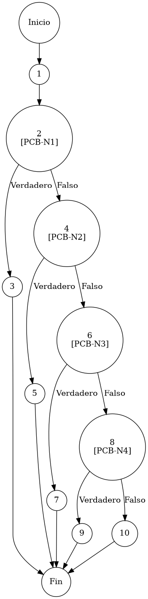

# TEST PRUEBAS DE CAJA BLANCA

| **DATOS DEL ESTUDIANTE** | |
| :--- | :--- |
| **NOMBRE:** | Gabriel Amílcar Cruz Canto |
| **EMPRESA:** | WALOOK MEXICO, S.A. de C.V. |
| **TITULO DEL PROYECTO:** | Sistema ERP en la nube para gestión de ópticas OMCGC |
| **URL y Claves de acceso:** | [Configurar en ambiente de entrega] |

<br>

| **PLAN DE PRUEBAS DE CAJA BLANCA: BACKEND** | | | | |
| :--- | :--- | :--- | :--- | :--- |
| **Número** | **Nombre de la Prueba Backend** | **Descripción** | **Fecha** | **Responsable** |
| PCB-011 | Registro de Proveedores | Protocolo de Validación Estructural de Entidades Proveedoras | 17/03/2026 | Gabriel Amílcar Cruz Canto |

---

# FASE DE PRUEBAS

| **Nombre del Módulo del Sistema + Historia de usuario** |
| :--- |
| Módulo Compras / Terceros – HU-M05-01 |

| **Número y nombre de la Prueba** |
| :--- |
| PCB-011 / Registro de Proveedores – ProveedorService.validarProveedor() |

### Paso 0

```java
    /**
     * ESPECIFICACIÓN TÉCNICA: Protocolo de Validación Estructural de Entidades Proveedoras.
     * OBJETIVO OPERATIVO: Validar completitud de la ficha para asegurar operatividad de pagos.
     * IMPACTO: Prevención de registros redundantes o incompletos en el módulo de egresos.
     */
    private void validarProveedor(Proveedor p, boolean esActualizacion) { // [N1: INICIO]
        
        // [PCB-N1] validación de identidad jurídica (Razon Social)
        if (p.getRazonSocial() == null || p.getRazonSocial().trim().isEmpty()) { // [N2] [PCB-N1] -> [SI: N3] [NO: N4] : ¿Nombre jurídico ausente?
            throw new IllegalArgumentException("Razón Social obligatoria"); // [N3: FIN (EXC)]
        }
        
        // [PCB-N2] validación de identidad tributaria (RFC)
        if (p.getRfc() == null || p.getRfc().trim().isEmpty()) { // [N4] [PCB-N2] -> [SI: N5] [NO: N6] : ¿RFC ausente?
            throw new IllegalArgumentException("RFC obligatorio"); // [N5: FIN (EXC)]
        }
        
        // [PCB-N3] validación de acuerdo comercial (Condición Pago)
        if (p.getCondicionPago() == null || p.getCondicionPago().trim().isEmpty()) { // [N6] [PCB-N3] -> [SI: N7] [NO: N8] : ¿Condición de pago ausente?
            throw new IllegalArgumentException("Condición Pago obligatoria"); // [N7: FIN (EXC)]
        }

        // [PCB-N4] validación de marca/denominación comercial (Nombre Comercial)
        if (p.getNombreComercial() == null || p.getNombreComercial().trim().isEmpty()) { // [N8] [PCB-N4] -> [SI: N9] [NO: N10] : ¿Nombre comercial ausente?
            throw new IllegalArgumentException("Nombre Comercial obligatorio"); // [N9: FIN (EXC)]
        }
    } // [N10: FIN]
```

### Descripción breve del fragmento

El fragmento **PCB-011** implementa el "Gatekeeper" estructural para el padrón de proveedores. Su función es realizar verificaciones mandoatorias 'Trim-Aware' sobre campos críticos (RFC, Razón Social, Condiciones de Pago) antes de permitir cualquier operación comercial. Con una complejidad $V(G)=5$, el código garantiza que la cadena de suministro cuente con registros íntegros y verificables para procesos de auditoría financiera.

### Identificación de Nodos

| ID del Nodo | Tipo | Descripción |
| :--- | :--- | :--- |
| **Nodo 1** | Inicio | Inicio de la función privada `validarProveedor(Proveedor p)` y recepción de la entidad comercial. |
| **Nodo 2 [PCB-N1]** | Nodo predicado | Evaluación de la condición de Razón Social nula o vacía. Identificado con la etiqueta **PCB-N1**. |
| **Nodo 3** | Nodo de salida | Lanzamiento de `IllegalArgumentException("Razón Social obligatoria")`. Interrupción del flujo por ausencia de identidad jurídica. |
| **Nodo 4 [PCB-N2]** | Nodo predicado | Evaluación de la condición de RFC nulo o vacío. Identificado con la etiqueta **PCB-N2**. |
| **Nodo 5** | Nodo de salida | Lanzamiento de `IllegalArgumentException("RFC obligatorio")`. Interrupción del flujo por ausencia de identificador fiscal. |
| **Nodo 6 [PCB-N3]** | Nodo predicado | Evaluación de la condición de Condición de Pago nula o vacía. Identificado con la etiqueta **PCB-N3**. |
| **Nodo 7** | Nodo de salida | Lanzamiento de `IllegalArgumentException("Condición Pago obligatoria")`. Interrupción del flujo por falta de política de egresos comercial. |
| **Nodo 8 [PCB-N4]** | Nodo predicado | Evaluación de la condición de Nombre Comercial nulo o vacío. Identificado con la etiqueta **PCB-N4**. |
| **Nodo 9** | Nodo de salida | Lanzamiento de `IllegalArgumentException("Nombre Comercial obligatorio")`. Interrupción del flujo por falta de denominación de marca operativa. |
| **Nodo 10** | Fin | Finalización del protocolo de validación estructural y habilitación para la persistencia atómica en el sistema. |

### Paso 1



### Paso 2

**V(G) = Número de regiones** = (4 internas + 1 externa) = **5**
**V(G) = Aristas – Nodos + 2** = V(G) = 15 – 12 + 2 = **5**
**V(G) = Nodos Predicado + 1** = V(G) = 4 + 1 = **5**

### Paso 3

| Total de caminos | Ruta de cada camino |
| :--- | :--- |
| **Camino 1** | Inicio → 1 → 2(SÍ) → 3 → Fin |
| **Camino 2** | Inicio → 1 → 2(NO) → 4(SÍ) → 5 → Fin |
| **Camino 3** | Inicio → 1 → 2(NO) → 4(NO) → 6(SÍ) → 7 → Fin |
| **Camino 4** | Inicio → 1 → 2(NO) → 4(NO) → 6(NO) → 8(SÍ) → 9 → Fin |
| **Camino 5** | Inicio → 1 → 2(NO) → 4(NO) → 6(NO) → 8(NO) → 10 → Fin |

### Paso 4

| Número del camino | Caso de Prueba (IN) | Resultado esperado (OUT) |
| :--- | :--- | :--- |
| **Camino 1** | p.razonSocial = "" | IllegalArgumentException: Razón Social obligatoria (PCB-N1: SI) |
| **Camino 2** | p.razonSocial = "PROV SA", p.rfc = "" | IllegalArgumentException: RFC obligatorio (PCB-N1: NO, PCB-N2: SI) |
| **Camino 3** | p.razonSocial = "PROV SA", p.rfc = "XAXX...", p.condicionPago = "" | IllegalArgumentException: Condición Pago obligatoria (PCB-N1: NO, PCB-N2: NO, PCB-N3: SI) |
| **Camino 4** | p.razonSocial = "PROV SA", p.rfc = "XAXX...", p.condicionPago = "CREDITO", p.nombreComercial = "" | IllegalArgumentException: Nombre Comercial obligatorio (PCB-N1: NO, PCB-N2: NO, PCB-N3: NO, PCB-N4: SI) |
| **Camino 5** | p.razonSocial = "PROV SA", p.rfc = "XAXX...", p.condicionPago = "CONTADO", p.nombreComercial = "MARCA X" | Validación exitosa sin excepciones (PCB-N1: NO, PCB-N2: NO, PCB-N3: NO, PCB-N4: NO) |
