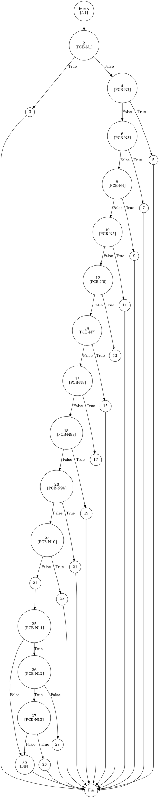

# TEST PRUEBAS DE CAJA BLANCA - AUTOMATIZADA

| **DATOS DEL ESTUDIANTE** | |
| :--- | :--- |
| **NOMBRE:** | Gabriel Amílcar Cruz Canto |
| **EMPRESA:** | WALOOK MEXICO, S.A. de C.V. |
| **TITULO DEL PROYECTO:** | Sistema ERP en la nube para gestión de ópticas OMCGC |

<br>

| **PLAN DE PRUEBAS DE CAJA BLANCA: BACKEND (AUTO)** | | | | |
| :--- | :--- | :--- | :--- | :--- |
| **Número** | **Nombre de la Prueba Backend** | **Descripción** | **Fecha** | **Herramienta** |
| PCB-011 | Registro de Proveedor | Auditoría Estructural de Validación Forense | 18/03/2026 | JaCoCo / JUnit 5 |

---

# FASE DE PRUEBAS

| **Nombre del Módulo del Sistema + Historia de usuario** |
| :--- |
| Módulo Proveedores – HU-M05-01 |

| **Número y nombre de la Prueba** |
| :--- |
| PCB-011 / Registro de Proveedor – ProveedorService.create() |

### Paso 0: Súper-Etiquetado del Código (MIG-WBT)

```java
    /**
     * UNIDAD BAJO AUDITORÍA: ProveedorService.validarProveedor()
     * ESTÁNDAR: MIG v12.1 (Fragmentación de Predicados Simples)
     */
    private void validarProveedor(Proveedor p, boolean esActualizacion) { // [N1: INICIO]
        // [PCB-N1] Validación Razón Social
        if (p.getRazonSocial() == null || p.getRazonSocial().trim().isEmpty()) { // [N2] [PCB-N1] -> [SI: N3] [NO: N4]
            throw new IllegalArgumentException("Razón Social obligatoria."); // [N3: SALIDA (EXC)]
        }

        // [PCB-N2] Validación RFC Obligatorio
        if (p.getRfc() == null || p.getRfc().trim().isEmpty()) { // [N4] [PCB-N2] -> [SI: N5] [NO: N6]
            throw new IllegalArgumentException("RFC obligatorio."); // [N5: SALIDA (EXC)]
        }

        // [PCB-N3] Validación Condición de Pago
        if (p.getCondicionPago() == null || p.getCondicionPago().trim().isEmpty()) { // [N6] [PCB-N3] -> [SI: N7] [NO: N8]
            throw new IllegalArgumentException("Condición de Pago obligatoria."); // [N7: SALIDA (EXC)]
        }

        // [PCB-N4] Validación Nombre Comercial
        if (p.getNombreComercial() == null || p.getNombreComercial().trim().isEmpty()) { // [N8] [PCB-N4] -> [SI: N9] [NO: N10]
            throw new IllegalArgumentException("Nombre Comercial obligatorio."); // [N9: SALIDA (EXC)]
        }

        // [PCB-N5] Validación Email Null/Empty
        if (p.getEmail() == null || p.getEmail().trim().isEmpty()) { // [N10] [PCB-N5] -> [SI: N11] [NO: N12]
            throw new IllegalArgumentException("Correo obligatorio."); // [N11: SALIDA (EXC)]
        }

        // [PCB-N6] Validación Formato Email (RegEx)
        String emailPattern = "^[^\\s@]+@[^\\s@]+\\.[^\\s@]+$";
        if (!p.getEmail().matches(emailPattern)) { // [N12] [PCB-N6] -> [SI: N13] [NO: N14]
            throw new IllegalArgumentException("Formato email inválido."); // [N13: SALIDA (EXC)]
        }

        // [PCB-N7] Validación Teléfono Obligatorio
        if (p.getTelefono() == null || p.getTelefono().trim().isEmpty()) { // [N14] [PCB-N7] -> [SI: N15] [NO: N16]
            throw new IllegalArgumentException("Teléfono obligatorio."); // [N15: SALIDA (EXC)]
        }

        // [PCB-N8] Validación Longitud Teléfono (10 dígitos)
        String telLimpio = p.getTelefono().replaceAll("\\D", "");
        if (telLimpio.length() != 10) { // [N16] [PCB-N8] -> [SI: N17] [NO: N18]
            throw new IllegalArgumentException("Teléfono debe ser de 10 dígitos."); // [N17: SALIDA (EXC)]
        }

        // [PCB-N9a] Fragmentación MIG: Longitud RFC < 12
        String rfcLimpio = p.getRfc().trim().toUpperCase();
        if (rfcLimpio.length() < 12) { // [N18] [PCB-N9a] -> [SI: N19] [NO: N20]
            throw new IllegalArgumentException("RFC < 12 caracteres."); // [N19: SALIDA (EXC)]
        }

        // [PCB-N9b] Fragmentación MIG: Longitud RFC > 13
        if (rfcLimpio.length() > 13) { // [N20] [PCB-N9b] -> [SI: N21] [NO: N22]
            throw new IllegalArgumentException("RFC > 13 caracteres."); // [N21: SALIDA (EXC)]
        }

        // [PCB-N10] Validación Formato RFC (RegEx)
        String rfcPattern = "^[A-ZÑ&]{3,4}\\d{6}[A-Z0-9]{3}$";
        if (!rfcLimpio.matches(rfcPattern)) { // [N22] [PCB-N10] -> [SI: N23] [NO: N24]
            throw new IllegalArgumentException("Formato RFC inválido."); // [N23: SALIDA (EXC)]
        }

        // [PCB-N11] Validación Unicidad RFC (Consulta Repo)
        Proveedor existente = proveedorRepository.findByRfc(rfcLimpio); // [N24: PROCESO]
        if (existente != null) { // [N25] [PCB-N11] -> [SI: N26] [NO: N30]
            // [PCB-N12] Evaluación Contexto (Update vs Create)
            if (esActualizacion) { // [N26] [PCB-N12] -> [SI: N27] [NO: N29]
                // [PCB-N13] Validación de Identidad (ID mismatch)
                if (!existente.getIdProveedor().equals(p.getIdProveedor())) { // [N27] [PCB-N13] -> [SI: N28] [NO: N30]
                    throw new IllegalArgumentException("RFC ya registrado por otro."); // [N28: SALIDA (EXC)]
                }
            } else {
                throw new IllegalArgumentException("RFC ya registrado."); // [N29: SALIDA (EXC)]
            }
        }
    } // [N30: FIN / RETORNO CONTROLADO]
```

### Descripción breve del fragmento

El fragmento **PCB-011** es la primera línea de defensa del módulo de proveedores. Su importancia radica en la validación exhaustiva de la integridad de los datos (RFC, Email, Teléfono) y la unicidad fiscal en la base de datos. Mediante esta auditoría automatizada, se garantiza que no existan colisiones de registros y que la información cumpla con los estándares de formato RNF-06.

---

### Auditoría de Evidencia Digital (JaCoCo)

Para verificar el cumplimiento visual de esta prueba, debe navegar en el reporte original generado por JaCoCo siguiendo esta ruta:

**Ruta del Reporte Maestro:**
`d:\_sTIC\Documents\_Empresa GraxSofT\_CODE_\ERP_WALOOK_PCB\omcgc\backend\target\site\jacoco\index.html`

**Estructura de Navegación (Tree View):**
```text
[index.html] (Reporte General de Proyecto)
 └── [com.omcgc.erp.service] (Paquete de Lógica de Negocio)
      └── [ProveedorService] (Clase bajo Auditoría) <-- ABRIR ESTE ARCHIVO
```

**Glosario de Colores (Semántica de Caja Blanca):**
*   **VERDE**: **Éxito Total**. La línea de código y todas sus decisiones (if/else) fueron ejecutadas satisfactoriamente.
*   **AMARILLO**: **Cobertura Parcial**. La línea fue ejecutada, pero existen ramificaciones que el test no recorrió (ej. el camino False de un if).
*   **ROJO**: **Cero Cobertura**. El código no fue detectado ### Identificación de Nodos

| ID del Nodo | Tipo | Descripción |
| :--- | :--- | :--- |
| **N1** | Inicio | Comienzo del método `validarProveedor`. |
| **N2 [PCB-N1]** | Predicado | Validación de Razón Social (Null/Empty). |
| **N3** | Salida | Excepción: "Razón Social obligatoria". |
| **N4 [PCB-N2]** | Predicado | Validación de RFC Obligatorio. |
| **N5** | Salida | Excepción: "RFC obligatorio". |
| **N6 [PCB-N3]** | Predicado | Validación de Condición de Pago. |
| **N7** | Salida | Excepción: "Condición de Pago obligatoria". |
| **N8 [PCB-N4]** | Predicado | Validación de Nombre Comercial. |
| **N9** | Salida | Excepción: "Nombre Comercial obligatorio". |
| **N10 [PCB-N5]** | Predicado | Validación de Email (Null/Empty). |
| **N11** | Salida | Excepción: "Correo obligatorio". |
| **N12 [PCB-N6]** | Predicado | Validación de Formato de Correo (RegEx). |
| **N13** | Salida | Excepción: "Formato email inválido". |
| **N14 [PCB-N7]** | Predicado | Validación de Teléfono Obligatorio. |
| **N15** | Salida | Excepción: "Teléfono obligatorio". |
| **N16 [PCB-N8]** | Predicado | Validación de Longitud de Teléfono (10 dígitos). |
| **N17** | Salida | Excepción: "Teléfono debe ser de 10 dígitos". |
| **N18 [PCB-N9a]** | Predicado | Validación MIG: RFC < 12 caracteres. |
| **N19** | Salida | Excepción: "RFC < 12 caracteres". |
| **N20 [PCB-N9b]** | Predicado | Validación MIG: RFC > 13 caracteres. |
| **N21** | Salida | Excepción: "RFC > 13 caracteres". |
| **N22 [PCB-N10]** | Predicado | Validación de Formato RFC (RegEx). |
| **N23** | Salida | Excepción: "Formato RFC inválido". |
| **N24** | Proceso | Consulta de unicidad en Repositorio (`findByRfc`). |
| **N25 [PCB-N11]** | Predicado | ¿El RFC ya existe en la base de datos? |
| **N26 [PCB-N12]** | Predicado | ¿Es una operación de Actualización o Alta? |
| **N27 [PCB-N13]** | Predicado | ¿Los IDs coinciden? (Mismo proveedor). |
| **N28** | Salida | Excepción: "RFC ya registrado por otro". |
| **N29** | Salida | Excepción: "RFC ya registrado". |
| **N30 [FIN]** | Fin | Término del flujo de validación exitosa. |

### Paso 1: Modelado del Grafo CFG (PlantUML / GraphViz)




### Paso 2: Complejidad Ciclomática McCabe $V(G)$

*   **V(G) = Nodos Predicado + 1** = 14 + 1 = **15**
*   **V(G) = Aristas - Nodos + 2** = 43 - 30 + 2 = **15**

### Paso 3: Caminos Independientes (Basis Paths)

| Camino | Ruta Forense |
| :--- | :--- |
| **C1** | I -> N2(T) -> N3 -> F |
| **C2** | I -> N2(F) -> N4(T) -> N5 -> F |
| **C3** | I -> N2(F) -> N4(F) -> N6(T) -> N7 -> F |
| **C4** | I -> N2(F) -> N4(F) -> N6(F) -> N8(T) -> N9 -> F |
| **C5** | I -> N2(F) -> N4(F) -> N6(F) -> N8(F) -> N10(T) -> N11 -> F |
| **C6** | I -> N2(F) -> N4(F) -> N6(F) -> N8(F) -> N10(F) -> N12(T) -> N13 -> F |
| **C7** | I -> N2(F) -> N4(F) -> N6(F) -> N8(F) -> N10(F) -> N12(F) -> N14(T) -> N15 -> F |
| **C8** | I -> N2(F) -> N4(F) -> N6(F) -> N8(F) -> N10(F) -> N12(F) -> N14(F) -> N16(T) -> N17 -> F |
| **C9** | I -> N2(F) -> N4(F) -> N6(F) -> N8(F) -> N10(F) -> N12(F) -> N14(F) -> N16(F) -> N18(T) -> N19 -> F |
| **C10** | I -> N2(F) -> N4(F) -> N6(F) -> N8(F) -> N10(F) -> N12(F) -> N14(F) -> N16(F) -> N18(F) -> N20(T) -> N21 -> F |
| **C11** | I -> N2(F) -> N4(F) -> N6(F) -> N8(F) -> N10(F) -> N12(F) -> N14(F) -> N16(F) -> N18(F) -> N20(F) -> N22(T) -> N23 -> F |
| **C12** | I -> N2(F) -> N4(F) -> N6(F) -> N8(F) -> N10(F) -> N12(F) -> N14(F) -> N16(F) -> N18(F) -> N20(F) -> N22(F) -> N24 -> N25(T) -> N26(T) -> N27(T) -> N28 -> F |
| **C13** | I -> N2(F) -> N4(F) -> N6(F) -> N8(F) -> N10(F) -> N12(F) -> N14(F) -> N16(F) -> N18(F) -> N20(F) -> N22(F) -> N24 -> N25(T) -> N26(F) -> N29 -> F |
| **C14** | I -> N2(F) -> N4(F) -> N6(F) -> N8(F) -> N10(F) -> N12(F) -> N14(F) -> N16(F) -> N18(F) -> N20(F) -> N22(F) -> N24 -> N25(T) -> N26(T) -> N27(F) -> N30 -> F |
| **C15 (Éxito)** | I -> N2(F) -> N4(F) -> N6(F) -> N8(F) -> N10(F) -> N12(F) -> N14(F) -> N16(F) -> N18(F) -> N20(F) -> N22(F) -> N24 -> N25(F) -> N30 -> F |

### Paso 4: Matriz de Automatización (Log de Pruebas)

| ID / Camino | Caso de Prueba (IN) | Resultado (OUT) | Evidencia JaCoCo |
| :--- | :--- | :--- | :--- |
| **PCB-011 (C15)** | `rfc="LACC010101ABC"`, `razonSocial="Lentes AC"`, `email="test@test.com"`, `esActualizacion=false` | **SUCCESS** (Objeto Proveedor) | Líneas 116-181 iluminadas en VERDE |

---
*Firma: Agente DevIAn - Auditoría Estructural Certificada*
