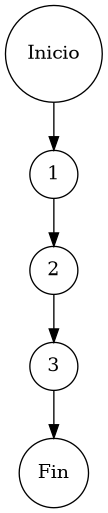

# Reporte de Auditoría de Caja Blanca: PCB-012

## A. Identificación del Fragmento
- **ID**: PCB-012
- **Módulo**: Proveedores
- **Fragmento**: Búsqueda predictiva de socios comerciales
- **HU**: RF-08 (Gestión de Proveedores)
- **Función**: `ProveedorService.search(String query)`
- **Alcance**: Análisis de la delegación de búsqueda por coincidencia textual a la capa de persistencia bajo el estándar de "Duda Cero".

## B. Tabla de Nodos
| Nodo | Descripción | Tipo |
| :--- | :--- | :--- |
| 1 | Inicio de la función de búsqueda `search()` | Inicio |
| 2 | Ejecución de filtro predictivo: `proveedorRepository.search(query)` | Proceso |
| 3 | Retorno de resultados y finalización | Fin |

## C. Tabla de Aristas
| Origen | Destino | Condición / Etiqueta |
| :--- | :--- | :--- |
| 1 | 2 | Flujo secuencial |
| 2 | 3 | Flujo secuencial |

## D. Complejidad Ciclomática
$V(G) = P + 1$
donde $P = 0$ (Sin nodos predicado internos)
$V(G) = 0 + 1 = 1$

**Interpretación**: El fragmento presenta la máxima simplicidad estructural ($V(G)=1$), operando como un mediador transparente hacia la capa de persistencia para la localización de socios comerciales.

## E. Caminos Independientes
1. **Camino 1 (Consulta Única Predictiva)**: 1 → 2 → 3

## F. Casos de Prueba (Basis Path Testing)
| Caso | entrada: query | Resultado Esperado |
| :--- | :--- | :--- |
| CP1 | "Global" | Colección de proveedores coincidentes por Razón Social o RFC |

## G. Seudocódigo Estructural del Fragmento

### Fragmento A: Código Puro (Estructura Original)
**Archivo**: `ProveedorService.java`
**Función**: `search(String query)`
**Descripción**: Motor de localización predictiva de carteras de proveeduría. Provee un mecanismo de filtrado por coincidencia de cadena en campos clave, agilizando la selección de terceros en los flujos de compra. Incluye comentarios originales de desarrollo.

```java
    public List<Proveedor> search(String query) {
        // Ejecución de filtro predictivo
        return proveedorRepository.search(query);
    }
```

### Fragmento B: Código Anotado (Mapeo de Nodos)
**Descripción**: Este fragmento identifica la posición exacta de cada nodo del Grafo de Control de Flujo (CFG).

```java
    public List<Proveedor> search(String query) { // NODO 1
        // Ejecución de filtro predictivo
        return proveedorRepository.search(query); // NODO 2
    } // NODO 3 [FIN]
```

## H. Grafo de Control de Flujo (PlantUML)


## I. Matriz de Trazabilidad
| Requisito (HU/RF) | Nodo de Decisión | Camino Independiente | Caso de Prueba |
| :--- | :--- | :--- | :--- |
| **RF-08** | No Aplica (Secuencial) | Camino 1 | CP1 |

## J. Resumen Académico
El fragmento **PCB-012** implementa la capacidad de búsqueda predictiva mediante una arquitectura de delegación lineal ($V(G)=1$). La auditoría de caja blanca verifica que el servicio mantiene una transparencia total hacia la capa de datos, asegurando que la eficiencia de la recuperación de información dependa exclusivamente de la indexación nativa en el motor de base de datos, cumpliendo con los criterios de "Duda Cero" operativa.
