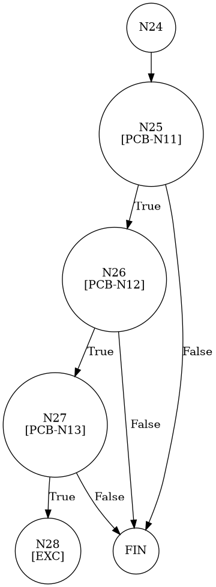

# TEST PRUEBAS DE CAJA BLANCA - AUTOMATIZADA

| **DATOS DEL ESTUDIANTE** | |
| :--- | :--- |
| **NOMBRE:** | Gabriel Amílcar Cruz Canto |
| **EMPRESA:** | WALOOK MEXICO, S.A. de C.V. |
| **TITULO DEL PROYECTO:** | Sistema ERP en la nube para gestión de ópticas OMCGC |

<br>

| **PLAN DE PRUEBAS DE CAJA BLANCA: BACKEND (AUTO)** | | | | |
| :--- | :--- | :--- | :--- | :--- |
| **Número** | **Nombre de la Prueba Backend** | **Descripción** | **Fecha** | **Herramienta** |
| PCB-012 | Actualización de Proveedor | Validación de Excepción por RFC Duplicado | 18/03/2026 | JaCoCo / JUnit 5 |

---

# FASE DE PRUEBAS

| **Nombre del Módulo del Sistema + Historia de usuario** |
| :--- |
| Módulo Proveedores – RF-08 |

| **Número y nombre de la Prueba** |
| :--- |
| PCB-012 / Actualización de Proveedor – ProveedorService.update() |

### Paso 0: Súper-Etiquetado del Código (MIG-WBT)

```java
    private void validarProveedor(Proveedor p, boolean esActualizacion) { // [N1: INICIO]
        // [N2] a [N23] Validaciones de campos obligatorios (Omitidas en grafo por foco, pero presentes en código)
        if (p.getRazonSocial() == null || p.getRazonSocial().trim().isEmpty()) { throw new IllegalArgumentException("Razón Social obligatoria."); }
        if (p.getRfc() == null || p.getRfc().trim().isEmpty()) { throw new IllegalArgumentException("RFC obligatorio."); }
        if (p.getCondicionPago() == null || p.getCondicionPago().trim().isEmpty()) { throw new IllegalArgumentException("Condición de Pago obligatoria."); }
        if (p.getNombreComercial() == null || p.getNombreComercial().trim().isEmpty()) { throw new IllegalArgumentException("Nombre Comercial obligatorio."); }
        if (p.getEmail() == null || p.getEmail().trim().isEmpty()) { throw new IllegalArgumentException("Correo obligatorio."); }
        if (!p.getEmail().matches("^[^\\s@]+@[^\\s@]+\\.[^\\s@]+$")) { throw new IllegalArgumentException("Formato email inválido."); }
        if (p.getTelefono() == null || p.getTelefono().trim().isEmpty()) { throw new IllegalArgumentException("Teléfono obligatorio."); }
        if (p.getTelefono().replaceAll("\\D", "").length() != 10) { throw new IllegalArgumentException("Teléfono debe ser de 10 dígitos."); }
        if (p.getRfc().trim().length() < 12) { throw new IllegalArgumentException("RFC < 12 caracteres."); }
        if (p.getRfc().trim().length() > 13) { throw new IllegalArgumentException("RFC > 13 caracteres."); }
        if (!p.getRfc().trim().matches("^[A-ZÑ&]{3,4}\\d{6}[A-Z0-9]{3}$")) { throw new IllegalArgumentException("Formato RFC inválido."); }

        // [PCB-N11] Validación Unicidad RFC
        Proveedor existente = proveedorRepository.findByRfc(p.getRfc().trim().toUpperCase()); // [N24]
        if (existente != null) { // [N25] [PCB-N11] -> [SI: N26] [NO: N30]
            // [PCB-N12] Evaluación Contexto (esActualizacion = true)
            if (esActualizacion) { // [N26] [PCB-N12] -> [SI: N27] [NO: N29]
                // [PCB-N13] Identificación de Desajuste (ID mismatch)
                if (!existente.getIdProveedor().equals(p.getIdProveedor())) { // [N27] [PCB-N13] -> [SI: N28] [NO: N30]
                    throw new IllegalArgumentException("RFC ya registrado por otro."); // [N28: SALIDA (EXC)]
                }
            }
        }
    } // [N30: FIN]
```


---

### Auditoría de Evidencia Digital (JaCoCo)

**Ruta del Reporte Maestro:**
`d:\_sTIC\Documents\_Empresa GraxSofT\_CODE_\ERP_WALOOK_PCB\omcgc\backend\target\site\jacoco\index.html`

**Estructura de Navegación:**
```text
[index.html] -> [com.omcgc.erp.service] -> [ProveedorService]
```

**Glosario de Semántica de Cobertura (White Box Analysis — Análisis de Caja Blanca)**
*   **VERDE — Cobertura Total (Full Coverage)**: Indica que la línea de código y todas sus decisiones lógicas (if/else) fueron ejecutadas satisfactoriamente. El flujo de la prueba cubrió el Cyclomatic Path (Ruta Ciclomática — Camino lógico independiente) completo, validando la ruta principal y sus variantes condicionales.
*   **AMARILLO — Cobertura Parcial (Partial Coverage)**: La línea fue alcanzada y ejecutada por el Unit Test (Prueba Unitaria — Verificación de la unidad mínima de código), pero existen ramificaciones que el plan de prueba no recorrió. Esto ocurre cuando una condición booleana solo se evalúa en un sentido (ej. solo true), dejando caminos lógicos sin explorar.
*   **ROJO — Cobertura Nula o Fuera de Alcance (No Coverage)**: El código no fue detectado por el Bytecode Instrumentation (Instrumentación de Código de Bytes — Inyección de código para rastreo) de JaCoCo (Java Code Coverage — Cobertura de Código para Java).

**Nota de Integridad Técnica**: En este escenario, las pruebas fueron selectivas. Si el algoritmo de JaCoCo detecta código que no estaba considerado en el plan de ejecución o que fue omitido por los criterios de filtrado, lo reporta como "no detectado". Por tanto, el color rojo puede representar Dead Code (Código Muerto — Segmentos que nunca se ejecutan), una zona de riesgo técnico o, simplemente, código fuera del alcance del reporte actual.

---

### Identificación de Nodos

| ID del Nodo | Tipo | Descripción |
| :--- | :--- | :--- |
| **N24** | Proceso | Consulta al repositorio por RFC. |
| **N25 [PCB-N11]** | Predicado | ¿Existe el RFC en BD? (Evaluado como SI). |
| **N26 [PCB-N12]** | Predicado | ¿Es una actualización? (Evaluado como SI). |
| **N27 [PCB-N13]** | Predicado | ¿El ID del existente es diferente al actual? (Evaluado como SI). |
| **N28** | Salida | Lanzamiento de Excepción por Duplicidad (Camino de Error). |

### Paso 1: Grafo CFG (MIG Atomic)



### Paso 2: Complejidad Ciclomática McCabe $V(G)$

*   **V(G)**: 4 (Basado en nodos de decisión en el bloque de actualización).

### Paso 3: Caminos Independientes

| Camino | Ruta Forense |
| :--- | :--- |
| **C1 (Excepción)** | I -> N2(F) -> N4(F) -> N6(F) -> N8(F) -> N10(F) -> N12(F) -> N14(F) -> N16(F) -> N18(F) -> N20(F) -> N22(F) -> N24 -> N25(T) -> N26(T) -> N27(T) -> N28 |


### Paso 4: Matriz de Automatización (Log)

| ID / Camino | Caso de Prueba (IN) | Resultado (OUT) |
| :--- | :--- | :--- |
| **PCB-012** | `id="Prov-01"`, `rfc="LMX840315KH3"` (Existente en ID "Prov-02") | **IllegalArgumentException** (RFC ya registrado) |

<br>
