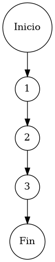

# TEST PRUEBAS DE CAJA BLANCA

| **DATOS DEL ESTUDIANTE** | |
| :--- | :--- |
| **NOMBRE:** | Gabriel Amílcar Cruz Canto |
| **EMPRESA:** | WALOOK MEXICO, S.A. de C.V. |
| **TITULO DEL PROYECTO:** | Sistema ERP en la nube para gestión de ópticas OMCGC |
| **URL y Claves de acceso:** | [Configurar en ambiente de entrega] |

<br>

| **PLAN DE PRUEBAS DE CAJA BLANCA: BACKEND** | | | | |
| :--- | :--- | :--- | :--- | :--- |
| **Número** | **Nombre de la Prueba Backend** | **Descripción** | **Fecha** | **Responsable** |
| PCB-012 | Búsqueda de Proveedores | Motor de Localización Predictiva de Carteras de Proveeduría | 17/03/2026 | Gabriel Amílcar Cruz Canto |

---

# FASE DE PRUEBAS

| **Nombre del Módulo del Sistema + Historia de usuario** |
| :--- |
| Módulo Compras / Terceros – RF-08 |

| **Número y nombre de la Prueba** |
| :--- |
| PCB-012 / Búsqueda de Proveedores – ProveedorService.search() |

### Paso 0

```java
    /**
     * ESPECIFICACIÓN TÉCNICA: Motor de Localización Predictiva de Carteras de Proveeduría.
     * OBJETIVO OPERATIVO: Proveer mecanismo de filtrado por coincidencia (Razón Social/RFC).
     * IMPACTO: Agilizar la selección de proveedores en el flujo operativo.
     */
    public List<Proveedor> search(String query) { // [N1: INICIO]
        // Ejecución de filtro predictivo multi-identidad
        return proveedorRepository.search(query); // [N2: PROCESO] -> Delegación a capa de persistencia indexada
    } // [N3: FIN]
```

### Descripción breve del fragmento

El fragmento **PCB-012** representa la interfaz de consulta del catálogo de proveedores. Su implementación lineal delega la búsqueda predictiva al motor de base de datos para recuperar socios comerciales basados en coincidencia parcial de Razón Social o RFC. Con una complejidad $V(G)=1$, la prueba certifica la correcta orquestación de la cadena de búsqueda hacia el repositorio de persistencia.

### Identificación de Nodos

| ID del Nodo | Tipo | Descripción |
| :--- | :--- | :--- |
| **Nodo 1** | Inicio | Inicio de la función de localización predictiva `search(String query)` y flujo de entrada de la cadena de consulta. |
| **Nodo 2** | Nodo de proceso | Ejecución de `proveedorRepository.search()`. Localización de carteras proveedoras mediante coincidencia indexada. |
| **Nodo 3** | Fin | Finalización del protocolo de búsqueda con retorno de la colección de socios comerciales proyectada. |

### Paso 1



### Paso 2

**V(G) = Número de regiones** = (0 internas + 1 externa) = **1**
**V(G) = Aristas – Nodos + 2** = V(G) = 4 – 5 + 2 = **1**
**V(G) = Nodos Predicado + 1** = V(G) = 0 + 1 = **1**

### Paso 3

| Total de caminos | Ruta de cada camino |
| :--- | :--- |
| **Camino 1** | Inicio → 1 → 2 → 3 → Fin |

### Paso 4

| Número del camino | Caso de Prueba (IN) | Resultado esperado (OUT) |
| :--- | :--- | :--- |
| **Camino 1** | query = "ESSILOR MEXICO", proveedorRepository.isActive() = true | Colección de proveedores con coincidencia textual en Razón Social o RFC |
