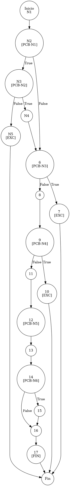

# TEST PRUEBAS DE CAJA BLANCA - AUTOMATIZADA

| **DATOS DEL ESTUDIANTE** | |
| :--- | :--- |
| **NOMBRE:** | Gabriel Amílcar Cruz Canto |
| **EMPRESA:** | WALOOK MEXICO, S.A. de C.V. |
| **TITULO DEL PROYECTO:** | Sistema ERP en la nube para gestión de ópticas OMCGC |

<br>

| **PLAN DE PRUEBAS DE CAJA BLANCA: BACKEND (AUTO)** | | | | |
| :--- | :--- | :--- | :--- | :--- |
| **Número** | **Nombre de la Prueba Backend** | **Descripción** | **Fecha** | **Herramienta** |
| PCB-013 | Registro de Usuario | Validación de Excepción por Correo Duplicado | 18/03/2026 | JaCoCo / JUnit 5 |

---

# FASE DE PRUEBAS

| **Nombre del Módulo del Sistema + Historia de usuario** |
| :--- |
| Módulo Seguridad y Acceso – HU-M01-03 |

| **Número y nombre de la Prueba** |
| :--- |
| PCB-013 / Registro de Usuario – UsuarioService.create() |

### Paso 0: Súper-Etiquetado del Código (MIG-WBT)

```java
    public Usuario create(Usuario usuario) { // [N1: INICIO]
        // [PCB-N1] Validación Username Null
        if (usuario.getUsuario() == null || usuario.getUsuario().trim().isEmpty()) { // [N2] [PCB-N1] -> [SI: N3] [NO: N6]
            // [PCB-N2] Intento de autogeneración vía Email
            if (usuario.getCorreo() != null && !usuario.getCorreo().trim().isEmpty()) { // [N3] [PCB-N2] -> [SI: N4] [NO: N5]
                String generatedUser = usuario.getCorreo().split("@")[0]; // [N4]
                usuario.setUsuario(generatedUser);
            } else {
                throw new IllegalArgumentException("Username/Correo obligatorio"); // [N5: SALIDA (EXC)]
            }
        }

        // [PCB-N3] Validación Correo Null
        if (usuario.getCorreo() == null || usuario.getCorreo().trim().isEmpty()) { // [N6] [PCB-N3] -> [SI: N7] [NO: N8]
            throw new IllegalArgumentException("El correo es obligatorio"); // [N7: SALIDA (EXC)]
        }

        // [PCB-N4] Validación Unicidad Correo
        Usuario existente = usuarioRepository.findByEmail(usuario.getCorreo()); // [N8: PROCESO]
        if (existente != null) { // [N9] [PCB-N4] -> [SI: N10] [NO: N11]
            throw new IllegalArgumentException("El correo electrónico ya está registrado"); // [N10: SALIDA (EXC)]
        }

        // [N11: PROCESO - GENERACIÓN DE IDENTIDAD Y CIFRADO]
        usuario.setId(UUID.randomUUID().toString());
        
        // [PCB-N5] Selección de Password (Manual vs Temporal)
        String passwordTemporal = usuario.getPassword() != null ? usuario.getPassword() : "Temp123!"; // [N12] [PCB-N5] -> [N13]
        usuario.setPassword(passwordEncoder.encode(passwordTemporal)); // [N13]
        usuario.setPasswordTemp(passwordTemporal);

        // [PCB-N6] Estatus por defecto
        if (usuario.getEstatus() == null) { // [N14] [PCB-N6] -> [SI: N15] [NO: N16]
            usuario.setEstatus("activo"); // [N15]
        }

        return usuarioRepository.save(usuario); // [N16] -> [N17: FIN]
    }
```


---

### Auditoría de Evidencia Digital (JaCoCo)

**Ruta del Reporte Maestro:**
`d:\_sTIC\Documents\_Empresa GraxSofT\_CODE_\ERP_WALOOK_PCB\omcgc\backend\target\site\jacoco\index.html`

**Estructura de Navegación (Tree View):**
```text
[index.html] -> [com.omcgc.erp.service] -> [UsuarioService]
```

---

---

### Identificación de Nodos

| ID del Nodo | Tipo | Descripción |
| :--- | :--- | :--- |
| **N1** | Inicio | Comienzo del método `create`. |
| **N2 [PCB-N1]** | Predicado | ¿El username es nulo o vacío? |
| **N3 [PCB-N2]** | Predicado | ¿El correo existe para autogenerar username? |
| **N4** | Proceso | Autogeneración de username (`split("@")[0]`). |
| **N5** | Salida | Excepción: "Username/Correo obligatorio". |
| **N6 [PCB-N3]** | Predicado | ¿El correo es nulo o vacío? |
| **N7** | Salida | Excepción: "El correo es obligatorio". |
| **N8** | Proceso | Consulta de unicidad de email en Repositorio. |
| **N9 [PCB-N4]** | Predicado | ¿El correo ya existe en BD? (Evaluado como SI para este test). |
| **N10** | Salida | Excepción: "El correo electrónico ya está registrado". |
| **N11** | Proceso | Generación de UUID para el ID de usuario. |
| **N12 [PCB-N5]** | Predicado | ¿El password viene definido en el objeto? |
| **N13** | Proceso | Encriptado de contraseña (BCrypt). |
| **N14 [PCB-N6]** | Predicado | ¿El estatus es nulo? |
| **N15** | Proceso | Asignación de estatus "activo" por defecto. |
| **N16** | Proceso | Envío a repositorio (`save`). |
| **N17** | Fin | Término del flujo de creación. |

### Paso 1: Grafo de Flujo (CFG)



### Paso 2: Complejidad Ciclomática McCabe $V(G)$

*   **V(G)** = Nodos Predicado + 1 = 6 + 1 = **7**

### Paso 3: Caminos Independientes

| Camino | Ruta Forense |
| :--- | :--- |
| **C1** | I -> N2(T) -> N3(F) -> N5 -> F |
| **C2** | I -> N2(F) -> N6(T) -> N7 -> F |
| **C3** | I -> N2(F) -> N6(F) -> N8 -> N9(T) -> N10 -> F |
| **C4** | I -> N2(F) -> N6(F) -> N8 -> N9(F) -> N11 -> N12 -> N13 -> N14(T) -> N15 -> N16 -> N17 -> F |
| **C5** | I -> N2(F) -> N6(F) -> N8 -> N9(F) -> N11 -> N12 -> N13 -> N14(F) -> N16 -> N17 -> F |
| **C6** | I -> N2(T) -> N3(T) -> N4 -> N6(F) -> N8 -> N9(F) -> N11 -> N12 -> N13 -> N14(T) -> N15 -> N16 -> N17 -> F |
| **C7** | I -> N2(T) -> N3(T) -> N4 -> N6(T) -> N7 -> F |


### Paso 4: Matriz de Automatización (Log)

| **PCB-013** | `correo="caja@test.com"`, `nombre="Cajero Uno"` (Existente en DB) | **IllegalArgumentException** (Correo ya registrado) |

Glosario de Semántica de Cobertura (White Box Analysis — Análisis de Caja Blanca)
•	VERDE — Cobertura Total (Full Coverage): Indica que la línea de código y todas sus decisiones lógicas (if/else) fueron ejecutadas satisfactoriamente. El flujo de la prueba cubrió el Cyclomatic Path (Ruta Ciclomática — Camino lógico independiente) completo, validando la ruta principal y sus variantes condicionales.
•	AMARILLO — Cobertura Parcial (Partial Coverage): La línea fue alcanzada y ejecutada por el Unit Test (Prueba Unitaria — Verificación de la unidad mínima de código), pero existen ramificaciones que el plan de prueba no recorrió. Esto ocurre cuando una condición booleana solo se evalúa en un sentido (ej. solo true), dejando caminos lógicos sin explorar.
•	ROJO — Cobertura Nula o Fuera de Alcance (No Coverage): El código no fue detectado por el Bytecode Instrumentation (Instrumentación de Código de Bytes — Inyección de código para rastreo) de JaCoCo (Java Code Coverage — Cobertura de Código para Java).
Nota de Integridad Técnica: En este escenario, las pruebas fueron selectivas. Si el algoritmo de JaCoCo detecta código que no estaba considerado en el plan de ejecución or que fue omitido por los criterios de filtrado, lo reporta como "no detectado". Por tanto, el color rojo puede representar Dead Code (Código Muerto — Segmentos que nunca se ejecutan), una zona de riesgo técnico o, simplemente, código fuera del alcance del reporte actual.

<br>
