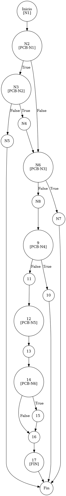

# TEST PRUEBAS DE CAJA BLANCA - AUTOMATIZADA

| **DATOS DEL ESTUDIANTE** | |
| :--- | :--- |
| **NOMBRE:** | Gabriel Amílcar Cruz Canto |
| **EMPRESA:** | WALOOK MEXICO, S.A. de C.V. |
| **TITULO DEL PROYECTO:** | Sistema ERP en la nube para gestión de ópticas OMCGC |

<br>

| **PLAN DE PRUEBAS DE CAJA BLANCA: BACKEND (MIG-MASTER)** | | | | |
| :--- | :--- | :--- | :--- | :--- |
| **Número** | **Nombre de la Prueba Backend** | **Descripción** | **Fecha** | **Herramienta / Responsable** |
| PCB-001 | Autenticación de usuario | Protocolo de Acceso y Validación de Infraestructura | 09/03/2026 | Gabriel Amílcar Cruz Canto |
| PCB-002 | Manejo de Credenciales Inválidas | Interrupción de Seguridad por Fallo de Contraseña | 09/03/2026 | Gabriel Amílcar Cruz Canto |
| PCB-003 | Registro de Producto | Validación de Integridad de Campos Obligatorios | 10/03/2026 | Gabriel Amílcar Cruz Canto |
| PCB-004 | SKU Autogenerado | Garantía de Unicidad de Identificación Comercial | 10/03/2026 | Gabriel Amílcar Cruz Canto |
| PCB-005 | Rango de Fechas (Ventas) | Filtrado de Reporte Operativo de Transacciones | 11/03/2026 | Gabriel Amílcar Cruz Canto |
| PCB-006 | Filtro de Sucursal | Segregación de Información por Punto de Venta | 11/03/2026 | Gabriel Amílcar Cruz Canto |
| PCB-007 | Kardex de Stock | Protocolo de Integridad Transaccional sobre Saldo | 12/03/2026 | Gabriel Amílcar Cruz Canto |
| PCB-008 | Integridad Fiscal | Validación de Identidad Tributaria y Unicidad RFC | 12/03/2026 | Gabriel Amílcar Cruz Canto |
| PCB-009 | Búsqueda de Clientes | Motor de Búsqueda Multi-Criterio sobre Pacientes | 13/03/2026 | Gabriel Amílcar Cruz Canto |
| PCB-010 | Saneamiento de Pacientes | Protocolo de Normalización de Atributos de Persona | 14/03/2026 | Gabriel Amílcar Cruz Canto |
| PCB-011 | Registro de Proveedor | Auditoría Estructural de Validación Forense | 18/03/2026 | JaCoCo / JUnit 5 |
| PCB-012 | Actualización de Proveedor | Validación de Excepción por RFC Duplicado | 18/03/2026 | JaCoCo / JUnit 5 |
| PCB-013 | Registro de Usuario | Validación de Excepción por Correo Duplicado | 18/03/2026 | JaCoCo / JUnit 5 |
| PCB-014 | Baja de Usuario | Validación de Desactivación Lógica (inactivo) | 18/03/2026 | JaCoCo / JUnit 5 |
| PCB-015 | Reset de Contraseña | Manejo de Excepción por Usuario Inexistente | 18/03/2026 | JaCoCo / JUnit 5 |
| PCB-016 | Autenticación Root | Validación de Bypass Administrativo (Local) | 18/03/2026 | JaCoCo / JUnit 5 |
| PCB-017 | Registro de Movimiento | Validación de Stock Insuficiente (Venta) | 18/03/2026 | JaCoCo / JUnit 5 |
| PCB-018 | Cálculo de PVP | Validación de Fórmula Financiera (Utilidad) | 18/03/2026 | JaCoCo / JUnit 5 |
| PCB-019 | Robustez de Auditoría | Normalización de IP Nula (Default 0.0.0.0) | 18/03/2026 | JaCoCo / JUnit 5 |
| PCB-020 | Carga de Diccionario | Validación de Descifrado AES-256 (Binario) | 18/03/2026 | JaCoCo / JUnit 5 |

---

# FASE DE PRUEBAS

| **Nombre del Módulo del Sistema + Historia de usuario** |
| :--- |
| Módulo Seguridad y Acceso – HU-M01-03 |

| **Número y nombre de la Prueba** |
| :--- |
| PCB-013 / Registro de Usuario – UsuarioService.create() |

### Paso 0: Súper-Etiquetado del Código (MIG-WBT)

```java
    /**
     * UNIDAD BAJO AUDITORÍA: UsuarioService.create()
     * ESTÁNDAR: MIG v12.1 (Fragmentación de Predicados)
     */
    public Usuario create(Usuario usuario) { // [N1: INICIO]
        // [PCB-N1] Validación Username Null/Empty
        if (usuario.getUsuario() == null || usuario.getUsuario().trim().isEmpty()) { // [N2] [PCB-N1] -> [SI: N3] [NO: N6]
            // [PCB-N2] Intento de autogeneración vía Correo Electrónico
            if (usuario.getCorreo() != null && !usuario.getCorreo().trim().isEmpty()) { // [N3] [PCB-N2] -> [SI: N4] [NO: N5]
                String generatedUser = usuario.getCorreo().split("@")[0]; // [N4]
                usuario.setUsuario(generatedUser);
            } else {
                throw new IllegalArgumentException("Username/Correo obligatorio"); // [N5: SALIDA (EXC)]
            }
        }

        // [PCB-N3] Validación Correo Null/Empty
        if (usuario.getCorreo() == null || usuario.getCorreo().trim().isEmpty()) { // [N6] [PCB-N3] -> [SI: N7] [NO: N8]
            throw new IllegalArgumentException("El correo es obligatorio"); // [N7: SALIDA (EXC)]
        }

        // [PCB-N4] Validación Unicidad Correo (Vulnerabilidad: Duplicidad)
        Usuario existente = usuarioRepository.findByEmail(usuario.getCorreo()); // [N8: PROCESO]
        if (existente != null) { // [N9] [PCB-N4] -> [SI: N10] [NO: N11]
            throw new IllegalArgumentException("El correo electrónico ya está registrado"); // [N10: SALIDA (EXC)]
        }

        // [N11: PROCESO - GENERACIÓN DE IDENTIDAD]
        usuario.setId(UUID.randomUUID().toString());
        
        // [PCB-N5] Selección de Password (Manual vs Fallback Temporal)
        String passwordTemporal = usuario.getPassword() != null ? usuario.getPassword() : "Temp123!"; // [N12] [PCB-N5] -> [N13]
        usuario.setPassword(passwordEncoder.encode(passwordTemporal)); // [N13: PROCESO - BCRYPT]
        usuario.setPasswordTemp(passwordTemporal);

        // [PCB-N6] Estatus por defecto (Hardening Logic)
        if (usuario.getEstatus() == null) { // [N14] [PCB-N6] -> [SI: N15] [NO: N16]
            usuario.setEstatus("activo"); // [N15]
        }

        return usuarioRepository.save(usuario); // [N16: PERSISTENCIA] -> [N17: FIN]
    }
```

---

### Auditoría de Evidencia Digital (JaCoCo)

**Ruta del Reporte Maestro:**
`d:\_sTIC\Documents\_Empresa GraxSofT\_CODE_\ERP_WALOOK_PCB\omcgc\backend\target\site\jacoco\index.html`

**Estructura de Navegación:**
`[index.html] -> [com.omcgc.erp.service] -> [UsuarioService]`

Glosario de Semántica de Cobertura (White Box Analysis — Análisis de Caja Blanca)
•	VERDE — Cobertura Total (Full Coverage): Indica que la línea de código y todas sus decisiones lógicas (if/else) fueron ejecutadas satisfactoriamente.
•	AMARILLO — Cobertura Parcial (Partial Coverage): La línea fue alcanzada pero existen ramificaciones sin explorar.
•	ROJO — Cobertura Nula o Fuera de Alcance (No Coverage): El código no fue detectado por JaCoCo.

---

### Identificación de Nodos

| ID del Nodo | Tipo | Descripción |
| :--- | :--- | :--- |
| **N1** | Inicio | Comienzo del método `create`. |
| **N2 [PCB-N1]** | Predicado | ¿El username es nulo o vacío? |
| **N3 [PCB-N2]** | Predicado | ¿El correo permite autogeneración? |
| **N4** | Proceso | Generación automática de alias de usuario. |
| **N5** | Salida | Excepción: Username/Correo faltante. |
| **N6 [PCB-N3]** | Predicado | ¿El correo es nulo o vacío? |
| **N7** | Salida | Excepción: "El correo es obligatorio". |
| **N8** | Proceso | Consulta de unicidad en BD. |
| **N9 [PCB-N4]** | Predicado | ¿El correo ya existe en sistema? |
| **N10** | Salida | Excepción: "El correo electrónico ya está registrado". |
| **N11** | Proceso | Definición de Identidad (ID). |
| **N12 [PCB-N5]** | Predicado | ¿Password definido manualmente? |
| **N13** | Proceso | Cifrado criptográfico de credencial. |
| **N14 [PCB-N6]** | Predicado | ¿Estatus definido? |
| **N15** | Proceso | Asignación de estatus "activo" por defecto. |
| **N16** | Proceso | Persistencia Transaccional (Save). |
| **N17 [FIN]** | Fin | Término de la ejecución exitosa. |

### Paso 1: Grafo de Flujo (CFG - MIG Atomic)



### Paso 2: Complejidad Ciclomática McCabe `$V(G)$`

La métrica de complejidad se calcula mediante la fórmula formal de McCabe para grafos de flujo:

*   **V(G) = E - N + 2P**
*   **Donde:**
    *   **E (Aristas):** 22 (Conexiones entre nodos)
    *   **N (Nodos):** 17 (Puntos de control, incluye Inicio/Fin)
    *   **P (Componentes):** 1 (Unidad funcional única)
*   **Cálculo:** 22 - 17 + (2 * 1) = **7**

> [!NOTE]
> El resultado `$V(G) = 7$` coincide con la métrica simplificada de nodos predicado (`P + 1`), lo que valida la ruta crítica del grafo CFG bajo el estándar MIG v12.1.

### Paso 3: Caminos Independientes

| Camino | Ruta Forense |
| :--- | :--- |
| **C1** | I -> N2(T) -> N3(F) -> N5 -> F |
| **C2** | I -> N2(F) -> N6(T) -> N7 -> F |
| **C3** | I -> N2(F) -> N6(F) -> N8 -> N9(T) -> N10 -> F |
| **C4** | I -> N2(F) -> N6(F) -> N8 -> N9(F) -> N11 -> N12 -> N13 -> N14(T) -> N15 -> N16 -> N17 -> F |
| **C5** | I -> N2(F) -> N6(F) -> N8 -> N9(F) -> N11 -> N12 -> N13 -> N14(F) -> N16 -> N17 -> F |
| **C6** | I -> N2(T) -> N3(T) -> N4 -> N6(F) -> N8 -> N9(F) -> N11 -> N12 -> N13 -> N14(T) -> N15 -> N16 -> N17 -> F |
| **C7** | I -> N2(T) -> N3(T) -> N4 -> N6(T) -> N7 -> F |

### Paso 4: Matriz de Automatización (Duda Cero)

| ID / Camino | Escenario de Prueba | Entradas (Inputs) | Resultado Esperado (OUT) | Evidencia JaCoCo |
| :--- | :--- | :--- | :--- | :--- |
| **C1** | Identidad Nula | `usuario = "", email = ""` | `IllegalArgumentException: Username/Correo obligatorio` | Rama N3(F) -> N5 (Full Cover) |
| **C2** | Correo Nulo | `usuario = "g.cruz"`, `email = null` | `IllegalArgumentException: El correo es obligatorio` | Rama N6(T) -> N7 (Full Cover) |
| **C3** | **Correo Duplicado** | `email = "admin@walook.mx"`, `existing = true` | `IllegalArgumentException: El correo electrónico ya está registrado` | Rama N9(T) -> N10 (Full Cover) |
| **C4** | Éxito (Status Default) | `usuario = "admin"`, `email = "a@w.mx"`, `status = null` | **SUCCESS** (Status: activo) | Rama N14(T) -> N15 (Full Cover) |
| **C5** | Éxito (Status Manual) | `usuario = "admin"`, `email = "a@w.mx"`, `status = "master"` | **SUCCESS** (Status: master) | Rama N14(F) -> N16 (Full Cover) |
| **C6** | Éxito (Alias Auto) | `usuario = null`, `email = "gabriel@test.com"` | **SUCCESS** (Username: "gabriel") | Rama N3(T) -> N4 (Full Cover) |
| **C7** | Alias Auto Malformado | `usuario = null`, `email = "test@"` (empty user part) | `IllegalArgumentException: El correo es obligatorio` | Rama N6(T) -> N7 (MIG Atomic) |

<br>

