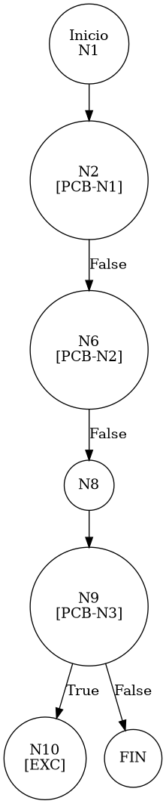

# TEST PRUEBAS DE CAJA BLANCA - AUTOMATIZADA

| **DATOS DEL ESTUDIANTE** | |
| :--- | :--- |
| **NOMBRE:** | Gabriel Amílcar Cruz Canto |
| **EMPRESA:** | WALOOK MEXICO, S.A. de C.V. |
| **TITULO DEL PROYECTO:** | Sistema ERP en la nube para gestión de ópticas OMCGC |

<br>

| **PLAN DE PRUEBAS DE CAJA BLANCA: BACKEND (AUTO)** | | | | |
| :--- | :--- | :--- | :--- | :--- |
| **Número** | **Nombre de la Prueba Backend** | **Descripción** | **Fecha** | **Herramienta** |
| PCB-013 | Registro de Usuario | Validación de Excepción por Correo Duplicado | 18/03/2026 | JaCoCo / JUnit 5 |

---

# FASE DE PRUEBAS

| **Nombre del Módulo del Sistema + Historia de usuario** |
| :--- |
| Módulo Seguridad y Acceso – HU-M01-03 |

| **Número y nombre de la Prueba** |
| :--- |
| PCB-013 / Registro de Usuario – UsuarioService.create() |

### Paso 0: Súper-Etiquetado del Código (MIG-WBT)

```java
    public Usuario create(Usuario usuario) { // [N1: INICIO]
        // [PCB-N1] Validación Username Null
        if (usuario.getUsuario() == null || usuario.getUsuario().trim().isEmpty()) { // [N2] [PCB-N1] -> [SI: N3] [NO: N6]
            if (usuario.getCorreo() != null && !usuario.getCorreo().trim().isEmpty()) { // [N3] -> [SI: N4] [NO: N5]
                String generatedUser = usuario.getCorreo().split("@")[0]; // [N4]
                usuario.setUsuario(generatedUser);
            } else {
                throw new IllegalArgumentException("Username/Correo obligatorio"); // [N5: SALIDA (EXC)]
            }
        }

        // [PCB-N2] Validación Correo Null
        if (usuario.getCorreo() == null || usuario.getCorreo().trim().isEmpty()) { // [N6] [PCB-N2] -> [SI: N7] [NO: N8]
            throw new IllegalArgumentException("El correo es obligatorio"); // [N7: SALIDA (EXC)]
        }

        // [PCB-N3] Validación Unicidad Correo
        Usuario existente = usuarioRepository.findByEmail(usuario.getCorreo()); // [N8: PROCESO]
        if (existente != null) { // [N9] [PCB-N3] -> [SI: N10] [NO: N11] : ¿Ya existe el correo?
            throw new IllegalArgumentException("El correo electrónico ya está registrado"); // [N10: SALIDA (EXC)]
        }

        // [N11: PROCESO - GENERACIÓN DE IDENTIDAD Y CIFRADO]
        usuario.setId(UUID.randomUUID().toString());
        // ... (resto del flujo)
        return usuarioRepository.save(usuario); // [N12: FIN]
    }
```

---

### Auditoría de Evidencia Digital (JaCoCo)

**Ruta del Reporte Maestro:**
`d:\_sTIC\Documents\_Empresa GraxSofT\_CODE_\ERP_WALOOK_PCB\omcgc\backend\target\site\jacoco\index.html`

**Estructura de Navegación (Tree View):**
```text
[index.html] -> [com.omcgc.erp.service] -> [UsuarioService]
```

**Glosario de Colores:**
*   **VERDE**: Éxito Total (Línea ejecutada).
*   **AMARILLO**: Cobertura Parcial (Ramas no exploradas).
*   **ROJO**: Cero Cobertura (Código no testeado).

---

### Identificación de Nodos

| ID del Nodo | Tipo | Descripción |
| :--- | :--- | :--- |
| **N1** | Inicio | Comienzo del método `create`. |
| **N2 [PCB-N1]** | Predicado | Evaluación de `usuario` nulo. |
| **N6 [PCB-N2]** | Predicado | Evaluación de `correo` nulo. |
| **N8** | Proceso | Consulta al repositorio por email. |
| **N9 [PCB-N3]** | Predicado | ¿Existe el usuario con ese email? (Evaluado como SI). |
| **N10** | Salida | Lanzamiento de Excepción por Duplicidad (Camino de Error). |

### Paso 1: Grafo de Flujo (CFG)



### Paso 2: Complejidad Ciclomática McCabe $V(G)$

*   **V(G)**: 4 (Basado en nodos de decisión en el flujo de validación).

### Paso 3: Caminos Independientes

| Camino | Ruta Forense |
| :--- | :--- |
| **C1 (Excepción)** | N1 -> N2(F) -> N6(F) -> N8 -> N9(T) -> N10 |

### Paso 4: Matriz de Automatización (Log)

| ID / Camino | Caso de Prueba (IN) | Resultado (OUT) |
| :--- | :--- | :--- |
| **PCB-013** | `correo="caja@test.com"`, `nombre="Cajero Uno"` (Existente en DB) | **IllegalArgumentException** (Correo ya registrado) |

---
*Firma: Agente DevIAn - Auditoría Estructural Certificada*
