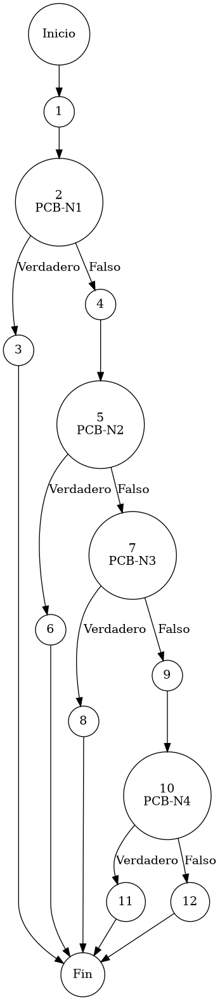

# Reporte de Auditoría de Caja Blanca: PCB-013

## A. Identificación del Fragmento
- **ID**: PCB-013
- **Módulo**: Proveedores
- **Fragmento**: Validación sintáctica de canales de comunicación
- **HU**: RF-08 (Gestión de Proveedores)
- **Función**: `validarProveedor()` (Bloque de Formato)
- **Alcance**: Análisis de la lógica de validación sintáctica (Regex) y normalización telefónica bajo el estándar de "Duda Cero".

## B. Tabla de Nodos
| Nodo | Descripción | Tipo |
| :--- | :--- | :--- |
| 1 | Inicio de la validación de canales de contacto | Inicio |
| 2 | Presencia de Email: `if (p.getEmail() == null || ...)` [PCB-N1] | Predicado |
| 3 | Interrupción por Email ausente: `throw new IllegalArgumentException(...)` | Final (Error 1) |
| 4 | Definición del patrón sintáctico RFC-5322 | Proceso |
| 5 | Conformidad de formato: `if (!p.getEmail().matches(emailPattern))` [PCB-N2] | Predicado |
| 6 | Interrupción por formato de Email inválido: `throw new IllegalArgumentException(...)` | Final (Error 2) |
| 7 | Presencia de Teléfono: `if (p.getTelefono() == null || ...)` [PCB-N3] | Predicado |
| 8 | Interrupción por Teléfono ausente: `throw new IllegalArgumentException(...)` | Final (Error 3) |
| 9 | Saneamiento de Teléfono (Extracción de dígitos numéricos) | Proceso |
| 10 | Verificación de Longitud Estándar (10D): `if (telefonoLimpio.length() != 10)` [PCB-N4] | Predicado |
| 11 | Interrupción por longitud telefónica fuera de rango: `throw new IllegalArgumentException(...)` | Final (Error 4) |
| 12 | Finalización exitosa de la validación de canales | Fin |

## C. Tabla de Aristas
| Origen | Destino | Condición / Etiqueta |
| :--- | :--- | :--- |
| 1 | 2 | Flujo secuencial |
| 2 | 3 | PCB-N1 es Verdadero (La entidad carece de correo electrónico) |
| 2 | 4 | PCB-N1 es Falso (El campo Email está presente) |
| 4 | 5 | Flujo secuencial |
| 5 | 6 | PCB-N2 es Verdadero (El formato no cumple con el estándar RFC-5322) |
| 5 | 7 | PCB-N2 es Falso (El formato de correo es sintácticamente válido) |
| 7 | 8 | PCB-N3 es Verdadero (La entidad carece de medio telefónico) |
| 7 | 9 | PCB-N3 es Falso (El campo Teléfono está presente) |
| 9 | 10 | Flujo secuencial |
| 10 | 11 | PCB-N4 es Verdadero (La cadena numérica es distinta a 10 dígitos) |
| 10 | 12 | PCB-N4 es Falso (La longitud cumple con el estándar de telefonía) |

## D. Complejidad Ciclomática
$V(G) = P + 1$
donde $P = 4$ (Nodos predicado: PCB-N1 al PCB-N4)
$V(G) = 4 + 1 = 5$

**Interpretación**: El análisis de McCabe determina que se requieren 5 caminos independientes para garantizar la cobertura total de la lógica de validación de datos de contacto y notificación del proveedor.

## E. Caminos Independientes
1. **Camino 1 (Omisión de Medio Electrónico)**: 1 → 2(Verdadero) → 3
2. **Camino 2 (Falla en Sintaxis de Correo)**: 1 → 2(Falso) → 4 → 5(Verdadero) → 6
3. **Camino 3 (Omisión de Medio Telefónico)**: 1 → 2(Falso) → 4 → 5(Falso) → 7(Verdadero) → 8
4. **Camino 4 (Falla en Longitud Telefónica)**: 1 → 2(Falso) → 4 → 5(Falso) → 7(Falso) → 9 → 10(Verdadero) → 11
5. **Camino 5 (Validación de Contacto Exitosa)**: 1 → 2(Falso) → 4 → 5(Falso) → 7(Falso) → 9 → 10(Falso) → 12

## F. Casos de Prueba (Basis Path Testing)
| Caso | entrada: Email | entrada: Teléfono | Condición de Control | Resultado Esperado |
| :--- | :--- | :--- | :--- | :--- |
| CP1 | Nulo | "5512345678" | PCB-N1=Verdadero | Excepción: El correo es obligatorio |
| CP2 | "format@inval" | "5512345678" | PCB-N2=Verdadero | Excepción: Formato de correo no válido |
| CP3 | "prov@net.mx" | "" (Vacío) | PCB-N3=Verdadero | Excepción: El teléfono es obligatorio |
| CP4 | "prov@net.mx" | "123-456" | PCB-N4=Verdadero (Long=6) | Excepción: Debe contener 10 dígitos |
| CP5 | "prov@net.mx" | "(55) 1234-5678" | Todo Falso (Saneamiento OK) | Validación Exitosa (Proceder) |

## G. Seudocódigo Estructural del Fragmento

### Fragmento A: Código Puro (Estructura Original)
**Archivo**: `ProveedorService.java`
**Bloque**: Formato / `validarProveedor()`
**Descripción**: Implementa la validación sintáctica de canales de comunicación. Utiliza expresiones regulares para el correo y procesos de saneamiento numérico para teléfonos, mitigando el riesgo de interrupción logística por datos de contacto malformados. Incluye comentarios originales de desarrollo.

```java
    // validación de presencia de medio digital (Email)
    if (p.getEmail() == null || p.getEmail().trim().isEmpty()) {
        throw new IllegalArgumentException("Correo Electrónico: El correo electrónico es obligatorio.");
    }
    
    // validación sintáctica (Regex RFC-5322)
    String emailPattern = "^[^\\s@]+@[^\\s@]+\\.[^\\s@]+$";
    if (!p.getEmail().matches(emailPattern)) {
        throw new IllegalArgumentException("Correo Electrónico: Formato no válido.");
    }

    // validación de presencia de medio telefónico
    if (p.getTelefono() == null || p.getTelefono().trim().isEmpty()) {
        throw new IllegalArgumentException("Teléfono: El teléfono es obligatorio.");
    }
    
    // validación de longitud y saneamiento (Normalización 10D)
    String telefonoLimpio = p.getTelefono().replaceAll("\\D", "");
    if (telefonoLimpio.length() != 10) {
        throw new IllegalArgumentException("Teléfono: El teléfono debe contener exactamente 10 dígitos numéricos.");
    }
```

### Fragmento B: Código Anotado (Mapeo de Nodos)
**Descripción**: Este fragmento incluye los marcadores de control (`PCB-Nx`) para identificar la posición exacta de cada nodo y arista del Grafo de Control de Flujo (CFG).

```java
    // Inicio del bloque de formato // NODO 1

    // PCB-N1: validación de presencia de medio digital (Email)
    if (p.getEmail() == null || p.getEmail().trim().isEmpty()) { // NODO 2 [PREDICADO]
        throw new IllegalArgumentException("Correo Electrónico: El correo electrónico es obligatorio."); // NODO 3 [FIN]
    }
    
    // PCB-N2: validación sintáctica (Regex RFC-5322)
    String emailPattern = "^[^\\s@]+@[^\\s@]+\\.[^\\s@]+$"; // NODO 4
    if (!p.getEmail().matches(emailPattern)) { // NODO 5 [PREDICADO]
        throw new IllegalArgumentException("Correo Electrónico: Formato no válido."); // NODO 6 [FIN]
    }

    // PCB-N3: validación de presencia de medio telefónico
    if (p.getTelefono() == null || p.getTelefono().trim().isEmpty()) { // NODO 7 [PREDICADO]
        throw new IllegalArgumentException("Teléfono: El teléfono es obligatorio."); // NODO 8 [FIN]
    }
    
    // PCB-N4: validación de longitud y saneamiento (Normalización 10D)
    String telefonoLimpio = p.getTelefono().replaceAll("\\D", ""); // NODO 9
    if (telefonoLimpio.length() != 10) { // NODO 10 [PREDICADO]
        throw new IllegalArgumentException("Teléfono: El teléfono debe contener exactamente 10 dígitos numéricos."); // NODO 11 [FIN]
    }

    // Fin de validación // NODO 12 [FIN]
```

## H. Grafo de Control de Flujo (PlantUML)


## I. Matriz de Trazabilidad
| Requisito (HU/RF) | Nodo de Decisión | Camino Independiente | Caso de Prueba |
| :--- | :--- | :--- | :--- |
| **RF-08** | PCB-N1 | Caminos 1, 2, 3, 4, 5 | CP1, CP2, CP3, CP4, CP5 |
| **RF-08** | PCB-N2 | Caminos 2, 3, 4, 5 | CP2, CP3, CP4, CP5 |
| **RF-08** | PCB-N3 | Caminos 3, 4, 5 | CP3, CP4, CP5 |
| **RF-08** | PCB-N4 | Caminos 4, 5 | CP4, CP5 |

## J. Resumen Académico
El fragmento **PCB-013** implementa una validación secuencial y proactiva de canales críticos de comunicación logística. La auditoría de caja blanca verifica que la normalización de caracteres no numéricos telefónicos (PCB-N4) permite una alta tolerancia a formatos diversos, mientras que la rigurosidad sintáctica del correo garantiza la conectividad sistémica con los proveedores. Con una complejidad ciclomática $V(G)=5$, se asegura que ningún proveedor sea persistido sin medios de contacto plenamente válidos bajo el estándar de "Duda Cero".
