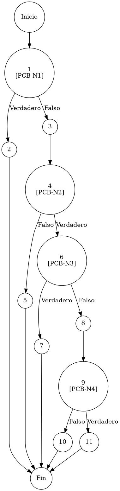

# TEST PRUEBAS DE CAJA BLANCA

| **DATOS DEL ESTUDIANTE** | |
| :--- | :--- |
| **NOMBRE:** | Gabriel Amílcar Cruz Canto |
| **EMPRESA:** | WALOOK MEXICO, S.A. de C.V. |
| **TITULO DEL PROYECTO:** | Sistema ERP en la nube para gestión de ópticas OMCGC |
| **URL y Claves de acceso:** | [Configurar en ambiente de entrega] |

<br>

| **PLAN DE PRUEBAS DE CAJA BLANCA: BACKEND** | | | | |
| :--- | :--- | :--- | :--- | :--- |
| **Número** | **Nombre de la Prueba Backend** | **Descripción** | **Fecha** | **Responsable** |
| PCB-013 | Saneamiento de Proveedores | Validación de Conformidad de Canales de Comunicación | 17/03/2026 | Gabriel Amílcar Cruz Canto |

---

# FASE DE PRUEBAS

| **Nombre del Módulo del Sistema + Historia de usuario** |
| :--- |
| Módulo Compras / Terceros – RF-08 |

| **Número y nombre de la Prueba** |
| :--- |
| PCB-013 / Saneamiento de Proveedores – ProveedorService.validarProveedor() |

### Paso 0

```java
    /**
     * ESPECIFICACIÓN TÉCNICA: Validación de Conformidad de Canales de Comunicación y Notificación.
     * OBJETIVO OPERATIVO: Asegurar que datos de contacto posean formatos internacionales.
     * IMPACTO: Mitigar riesgo de interrupción de comunicación logística por fallos en metadatos.
     */
     
    // [PCB-N1] validación de presencia de medio digital (Email)
    if (p.getEmail() == null || p.getEmail().trim().isEmpty()) { // [N1] [PCB-N1] -> [SI: N2] [NO: N3] : ¿Correo ausente?
        throw new IllegalArgumentException("Correo obligatorio"); // [N2: FIN (EXC)]
    }
    
    // [PCB-N2] validación sintáctica (Regex RFC-5322)
    String emailPattern = "^[^\\s@]+@[^\\s@]+\\.[^\\s@]+$"; // [N3: PROCESO]
    if (!p.getEmail().matches(emailPattern)) { // [N4] [PCB-N2] -> [SI: N6] [NO: N5] : ¿Formato de correo válido?
        throw new IllegalArgumentException("Formato correo no válido"); // [N5: FIN (EXC)]
    }

    // [PCB-N3] validación de presencia de medio telefónico
    if (p.getTelefono() == null || p.getTelefono().trim().isEmpty()) { // [N6] [PCB-N3] -> [SI: N7] [NO: N8] : ¿Teléfono ausente?
        throw new IllegalArgumentException("Teléfono obligatorio"); // [N7: FIN (EXC)]
    }
    
    // [PCB-N4] validación de longitud y saneamiento (Normalización 10D)
    String telefonoLimpio = p.getTelefono().replaceAll("\\D", ""); // [N8: PROCESO]
    if (telefonoLimpio.length() != 10) { // [N9] [PCB-N4] -> [SI: N11] [NO: N10] : ¿Contiene exactamente 10 dígitos?
        throw new IllegalArgumentException("Teléfono debe tener 10 dígitos"); // [N10: FIN (EXC)]
    }
    
    // [N11: FIN]
```

### Descripción breve del fragmento

El fragmento **PCB-013** implementa la lógica de conformidad técnica para los canales de comunicación de proveedores. Realiza verificaciones sintácticas mediante expresiones regulares para el correo electrónico y procesos de saneamiento numérico (Normalización 10D) para el teléfono. Con una complejidad $V(G)=5$, el código asegura la eficacia operativa del sistema en los procesos de notificación y gestión de pedidos internacionales.

### Identificación de Nodos

| ID del Nodo | Tipo | Descripción |
| :--- | :--- | :--- |
| **Nodo 1 [PCB-N1]** | Nodo predicado | Evaluación de la condición `p.getEmail() == null || p.getEmail().trim().isEmpty()`. Identificado con la etiqueta **PCB-N1**. |
| **Nodo 2** | Nodo de salida | Lanzamiento de `IllegalArgumentException("Correo obligatorio")`. Interrupción del flujo por ausencia de canal digital. |
| **Nodo 3** | Nodo de proceso | Definición del patrón sintáctico de cumplimiento mediante expresión regular estándar (RFC-5322). |
| **Nodo 4 [PCB-N2]** | Nodo predicado | Evaluación de la condición `!p.getEmail().matches(emailPattern)`. Verificación sintáctica operativa. Identificado con la etiqueta **PCB-N2**. |
| **Nodo 5** | Nodo de salida | Lanzamiento de `IllegalArgumentException("Formato correo no válido")`. Interrupción por patrón sintáctico ilegal. |
| **Nodo 6 [PCB-N3]** | Nodo predicado | Evaluación de la condición `p.getTelefono() == null || p.getTelefono().trim().isEmpty()`. Identificado con la etiqueta **PCB-N3**. |
| **Nodo 7** | Nodo de salida | Lanzamiento de `IllegalArgumentException("Teléfono obligatorio")`. Interrupción del flujo por ausencia de contacto telefónico. |
| **Nodo 8** | Nodo de proceso | Ejecución de saneamiento proactivo de caracteres no numéricos (Normalización 10D) para persistencia limpia. |
| **Nodo 9 [PCB-N4]** | Nodo predicado | Evaluación de la condición de longitud normativa `telefonoLimpio.length() != 10`. Identificado con la etiqueta **PCB-N4**. |
| **Nodo 10** | Nodo de salida | Lanzamiento de `IllegalArgumentException("Teléfono debe tener 10 dígitos")`. Interrupción por longitud numérica ilegal. |
| **Nodo 11** | Fin | Finalización exitosa del protocolo de validación de conformidad de canales de comunicación y notificación. |

### Paso 1



### Paso 2

**V(G) = Número de regiones** = (4 internas + 1 externa) = **5**
**V(G) = Aristas – Nodos + 2** = V(G) = 16 – 13 + 2 = **5**
**V(G) = Nodos Predicado + 1** = V(G) = 4 + 1 = **5**

### Paso 3

| Total de caminos | Ruta de cada camino |
| :--- | :--- |
| **Camino 1** | Inicio → 1(SÍ) → 2 → Fin |
| **Camino 2** | Inicio → 1(NO) → 3 → 4(NO) → 5 → Fin |
| **Camino 3** | Inicio → 1(NO) → 3 → 4(SÍ) → 6(SÍ) → 7 → Fin |
| **Camino 4** | Inicio → 1(NO) → 3 → 4(SÍ) → 6(NO) → 8 → 9(NO) → 10 → Fin |
| **Camino 5** | Inicio → 1(NO) → 3 → 4(SÍ) → 6(NO) → 8 → 9(SÍ) → 11 → Fin |

### Paso 4

| Número del camino | Caso de Prueba (IN) | Resultado esperado (OUT) |
| :--- | :--- | :--- |
| **Camino 1** | p.email = "" | IllegalArgumentException: Correo obligatorio (PCB-N1: SI) |
| **Camino 2** | p.email = "contacto_sin_arroba" | IllegalArgumentException: Formato correo no válido (PCB-N1: NO, PCB-N2: NO) |
| **Camino 3** | p.email = "contacto@walo.mx", p.telefono = "" | IllegalArgumentException: Teléfono obligatorio (PCB-N1: NO, PCB-N2: SI, PCB-N3: SI) |
| **Camino 4** | p.email = "contacto@walo.mx", p.telefono = "55-12-34" | IllegalArgumentException: Teléfono debe tener 10 dígitos (PCB-N1: NO, PCB-N2: SI, PCB-N3: NO, PCB-N4: NO) |
| **Camino 5** | p.email = "contacto@walo.mx", p.telefono = "(999) 123 4567" | Validación exitosa tras saneamiento (PCB-N1: NO, PCB-N2: SI, PCB-N3: NO, PCB-N4: SI) |
