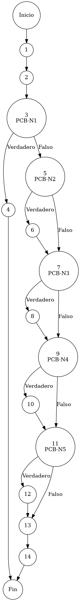

# Reporte de Auditoría de Caja Blanca: PCB-014

## A. Identificación del Fragmento
- **ID**: PCB-014
- **Módulo**: Usuarios
- **Fragmento**: Actualización selectiva de perfil y facultades de rol
- **HU**: HU-M01-03 (Ciclo de Vida del Usuario)
- **Función**: `UsuarioService.update(Usuario usuario)`
- **Alcance**: Análisis de la lógica de actualización atómica de atributos de perfil y roles bajo el estándar de "Duda Cero".

## B. Tabla de Nodos
| Nodo | Descripción | Tipo |
| :--- | :--- | :--- |
| 1 | Inicio de la función de actualización `update()` | Inicio |
| 2 | Recuperación de estado persistente: `usuarioRepository.findById(...)` | Proceso |
| 3 | Validación de existencia: `if (existente == null)` [PCB-N1] | Predicado |
| 4 | Interrupción por usuario inexistente (Retorno Nulo) | Final (Nulo) |
| 5 | Evaluación de cambio nominal: `if (usuario.getNombre() != null)` [PCB-N2] | Predicado |
| 6 | Sincronización de atributo Nombre | Proceso |
| 7 | Evaluación de cambio de identidad: `if (usuario.getCorreo() != null)` [PCB-N3] | Predicado |
| 8 | Sincronización de atributo Correo | Proceso |
| 9 | Evaluación de cambio jerárquico (ID): `if (usuario.getRolId() != null)` [PCB-N4] | Predicado |
| 10 | Sincronización de identificador de Rol | Proceso |
| 11 | Evaluación de denominación operativa: `if (usuario.getRolNombre() != null)` [PCB-N5] | Predicado |
| 12 | Sincronización de nombre descriptivo de Rol | Proceso |
| 13 | Persistencia de cambios atómicos: `usuarioRepository.update(existente)` | Proceso |
| 14 | Finalización y retorno de entidad actualizada | Fin |

## C. Tabla de Aristas
| Origen | Destino | Condición / Etiqueta |
| :--- | :--- | :--- |
| 1 | 2 | Flujo secuencial |
| 2 | 3 | Flujo secuencial |
| 3 | 4 | PCB-N1 es Verdadero (La entidad no reside en el repositorio) |
| 3 | 5 | PCB-N1 es Falso (Referencia de usuario válida) |
| 5 | 6 | PCB-N2 es Verdadero (Se solicita cambio de nombre) |
| 5 | 7 | PCB-N2 es Falso (Atributo sin cambios en el request) |
| 6 | 7 | Flujo secuencial |
| 7 | 8 | PCB-N3 es Verdadero (Se solicita cambio de correo) |
| 7 | 9 | PCB-N3 es Falso (Atributo sin cambios en el request) |
| 8 | 9 | Flujo secuencial |
| 9 | 10 | PCB-N4 es Verdadero (Se solicita cambio de Rol ID) |
| 9 | 11 | PCB-N4 es Falso (Atributo sin cambios en el request) |
| 10 | 11 | Flujo secuencial |
| 11 | 12 | PCB-N5 es Verdadero (Se solicita cambio de Nombre de Rol) |
| 11 | 13 | PCB-N5 es Falso (Atributo sin cambios en el request) |
| 12 | 13 | Flujo secuencial |
| 13 | 14 | Flujo secuencial |

## D. Complejidad Ciclomática
$V(G) = P + 1$
donde $P = 5$ (Nodos predicado: PCB-N1 al PCB-N5)
$V(G) = 5 + 1 = 6$

**Interpretación**: El análisis estructural identifica 6 caminos independientes necesarios para validar el comportamiento resiliente de la actualización parcial (estilo PATCH) ante diversos payloads.

## E. Caminos Independientes
1. **Camino 1 (Falla de Persistencia Inicial)**: 1 → 2 → 3(Verdadero) → 4
2. **Camino 2 (Sincronización de Nombre Únicamente)**: 1 → 2 → 3(F) → 5(V) → 6 → 7(F) → 9(F) → 11(F) → 13 → 14
3. **Camino 3 (Sincronización de Correo Únicamente)**: 1 → 2 → 3(F) → 5(F) → 7(V) → 8 → 9(F) → 11(F) → 13 → 14
4. **Camino 4 (Sincronización de Identificador de Rol)**: 1 → 2 → 3(F) → 5(F) → 7(F) → 9(V) → 10 → 11(F) → 13 → 14
5. **Camino 5 (Sincronización de Denominación de Rol)**: 1 → 2 → 3(F) → 5(F) → 7(F) → 9(F) → 11(V) → 12 → 13 → 14
6. **Camino 6 (Sincronización Integral de Perfil)**: 1 → 2 → 3(F) → 5(V) → 6 → 7(V) → 8 → 9(V) → 10 → 11(V) → 12 → 13 → 14

## F. Casos de Prueba (Basis Path Testing)
| Caso | Existe en BD | Atributos en el Request | Condición Activa | Resultado Esperado |
| :--- | :--- | :--- | :--- | :--- |
| CP1 | No | {id: 999} | PCB-N1=Verdadero | Retorno Nulo (Controlado) |
| CP2 | Sí | {nombre: "Admin"} | PCB-N2=Verdadero | Actualiza solo Nombre |
| CP3 | Sí | {correo: "x@net.mx"} | PCB-N3=Verdadero | Actualiza solo Correo |
| CP4 | Sí | {rolId: "SUPER"} | PCB-N4=Verdadero | Actualiza solo ID de Rol |
| CP5 | Sí | {rolNombre: "Supervisor"} | PCB-N5=Verdadero | Actualiza solo Nombre de Rol |
| CP6 | Sí | Todos los campos | Todas las Falsas (Sinc total) | Actualización completa del perfil |

## G. Seudocódigo Estructural del Fragmento

### Fragmento A: Código Puro (Estructura Original)
**Archivo**: `UsuarioService.java`
**Función**: `update(Usuario usuario)`
**Descripción**: Implementa el protocolo de actualización selectiva de perfil. Permite la modificación granular de atributos de identidad sin comprometer la base criptográfica, filtrando campos nulificados para evitar sobrescrituras de datos no solicitados. Incluye comentarios originales de desarrollo.

```java
    public Usuario update(Usuario usuario) {
        Usuario existente = usuarioRepository.findById(usuario.getId());

        // validación de existencia (Check de persistencia previa)
        if (existente == null) {
            return null;
        }

        // evaluación de actualización nominal (Nombre)
        if (usuario.getNombre() != null) {
            existente.setNombre(usuario.getNombre());
        }
        
        // evaluación de actualización de identidad digital (Correo)
        if (usuario.getCorreo() != null) {
            existente.setCorreo(usuario.getCorreo());
        }
        
        // evaluación de cambio de jerarquía (IdRol)
        if (usuario.getRolId() != null) {
            existente.setRolId(usuario.getRolId());
        }
        
        // evaluación de cambio de denominación operativa (NombreRol)
        if (usuario.getRolNombre() != null) {
            existente.setRolNombre(usuario.getRolNombre());
        }
        
        return usuarioRepository.update(existente);
    }
```

### Fragmento B: Código Anotado (Mapeo de Nodos)
**Descripción**: Este fragmento incluye los marcadores de control (`PCB-Nx`) para identificar la posición exacta de cada nodo y arista del Grafo de Control de Flujo (CFG).

```java
    public Usuario update(Usuario usuario) { // NODO 1
        Usuario existente = usuarioRepository.findById(usuario.getId()); // NODO 2

        // PCB-N1: validación de existencia (Check de persistencia previa)
        if (existente == null) { // NODO 3 [PREDICADO]
            return null; // NODO 4 [FIN]
        }

        // PCB-N2: evaluación de actualización nominal (Nombre)
        if (usuario.getNombre() != null) { // NODO 5 [PREDICADO]
            existente.setNombre(usuario.getNombre()); // NODO 6
        }
        
        // PCB-N3: evaluación de actualización de identidad digital (Correo)
        if (usuario.getCorreo() != null) { // NODO 7 [PREDICADO]
            existente.setCorreo(usuario.getCorreo()); // NODO 8
        }
        
        // PCB-N4: evaluación de cambio de jerarquía (IdRol)
        if (usuario.getRolId() != null) { // NODO 9 [PREDICADO]
            existente.setRolId(usuario.getRolId()); // NODO 10
        }
        
        // PCB-N5: evaluación de cambio de denominación operativa (NombreRol)
        if (usuario.getRolNombre() != null) { // NODO 11 [PREDICADO]
            existente.setRolNombre(usuario.getRolNombre()); // NODO 12
        }
        
        return usuarioRepository.update(existente); // NODO 13
    } // NODO 14 [FIN]
```

## H. Grafo de Control de Flujo (PlantUML)


## I. Matriz de Trazabilidad
| Requisito (HU) | Nodo de Decisión | Camino Independiente | Caso de Prueba |
| :--- | :--- | :--- | :--- |
| **HU-M01-03** | PCB-N1 | Caminos 1 al 6 | CP1, CP2, CP3, CP4, CP5, CP6 |
| **HU-M01-03** | PCB-N2 | Caminos 2, 6 | CP2, CP6 |
| **HU-M01-03** | PCB-N3 | Caminos 3, 6 | CP3, CP6 |
| **HU-M01-03** | PCB-N4 | Caminos 4, 6 | CP4, CP6 |
| **HU-M01-03** | PCB-N5 | Caminos 5, 6 | CP5, CP6 |

## J. Resumen Académico
El fragmento **PCB-014** implementa un patrón robusto de "Actualización Selectiva" con una complejidad ciclomática de $V(G)=6$. La auditoría de caja blanca confirma que el diseño (Duda Cero) protege la integridad del perfil al permitir modificaciones granulares sin riesgo de sobrescritura accidental por nulos. La validación PCB-N1 es crítica para garantizar que cualquier operación de sincronización ocurra exclusivamente sobre entidades previamente validadas y persistidas en el ecosistema del ERP.
