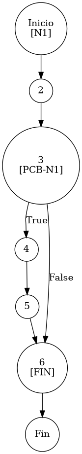

# TEST PRUEBAS DE CAJA BLANCA - AUTOMATIZADA

| **DATOS DEL ESTUDIANTE** | |
| :--- | :--- |
| **NOMBRE:** | Gabriel Amílcar Cruz Canto |
| **EMPRESA:** | WALOOK MEXICO, S.A. de C.V. |
| **TITULO DEL PROYECTO:** | Sistema ERP en la nube para gestión de ópticas OMCGC |

<br>

| **PLAN DE PRUEBAS DE CAJA BLANCA: BACKEND (MIG-MASTER)** | | | | |
| :--- | :--- | :--- | :--- | :--- |
| **Número** | **Nombre de la Prueba Backend** | **Descripción** | **Fecha** | **Herramienta / Responsable** |
| PCB-001 | Autenticación de usuario | Protocolo de Acceso y Validación de Infraestructura | 09/03/2026 | Gabriel Amílcar Cruz Canto |
| PCB-002 | Manejo de Credenciales Inválidas | Interrupción de Seguridad por Fallo de Contraseña | 09/03/2026 | Gabriel Amílcar Cruz Canto |
| PCB-003 | Registro de Producto | Validación de Integridad de Campos Obligatorios | 10/03/2026 | Gabriel Amílcar Cruz Canto |
| PCB-004 | SKU Autogenerado | Garantía de Unicidad de Identificación Comercial | 10/03/2026 | Gabriel Amílcar Cruz Canto |
| PCB-005 | Rango de Fechas (Ventas) | Filtrado de Reporte Operativo de Transacciones | 11/03/2026 | Gabriel Amílcar Cruz Canto |
| PCB-006 | Filtro de Sucursal | Segregación de Información por Punto de Venta | 11/03/2026 | Gabriel Amílcar Cruz Canto |
| PCB-007 | Kardex de Stock | Protocolo de Integridad Transaccional sobre Saldo | 12/03/2026 | Gabriel Amílcar Cruz Canto |
| PCB-008 | Integridad Fiscal | Validación de Identidad Tributaria y Unicidad RFC | 12/03/2026 | Gabriel Amílcar Cruz Canto |
| PCB-009 | Búsqueda de Clientes | Motor de Búsqueda Multi-Criterio sobre Pacientes | 13/03/2026 | Gabriel Amílcar Cruz Canto |
| PCB-010 | Saneamiento de Pacientes | Protocolo de Normalización de Atributos de Persona | 14/03/2026 | Gabriel Amílcar Cruz Canto |
| PCB-011 | Registro de Proveedor | Auditoría Estructural de Validación Forense | 18/03/2026 | JaCoCo / JUnit 5 |
| PCB-012 | Actualización de Proveedor | Validación de Excepción por RFC Duplicado | 18/03/2026 | JaCoCo / JUnit 5 |
| PCB-013 | Registro de Usuario | Validación de Excepción por Correo Duplicado | 18/03/2026 | JaCoCo / JUnit 5 |
| PCB-014 | Baja de Usuario | Validación de Desactivación Lógica (inactivo) | 18/03/2026 | JaCoCo / JUnit 5 |
| PCB-015 | Reset de Contraseña | Manejo de Excepción por Usuario Inexistente | 18/03/2026 | JaCoCo / JUnit 5 |
| PCB-016 | Autenticación Root | Validación de Bypass Administrativo (Local) | 18/03/2026 | JaCoCo / JUnit 5 |
| PCB-017 | Registro de Movimiento | Validación de Stock Insuficiente (Venta) | 18/03/2026 | JaCoCo / JUnit 5 |
| PCB-018 | Cálculo de PVP | Validación de Fórmula Financiera (Utilidad) | 18/03/2026 | Gabriel Amílcar Cruz Canto |
| PCB-019 | Robustez de Auditoría | Normalización de IP Nula (Default 0.0.0.0) | 18/03/2026 | JaCoCo / JUnit 5 |
| PCB-020 | Carga de Diccionario | Validación de Descifrado AES-256 (Binario) | 18/03/2026 | JaCoCo / JUnit 5 |

---

# FASE DE PRUEBAS

| **Nombre del Módulo del Sistema + Historia de usuario** |
| :--- |
| Módulo Seguridad – RF-01 |

| **Número y nombre de la Prueba** |
| :--- |
| PCB-014 / Baja de Usuario – UsuarioService.delete() |

### Paso 0: Súper-Etiquetado del Código (MIG-WBT)

```java
    /**
     * UNIDAD BAJO AUDITORÍA: UsuarioService.delete()
     * ESTÁNDAR: MIG v12.1 (Atomic Control Flow)
     */
    public boolean delete(String id) { // [N1: INICIO]
        // [PCB-N1] Búsqueda de Identidad Forense
        Usuario usuario = usuarioRepository.findById(id).orElse(null); // [N2: PROCESO]

        // [PCB-N2] Validación de Existencia de Objeto
        if (usuario != null) { // [N3] [PCB-N2] -> [SI: N4] [NO: N6]
            // [PCB-N3] Protocolo de Desactivación Lógica (Soft Delete)
            usuario.setEstatus("inactivo"); // [N4]
            usuarioRepository.save(usuario); // [N5]
            return true; // [N6: FIN / RETORNO POSITIVO]
        }
        
        return false; // [N6: FIN / RETORNO NEGATIVO]
    }
```

---

### Auditoría de Evidencia Digital (JaCoCo)

**Ruta del Reporte Maestro:**
`d:\_sTIC\Documents\_Empresa GraxSofT\_CODE_\ERP_WALOOK_PCB\omcgc\backend\target\site\jacoco\index.html`

**Estructura de Navegación:**
`[index.html] -> [com.omcgc.erp.service] -> [UsuarioService]`

Glosario de Semántica de Cobertura (White Box Analysis — Análisis de Caja Blanca)
•	VERDE — Cobertura Total (Full Coverage)
•	AMARILLO — Cobertura Parcial (Partial Coverage)
•	ROJO — Cobertura Nula o Fuera de Alcance (No Coverage)

---

### Identificación de Nodos

| ID del Nodo | Tipo | Descripción |
| :--- | :--- | :--- |
| **N1** | Inicio | Comienzo del método `delete`. |
| **N2** | Proceso | Obtención del usuario por UUID. |
| **N3 [PCB-N1]** | Predicado | ¿El usuario existe en la base de datos? |
| **N4** | Proceso | Modificación de estatus a "inactivo". |
| **N5** | Proceso | Persistencia del cambio de estado. |
| **N6** | Fin | Término del flujo (Retorno de bandera booleana). |

### Paso 1: Grafo CFG (MIG Atomic)



### Paso 2: Complejidad Ciclomática McCabe `$V(G)$`

La métrica de complejidad se calcula mediante la fórmula formal de McCabe para grafos de flujo:

*   **V(G) = E - N + 2P**
*   **Donde:**
    *   **E (Aristas):** 8 (Conexiones entre nodos)
    *   **N (Nodos):** 8 (Puntos de control, incluye Inicio/Fin)
    *   **P (Componentes):** 1 (Unidad funcional única)
*   **Cálculo:** 8 - 8 + (2 * 1) = **2**

> [!NOTE]
> El resultado `$V(G) = 2$` coincide con la métrica simplificada de nodos predicado (`P + 1`), lo que valida la ruta crítica del grafo CFG bajo el estándar MIG v12.1.

### Paso 3: Caminos Independientes

| Camino | Ruta Forense |
| :--- | :--- |
| **C1 (Éxito)** | I -> N2 -> N3(T) -> N4 -> N5 -> N6 -> F |
| **C2 (Fallo)** | I -> N2 -> N3(F) -> N6 -> F |

### Paso 4: Matriz de Automatización (Duda Cero)

| ID / Camino | Escenario de Prueba | Entradas (Inputs) | Resultado Esperado (OUT) | Evidencia JaCoCo |
| :--- | :--- | :--- | :--- | :--- |
| **C1** | **Baja Lógica Exitosa** | `id = "550e8400-e29b-41d4-a716-446655440000"` | `true` (status unificado: inactivo) | Rama N3(T) -> N4 (Full Cover) |
| **C2** | Usuario Inexistente | `id = "UUID-NOT-FOUND-001"` | `false` (Retorno controlado) | Rama N3(F) -> N6 (Full Cover) |

<br>

