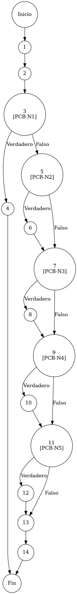

# TEST PRUEBAS DE CAJA BLANCA

| **DATOS DEL ESTUDIANTE** | |
| :--- | :--- |
| **NOMBRE:** | Gabriel Amílcar Cruz Canto |
| **EMPRESA:** | WALOOK MEXICO, S.A. de C.V. |
| **TITULO DEL PROYECTO:** | Sistema ERP en la nube para gestión de ópticas OMCGC |
| **URL y Claves de acceso:** | [Configurar en ambiente de entrega] |

<br>

| **PLAN DE PRUEBAS DE CAJA BLANCA: BACKEND** | | | | |
| :--- | :--- | :--- | :--- | :--- |
| **Número** | **Nombre de la Prueba Backend** | **Descripción** | **Fecha** | **Responsable** |
| PCB-014 | Actualización de Perfil | Protocolo de Actualización Selectiva de Perfil de Seguridad | 17/03/2026 | Gabriel Amílcar Cruz Canto |

---

# FASE DE PRUEBAS

| **Nombre del Módulo del Sistema + Historia de usuario** |
| :--- |
| Módulo Usuarios / Seguridad – HU-M01-03 |

| **Número y nombre de la Prueba** |
| :--- |
| PCB-014 / Actualización de Perfil – UsuarioService.update() |

### Paso 0

```java
    /**
     * ESPECIFICACIÓN TÉCNICA: Protocolo de Actualización Selectiva de Perfil de Seguridad.
     * OBJETIVO OPERATIVO: Actualizar atributos sin comprometer la base criptográfica.
     * IMPACTO: Mantener consistencia del Control de Acceso ante cambios organizacionales.
     */
    public Usuario update(Usuario usuario) { // [N1: INICIO]
        Usuario existente = usuarioRepository.findById(usuario.getId()); // [N2: PROCESO]

        // [PCB-N1] validación de existencia (Check de persistencia previa)
        if (existente == null) { // [N3] [PCB-N1] -> [SI: N4] [NO: N5] : ¿Usuario no encontrado?
            return null; // [N4: FIN]
        }

        // [PCB-N2] evaluación de actualización nominal (Nombre)
        if (usuario.getNombre() != null) { // [N5] [PCB-N2] -> [SI: N6] [NO: N7] : ¿Actualiza Nombre?
            existente.setNombre(usuario.getNombre()); // [N6: PROCESO]
        }
        
        // [PCB-N3] evaluación de actualización de identidad (Correo)
        if (usuario.getCorreo() != null) { // [N7] [PCB-N3] -> [SI: N8] [NO: N9] : ¿Actualiza Correo?
            existente.setCorreo(usuario.getCorreo()); // [N8: PROCESO]
        }
        
        // [PCB-N4] evaluación de cambio de jerarquía (IdRol)
        if (usuario.getRolId() != null) { // [N9] [PCB-N4] -> [SI: N10] [NO: N11] : ¿Actualiza Rol?
            existente.setRolId(usuario.getRolId()); // [N10: PROCESO]
        }
        
        // [PCB-N5] evaluación de cambio denominación operativa (NombreRol)
        if (usuario.getRolNombre() != null) { // [N11] [PCB-N5] -> [SI: N12] [NO: N13] : ¿Actualiza Nombre Rol?
            existente.setRolNombre(usuario.getRolNombre()); // [N12: PROCESO]
        }
        
        // [N13: PROCESO] -> Persistir cambios selectivos sincronizados
        return usuarioRepository.update(existente); // [N14: FIN]
    }
```

### Descripción breve del fragmento

El fragmento **PCB-014** implementa el motor de actualización granulada de metadatos de usuario. Su diseño asegura que solo los campos explícitamente suministrados en el request sean modificados, protegiendo la integridad del registro y evitando la sobrescritura de la base criptográfico (contraseñas). Con una complejidad $V(G)=6$, el código garantiza la resiliencia del control de acceso ante cambios en la estructura jerárquica de la organización.

### Identificación de Nodos

| ID del Nodo | Tipo | Descripción |
| :--- | :--- | :--- |
| **Nodo 1** | Inicio | Inicio de la función de actualización de perfil `update(Usuario usuario)` y recepción de parámetros operativos. |
| **Nodo 2** | Nodo de proceso | Ejecución de `usuarioRepository.findById()`. Localización de la identidad persistida en la base de datos de seguridad. |
| **Nodo 3 [PCB-N1]** | Nodo predicado | Evaluación de la condición de existencia previa (`existente == null`). Verificación de integridad referencial. Identificado con la etiqueta **PCB-N1**. |
| **Nodo 4** | Final | Diferenciación de fallo por identidad no localizada y retorno de valor nulo para gestión de errores en capa superior. |
| **Nodo 5 [PCB-N2]** | Nodo predicado | Evaluación selectiva de cambio de nombre (`usuario.getNombre() != null`). Identificación de actualización nominal. Identificado con la etiqueta **PCB-N2**. |
| **Nodo 6** | Nodo de proceso | Ejecución de `existente.setNombre()`. Actualización del atributo de identidad nominal en el objeto persistido. |
| **Nodo 7 [PCB-N3]** | Nodo predicado | Evaluación selectiva de cambio de correo (`usuario.getCorreo() != null`). Identificado con la etiqueta **PCB-N3**. |
| **Nodo 8** | Nodo de proceso | Ejecución de `existente.setCorreo()`. Actualización del canal de comunicación digital y nombre de usuario. |
| **Nodo 9 [PCB-N4]** | Nodo predicado | Evaluación selectiva de cambio de rol (`usuario.getRolId() != null`). Identificado con la etiqueta **PCB-N4**. |
| **Nodo 10** | Nodo de proceso | Ejecución de `existente.setRolId()`. Actualización del vínculo jerárquico de seguridad en el sistema de permisos. |
| **Nodo 11 [PCB-N5]** | Nodo predicado | Evaluación de cambio de nombre de rol descriptivo. Identificado con la etiqueta **PCB-N5**. |
| **Nodo 12** | Nodo de proceso | Ejecución de `existente.setRolNombre()`. Actualización de la denominación operativa del rol para auditoría. |
| **Nodo 13** | Nodo de proceso | Ejecución de `usuarioRepository.update(existente)`. Persistencia atómica de la transacción de actualización física de seguridad. |
| **Nodo 14** | Fin | Finalización del protocolo de actualización selectiva y retorno de la identidad operativa sincronizada. |

### Paso 1



### Paso 2

**V(G) = Número de regiones** = (5 internas + 1 externa) = **6**
**V(G) = Aristas – Nodos + 2** = V(G) = 19 – 15 + 2 = **6**
**V(G) = Nodos Predicado + 1** = V(G) = 5 + 1 = **6**

### Paso 3

| Total de caminos | Ruta de cada camino |
| :--- | :--- |
| **Camino 1** | Inicio → 1 → 2 → 3(SÍ) → 4 → Fin |
| **Camino 2** | Inicio → 1 → 2 → 3(NO) → 5(SÍ) → 6 → 7(NO) → 9(NO) → 11(NO) → 13 → 14 → Fin |
| **Camino 3** | Inicio → 1 → 2 → 3(NO) → 5(NO) → 7(SÍ) → 8 → 9(NO) → 11(NO) → 13 → 14 → Fin |
| **Camino 4** | Inicio → 1 → 2 → 3(NO) → 5(NO) → 7(NO) → 9(SÍ) → 10 → 11(NO) → 13 → 14 → Fin |
| **Camino 5** | Inicio → 1 → 2 → 3(NO) → 5(NO) → 7(NO) → 9(NO) → 11(SÍ) → 12 → 13 → 14 → Fin |
| **Camino 6** | Inicio → 1 → 2 → 3(NO) → 5(NO/NO/NO/NO) → 13 → 14 → Fin |

### Paso 4

| Número del camino | Caso de Prueba (IN) | Resultado esperado (OUT) |
| :--- | :--- | :--- |
| **Camino 1** | usuario.id = 999 (No existe) | return null (PCB-N1: SI) |
| **Camino 2** | usuario.id = 1, usuario.nombre = "Admin Actualizado" | Actualización nominal exitosa (PCB-N1: NO, PCB-N2: SI, PCB-N3: NO, PCB-N4: NO, PCB-N5: NO) |
| **Camino 3** | usuario.id = 1, usuario.correo = "soporte@walo.mx" | Actualización de canal digital exitosa (PCB-N1: NO, PCB-N2: NO, PCB-N3: SI, PCB-N4: NO, PCB-N5: NO) |
| **Camino 4** | usuario.id = 1, usuario.rolId = 1 | Actualización de jerarquía exitosa (PCB-N1: NO, PCB-N2: NO, PCB-N3: NO, PCB-N4: SI, PCB-N5: NO) |
| **Camino 5** | usuario.id = 1, usuario.rolNombre = "SUPERADMIN" | Actualización descriptiva exitosa (PCB-N1: NO, PCB-N2: NO, PCB-N3: NO, PCB-N4: NO, PCB-N5: SI) |
| **Camino 6** | usuario.id = 1, {campos null} | Persistencia sin cambios físicos (PCB-N1: NO, PCB-N2: NO, PCB-N3: NO, PCB-N4: NO, PCB-N5: NO) |
