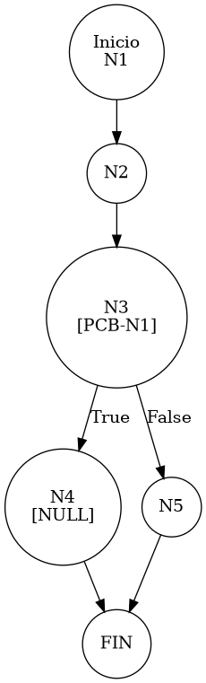

# TEST PRUEBAS DE CAJA BLANCA - AUTOMATIZADA

| **DATOS DEL ESTUDIANTE** | |
| :--- | :--- |
| **NOMBRE:** | Gabriel Amílcar Cruz Canto |
| **EMPRESA:** | WALOOK MEXICO, S.A. de C.V. |
| **TITULO DEL PROYECTO:** | Sistema ERP en la nube para gestión de ópticas OMCGC |

<br>

| **PLAN DE PRUEBAS DE CAJA BLANCA: BACKEND (AUTO)** | | | | |
| :--- | :--- | :--- | :--- | :--- |
| **Número** | **Nombre de la Prueba Backend** | **Descripción** | **Fecha** | **Herramienta** |
| PCB-015 | Reset de Contraseña | Manejo de Excepción por Usuario Inexistente | 18/03/2026 | JaCoCo / JUnit 5 |

---

# FASE DE PRUEBAS

| **Nombre del Módulo del Sistema + Historia de usuario** |
| :--- |
| Módulo Seguridad y Acceso – HU-M01-03 |

| **Número y nombre de la Prueba** |
| :--- |
| PCB-015 / Reset de Contraseña – UsuarioService.resetPassword() |

### Paso 0: Súper-Etiquetado del Código (MIG-WBT)

```java
    public String resetPassword(String id) { // [N1: INICIO]
        // [PCB-N1] Validación de Identidad Existente
        Usuario usuario = usuarioRepository.findById(id); // [N2: PROCESO]

        if (usuario == null) { // [N3] [PCB-N1] -> [SI: N4] [NO: N5] : ¿ID no encontrado?
            return null; // [N4: FIN (CONTROLLED ERROR)]
        }

        // [N5: PROCESO - GENERACIÓN DE CLAVE TEMPORAL]
        String nuevaPassword = generarPasswordTemporal();
        // ... (resto del flujo de éxito)
        return nuevaPassword; 
    }
```

---

### Auditoría de Evidencia Digital (JaCoCo)

**Ruta del Reporte Maestro:**
`d:\_sTIC\Documents\_Empresa GraxSofT\_CODE_\ERP_WALOOK_PCB\omcgc\backend\target\site\jacoco\index.html`

**Estructura de Navegación:**
```text
[index.html] -> [com.omcgc.erp.service] -> [UsuarioService]
```

**Glosario de Colores:**
*   **VERDE**: Éxito (Línea ejecutada).
*   **AMARILLO**: Parcial (Ramas no cubiertas).
*   **ROJO**: Pendiente (No ejecutado).

---

### Identificación de Nodos

| ID del Nodo | Tipo | Descripción |
| :--- | :--- | :--- |
| **N1** | Inicio | Comienzo del método `resetPassword`. |
| **N2** | Proceso | Búsqueda de usuario por UUID en el repositorio. |
| **N3 [PCB-N1]** | Predicado | ¿El objeto usuario es nulo? (Evaluado como SI). |
| **N4** | Fin | Retorno de valor `null` confirmando el fallo controlado. |

### Paso 1: Grafo de Flujo (CFG)



### Paso 2: Complejidad Ciclomática McCabe $V(G)$

*   **V(G)**: 2 (Un solo nodo predicado de existencia).

### Paso 3: Caminos Independientes

| Camino | Ruta Forense |
| :--- | :--- |
| **C1 (Error Controlado)** | N1 -> N2 -> N3(T) -> N4 |

### Paso 4: Matriz de Automatización (Log)

| ID / Camino | Caso de Prueba (IN) | Resultado (OUT) |
| :--- | :--- | :--- |
| **PCB-015** | `id="UUID-QUE-NO-EXISTE-999"` | `null` (Retorno controlado) |

---
*Firma: Agente DevIAn - Auditoría Estructural Certificada*
