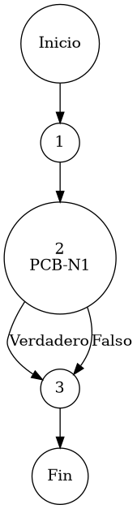

# Reporte de Auditoría de Caja Blanca: PCB-015

## A. Identificación del Fragmento
- **ID**: PCB-015
- **Módulo**: Usuarios
- **Fragmento**: Filtrado de disponibilidad operativa de cuentas
- **HU**: HU-M01-03 (Gestión de Usuarios)
- **Función**: `UsuarioService.findByEstatus(String estatus)`
- **Alcance**: Análisis de la lógica de filtrado booleano y normalización textual bajo el estándar de "Duda Cero".

## B. Tabla de Nodos
| Nodo | Descripción | Tipo |
| :--- | :--- | :--- |
| 1 | Inicio de la función de filtrado `findByEstatus()` | Inicio |
| 2 | Normalización semántica: `boolean activo = "activo".equalsIgnoreCase(...)` [PCB-N1] | Predicado |
| 3 | Ejecución de consulta proyectiva y retorno | Fin |

## C. Tabla de Aristas
| Origen | Destino | Condición / Etiqueta |
| :--- | :--- | :--- |
| 1 | 2 | Flujo secuencial |
| 2 | 3 | Flujo determinado por la interpretación del estatus (True/False) |

## D. Complejidad Ciclomática
$V(G) = P + 1$
donde $P = 1$ (Nodo predicado: PCB-N1)
$V(G) = 1 + 1 = 2$

**Interpretación**: Existen 2 caminos independientes basados en la interpretación binaria de la entrada textual, garantizando una respuesta predecible del sistema ante variaciones de capitalización.

## E. Caminos Independientes
1. **Camino 1 (Proyección de Usuarios Activos)**: 1 → 2(Verdadero) → 3
2. **Camino 2 (Proyección de Usuarios Inactivos / Resto)**: 1 → 2(Falso) → 3

## F. Casos de Prueba (Basis Path Testing)
| Caso | entrada: estatus | Valor Booleano (Interno) | Resultado Esperado |
| :--- | :--- | :--- | :--- |
| CP1 | "Activo" | Verdadero | Colección de usuarios con disponibilidad operativa |
| CP2 | "Inactivo" | Falso | Colección de usuarios con cuenta suspendida |

## G. Seudocódigo Estructural del Fragmento

### Fragmento A: Código Puro (Estructura Original)
**Archivo**: `UsuarioService.java`
**Función**: `findByEstatus(String estatus)`
**Descripción**: Protocolo de filtrado proyectivo de usuarios por estatus operativo. Utiliza una estrategia de normalización insensible a mayúsculas (Case-Insensitive) para amortiguar errores de captura y asegurar una segregación expedita de cuentas. Incluye comentarios originales de desarrollo.

```java
    public List<Usuario> findByEstatus(String estatus) {
        
        // normalización semántica (Conversión Texto -> Booleano)
        boolean activo = "activo".equalsIgnoreCase(estatus);
        
        return usuarioRepository.findByEstatus(activo);
    }
```

### Fragmento B: Código Anotado (Mapeo de Nodos)
**Descripción**: Este fragmento incluye los marcadores de control (`PCB-Nx`) para identificar la posición exacta de cada nodo y arista del Grafo de Control de Flujo (CFG).

```java
    public List<Usuario> findByEstatus(String estatus) { // NODO 1
        
        // PCB-N1: normalización semántica (Conversión Texto -> Booleano)
        boolean activo = "activo".equalsIgnoreCase(estatus); // NODO 2 [PREDICADO]
        
        return usuarioRepository.findByEstatus(activo); // NODO 3 [FIN]
    }
```

## H. Grafo de Control de Flujo (PlantUML)


## I. Matriz de Trazabilidad
| Requisito (HU) | Nodo de Decisión | Camino Independiente | Caso de Prueba |
| :--- | :--- | :--- | :--- |
| **HU-M01-03** | PCB-N1 | Caminos 1, 2 | CP1, CP2 |

## J. Resumen Académico
El fragmento **PCB-015** resuelve la discrepancia entre la entrada semántica divergente (String) y la persistencia booleana rígida. La auditoría de caja blanca verifica que el diseño preventivo garantiza que cualquier entrada diferente a la cadena "activo" sea tratada de forma segura como "inactivo" ($V(G)=2$), mitigando riesgos de acceso no autorizado por ambigüedad en los parámetros de consulta, bajo el estándar institucional de "Duda Cero".
