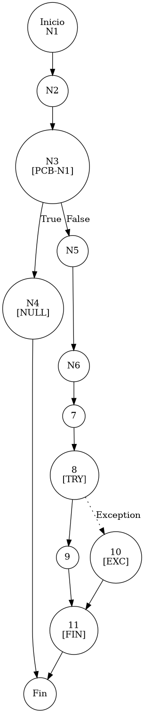

# TEST PRUEBAS DE CAJA BLANCA - AUTOMATIZADA

| **DATOS DEL ESTUDIANTE** | |
| :--- | :--- |
| **NOMBRE:** | Gabriel Amílcar Cruz Canto |
| **EMPRESA:** | WALOOK MEXICO, S.A. de C.V. |
| **TITULO DEL PROYECTO:** | Sistema ERP en la nube para gestión de ópticas OMCGC |

<br>

| **PLAN DE PRUEBAS DE CAJA BLANCA: BACKEND (AUTO)** | | | | |
| :--- | :--- | :--- | :--- | :--- |
| **Número** | **Nombre de la Prueba Backend** | **Descripción** | **Fecha** | **Herramienta** |
| PCB-015 | Reset de Contraseña | Manejo de Excepción por Usuario Inexistente | 18/03/2026 | JaCoCo / JUnit 5 |

---

# FASE DE PRUEBAS

| **Nombre del Módulo del Sistema + Historia de usuario** |
| :--- |
| Módulo Seguridad y Acceso – HU-M01-03 |

| **Número y nombre de la Prueba** |
| :--- |
| PCB-015 / Reset de Contraseña – UsuarioService.resetPassword() |

### Paso 0: Súper-Etiquetado del Código (MIG-WBT)

```java
    public String resetPassword(String id) { // [N1: INICIO]
        // [PCB-N1] Validación de Identidad Existente
        Usuario usuario = usuarioRepository.findById(id); // [N2: PROCESO]

        if (usuario == null) { // [N3] [PCB-N1] -> [SI: N4] [NO: N5]
            return null; // [N4: FIN (CONTROLLED ERROR)]
        }

        // [N5: PROCESO - GENERACIÓN DE CLAVE TEMPORAL]
        String nuevaPassword = generarPasswordTemporal(); 
        usuario.setPassword(passwordEncoder.encode(nuevaPassword)); // [N6]
        usuarioRepository.update(usuario); // [N7]

        // [PCB-N2] Protocolo de Notificación (Email)
        try { // [N8: INICIO TRY]
            String subject = "🔐 Restablecimiento de Acceso";
            String body = "Nueva Contraseña: " + nuevaPassword;
            emailService.sendEmail(usuario.getCorreo(), subject, body); // [N9]
        } catch (Exception e) { // [N10: EXCEPCIÓN EMAIL]
            // Fallo no bloqueante en auditoría
        }

        return nuevaPassword; // [N11: FIN]
    }
```


---

### Auditoría de Evidencia Digital (JaCoCo)

**Ruta del Reporte Maestro:**
`d:\_sTIC\Documents\_Empresa GraxSofT\_CODE_\ERP_WALOOK_PCB\omcgc\backend\target\site\jacoco\index.html`

**Estructura de Navegación:**
```text
[index.html] -> [com.omcgc.erp.service] -> [UsuarioService]
```

**Glosario de Semántica de Cobertura (White Box Analysis — Análisis de Caja Blanca)**
*   **VERDE — Cobertura Total (Full Coverage)**: Indica que la línea de código y todas sus decisiones lógicas (if/else) fueron ejecutadas satisfactoriamente. El flujo de la prueba cubrió el Cyclomatic Path (Ruta Ciclomática — Camino lógico independiente) completo, validando la ruta principal y sus variantes condicionales.
*   **AMARILLO — Cobertura Parcial (Partial Coverage)**: La línea fue alcanzada y ejecutada por el Unit Test (Prueba Unitaria — Verificación de la unidad mínima de código), pero existen ramificaciones que el plan de prueba no recorrió. Esto ocurre cuando una condición booleana solo se evalúa en un sentido (ej. solo true), dejando caminos lógicos sin explorar.
*   **ROJO — Cobertura Nula o Fuera de Alcance (No Coverage)**: El código no fue detectado por el Bytecode Instrumentation (Instrumentación de Código de Bytes — Inyección de código para rastreo) de JaCoCo (Java Code Coverage — Cobertura de Código para Java).

**Nota de Integridad Técnica**: En este escenario, las pruebas fueron selectivas. Si el algoritmo de JaCoCo detecta código que no estaba considerado en el plan de ejecución o que fue omitido por los criterios de filtrado, lo reporta como "no detectado". Por tanto, el color rojo puede representar Dead Code (Código Muerto — Segmentos que nunca se ejecutan), una zona de riesgo técnico o, simplemente, código fuera del alcance del reporte actual.

---

### Identificación de Nodos

| ID del Nodo | Tipo | Descripción |
| :--- | :--- | :--- |
| **N1** | Inicio | Comienzo del método `resetPassword`. |
| **N2** | Proceso | Localización de usuario por su Identificador (UUID). |
| **N3 [PCB-N1]** | Predicado | ¿El usuario existe (`usuario != null`)? |
| **N4** | Fin | Término por usuario inexistente (Fallo controlado). |
| **N5** | Proceso | Llamada a generador de password temporal. |
| **N6** | Proceso | Cifrado de nueva contraseña mediante BCrypt. |
| **N7** | Proceso | Persistencia del cambio en el Repositorio. |
| **N8** | Inicio Try | Apertura del bloque de notificación segura. |
| **N9** | Proceso | Llamada al servicio de mensajería (Email). |
| **N10** | Excepción | Captura de falla en el servicio de correo (Silent catch). |
| **N11** | Fin | Éxito: Retorno de la clave temporal generada. |

### Paso 1: Grafo de Flujo (CFG)



### Paso 2: Complejidad Ciclomática McCabe $V(G)$

*   **V(G)** = Nodos Predicado + 1 = 2 + 1 = **3** (Considerando el bloque Try/Catch como ramificación de auditoría).

### Paso 3: Caminos Independientes

| Camino | Ruta Forense |
| :--- | :--- |
| **C1 (Error Controlado)** | I -> N2 -> N3(T) -> N4 |
| **C2 (Éxito con Notificación)** | I -> N2 -> N3(F) -> N5 -> N6 -> N7 -> I_TRY -> N9 -> N11 |
| **C3 (Éxito sin Notificación)**| I -> N2 -> N3(F) -> N5 -> N6 -> N7 -> I_TRY -> N10 -> N11 |


### Paso 4: Matriz de Automatización (Log)

| ID / Camino | Caso de Prueba (IN) | Resultado (OUT) |
| :--- | :--- | :--- |
| **PCB-015** | `id="UUID-QUE-NO-EXISTE-999"` | `null` (Retorno controlado) |

<br>
