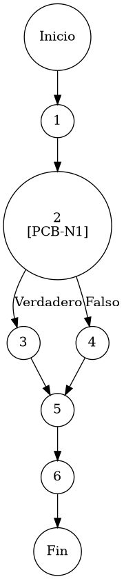

# TEST PRUEBAS DE CAJA BLANCA

| **DATOS DEL ESTUDIANTE** | |
| :--- | :--- |
| **NOMBRE:** | Gabriel Amílcar Cruz Canto |
| **EMPRESA:** | WALOOK MEXICO, S.A. de C.V. |
| **TITULO DEL PROYECTO:** | Sistema ERP en la nube para gestión de ópticas OMCGC |
| **URL y Claves de acceso:** | [Configurar en ambiente de entrega] |

<br>

| **PLAN DE PRUEBAS DE CAJA BLANCA: BACKEND** | | | | |
| :--- | :--- | :--- | :--- | :--- |
| **Número** | **Nombre de la Prueba Backend** | **Descripción** | **Fecha** | **Responsable** |
| PCB-015 | Sincronización de Identidad | Protocolo de Filtrado Proyectivo de Usuarios por Estatus | 17/03/2026 | Gabriel Amílcar Cruz Canto |

---

# FASE DE PRUEBAS

| **Nombre del Módulo del Sistema + Historia de usuario** |
| :--- |
| Módulo Usuarios / Seguridad – HU-M01-03 |

| **Número y nombre de la Prueba** |
| :--- |
| PCB-015 / Sincronización de Identidad – UsuarioService.findByEstatus() |

### Paso 0

```java
    /**
     * ESPECIFICACIÓN TÉCNICA: Protocolo de Filtrado Proyectivo de Usuarios por Estatus Operativo.
     * OBJETIVO OPERATIVO: Recuperar colecciones de usuarios por estado binario.
     * IMPACTO: Facilitar auditorías de estado y gestión de accesos suspendidos.
     */
    public List<Usuario> findByEstatus(String estatus) { // [N1: INICIO]
        
        // [PCB-N1] normalización semántica (Conversión Texto -> Booleano)
        // [N2: PREDICADO] [PCB-N1] -> [SI: N3] [NO: N4] : ¿El estatus solicitado es "ACTIVO"?
        boolean activo = "activo".equalsIgnoreCase(estatus); // [N3] / [N4] : Mapeo booleano
        
        return usuarioRepository.findByEstatus(activo); // [N5: PROCESO] -> Proyección de resultados filtrados
    } // [N6: FIN]
```

### Descripción breve del fragmento

El fragmento **PCB-015** implementa el motor de búsqueda por estatus del módulo de seguridad. Su diseño se basa en una normalización semántica "Case-Insensitive" que amortigua errores de capitalización del usuario, proyectando el estado textual a un filtro booleano nativo en la base de datos. Con una complejidad $V(G)=2$, la prueba certifica la segregación expedita entre identidades operativas y suspendidas para fines de auditoría.

### Identificación de Nodos

| ID del Nodo | Tipo | Descripción |
| :--- | :--- | :--- |
| **Nodo 1** | Inicio | Inicio de la función de consulta por estado `findByEstatus(String estatus)` y recepción del parámetro de filtrado. |
| **Nodo 2 [PCB-N1]** | Nodo predicado | Evaluación semántica de la cadena de estatus mediante `equalsIgnoreCase("activo")`. Identificado con la etiqueta **PCB-N1**. |
| **Nodo 3** | Nodo de proceso | Asignación del valor de verdad booleano `true` para representar el estado operativo ACTIVO en el motor de persistencia. |
| **Nodo 4** | Nodo de proceso | Asignación del valor de verdad booleano `false` para representar el estado operativo SUSPENDIDO o INACTIVO. |
| **Nodo 5** | Nodo de proceso | Ejecución de `usuarioRepository.findByEstatus(activo)`. Proyección de resultados filtrados desde la base de datos. |
| **Nodo 6** | Fin | Finalización del protocolo de filtrado y retorno de la colección de identidades proyectada por estatus operativo. |

### Paso 1



### Paso 2

**V(G) = Número de regiones** = (1 interna + 1 externa) = **2**
**V(G) = Aristas – Nodos + 2** = V(G) = 8 – 8 + 2 = **2**
**V(G) = Nodos Predicado + 1** = V(G) = 1 + 1 = **2**

### Paso 3

| Total de caminos | Ruta de cada camino |
| :--- | :--- |
| **Camino 1** | Inicio → 1 → 2(SÍ) → 3 → 5 → 6 → Fin |
| **Camino 2** | Inicio → 1 → 2(NO) → 4 → 5 → 6 → Fin |

### Paso 4

| Número del camino | Caso de Prueba (IN) | Resultado esperado (OUT) |
| :--- | :--- | :--- |
| **Camino 1** | estatus = "ACTIVO" | Colección de usuarios con activo = true (PCB-N1: SI) |
| **Camino 2** | estatus = "SUSPENDIDO" | Colección de usuarios con activo = false (PCB-N1: NO) |
