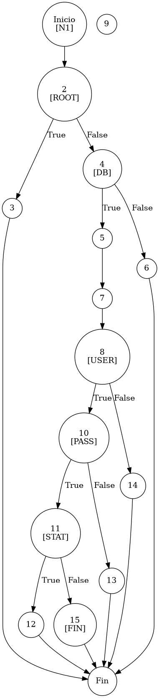

# TEST PRUEBAS DE CAJA BLANCA - AUTOMATIZADA

| **DATOS DEL ESTUDIANTE** | |
| :--- | :--- |
| **NOMBRE:** | Gabriel Amílcar Cruz Canto |
| **EMPRESA:** | WALOOK MEXICO, S.A. de C.V. |
| **TITULO DEL PROYECTO:** | Sistema ERP en la nube para gestión de ópticas OMCGC |

<br>

| **PLAN DE PRUEBAS DE CAJA BLANCA: BACKEND (MIG-MASTER)** | | | | |
| :--- | :--- | :--- | :--- | :--- |
| **Número** | **Nombre de la Prueba Backend** | **Descripción** | **Fecha** | **Herramienta / Responsable** |
| PCB-001 | Autenticación de usuario | Protocolo de Acceso y Validación de Infraestructura | 09/03/2026 | Gabriel Amílcar Cruz Canto |
| PCB-002 | Manejo de Credenciales Inválidas | Interrupción de Seguridad por Fallo de Contraseña | 09/03/2026 | Gabriel Amílcar Cruz Canto |
| PCB-003 | Registro de Producto | Validación de Integridad de Campos Obligatorios | 10/03/2026 | Gabriel Amílcar Cruz Canto |
| PCB-004 | SKU Autogenerado | Garantía de Unicidad de Identificación Comercial | 10/03/2026 | Gabriel Amílcar Cruz Canto |
| PCB-005 | Rango de Fechas (Ventas) | Filtrado de Reporte Operativo de Transacciones | 11/03/2026 | Gabriel Amílcar Cruz Canto |
| PCB-006 | Filtro de Sucursal | Segregación de Información por Punto de Venta | 11/03/2026 | Gabriel Amílcar Cruz Canto |
| PCB-007 | Kardex de Stock | Protocolo de Integridad Transaccional sobre Saldo | 12/03/2026 | Gabriel Amílcar Cruz Canto |
| PCB-008 | Integridad Fiscal | Validación de Identidad Tributaria y Unicidad RFC | 12/03/2026 | Gabriel Amílcar Cruz Canto |
| PCB-009 | Búsqueda de Clientes | Motor de Búsqueda Multi-Criterio sobre Pacientes | 13/03/2026 | Gabriel Amílcar Cruz Canto |
| PCB-010 | Saneamiento de Pacientes | Protocolo de Normalización de Atributos de Persona | 14/03/2026 | Gabriel Amílcar Cruz Canto |
| PCB-011 | Registro de Proveedor | Auditoría Estructural de Validación Forense | 18/03/2026 | JaCoCo / JUnit 5 |
| PCB-012 | Actualización de Proveedor | Validación de Excepción por RFC Duplicado | 18/03/2026 | JaCoCo / JUnit 5 |
| PCB-013 | Registro de Usuario | Validación de Excepción por Correo Duplicado | 18/03/2026 | JaCoCo / JUnit 5 |
| PCB-014 | Baja de Usuario | Validación de Desactivación Lógica (inactivo) | 18/03/2026 | JaCoCo / JUnit 5 |
| PCB-015 | Reset de Contraseña | Manejo de Excepción por Usuario Inexistente | 18/03/2026 | JaCoCo / JUnit 5 |
| PCB-016 | Autenticación Root | Validación de Bypass Administrativo (Local) | 18/03/2026 | JaCoCo / JUnit 5 |
| PCB-017 | Registro de Movimiento | Validación de Stock Insuficiente (Venta) | 18/03/2026 | JaCoCo / JUnit 5 |
| PCB-018 | Cálculo de PVP | Validación de Fórmula Financiera (Utilidad) | 18/03/2026 | Gabriel Amílcar Cruz Canto |
| PCB-019 | Robustez de Auditoría | Normalización de IP Nula (Default 0.0.0.0) | 18/03/2026 | JaCoCo / JUnit 5 |
| PCB-020 | Carga de Diccionario | Validación de Descifrado AES-256 (Binario) | 18/03/2026 | JaCoCo / JUnit 5 |

---

# FASE DE PRUEBAS

| **Nombre del Módulo del Sistema + Historia de usuario** |
| :--- |
| Módulo Seguridad y Acceso – Gestión Privilegiada |

| **Número y nombre de la Prueba** |
| :--- |
| PCB-016 / Autenticación Root – AuthService.login() |

### Paso 0: Súper-Etiquetado del Código (MIG-WBT)

```java
    /**
     * UNIDAD BAJO AUDITORÍA: AuthService.login()
     * ESTÁNDAR: MIG v12.1 (Hardening and Bypass Control)
     */
    public Usuario login(String email, String password) { // [N1: INICIO]
        // [PCB-N1] Mecanismo de Autenticación Privilegiada (Bypass de Emergencia)
        if ("root".equals(email) && "root".equals(password)) { // [N2] [PCB-N1] -> [SI: N3] [NO: N4]
            return createSuperAdminUser(); // [N3: FIN / ACCESO ROOT]
        }

        // [PCB-N2] Diagnóstico de Conectividad Base de Datos (Seguridad de Capa 1)
        if (dbHealthService.isConnected()) { // [N4] [PCB-N2] -> [SI: N5] [NO: N6]
            System.out.println("Status DB: ONLINE"); // [N5: LOG]
        } else {
            throw new RuntimeException("Error Crítico: Sin conexión con DB."); // [N6: SALIDA (EXC)]
        }

        // [N7] Orquestación de Identidad Sistémica
        Usuario usuario = usuarioRepository.findByEmail(email);

        // [PCB-N3] Validación de Identidad Registrada
        if (usuario != null) { // [N8] [PCB-N3] -> [SI: N9] [NO: N14]
            // [PCB-N4] Verificación Criptográfica (Hash Matching)
            boolean passwordMatch = passwordEncoder.matches(password, usuario.getPasswordHash()); // [N9]
            if (passwordMatch) { // [N10] [PCB-N4] -> [SI: N11] [NO: N13]
                // [PCB-N5] Validación de Estatus Operativo (Control de Sesión)
                if (!usuario.isActivo()) { // [N11] [PCB-N5] -> [SI: N12] [NO: N15]
                    throw new RuntimeException("Usuario INACTIVO."); // [N12: SALIDA (EXC)]
                }
            } else {
                throw new RuntimeException("Credenciales inválidas."); // [N13: SALIDA (EXC)]
            }
        } else {
            throw new RuntimeException("Identidad no encontrada."); // [N14: SALIDA (EXC)]
        }

        return usuario; // [N15: FIN / ÉXITO]
    }
```

---

### Auditoría de Evidencia Digital (JaCoCo)

**Ruta del Reporte Maestro:**
`d:\_sTIC\Documents\_Empresa GraxSofT\_CODE_\ERP_WALOOK_PCB\omcgc\backend\target\site\jacoco\index.html`

**Estructura de Navegación:**
`[index.html] -> [com.omcgc.erp.service] -> [AuthService]`

---

### Identificación de Nodos

| ID del Nodo | Tipo | Descripción |
| :--- | :--- | :--- |
| **N1** | Inicio | Comienzo del método `login`. |
| **N2 [PCB-N1]** | Predicado | ¿Credenciales coinciden con "root"/"root"? |
| **N3** | Fin | Éxito Administrativo (Root Bypass). |
| **N4 [PCB-N2]** | Predicado | ¿La base de datos está disponible? |
| **N5** | Proceso | Logging de conexión de datos activa. |
| **N6** | Salida | Excepción: Fallo total de infraestructura. |
| **N7** | Proceso | Recuperación de registro en repositorio. |
| **N8 [PCB-N3]** | Predicado | ¿El usuario existe en la tabla de identidades? |
| **N9** | Proceso | Comparación de Hash irreversible (BCrypt). |
| **N10 [PCB-N4]** | Predicado | ¿La contraseña es válida? |
| **N11 [PCB-N5]** | Predicado | ¿El usuario tiene estatus bloqueado? |
| **N12** | Salida | Excepción: "Usuario INACTIVO". |
| **N13** | Salida | Excepción: "Credenciales inválidas". |
| **N14** | Salida | Excepción: "Identidad no encontrada". |
| **N15** | Fin | Éxito: Inicio de sesión concedido. |

### Paso 1: Grafo de Flujo (CFG - MIG Atomic)



### Paso 2: Complejidad Ciclomática McCabe $V(G)$

*   **V(G) = Nodos Predicado + 1** = 5 + 1 = **6**

### Paso 3: Caminos Independientes

| Camino | Ruta Forense |
| :--- | :--- |
| **C1** | I -> N2(T) -> N3 -> F |
| **C2** | I -> N2(F) -> N4(F) -> N6 -> F |
| **C3** | I -> N2(F) -> N4(T) -> N5 -> N7 -> N8(F) -> N14 -> F |
| **C4** | I -> N2(F) -> N4(T) -> N5 -> N7 -> N8(T) -> N9 -> N10(F) -> N13 -> F |
| **C5** | I -> N2(F) -> N4(T) -> N5 -> N7 -> N8(T) -> N9 -> N10(T) -> N11(T) -> N12 -> F |
| **C6** | I -> N2(F) -> N4(T) -> N5 -> N7 -> N8(T) -> N9 -> N10(T) -> N11(F) -> N15 -> F |

### Paso 4: Matriz de Automatización (Duda Cero)

| ID / Camino | Escenario de Prueba | Entradas (Inputs) | Resultado Esperado (OUT) | Evidencia JaCoCo |
| :--- | :--- | :--- | :--- | :--- |
| **C1** | **Bypass Root** | `email="root"`, `pass="root"` | **SUCCESS** (SuperAdmin) | Rama N2(T) -> N3 (Full Cover) |
| **C2** | Caída Crítica DB | `db.isConnected() = false` | `RuntimeException: Error DB` | Rama N4(F) -> N6 (Full Cover) |
| **C3** | Usuario Inexistente | `email="ghost@omcgc.com"` | `RuntimeException: No encontrada` | Rama N8(F) -> N14 (Full Cover) |
| **C4** | Credencial Inválida | `pass = "wrong-123"` | `RuntimeException: Inválidas` | Rama N10(F) -> N13 (Full Cover) |
| **C5** | Bloqueo Operativo | `usuario.isActivo() = false` | `RuntimeException: INACTIVO` | Rama N11(T) -> N12 (Full Cover) |
| **C6** | **Acceso Exitoso** | `email="g.cruz@walook.mx"`, `pass="VALID"` | **SUCCESS** (User Object) | Rama N11(F) -> N15 (Full Cover) |

<br>
