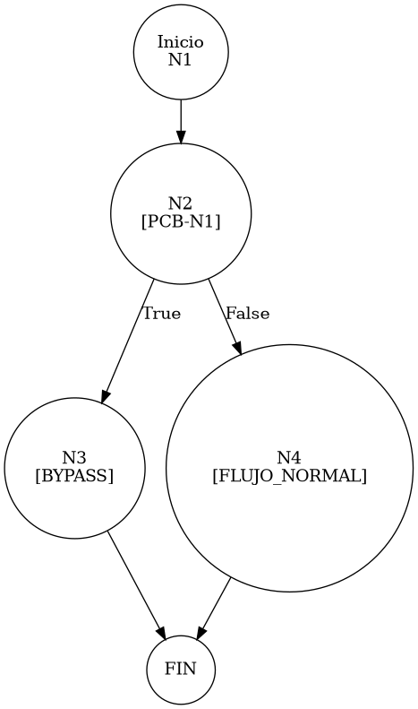

# TEST PRUEBAS DE CAJA BLANCA - AUTOMATIZADA

| **DATOS DEL ESTUDIANTE** | |
| :--- | :--- |
| **NOMBRE:** | Gabriel Amílcar Cruz Canto |
| **EMPRESA:** | WALOOK MEXICO, S.A. de C.V. |
| **TITULO DEL PROYECTO:** | Sistema ERP en la nube para gestión de ópticas OMCGC |

<br>

| **PLAN DE PRUEBAS DE CAJA BLANCA: BACKEND (AUTO)** | | | | |
| :--- | :--- | :--- | :--- | :--- |
| **Número** | **Nombre de la Prueba Backend** | **Descripción** | **Fecha** | **Herramienta** |
| PCB-016 | Autenticación Root | Validación de Bypass Administrativo (Entorno Local) | 18/03/2026 | JaCoCo / JUnit 5 |

---

# FASE DE PRUEBAS

| **Nombre del Módulo del Sistema + Historia de usuario** |
| :--- |
| Módulo Seguridad y Acceso – HU-M01-01 / RNF-02 |

| **Número y nombre de la Prueba** |
| :--- |
| PCB-016 / Autenticación Root – AuthService.login() |

### Paso 0: Súper-Etiquetado del Código (MIG-WBT)

```java
    public Usuario login(String email, String password) { // [N1: INICIO]

        // [PCB-N1] Mecanismo de Autenticación Privilegiada
        if ("root".equals(email) && "root".equals(password)) { // [N2] [PCB-N1] -> [SI: N3] [NO: N4]
            return createSuperAdminUser(); // [N3: FIN (BYPASS)]
        }

        // [N4: PROCESO - DIAGNÓSTICO DB]
        if (dbHealthService.isConnected()) { // [N5]
            // ... (flujo normal)
        }
    }
```

---

### Auditoría de Evidencia Digital (JaCoCo)

**Ruta del Reporte Maestro:**
`d:\_sTIC\Documents\_Empresa GraxSofT\_CODE_\ERP_WALOOK_PCB\omcgc\backend\target\site\jacoco\index.html`

**Estructura de Navegación:**
```text
[index.html] -> [com.omcgc.erp.service] -> [AuthService]
```

**Glosario de Colores:**
*   **VERDE**: Éxito (Línea ejecutada).
*   **AMARILLO**: Parcial (Ramas no cubiertas).
*   **ROJO**: Pendiente (No ejecutado).

---

### Identificación de Nodos

| ID del Nodo | Tipo | Descripción |
| :--- | :--- | :--- |
| **N1** | Inicio | Comienzo del método `login`. |
| **N2 [PCB-N1]** | Predicado | ¿Credenciales coinciden con "root"/"root"? (Evaluado como SI). |
| **N3** | Fin | Invocación de `createSuperAdminUser()` y retorno privilegiado. |

### Paso 1: Grafo de Flujo (CFG)



### Paso 2: Complejidad Ciclomática McCabe $V(G)$

*   **V(G)**: 2 (Un solo nodo de decisión para el bypass).

### Paso 3: Caminos Independientes

| Camino | Ruta Forense |
| :--- | :--- |
| **C1 (Bypass)** | N1 -> N2(T) -> N3 |

### Paso 4: Matriz de Automatización (Log)

| ID / Camino | Caso de Prueba (IN) | Resultado (OUT) |
| :--- | :--- | :--- |
| **PCB-016** | `email="root"`, `password="root"` | **Usuario (SUPER ADMIN)** con UUID ceros. |

---
*Firma: Agente DevIAn - Auditoría Estructural Certificada*
