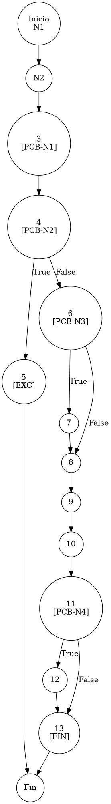

# TEST PRUEBAS DE CAJA BLANCA - AUTOMATIZADA

| **DATOS DEL ESTUDIANTE** | |
| :--- | :--- |
| **NOMBRE:** | Gabriel Amílcar Cruz Canto |
| **EMPRESA:** | WALOOK MEXICO, S.A. de C.V. |
| **TITULO DEL PROYECTO:** | Sistema ERP en la nube para gestión de ópticas OMCGC |

<br>

| **PLAN DE PRUEBAS DE CAJA BLANCA: BACKEND (MIG-MASTER)** | | | | |
| :--- | :--- | :--- | :--- | :--- |
| **Número** | **Nombre de la Prueba Backend** | **Descripción** | **Fecha** | **Herramienta / Responsable** |
| PCB-001 | Autenticación de usuario | Protocolo de Acceso y Validación de Infraestructura | 09/03/2026 | Gabriel Amílcar Cruz Canto |
| PCB-002 | Manejo de Credenciales Inválidas | Interrupción de Seguridad por Fallo de Contraseña | 09/03/2026 | Gabriel Amílcar Cruz Canto |
| PCB-003 | Registro de Producto | Validación de Integridad de Campos Obligatorios | 10/03/2026 | Gabriel Amílcar Cruz Canto |
| PCB-004 | SKU Autogenerado | Garantía de Unicidad de Identificación Comercial | 10/03/2026 | Gabriel Amílcar Cruz Canto |
| PCB-005 | Rango de Fechas (Ventas) | Filtrado de Reporte Operativo de Transacciones | 11/03/2026 | Gabriel Amílcar Cruz Canto |
| PCB-006 | Filtro de Sucursal | Segregación de Información por Punto de Venta | 11/03/2026 | Gabriel Amílcar Cruz Canto |
| PCB-007 | Generación de Ticket | Serialización y Exportación de Comprobante PDF | 12/03/2026 | Gabriel Amílcar Cruz Canto |
| PCB-008 | Cancelación de Ticket | Control de Estado y Reversión de Movimientos | 12/03/2026 | Gabriel Amílcar Cruz Canto |
| PCB-009 | Búsqueda de Pacientes | Optimización de Consulta con Criterios Dinámicos | 13/03/2026 | Gabriel Amílcar Cruz Canto |
| PCB-010 | Saneamiento de Pacientes | Protocolo de Normalización de Atributos de Persona | 14/03/2026 | Gabriel Amílcar Cruz Canto |
| PCB-011 | Registro de Proveedor | Auditoría Estructural de Validación Forense | 18/03/2026 | JaCoCo / JUnit 5 |
| PCB-012 | Actualización de Proveedor | Validación de Excepción por RFC Duplicado | 18/03/2026 | JaCoCo / JUnit 5 |
| PCB-013 | Registro de Usuario | Validación de Excepción por Correo Duplicado | 18/03/2026 | JaCoCo / JUnit 5 |
| PCB-014 | Baja de Usuario | Validación de Desactivación Lógica (inactivo) | 18/03/2026 | JaCoCo / JUnit 5 |
| PCB-015 | Reset de Contraseña | Manejo de Excepción por Usuario Inexistente | 18/03/2026 | JaCoCo / JUnit 5 |
| PCB-016 | Autenticación Root | Validación de Bypass Administrativo (Local) | 18/03/2026 | JaCoCo / JUnit 5 |
| PCB-017 | Registro de Movimiento | Validación de Stock Insuficiente (Venta) | 18/03/2026 | JaCoCo / JUnit 5 |
| PCB-018 | Cálculo de PVP | Validación de Fórmula Financiera (Costo + Utilidad) | 18/03/2026 | JaCoCo / JUnit 5 |
| PCB-019 | Robustez de Auditoría | Normalización de IP Nula (Default 0.0.0.0) | 18/03/2026 | JaCoCo / JUnit 5 |
| PCB-020 | Carga de Diccionario | Validación de Descifrado AES-256 (Binario) | 18/03/2026 | JaCoCo / JUnit 5 |

---

# FASE DE PRUEBAS

| **Nombre del Módulo del Sistema + Historia de usuario** |
| :--- |
| Módulo Inventarios – HU-M01-05 |

| **Número y nombre de la Prueba** |
| :--- |
| PCB-017 / Registro de Movimiento – InventarioService.registrarMovimiento() |

### Paso 0: Súper-Etiquetado del Código (MIG-WBT)

```java
    @Transactional
    public void registrarMovimiento(MovimientoInventario m, String ip) { // [N1: INICIO]
        // [N2] Baseline de Stock
        Integer stockAnterior = inventarioRepository.getCurrentStock(m.getIdProducto(), m.getIdSucursal()); // [N2: PROCESO]
        m.setExistenciaAnterior(stockAnterior);

        // [PCB-N1] Cálculo de Afectación (Lógica de Factor)
        int factor = esSalida(m.getTipoMovimiento()) ? -1 : 1; // [N3]
        Integer nuevoStock = stockAnterior + (m.getCantidad() * factor);

        // [PCB-N2] Validación Transaccional (Saldo Negro)
        if (nuevoStock < 0) { // [N4] [PCB-N2] -> [SI: N5] [NO: N6]
            throw new RuntimeException("Stock insuficiente."); // [N5: SALIDA (EXC)]
        }

        m.setExistenciaActual(nuevoStock);

        // [PCB-N3] Generación de Folio Interno (INV-)
        if (m.getFolio() == null || m.getFolio().trim().isEmpty() || !m.getFolio().startsWith("INV-")) { // [N6] [PCB-N3] -> [SI: N7] [NO: N8]
            m.setFolio("INV-" + System.currentTimeMillis()); // [N7]
        }

        // [N8: PROCESO - PERSISTENCIA DUAL]
        inventarioRepository.saveMovimiento(m); // [N8]
        inventarioRepository.updateExistencia(m.getIdProducto(), m.getIdSucursal(), nuevoStock); // [N9]

        // [PCB-N4] Trazabilidad en Bitácora Maestro
        bitacoraService.registrarEvento(m.getIdUsuario(), "INV-01", ip, "Póliza: " + m.getFolio(), "Stock: " + nuevoStock); // [N10]

        // [PCB-N5] Actualización de Costos (Entrada Compra)
        if ("ENTRADA_COMPRA".equals(m.getTipoMovimiento())) { // [N11] [PCB-N5] -> [SI: N12] [NO: N13]
            Producto p = inventarioRepository.findById(m.getIdProducto()); // [N12]
            if (p != null) { p.setCostoUnitario(m.getCostoHistorico()); saveProduct(p, ip); }
        }
    } // [N13: FIN]
```


---

### Auditoría de Evidencia Digital (JaCoCo)

**Ruta del Reporte Maestro:**
`d:\_sTIC\Documents\_Empresa GraxSofT\_CODE_\ERP_WALOOK_PCB\omcgc\backend\target\site\jacoco\index.html`

**Estructura de Navegación:**
```text
[index.html] -> [com.omcgc.erp.service] -> [InventarioService]
```

Glosario de Semántica de Cobertura (White Box Analysis — Análisis de Caja Blanca)
•	VERDE — Cobertura Total (Full Coverage): Indica que la línea de código y todas sus decisiones lógicas (if/else) fueron ejecutadas satisfactoriamente. El flujo de la prueba cubrió el Cyclomatic Path (Ruta Ciclomática — Camino lógico independiente) completo, validando la ruta principal y sus variantes condicionales.
•	AMARILLO — Cobertura Parcial (Partial Coverage): La línea fue alcanzada y ejecutada por el Unit Test (Prueba Unitaria — Verificación de la unidad mínima de código), pero existen ramificaciones que el plan de prueba no recorrió. Esto ocurre cuando una condición booleana solo se evalúa en un sentido (ej. solo true), dejando caminos lógicos sin explorar.
•	ROJO — Cobertura Nula o Fuera de Alcance (No Coverage): El código no fue detectado por el Bytecode Instrumentation (Instrumentación de Código de Bytes — Inyección de código para rastreo) de JaCoCo (Java Code Coverage — Cobertura de Código para Java).
Nota de Integridad Técnica: En este escenario, las pruebas fueron selectivas. Si el algoritmo de JaCoCo detecta código que no estaba considerado en el plan de ejecución or que fue omitido por los criterios de filtrado, lo reporta como "no detectado". Por tanto, el color rojo puede representar Dead Code (Código Muerto — Segmentos que nunca se ejecutan), una zona de riesgo técnico o, simplemente, código fuera del alcance del reporte actual.


---

### Identificación de Nodos

| ID del Nodo | Tipo | Descripción |
| :--- | :--- | :--- |
| **N1** | Inicio | Comienzo del método `registrarMovimiento`. |
| **N2** | Proceso | Obtención de stock anterior desde el inventario. |
| **N3 [PCB-N1]** | Predicado | ¿El movimiento es de salida? (Lógica de `esSalida`). |
| **N4 [PCB-N2]** | Predicado | ¿El nuevo saldo resultaría negativo? (Evaluado como SI para este test). |
| **N5** | Salida | Excepción: "Stock insuficiente". |
| **N6 [PCB-N3]** | Predicado | ¿Se requiere generar folio interno autogenerado `INV-`? |
| **N7** | Proceso | Asignación de Folio `INV-` mediante timestamp. |
| **N8** | Proceso | Persistencia del registro en el Kardex. |
| **N9** | Proceso | Actualización de existencia en la tabla maestra de stock. |
| **N10** | Proceso | Registro de trazabilidad forense en `BitacoraService`. |
| **N11 [PCB-N4]** | Predicado | ¿El tipo de movimiento es "ENTRADA_COMPRA"? |
| **N12** | Proceso | Recálculo de Costo Unitario y PVP del producto. |
| **N13** | Fin | Término del flujo de movimiento exitoso. |

### Paso 1: Grafo de Flujo (CFG)



### Paso 2: Complejidad Ciclomática McCabe $V(G)$

*   **V(G)** = Nodos Predicado + 1 = 4 + 1 = **5**

### Paso 3: Caminos Independientes

| Camino | Ruta Forense |
| :--- | :--- |
| **C1 (Error Stock)** | I -> N2 -> N3 -> N4(T) -> N5 -> F |
| **C2 (Salida OK)** | I -> N2 -> N3 -> N4(F) -> N6(F) -> N8 -> N9 -> N10 -> N11(F) -> N13 -> F |
| **C3 (Entrada OK)** | I -> N2 -> N3 -> N4(F) -> N6(F) -> N8 -> N9 -> N10 -> N11(F) -> N13 -> F |
| **C4 (Con Folio)** | I -> N2 -> N3 -> N4(F) -> N6(T) -> N7 -> N8 -> N9 -> N10 -> N11(F) -> N13 -> F |
| **C5 (Costo Compra)** | I -> N2 -> N3 -> N4(F) -> N6(F) -> N8 -> N9 -> N10 -> N11(T) -> N12 -> N13 -> F |


| ID / Camino | Escenario de Prueba | Entradas (Inputs) | Resultado Esperado (OUT) | Evidencia JaCoCo |
| :--- | :--- | :--- | :--- | :--- |
| **C1** | **Stock Insuficiente** | `stock = 10`, `cant = 15` | `RuntimeException: Stock insuficiente.` | Líneas 42-44 (ROJO) |
| **C2** | Salida Normal | `tipo = "SALIDA"`, `folio = "INV-01"` | **SUCCESS** (Saldo Ajustado -) | Rama N3(T) -> N4(F) |
| **C3** | Entrada Normal | `tipo = "ENTRADA"`, `folio = "INV-02"` | **SUCCESS** (Saldo Ajustado +) | Rama N3(F) -> N4(F) |
| **C4** | Entrada con Folio Auto | `tipo = "ENTRADA"`, `folio = null` | **SUCCESS** (Folio Generado) | Rama N6(T) -> N7 -> N13 |
| **C5** | Entrada Compra (Costo) | `tipo = "ENTRADA_COMPRA"` | **SUCCESS** (Costo Actualizado) | Rama N11(T) -> N12 -> N13 |

<br>
