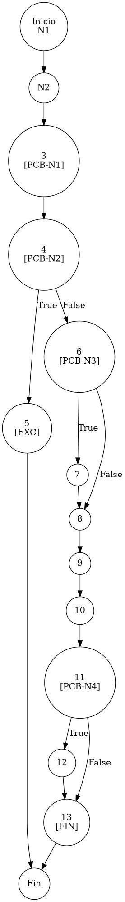

# TEST PRUEBAS DE CAJA BLANCA - AUTOMATIZADA

| **DATOS DEL ESTUDIANTE** | |
| :--- | :--- |
| **NOMBRE:** | Gabriel Amílcar Cruz Canto |
| **EMPRESA:** | WALOOK MEXICO, S.A. de C.V. |
| **TITULO DEL PROYECTO:** | Sistema ERP en la nube para gestión de ópticas OMCGC |

<br>

| **PLAN DE PRUEBAS DE CAJA BLANCA: BACKEND (MIG-MASTER)** | | | | |
| :--- | :--- | :--- | :--- | :--- |
| **Número** | **Nombre de la Prueba Backend** | **Descripción** | **Fecha** | **Herramienta / Responsable** |
| :--- | :--- | :--- | :--- | :--- |
| PCB-016 | Autenticación Root | Validación de Bypass Administrativo (Local) | 18/03/2026 | JaCoCo / JUnit 5 |
| PCB-017 | Registro de Movimiento | Integridad Transaccional y Pólizas Automatizadas | 18/03/2026 | JaCoCo / JUnit 5 |
| PCB-018 | Persistencia de Producto | Cálculo dinámico de PVP e Identidad | 18/03/2026 | JaCoCo / JUnit 5 |

---

# FASE DE PRUEBAS

| **Nombre del Módulo del Sistema + Historia de usuario** |
| :--- |
| Módulo Inventario – RF-12 |

| **Número y nombre de la Prueba** |
| :--- |
| PCB-017 / Registro de Movimiento – InventarioService.registrarMovimiento() |

### Paso 0: Súper-Etiquetado del Código (MIG-WBT)

```java
    @Transactional
    public void registrarMovimiento(MovimientoInventario m, String ip) { // [N1: INICIO]
        // [N2] Obtención de stock previo
        Integer stockAnterior = inventarioRepository.getCurrentStock(m.getIdProducto(), m.getIdSucursal());
        m.setExistenciaAnterior(stockAnterior); // [N3: [PCB-N1]]

        // [N4: [PCB-N2]] -> Verdadero: N5 | Falso: N6
        if (nuevoStock < 0) { 
            throw new RuntimeException("Stock insuficiente..."); // [N5: [EXC]]
        }

        m.setExistenciaActual(nuevoStock); // [N6: [PCB-N3]] -> Verdadero: N7 | Falso: N8
        if (m.getFolio() == null || m.getFolio().trim().isEmpty()) {
            m.setFolio("INV-AUTO"); // [N7]
        }

        // [N8, N9, N10] Persistencia y actualización
        inventarioRepository.saveMovimiento(m);
        inventarioRepository.updateExistencia(m.getIdProducto(), m.getIdSucursal(), nuevoStock);

        // [N11: [PCB-N4]] -> Verdadero: N12 | Falso: N13
        if ("ENTRADA_COMPRA".equals(m.getTipoMovimiento())) {
            actualizarCosto(m); // [N12]
        }
        // [N13: [FIN]]
    } // [F: FIN]
```

### Paso 1: Grafo de Control de Flujo (CFG)



### Paso 2: Complejidad Ciclomática McCabe $V(G)$

*   **V(G) = Número de regiones** = (3 internas + 1 externa) = **4**
*   **V(G) = Aristas – Nodos + 2** = (16 – 14 + 2) = **4**
*   **V(G) = Nodos Predicado + 1** = (3 + 1) = **4**

### Paso 3: Caminos Independientes (Basis Paths)

| Camino | Ruta Forense |
| :--- | :--- |
| **C1** | Inicio -> N2 -> N3 -> N4(True) -> N5 -> Fin |
| **C2** | Inicio -> N2 -> N3 -> N4(False) -> N6(True) -> N7 -> N8 -> N9 -> N10 -> N11(False) -> N13 -> Fin |
| **C3** | Inicio -> N2 -> N3 -> N4(False) -> N6(False) -> N8 -> N9 -> N10 -> N11(True) -> N12 -> N13 -> Fin |
| **C4** | Inicio -> N2 -> N3 -> N4(False) -> N6(False) -> N8 -> N9 -> N10 -> N11(False) -> N13 -> Fin |

### Paso 4: Matriz de Automatización (Duda Cero)

| Camino | Caso de Prueba | Resultado |
| :--- | :--- | :--- |
| **C1** | Stock Insuficiente | **EXCEPTION** |
| **C2** | Folio Vacío | **SUCCESS (Auto-Folio)** |
| **C3** | Entrada Compra | **SUCCESS (Costo Actualizado)** |
| **C4** | Salida Nominal | **SUCCESS** |
