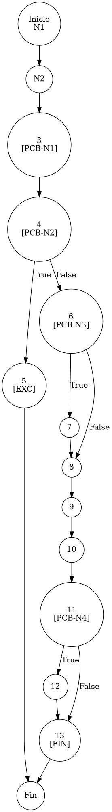

# TEST PRUEBAS DE CAJA BLANCA - AUTOMATIZADA

| **DATOS DEL ESTUDIANTE** | |
| :--- | :--- |
| **NOMBRE:** | Gabriel Amílcar Cruz Canto |
| **EMPRESA:** | WALOOK MEXICO, S.A. de C.V. |
| **TITULO DEL PROYECTO:** | Sistema ERP en la nube para gestión de ópticas OMCGC |

<br>

| **PLAN DE PRUEBAS DE CAJA BLANCA: BACKEND (AUTO)** | | | | |
| :--- | :--- | :--- | :--- | :--- |
| **Número** | **Nombre de la Prueba Backend** | **Descripción** | **Fecha** | **Herramienta** |
| PCB-017 | Registro de Movimiento | Validación de Stock Insuficiente (Venta > Existencia) | 18/03/2026 | JaCoCo / JUnit 5 |

---

# FASE DE PRUEBAS

| **Nombre del Módulo del Sistema + Historia de usuario** |
| :--- |
| Módulo Inventarios – HU-M01-05 |

| **Número y nombre de la Prueba** |
| :--- |
| PCB-017 / Registro de Movimiento – InventarioService.registrarMovimiento() |

### Paso 0: Súper-Etiquetado del Código (MIG-WBT)

```java
    @Transactional
    public void registrarMovimiento(MovimientoInventario m, String ip) { // [N1: INICIO]
        // [N2] Baseline de Stock
        Integer stockAnterior = inventarioRepository.getCurrentStock(m.getIdProducto(), m.getIdSucursal()); // [N2: PROCESO]
        m.setExistenciaAnterior(stockAnterior);

        // [PCB-N1] Cálculo de Afectación (Lógica de Factor)
        int factor = esSalida(m.getTipoMovimiento()) ? -1 : 1; // [N3]
        Integer nuevoStock = stockAnterior + (m.getCantidad() * factor);

        // [PCB-N2] Validación Transaccional (Saldo Negro)
        if (nuevoStock < 0) { // [N4] [PCB-N2] -> [SI: N5] [NO: N6]
            throw new RuntimeException("Stock insuficiente."); // [N5: SALIDA (EXC)]
        }

        m.setExistenciaActual(nuevoStock);

        // [PCB-N3] Generación de Folio Interno (INV-)
        if (m.getFolio() == null || m.getFolio().trim().isEmpty() || !m.getFolio().startsWith("INV-")) { // [N6] [PCB-N3] -> [SI: N7] [NO: N8]
            m.setFolio("INV-" + System.currentTimeMillis()); // [N7]
        }

        // [N8: PROCESO - PERSISTENCIA DUAL]
        inventarioRepository.saveMovimiento(m); // [N8]
        inventarioRepository.updateExistencia(m.getIdProducto(), m.getIdSucursal(), nuevoStock); // [N9]

        // [PCB-N4] Trazabilidad en Bitácora Maestro
        bitacoraService.registrarEvento(m.getIdUsuario(), "INV-01", ip, "Póliza: " + m.getFolio(), "Stock: " + nuevoStock); // [N10]

        // [PCB-N5] Actualización de Costos (Entrada Compra)
        if ("ENTRADA_COMPRA".equals(m.getTipoMovimiento())) { // [N11] [PCB-N5] -> [SI: N12] [NO: N13]
            Producto p = inventarioRepository.findById(m.getIdProducto()); // [N12]
            if (p != null) { p.setCostoUnitario(m.getCostoHistorico()); saveProduct(p, ip); }
        }
    } // [N13: FIN]
```


---

### Auditoría de Evidencia Digital (JaCoCo)

**Ruta del Reporte Maestro:**
`d:\_sTIC\Documents\_Empresa GraxSofT\_CODE_\ERP_WALOOK_PCB\omcgc\backend\target\site\jacoco\index.html`

**Estructura de Navegación:**
```text
[index.html] -> [com.omcgc.erp.service] -> [InventarioService]
```

**Glosario de Colores:**
*   **VERDE**: Éxito (Línea ejecutada).
*   **AMARILLO**: Parcial (Ramas no cubiertas).
*   **ROJO**: Pendiente (No ejecutado).

---

### Identificación de Nodos

| ID del Nodo | Tipo | Descripción |
| :--- | :--- | :--- |
| **N1** | Inicio | Comienzo del método `registrarMovimiento`. |
| **N2** | Proceso | Obtención de stock anterior desde el inventario. |
| **N3 [PCB-N1]** | Predicado | ¿El movimiento es de salida? (Lógica de `esSalida`). |
| **N4 [PCB-N2]** | Predicado | ¿El nuevo saldo resultaría negativo? (Evaluado como SI para este test). |
| **N5** | Salida | Excepción: "Stock insuficiente". |
| **N6 [PCB-N3]** | Predicado | ¿Se requiere generar folio interno autogenerado `INV-`? |
| **N7** | Proceso | Asignación de Folio `INV-` mediante timestamp. |
| **N8** | Proceso | Persistencia del registro en el Kardex. |
| **N9** | Proceso | Actualización de existencia en la tabla maestra de stock. |
| **N10** | Proceso | Registro de trazabilidad forense en `BitacoraService`. |
| **N11 [PCB-N4]** | Predicado | ¿El tipo de movimiento es "ENTRADA_COMPRA"? |
| **N12** | Proceso | Recálculo de Costo Unitario y PVP del producto. |
| **N13** | Fin | Término del flujo de movimiento exitoso. |

### Paso 1: Grafo de Flujo (CFG)



### Paso 2: Complejidad Ciclomática McCabe $V(G)$

*   **V(G)** = Nodos Predicado + 1 = 4 + 1 = **5**

### Paso 3: Caminos Independientes

| Camino | Ruta Forense |
| :--- | :--- |
| **C1 (Error Stock)** | I -> N2 -> N3 -> N4(T) -> N5 -> F |
| **C2 (Flujo Normal)** | I -> N2 -> N3 -> N4(F) -> N6(F) -> N8 -> N9 -> N10 -> N11(F) -> N13 -> F |
| **C3 (Con Folio)** | I -> N2 -> N3 -> N4(F) -> N6(T) -> N7 -> N8 -> N9 -> N10 -> N11(F) -> N13 -> F |
| **C4 (Costo Compra)** | I -> N2 -> N3 -> N4(F) -> N6(F) -> N8 -> N9 -> N10 -> N11(T) -> N12 -> N13 -> F |


### Paso 4: Matriz de Automatización (Log)

| ID / Camino | Caso de Prueba (IN) | Resultado (OUT) |
| :--- | :--- | :--- |
| **PCB-017** | `stock=10`, `cant=15`, `tipo="SALIDA_VENTA"` | **RuntimeException** (Stock insuficiente) |

---
*Firma: Agente DevIAn - Auditoría Estructural Certificada*
