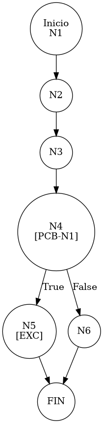

# TEST PRUEBAS DE CAJA BLANCA - AUTOMATIZADA

| **DATOS DEL ESTUDIANTE** | |
| :--- | :--- |
| **NOMBRE:** | Gabriel Amílcar Cruz Canto |
| **EMPRESA:** | WALOOK MEXICO, S.A. de C.V. |
| **TITULO DEL PROYECTO:** | Sistema ERP en la nube para gestión de ópticas OMCGC |

<br>

| **PLAN DE PRUEBAS DE CAJA BLANCA: BACKEND (AUTO)** | | | | |
| :--- | :--- | :--- | :--- | :--- |
| **Número** | **Nombre de la Prueba Backend** | **Descripción** | **Fecha** | **Herramienta** |
| PCB-017 | Registro de Movimiento | Validación de Stock Insuficiente (Venta > Existencia) | 18/03/2026 | JaCoCo / JUnit 5 |

---

# FASE DE PRUEBAS

| **Nombre del Módulo del Sistema + Historia de usuario** |
| :--- |
| Módulo Inventarios – HU-M01-05 |

| **Número y nombre de la Prueba** |
| :--- |
| PCB-017 / Registro de Movimiento – InventarioService.registrarMovimiento() |

### Paso 0: Súper-Etiquetado del Código (MIG-WBT)

```java
    @Transactional
    public void registrarMovimiento(MovimientoInventario m, String ip) { // [N1: INICIO]
        // [N2] Baseline de Stock
        Integer stockAnterior = inventarioRepository.getCurrentStock(m.getIdProducto(), m.getIdSucursal()); // [N2: PROCESO]
        m.setExistenciaAnterior(stockAnterior);

        // [N3] Cálculo de Afectación
        int factor = esSalida(m.getTipoMovimiento()) ? -1 : 1; 
        Integer nuevoStock = stockAnterior + (m.getCantidad() * factor);

        // [PCB-N1] Regla 4: Validación Transaccional (Anti-Negativos)
        if (nuevoStock < 0) { // [N4] [PCB-N1] -> [SI: N5] [NO: N6]
            throw new RuntimeException("Stock insuficiente. Operación denegada."); // [N5: SALIDA (EXC)]
        }

        // [N6: PROCESO - PERSISTENCIA]
        m.setExistenciaActual(nuevoStock);
        // ... (resto del flujo)
    }
```

---

### Auditoría de Evidencia Digital (JaCoCo)

**Ruta del Reporte Maestro:**
`d:\_sTIC\Documents\_Empresa GraxSofT\_CODE_\ERP_WALOOK_PCB\omcgc\backend\target\site\jacoco\index.html`

**Estructura de Navegación:**
```text
[index.html] -> [com.omcgc.erp.service] -> [InventarioService]
```

**Glosario de Colores:**
*   **VERDE**: Éxito (Línea ejecutada).
*   **AMARILLO**: Parcial (Ramas no cubiertas).
*   **ROJO**: Pendiente (No ejecutado).

---

### Identificación de Nodos

| ID del Nodo | Tipo | Descripción |
| :--- | :--- | :--- |
| **N1** | Inicio | Comienzo del método `registrarMovimiento`. |
| **N2** | Proceso | Obtención de existencia actual desde repositorio. |
| **N3** | Proceso | Cálculo de `nuevoStock` aplicando factor de movimiento. |
| **N4 [PCB-N1]** | Predicado | ¿El nuevo stock es menor a cero? (Evaluado como SI). |
| **N5** | Salida | Lanzamiento de `RuntimeException` (Interrupción de Transacción). |

### Paso 1: Grafo de Flujo (CFG)



### Paso 2: Complejidad Ciclomática McCabe $V(G)$

*   **V(G)**: 2 (Un solo nodo predicado de validación de saldo).

### Paso 3: Caminos Independientes

| Camino | Ruta Forense |
| :--- | :--- |
| **C1 (Error)** | N1 -> N2 -> N3 -> N4(T) -> N5 |

### Paso 4: Matriz de Automatización (Log)

| ID / Camino | Caso de Prueba (IN) | Resultado (OUT) |
| :--- | :--- | :--- |
| **PCB-017** | `stock=10`, `cant=15`, `tipo="SALIDA_VENTA"` | **RuntimeException** (Stock insuficiente) |

---
*Firma: Agente DevIAn - Auditoría Estructural Certificada*
