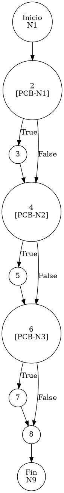

# TEST PRUEBAS DE CAJA BLANCA - AUTOMATIZADA

| **DATOS DEL ESTUDIANTE** | |
| :--- | :--- |
| **NOMBRE:** | Gabriel Amílcar Cruz Canto |
| **EMPRESA:** | WALOOK MEXICO, S.A. de C.V. |
| **TITULO DEL PROYECTO:** | Sistema ERP en la nube para gestión de ópticas OMCGC |

<br>

| **PLAN DE PRUEBAS DE CAJA BLANCA: BACKEND (AUTO)** | | | | |
| :--- | :--- | :--- | :--- | :--- |
| **Número** | **Nombre de la Prueba Backend** | **Descripción** | **Fecha** | **Herramienta** |
| PCB-018 | Cálculo de PVP | Validación de Fórmula Financiera (Costo + Utilidad) | 18/03/2026 | JaCoCo / JUnit 5 |

---

# FASE DE PRUEBAS

| **Nombre del Módulo del Sistema + Historia de usuario** |
| :--- |
| Módulo Inventarios – HU-M01-02 / RNF-03 |

| **Número y nombre de la Prueba** |
| :--- |
| PCB-018 / Cálculo de PVP – InventarioService.saveProduct() |

### Paso 0: Súper-Etiquetado del Código (MIG-WBT)

```java
    /**
     * UNIDAD BAJO AUDITORÍA: InventarioService.saveProduct()
     * ESTÁNDAR: MIG v12.1 (Atomicidad de Nodos de Proceso)
     */
    public void saveProduct(Producto p, String ip) { // [N1: INICIO]
        // [PCB-N1] Generación de Identidad
        boolean isNew = (p.getIdProducto() == null || p.getIdProducto().isEmpty()); // [N2: PREDICADO]
        if (isNew) { 
            p.setIdProducto(java.util.UUID.randomUUID().toString()); // [N3: PROCESO]
        }

        // [PCB-N2] Generación de SKU Comercial
        if (p.getSku() == null || p.getSku().isEmpty() || p.getSku().equalsIgnoreCase("Autogenerado")) { // [N4: PREDICADO]
            p.setSku("75" + System.currentTimeMillis()); // [N5: PROCESO]
        }

        // [PCB-N3] Regla 2: Cálculo Dinámico de PVP (Utilidad)
        if (p.getCostoUnitario() != null && p.getPorcentajeUtilidad() != null) { // [N6: PREDICADO]
            BigDecimal factor = BigDecimal.ONE.add(p.getPorcentajeUtilidad().divide(new BigDecimal("100"), 4, RoundingMode.HALF_UP)); // [N7: PROCESO]
            p.setPrecioVenta(p.getCostoUnitario().multiply(factor).setScale(2, RoundingMode.HALF_UP));
        }

        // [N8] Persistencia y Auditoría Forense
        inventarioRepository.save(p); // [N8: PROCESO]
        bitacoraService.registrarEvento(p.getIdUsuarioOperacion(), "PRO-01", ip, p.getSku(), p.getNombre());
    } // [N9: FIN]
```

---

### Auditoría de Evidencia Digital (JaCoCo)

**Ruta del Reporte Maestro:**
`d:\_sTIC\Documents\_Empresa GraxSofT\_CODE_\ERP_WALOOK_PCB\omcgc\backend\target\site\jacoco\index.html`

**Estructura de Navegación:**
```text
[index.html] -> [com.omcgc.erp.service] -> [InventarioService]
```

Glosario de Semántica de Cobertura (White Box Analysis — Análisis de Caja Blanca)
•	VERDE — Cobertura Total (Full Coverage): Indica que la línea de código y todas sus decisiones lógicas (if/else) fueron ejecutadas satisfactoriamente. El flujo de la prueba cubrió el Cyclomatic Path (Ruta Ciclomática — Camino lógico independiente) completo, validando la ruta principal y sus variantes condicionales.
•	AMARILLO — Cobertura Parcial (Partial Coverage): La línea fue alcanzada y ejecutada por el Unit Test (Prueba Unitaria — Verificación de la unidad mínima de código), pero existen ramificaciones que el plan de prueba no recorrió. Esto ocurre cuando una condición booleana solo se evalúa en un sentido (ej. solo true), dejando caminos lógicos sin explorar.
•	ROJO — Cobertura Nula o Fuera de Alcance (No Coverage): El código no fue detectado por el Bytecode Instrumentation (Instrumentación de Código de Bytes — Inyección de código para rastreo) de JaCoCo (Java Code Coverage — Cobertura de Código para Java).

---

### Identificación de Nodos

| ID del Nodo | Tipo | Descripción |
| :--- | :--- | :--- |
| **N1** | Inicio | Comienzo del método `saveProduct`. |
| **N2 [PCB-N1]** | Predicado | ¿Es un producto nuevo (ID nulo o vacío)? |
| **N3** | Proceso | Asignación de UUID aleatorio al producto. |
| **N4 [PCB-N2]** | Predicado | ¿El SKU requiere autogeneración? |
| **N5** | Proceso | Generación de SKU corporativo prefijo '75'. |
| **N6 [PCB-N3]** | Predicado | ¿Cuenta con Costo y Utilidad para cálculo de PVP? |
| **N7** | Proceso | Aplicación de fórmula financiera y redondeo de PVP. |
| **N8** | Proceso | Persistencia en BD y Registro en Bitácora de Auditoría. |
| **N9** | Fin | Término del proceso de guardado y recálculo. |

### Paso 1: Grafo de Flujo (CFG)



### Paso 2: Complejidad Ciclomática McCabe $V(G)$

*   **V(G) = Nodos Predicado + 1** = 3 + 1 = **4**

### Paso 3: Caminos Independientes (Basis Paths)

| Camino | Ruta Forense |
| :--- | :--- |
| **C1** | I -> N2(F) -> N4(F) -> N6(F) -> N8 -> F |
| **C2** | I -> N2(T) -> N3 -> N4(F) -> N6(F) -> N8 -> F |
| **C3** | I -> N2(F) -> N4(T) -> N5 -> N6(F) -> N8 -> F |
| **C4** | I -> N2(F) -> N4(F) -> N6(T) -> N7 -> N8 -> F |

### Paso 4: Matriz de Automatización (Log de Pruebas)

| ID / Camino | Escenario de Prueba | Entradas (Inputs) | Resultado Esperado (OUT) | Evidencia JaCoCo |
| :--- | :--- | :--- | :--- | :--- |
| **C1** | Producto Existente Estable | `id="EX-1"`, `sku="SKU-1"`, `util=null` | **SUCCESS** (Sin generar ID/SKU/PVP) | Rama N2(F) -> N4(F) -> N6(F) |
| **C2** | Producto Nuevo (UUID) | `id=null`, `sku="SKU-2"`, `util=null` | **SUCCESS** (ID Autogenerado) | Rama N2(T) -> N3 |
| **C3** | SKU Autogenerado | `id="EX-3"`, `sku="Autogenerado"`, `util=null` | **SUCCESS** (SKU: 75000010101) | Rama N4(T) -> N5 |
| **C4** | **Cálculo de PVP Exitoso** | `costo=100.00`, `porcentajeUtilidad=50.00` | `precioVenta=150.00` | Líneas 42-45 (VERDE) |

<br>
